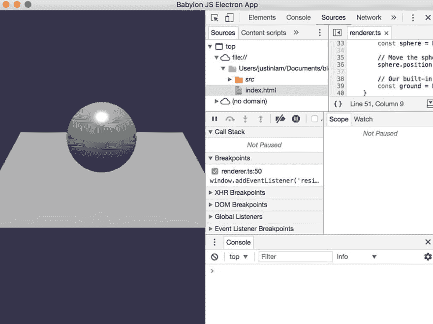
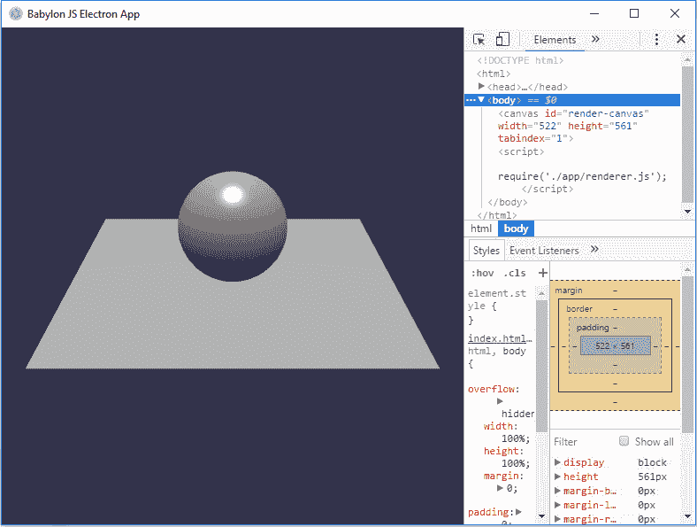
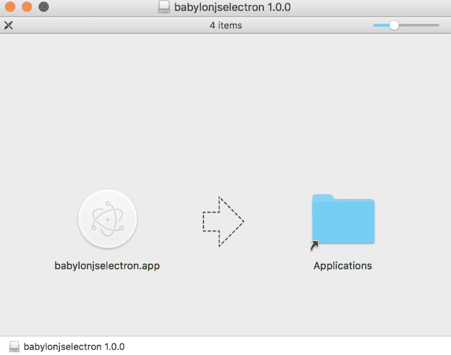

# 使用 TypeScript 构建包含电子和 BabylonJS 的 3D 应用程序

> 原文：<https://dev.to/justinctlam/building-a-3d-application-with-electron-and-babylonjs-using-typescript-2g29>

# 目录

1.  介绍
2.  设置事物
3.  构建应用程序
4.  是时候建造了
5.  包装和分发
6.  最终想法和资源

GitHub:[https://github.com/justinctlam/BabylonJS-Electron](https://github.com/justinctlam/BabylonJS-Electron)

## 1。介绍

您对构建跨平台的桌面 3D 应用程序感兴趣吗？也许你想做一个可视化应用，甚至一个游戏？我是来帮忙的，下面的教程将会指导你如何用 electronic 设置 BabylonJS。我还将引入 TypeScript，以便您可以看到所有这些技术是如何协同工作的。我希望你会发现这种组合是有用的和有益的。

我写这篇文章是为了帮助我和其他来自非网络背景的人，可能来自 iOS、Android、桌面应用、后端等...我会尽我最大的努力让它尽可能的直截了当，我的目标是那些刚刚开始 web 开发的人。

首先对技术栈做一些基本的解释。

*   ***BabylonJS*** :一个完整的 JavaScript 框架，用 HTML5、WebGL、WebVR 和 Web Audio 构建 3D 游戏。
*   ***电子*** :用 JavaScript、HTML、CSS 构建跨平台桌面应用。
*   ***TypeScript*** :微软开发并维护的免费开源编程语言。它是 JavaScript 的一个严格的语法超集，并为该语言添加了可选的静态类型。

为了将所有这些技术结合在一起，我将使用以下基础设施。

*   ***Visual Studio Code***:Visual Studio Code 是一个为构建和调试现代 web 和云应用程序而重新定义和优化的代码编辑器。
*   ***【NPM】***:JavaScript 的包管理器，世界上最大的软件注册中心。发现可重用代码包——并以强大的新方式组装它们。
*   **:一个完整的解决方案，用于打包和构建一个现成的支持“自动更新”的电子应用程序。**

 **本教程不会假设您已经安装了任何东西。我将介绍从头构建它所需的所有工具。我们开始吧！

## 2。设置事物

让我们从安装 NodeJS 开始，这将使我们能够使用 NPM。你可以在这里找到它([https://nodejs.org/en/](https://nodejs.org/en/)

本教程是在 NodeJS 版本 6 上测试的，你可以在这里下载([https://nodejs.org/dist/latest-v6.x/](https://nodejs.org/dist/latest-v6.x/))。

可选的:我推荐使用 Visual Studio 代码作为你的 IDE。这完全是可选的，不是完成教程所必需的。你可以在这里得到 VS 代码(【https://code.visualstudio.com/】T2)。

接下来，让我们创建一个文件夹，姑且称之为`babylonjsElectron`

在终端或命令提示符 shell 中执行以下命令:

```
npm init 
```

Enter fullscreen mode Exit fullscreen mode

为所有选项选择默认值。这将为您创建一个带有一些参数设置的`package.json`。

接下来，我们需要通过 NPM 为我们的项目下载和安装一些软件包。

在终端或命令提示符下执行以下命令。

```
npm install --save babylonjs@3.1.1
npm install --save-dev typescript@2.6.2
npm install --save-dev electron@1.7.10 
```

Enter fullscreen mode Exit fullscreen mode

从这里开始，本教程将使用以下版本的包。巴比伦的 **3.1.1，打字**的 **2.6.2，电子**的 **1.7.9。**

关于包依赖的一点解释。

`Dependencies`是运行我们的应用程序所需的包，`devDependencies`是我们将用来帮助构建应用程序但在应用程序的分发中不需要的包。

您的`package.json`文件现在应该包含这些属性:

```
"dependencies":  {  "babylonjs":  "^3.1.1"  },  "devDependencies":  {  "typescript":  "^2.6.2",  "electron":  "^1.7.9"  }, 
```

Enter fullscreen mode Exit fullscreen mode

## 3。构建应用程序

我们需要 3 个文件来开始`index.html`、`main.ts`和`renderer.ts`

在当前目录下创建一个`src`文件夹，例如`babylonjsElectron/src`。

在`src`目录下，创建两个文件`main.ts`和`renderer.ts`。

在根目录下`babylonjsElectron/`创建`index.html`。

在`main.ts`中输入以下锅炉板代码:

```
import { app, BrowserWindow } from "electron";
import * as path from "path";
import * as url from "url";

let mainWindow: Electron.BrowserWindow;

function createWindow() {
  // Create the browser window.
  mainWindow = new BrowserWindow({
    height: 600,
    width: 800,
  });

  // and load the index.html of the app.
  mainWindow.loadURL(url.format({
      pathname: path.join(__dirname, "../index.html"),
      protocol: "file:",
      slashes: true,
  }));

  // Open the DevTools.
  mainWindow.webContents.openDevTools();

  // Emitted when the window is closed.
  mainWindow.on("closed", () => {
    // Dereference the window object, usually you would store windows
    // in an array if your app supports multi windows, this is the time
    // when you should delete the corresponding element.
    mainWindow = null;
  });
}

// This method will be called when Electron has finished
// initialization and is ready to create browser windows.
// Some APIs can only be used after this event occurs.
app.on("ready", createWindow);

// Quit when all windows are closed.
app.on("window-all-closed", () => {
  // On OS X it is common for applications and their menu bar
  // to stay active until the user quits explicitly with Cmd + Q
  if (process.platform !== "darwin") {
    app.quit();
  }
});

app.on("activate", () => {
  // On OS X it"s common to re-create a window in the app when the
  // dock icon is clicked and there are no other windows open.
  if (mainWindow === null) {
    createWindow();
  }
});

// In this file you can include the rest of your app"s specific main process
// code. You can also put them in separate files and require them here. 
```

Enter fullscreen mode Exit fullscreen mode

在`renderer.ts`文件中放入以下代码:

```
import * as BABYLON from 'babylonjs';

export default class Renderer {
    private _canvas: HTMLCanvasElement;
    private _engine: BABYLON.Engine;
    private _scene: BABYLON.Scene;

    createScene(canvas: HTMLCanvasElement, engine: BABYLON.Engine) {
        this._canvas = canvas;

        this._engine = engine;

        // This creates a basic Babylon Scene object (non-mesh)
        const scene = new BABYLON.Scene(engine);
        this._scene = scene;

        // This creates and positions a free camera (non-mesh)
        const camera = new BABYLON.FreeCamera("camera1", new BABYLON.Vector3(0, 5, -10), scene);

        // This targets the camera to scene origin
        camera.setTarget(BABYLON.Vector3.Zero());

        // This attaches the camera to the canvas
        camera.attachControl(canvas, true);

        // This creates a light, aiming 0,1,0 - to the sky (non-mesh)
        const light = new BABYLON.HemisphericLight("light1", new BABYLON.Vector3(0, 1, 0), scene);

        // Default intensity is 1\. Let's dim the light a small amount
        light.intensity = 0.7;

        // Our built-in 'sphere' shape. Params: name, subdivs, size, scene
        const sphere = BABYLON.Mesh.CreateSphere("sphere1", 16, 2, scene);

        // Move the sphere upward 1/2 its height
        sphere.position.y = 1;

        // Our built-in 'ground' shape. Params: name, width, depth, subdivs, scene
        const ground = BABYLON.Mesh.CreateGround("ground1", 6, 6, 2, scene);
    }

    initialize(canvas: HTMLCanvasElement) {
        const engine = new BABYLON.Engine(canvas, true);
        this.createScene(canvas, engine);

        engine.runRenderLoop(() => {
            this._scene.render();
        });

        window.addEventListener('resize', function () {
            engine.resize();
        });
    }
}

const renderer = new Renderer();
renderer.initialize(document.getElementById('render-canvas') as HTMLCanvasElement); 
```

Enter fullscreen mode Exit fullscreen mode

在`index.html`中放入以下内容:

```
<!DOCTYPE html>
<html>

<head>
    <meta charset="UTF-8">
    Babylon JS Electron App
    <style>
        html,
        body {
            overflow: hidden;
            width: 100%;
            height: 100%;
            margin: 0;
            padding: 0;
        }

        #render-canvas {
            width: 100%;
            height: 100%;
            touch-action: none;
        }
    </style>
</head>

<body>
    <canvas id="render-canvas"></canvas>
    <script>
        require('./app/renderer.js');
    </script>
</body>

</html> 
```

Enter fullscreen mode Exit fullscreen mode

## 4。是时候建造了

我们现在要构建应用程序。通常情况下，您不需要构建 JavaScript 文件，但是对于 TypeScript，有一个“构建”步骤，将 TypeScript 文件转换成 JavaScript 以供使用。

首先，我们需要一个`tsconfig.json`。在`babylonjsElectron/`文件夹下创建一个`tsconfig.json`。

然后将以下内容放入`tsconfig.json` :

```
{  "compilerOptions":  {  "target":  "es6",  "module":  "commonjs",  "noImplicitAny":  true,  "sourceMap":  true,  "outDir":  "app",  "baseUrl":  ".",  "paths":  {  "*":  ["node_modules/*"]  }  },  "include":  [  "src/**/*"  ]  } 
```

Enter fullscreen mode Exit fullscreen mode

“include”属性告诉 TypeScript 编译器在哪里查找源文件。我们将在“outDir”属性中指定的`babylonjsElectron/app`文件夹下输出 JavaScript 文件。我们还将“sourceMap”设置为 true，以便调试器可以在 TypeScript 文件中找到并放置断点。关于其他属性的更多信息，您可以在以下资源中找到:[https://www . typescriptlang . org/docs/handbook/ts config-JSON . html](https://www.typescriptlang.org/docs/handbook/tsconfig-json.html)

接下来，我们将向`package.json`添加一些命令行脚本。这些命令行脚本用于帮助执行各种命令或命令组合。

在 package.json 中，在“脚本”属性下添加以下内容:

```
"build":  "tsc",  "start":  "electron ./app/main.js", 
```

Enter fullscreen mode Exit fullscreen mode

因此您的`package.json`文件应该如下所示:

```
 "scripts":  {  "build":  "tsc",  "start":  "electron ./app/main.js",  "test":  "echo \"Error: no test specified\" && exit 1"  }, 
```

Enter fullscreen mode Exit fullscreen mode

`tsc`在“build”属性中是 TypeScript 编译器。在“start”属性中，我们将使用我们编译的 TypeScript 源 main.js 启动 electron。

你可能想知道，`renderer.ts`文件呢？在`main.ts`中没有引用，但在`index.html`中有引用。

电子有两个过程，主过程和渲染过程。主进程负责创建和管理 BrowserWindow 实例和各种应用程序事件。渲染进程负责运行应用程序的用户界面。这里可以找到更详细的解释:[https://code burst . io/deep-dive-into-electronics-main-and-renderer-processes-7a 9599 D5 c9e 2](https://codeburst.io/deep-dive-into-electrons-main-and-renderer-processes-7a9599d5c9e2)。

在您的终端或命令提示符下，执行以下命令:

```
npm run build 
```

Enter fullscreen mode Exit fullscreen mode

这将“构建”您的类型脚本文件。接下来，执行以下命令:

```
npm start 
```

Enter fullscreen mode Exit fullscreen mode

这将启动电子应用程序。成功！

在 Mac 上运行
[](https://res.cloudinary.com/practicaldev/image/fetch/s--SEXuWTx4--/c_limit%2Cf_auto%2Cfl_progressive%2Cq_auto%2Cw_880/http://res.cloudinary.com/du0yn38n5/image/upload/v1513832521/bjse01_z906gw.jpg)

在 Windows 上运行
[](https://res.cloudinary.com/practicaldev/image/fetch/s--WzVeNaov--/c_limit%2Cf_auto%2Cfl_progressive%2Cq_auto%2Cw_880/http://res.cloudinary.com/du0yn38n5/image/upload/v1514089894/bjsewind_wtdb74.jpg)

您可能会在终端或命令提示符下看到如下警告:

```
Electron Helper[68582:2728327] Couldn't set selectedTextBackgroundColor from default () 
```

Enter fullscreen mode Exit fullscreen mode

在本教程的时候，这是 Chromium 中的一个 bug。我假设它会在未来的电子版本中被修正，所以我们不要担心它。

如您所见，当您运行应用程序时，开发面板被打开。如果您希望开发面板不自动打开，请注释掉`main.ts`中的以下行:

```
mainWindow.webContents.openDevTools(); 
```

Enter fullscreen mode Exit fullscreen mode

## 5。包装和分发

好吧！现在我们已经有了一个可以工作的应用程序，让我们准备打包它以供发布。

为了完成这项任务，我们需要电子生成器 NPM 软件包来帮助我们。

在您的终端或命令提示符下执行以下命令:

```
npm install --save-dev electron-builder@19.49.0 
```

Enter fullscreen mode Exit fullscreen mode

接下来，我们将把下面的脚本添加到`package.json`中的“脚本”中:

```
"dist":  "build" 
```

Enter fullscreen mode Exit fullscreen mode

所以现在`package.json`会是这样的:

```
 "description":  "This is a babylonjs electron sample",  "main":  "./app/main.js",  "scripts":  {  "build":  "tsc",  "start":  "electron ./app/main.js",  "dist":  "build",  "test":  "echo \"Error: no test specified\" && exit 1"  }, 
```

Enter fullscreen mode Exit fullscreen mode

确保您的“描述”属性中也有一些内容。

您还需要确保“main”属性指向如上所示的`main.js`文件。

我们已经到了最后阶段。

最后，执行以下命令:

```
npm run dist 
```

Enter fullscreen mode Exit fullscreen mode

这将在 Mac 上为你生成一个 DMG 文件。你可以在`babylonjsElectron/dist`文件夹下找到这个文件。当你打开你的 DMG，它应该是这样的:

[T2】](https://res.cloudinary.com/practicaldev/image/fetch/s--YS8e0JRo--/c_limit%2Cf_auto%2Cfl_progressive%2Cq_auto%2Cw_880/http://res.cloudinary.com/du0yn38n5/image/upload/v1514089894/bjsedmg_ix2gle.jpg)

要创建一个 Windows 应用程序，只需在 Windows 命令提示符下运行以下命令。

```
npm run dist 
```

Enter fullscreen mode Exit fullscreen mode

这将在 Windows 上为您生成一个 exe 文件。你可以在`babylonjsElectron/dist`文件夹下找到这个文件。

您也可以为每个系统定制一些选项。

如果你打算发布你的应用，你需要对你的应用进行代码签名。出于本教程的目的，我不会涉及这个，但你可以在这里找到更多的细节:[https://www.electron.build/code-signing](https://www.electron.build/code-signing)。

在 Mac 上，您可以为 DMG 发生器指定一些选项。

在`package.json`中，您可以向 DMG 属性添加以下选项:

```
"build":  {  "appId":  "yourappid",  "dmg":  {  "contents":  [  {  "x":  110,  "y":  0  },  {  "x":  240,  "y":  0,  "type":  "link",  "path":  "/Applications"  }  ]  }  } 
```

Enter fullscreen mode Exit fullscreen mode

让我们快速讨论一下这些属性的含义:

*   “appId”是你放置你的应用程序 Id 的地方，如果你曾经计划提交到像 App Store 这样的商店。
*   在内容中，您可以指定要在 DMG 中显示的各种文件和路径。

你可以在这里找到更多关于房产的细节:[https://www.electron.build/configuration/dmg](https://www.electron.build/configuration/dmg)。

在 Windows 上，您可以自定义要使用的安装程序类型。

默认情况下，电子建设者将建立一个“nsis”(Nullsoft 脚本化安装系统)安装程序。还有各种其他安装程序选项，如“便携式”安装程序，它将生成一个可执行文件，只运行而不安装，以及“松鼠”安装程序，它只需点击一次即可完成软件包更新。

例如，您可以将这些附加配置属性添加到“package.json”文件中，以创建一个非安装程序可执行文件:

```
"build": {
    "appId": "yourappid",
    "win": {
      target: "portable"
    }
  } 
```

Enter fullscreen mode Exit fullscreen mode

你可以在这里找到更多的属性详情:
[https://www.electron.build/configuration/win](https://www.electron.build/configuration/win)。

## 6。最终想法和资源

仅仅使用 JavaScript、HTML 和 CSS 就可以轻松开发跨平台的应用程序，这很酷。现在，您不仅可以创建一个跨平台应用程序，还可以创建一个跨平台 3D 应用程序，以获得更丰富和身临其境的体验。

在撰写本教程时，Chromium 支持 WebVR，但是 Electron 还没有使用 Chromium 的最新版本。我希望不久以后 Electron 将支持 WebVR，我们可以开始构建跨平台的 VR 应用程序！

你可以在 GitHub 上找到完整的源代码:[https://github.com/justinctlam/BabylonJS-Electron](https://github.com/justinctlam/BabylonJS-Electron)

我用来写这个教程的一些资源:

*   巴比伦-https://www.babylonjs.com/
*   Babylon.js 编辑器和电子-[https://medium . com/Babylon-js/Babylon-js-Editor-and-electronic-706 D6 faf 479 b](https://medium.com/babylon-js/babylon-js-editor-and-electron-706d6faf479b)
*   电子龙-[https://github.com/mmmeff/Electronylon](https://github.com/mmmeff/Electronylon)
*   用电子构建桌面应用-[https://medium . com/developers-writing/build-a-desktop-application-with-electronic-204203 eeb 658](https://medium.com/developers-writing/building-a-desktop-application-with-electron-204203eeb658)
*   打包电子应用的完整指南-[https://medium . com/how-to-electronic/a-complete-guide-to-packaging-your-electronic-app-1 BDC 717d 739 f](https://medium.com/how-to-electron/a-complete-guide-to-packaging-your-electron-app-1bdc717d739f)
*   带有 NodeJS、Electron 和 BabylonJS 的跨平台桌面 JavaScript 3D 游戏引擎-[http://grosan . co . uk/cross-platform-JavaScript-3D-Game-Engine-with-NodeJS-Electron-and-BabylonJS/](http://grosan.co.uk/cross-platform-javascript-3d-game-engine-with-nodejs-electron-and-babylonjs/)**