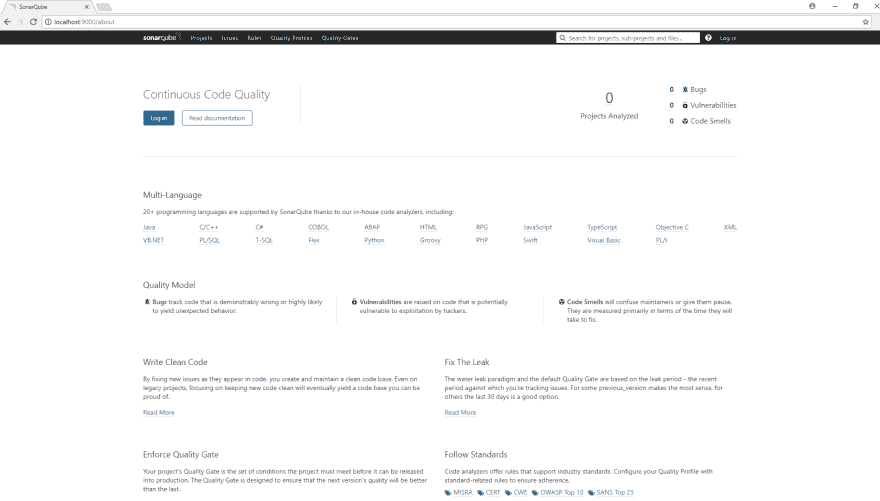
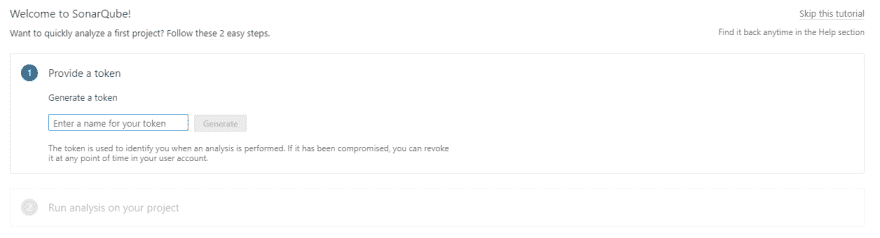
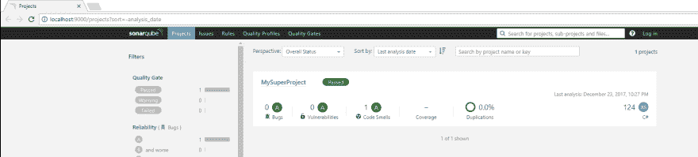
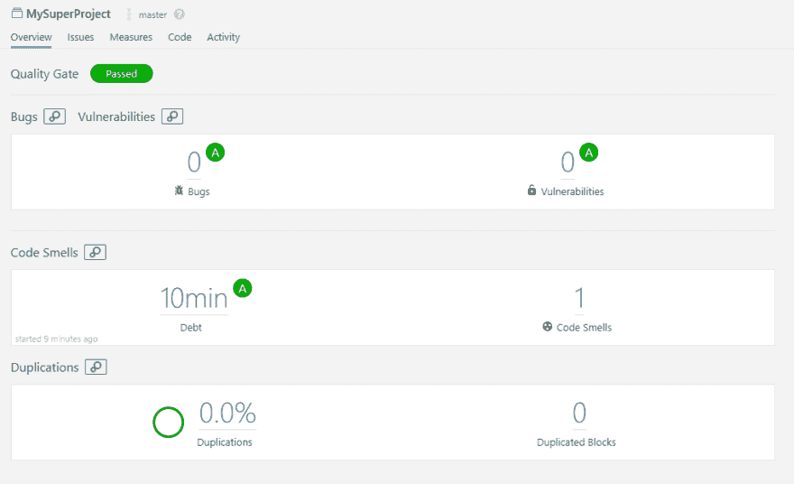
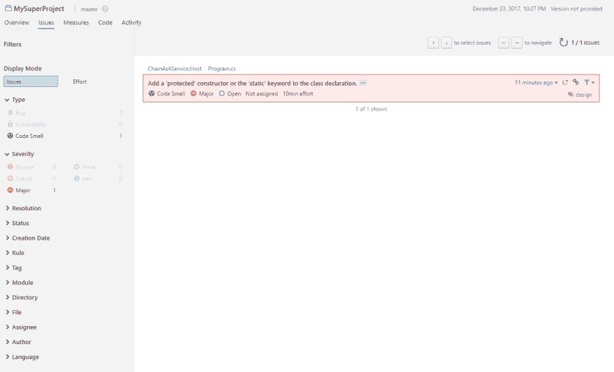
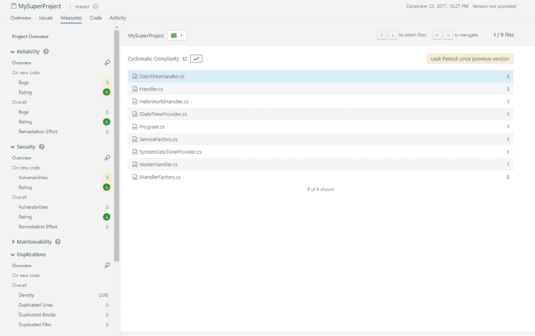
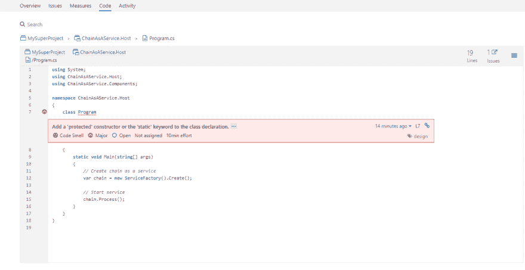
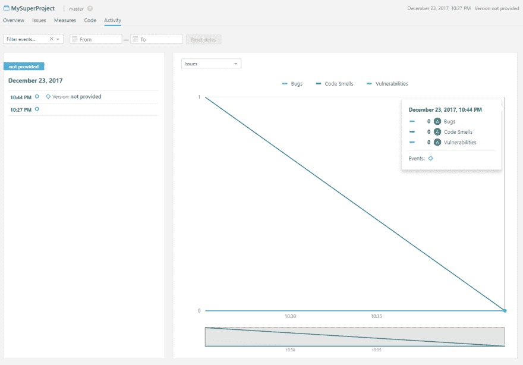

# 三步静态代码分析

> 原文:[https://dev . to/rafalpienkowski/static-code-analysis-in-3-steps-2 AHI](https://dev.to/rafalpienkowski/static-code-analysis-in-3-steps-2ahi)

### 背景

* * *

在这篇文章中，我将向你展示如何在 Windows 机器上的 Docker 上设置 SonarQube，以及如何对用 C#编写的简单应用程序进行代码分析。相信我，这比你想象的要简单。

我要介绍一下 [SonarQube](https://www.sonarqube.org/) ，这是一个开源的持续检查代码质量的平台。它可以在持续集成(CI)过程中构建，并在每次构建期间在您的项目中执行代码检查。这可能是有益的，尤其是如果你正在从事遗留项目。即使您不能将 SonarQube 添加到您的 CI 流程中，您仍然可以在将代码推入 repo 之前在本地检查您的代码质量。在创建将由其他团队成员检查的拉取请求之前，您可以将其视为第 0 步。

SonarQube 包含了许多各种语言的内置规则，如 [C#](https://www.sonarsource.com/products/codeanalyzers/sonarcsharp.html) 、 [Java](https://www.sonarsource.com/products/codeanalyzers/sonarjava.html) 、 [Javascript](https://www.sonarsource.com/products/codeanalyzers/sonarjs.html) 和[其他](https://www.sonarsource.com/products/codeanalyzers/)。当然，这些规则可以被修改或删除/禁用。我们还可以为我们的项目添加新的定制规则。

所以我们开始吧！

[T2】](https://i.giphy.com/media/1TzKVQwH820wM/giphy.gif)

### 先决条件

* * *

在开始之前，你只需要满足一个要求。您的机器上必须安装 Docker。如果你不知道 *Docker* 是什么[，这里的](https://dev.to/hbibzdeploy/docker-series-what-is-docker-88k)是一篇好文章的链接，它将向你介绍这个主题。

如果你安装了 Docker，你可以跳过这一部分。在其他情况下，我鼓励你安装它。即使你认为它没有好处，但它可能会在未来发生变化，你会做好准备:)详细的安装说明可以在 [Docker 的官方网站](https://www.docker.com/)上找到。例如，如果你的机器上安装了 Windows，这是一个简单的过程。你只需要点击“下一步”按钮几次。

[这里的](https://docs.docker.com/datacenter/ucp/1.1/installation/system-requirements/)是来自官方文档的硬件和软件要求的链接。

### 第一步

* * *

让我们检查一下我们是否已经在本地机器上启动并运行了 Docker。要检查这一点，请打开 PowerShell 并运行命令`docker --version`。在我的例子中，结果如下:

```
PS C:\Users\rapie2> docker --version
Docker version 17.09.1-ce, build 19e2cf6 
```

<svg width="20px" height="20px" viewBox="0 0 24 24" class="highlight-action crayons-icon highlight-action--fullscreen-on"><title>Enter fullscreen mode</title></svg> <svg width="20px" height="20px" viewBox="0 0 24 24" class="highlight-action crayons-icon highlight-action--fullscreen-off"><title>Exit fullscreen mode</title></svg>

现在我们准备好设置和运行基于 SonarQube 映像的 docker 容器。希望 sonar cube 在 [DockerHub](https://hub.docker.com/_/sonarqube/) 上有它的官方存储库，这样我们可以很容易地获得 sonar cube 准备的最新 docker 图片。这将保证一切都应该开箱即用。现在我们需要写一个命令:

```
docker run -d --name sonarqube -p 9000:9000 -p 9092:9092 sonarqube 
```

<svg width="20px" height="20px" viewBox="0 0 24 24" class="highlight-action crayons-icon highlight-action--fullscreen-on"><title>Enter fullscreen mode</title></svg> <svg width="20px" height="20px" viewBox="0 0 24 24" class="highlight-action crayons-icon highlight-action--fullscreen-off"><title>Exit fullscreen mode</title></svg>

该命令将从 DockerHub 下载(如果本地机器上没有映像)最新版本的 SonarQube docker 映像，公开 TCP 端口 9000 和 9092(工具正常工作所需的端口)，将容器命名为“sonar cube”并运行它。

图像下载后，我们的容器将运行。通过传递命令`docker ps`检查容器是否工作，可以检查一切是否正常。下面这个命令结果的例子:

```
PS C:\Users\rapie2> docker ps
CONTAINER ID        IMAGE               COMMAND             CREATED             STATUS              PORTS                                            NAMES
c4f57f8c3ab5        sonarqube           "./bin/run.sh"      54 seconds ago      Up 51 seconds       0.0.0.0:9000->9000/tcp, 0.0.0.0:9092->9092/tcp   sonarqube 
```

<svg width="20px" height="20px" viewBox="0 0 24 24" class="highlight-action crayons-icon highlight-action--fullscreen-on"><title>Enter fullscreen mode</title></svg> <svg width="20px" height="20px" viewBox="0 0 24 24" class="highlight-action crayons-icon highlight-action--fullscreen-off"><title>Exit fullscreen mode</title></svg>

顺便说一句，如果你想在将来使用这个容器，你只需要通过运行命令`docker start sonarqube`来启动现有的容器，其中*sonar cube*是在创建过程中给定的容器名称(参数名称)。

我们可以去 [http://localhost:9000/](http://localhost:9000/) 。默认情况下，SonarQube 在端口 9000 上工作。您应该会看到与此类似的站点:

[T2】](https://res.cloudinary.com/practicaldev/image/fetch/s--aUkksM3Y--/c_limit%2Cf_auto%2Cfl_progressive%2Cq_auto%2Cw_880/https://thepracticaldev.s3.amazonaws.com/i/j2g4kvpwdsr7cv2zwkew.png)

我们已经启动并运行了 SonarQube，因此我们可以进入下一步并设置我们的项目。

### 第二步

* * *

在这一步中，我们将建立一个用 C#编写的. Net 项目。我在 GitHub 上的项目中拍了一张。现在我们已经有了我们的项目，所以我们需要使用默认地址 [http://localhost:9000/](http://localhost:9000/) 登录 SonarQube。标准的登录/密码对是 admin/admin。当我们第一次登录时，我们会看到一个漂亮的欢迎屏幕，如下所示:

[T2】](https://res.cloudinary.com/practicaldev/image/fetch/s--5TeHqUBy--/c_limit%2Cf_auto%2Cfl_progressive%2Cq_auto%2Cw_880/https://thepracticaldev.s3.amazonaws.com/i/koaxucfy3j8q4xa2mwmh.png)

我们需要生成一个用于身份验证的令牌。所以我们给它们起个类似`MyKey`的名字吧。之后，我们将进入下一步。我们应该选择项目的主要语言。在我们的例子中是`C# or VB.NET`。我们将设置一个唯一的项目名称。之后，我们很好地接受了执行代码分析应该完成的步骤。

如果你的机器上没有 SonarQube 客户端，你需要先安装它。以防万一。Net 应用程序[这里的](https://docs.sonarqube.org/display/SCAN/Analyzing+with+SonarQube+Scanner+for+MSBuild)是到客户端的链接。安装是一个简单直接的过程。

安装 SonarQube 客户端后，您需要执行三个简单的指令:

```
SonarQube.Scanner.MSBuild.exe begin /k:"MySuperProject" /d:sonar.host.url="http://localhost:9000" /d:sonar.login="44a669e52cf3f8fae8605268e1750a48d4d3f64a"

MsBuild.exe /t:Rebuild

SonarQube.Scanner.MSBuild.exe end /d:sonar.login="44a669e52cf3f8fae8605268e1750a48d4d3f64a" 
```

<svg width="20px" height="20px" viewBox="0 0 24 24" class="highlight-action crayons-icon highlight-action--fullscreen-on"><title>Enter fullscreen mode</title></svg> <svg width="20px" height="20px" viewBox="0 0 24 24" class="highlight-action crayons-icon highlight-action--fullscreen-off"><title>Exit fullscreen mode</title></svg>

第一条指令将启动分析过程。在我们的例子中，您需要设置项目的名称`MySuperProject`，sonar cube 的主机 url `http://localhost:9000`和 sonar cube 的登录，这是我们之前生成的令牌。第二条指令是来自 MsBuild 的标准重建操作。最后一条指令通知 SonarQube 过程结束。

在此过程之后，所有收集的数据将被发送到 SonarQube 服务器进行分析。这可能需要一些时间，具体取决于您的解决方案规模。当这个过程结束时，您可以在 SonarQube 中看到结果:

[T2】](https://res.cloudinary.com/practicaldev/image/fetch/s--B7Bsz0jL--/c_limit%2Cf_auto%2Cfl_progressive%2Cq_auto%2Cw_880/https://thepracticaldev.s3.amazonaws.com/i/6iwlqxqteahjna2vctni.png)

### 第三步

* * *

收集数据分析的第三步也是最后一步。

[T2】](https://i.giphy.com/media/Zvgb12U8GNjvq/giphy.gif)

正如你在上面的屏幕上看到的，项目描述包含关于它的基本数据，如错误数量、漏洞、代码味道、测试覆盖率、代码重复百分比、编写代码或主要语言的行数。

我们可以在“概述”选项卡上看到所有这些操作:

[T2】](https://res.cloudinary.com/practicaldev/image/fetch/s--9Gk-_qZo--/c_limit%2Cf_auto%2Cfl_progressive%2Cq_auto%2Cw_880/https://thepracticaldev.s3.amazonaws.com/i/d2tcotm738pekpkn8yz6.png)

在`Issues`选项卡上，我们可以搜索发现的问题。我们可以根据类型、严重性、创建日期、语言和更多选项来过滤结果。

[T2】](https://res.cloudinary.com/practicaldev/image/fetch/s---SrSKyXE--/c_limit%2Cf_auto%2Cfl_progressive%2Cq_auto%2Cw_880/https://thepracticaldev.s3.amazonaws.com/i/ukpchola6k632kh6b10p.png)

`Measures`选项卡包含关于代码分析的详细信息。它被分为几类，如*可靠性*、*安全性*或*可维护性*。

[T2】](https://res.cloudinary.com/practicaldev/image/fetch/s--wW61ON52--/c_limit%2Cf_auto%2Cfl_progressive%2Cq_auto%2Cw_880/https://thepracticaldev.s3.amazonaws.com/i/wxdrf0973anwi3jzuxrs.png)

在我看来`Code` tab 非常有用。我们可以浏览代码，看看代码有没有问题。

[T2】](https://res.cloudinary.com/practicaldev/image/fetch/s--DUdetQfl--/c_limit%2Cf_auto%2Cfl_progressive%2Cq_auto%2Cw_880/https://thepracticaldev.s3.amazonaws.com/i/2pkpe5pfooxybfot3bqp.png)

在`Activity`选项卡中，我们可以看到代码发布的数量在项目的生命周期中是如何变化的。

[T2】](https://res.cloudinary.com/practicaldev/image/fetch/s--MNvg-oLe--/c_limit%2Cf_auto%2Cfl_progressive%2Cq_auto%2Cw_880/https://thepracticaldev.s3.amazonaws.com/i/anwoo0epr8pop3qsgygr.png)

### 总结

* * *

我给你介绍了一个 SonarQube 平台。如果你正在考虑执行代码分析，我希望在这篇文章的讲座之后你会去做。如您所见，设置和执行代码分析非常简单。如果你不考虑代码分析，因为你认为它很难设置和执行，我证明了它不是。

如果您考虑使用其他代码分析工具，请使用它。我鼓励你在评论中分享你对所选工具的看法。我相信这对我和其他人都有好处。在我看来，使用哪种工具并不重要，重要的是最终你的代码会更好，你会成为英雄

[T2】](https://i.giphy.com/media/R8MIGe47XWx68/giphy.gif)

干杯。