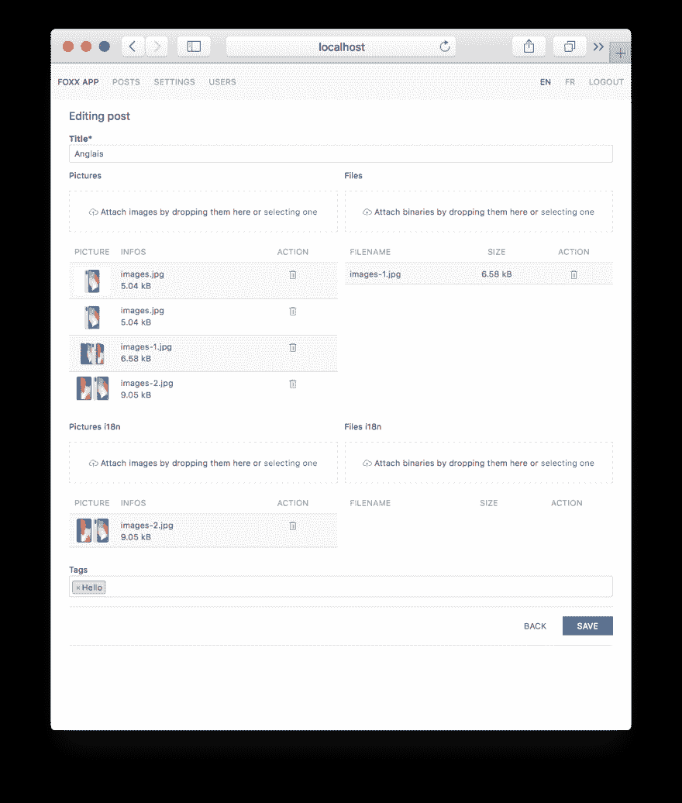

# 新的圣杯？第三部分

> 原文:[https://dev.to/solisoft/arangodb-新-graal - part-3-3917](https://dev.to/solisoft/arangodb--the-new-graal--part-3-3917)

在 [part2](https://dev.to/solisoft/arangodb--the-new-graal--part-2-6mc) 中看到认证之后，是时候玩集合了。
这里是 main.js 文件。

```
'use strict';
// Define db & joi for db calls and validation
const db = require('@arangodb').db;
const joi = require('joi');
// Enable cache
require("@arangodb/aql/cache").properties({ mode: "on" });

// Create router and session storage
const createRouter = require('@arangodb/foxx/router');
const sessionsMiddleware = require('@arangodb/foxx/sessions');
const jwtStorage = require('@arangodb/foxx/sessions/storages/jwt');
const router = createRouter();
const sessions = sessionsMiddleware({
  storage: jwtStorage('something secret'),
  transport: 'header'
});

// Use sessions & router
module.context.use(sessions);
module.context.use(router); 
```

<svg width="20px" height="20px" viewBox="0 0 24 24" class="highlight-action crayons-icon highlight-action--fullscreen-on"><title>Enter fullscreen mode</title></svg> <svg width="20px" height="20px" viewBox="0 0 24 24" class="highlight-action crayons-icon highlight-action--fullscreen-off"><title>Exit fullscreen mode</title></svg>

如果你想保护你的服务只对注册用户:

```
// Use the authentification
module.context.use(function (req, res, next) {
  if(!req.session.uid) res.throw('unauthorized');
  res.setHeader("Access-Control-Expose-Headers", "X-Session-Id");
  next();
}); 
```

<svg width="20px" height="20px" viewBox="0 0 24 24" class="highlight-action crayons-icon highlight-action--fullscreen-on"><title>Enter fullscreen mode</title></svg> <svg width="20px" height="20px" viewBox="0 0 24 24" class="highlight-action crayons-icon highlight-action--fullscreen-off"><title>Exit fullscreen mode</title></svg>

好了，让我们开始写垃圾。在这个示例中，我将使用`posts`集合作为示例。

```
// GET /page/:page
router.get('/page/:page', function (req, res) {
  res.send({ data: db._query(`
    LET count = LENGTH(posts)
    LET data = (FOR doc IN posts SORT doc._key DESC LIMIT @offset,25 RETURN doc)
    RETURN { count: count, data: data }
    `, { "offset": (req.pathParams.page - 1) * 25}).toArray() });
})
.header('X-Session-Id')
.description('Returns all objects using pagination');

// GET /:id
router.get('/:id', function (req, res) {
  res.send(db.posts.document(req.pathParams.id));
})
.header('X-Session-Id')
.description('Returns object within ID');

// POST /
router.post('/', function (req, res) {
  var data = {
    field_1: req.body.field_1,
    field_2: req.body.field_2,
    field_3: req.body.field_3
  }
  res.send(db.posts.save(data));
})
.body(joi.object({
  field_1: joi.string().required(),
  field_2: joi.number().required(),
  field_3: joi.any(),
}), 'data')
.header('X-Session-Id')
.description('Create a new object.');

// PUT /:id
router.put('/:id', function (req, res) {
  var object = db.posts.document(req.pathParams.id)
  var data = {
    field_1: req.body.field_1,
    field_2: req.body.field_2,
    field_3: req.body.field_3
  }
  res.send(db.posts.update(object, data));
})
.body(joi.object({
  field_1: joi.string().required(),
  field_2: joi.number().required(),
  field_3: joi.any(),
}), 'data')
.header('X-Session-Id')
.description('Update an object.');

// DELETE /:id
router.delete('/:id', function (req, res) {
  res.send(db.posts.remove("posts/"+req.pathParams.id));
})
.header('X-Session-Id')
.description('delete an object.'); 
```

<svg width="20px" height="20px" viewBox="0 0 24 24" class="highlight-action crayons-icon highlight-action--fullscreen-on"><title>Enter fullscreen mode</title></svg> <svg width="20px" height="20px" viewBox="0 0 24 24" class="highlight-action crayons-icon highlight-action--fullscreen-off"><title>Exit fullscreen mode</title></svg>

这里有一个使用 Foxx & ArangoDB 的完整 CRUD 的最小但有效的样本。

为了节省我的时间，我构建了一个非常有用的工具，名为[foxy](https://foxxy.ovh)来构建基于 Foxx、UIkit、RiotJS & Brunch 的管理应用程序。它将允许您管理文件上传，标签和更多。

[T2】](https://res.cloudinary.com/practicaldev/image/fetch/s--F0JdgNoI--/c_limit%2Cf_auto%2Cfl_progressive%2Cq_auto%2Cw_880/https://foxxy.ovh/assets/foxxy.png)

您现在可以构建任何类型的 Rest API，它可以链接到任何类型的客户端应用程序。