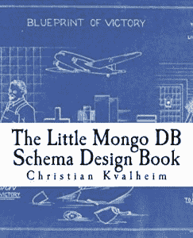

# 书评:小 Mongo DB 模式设计书

> 原文:[https://dev . to/kenwalger/book-review-the-little-mongo-d b-schema-design-book-56jj](https://dev.to/kenwalger/book-review-the-little-mongo-db-schema-design-book-56jj)

我在之前的一篇关于[模式设计](https://dev.to/kenwalger/schema-design-considerations-in-mongodb-47f)的文章中提到过，我提到过关于这个主题的一本书，当时我还没有读过。在听到*在别处提到的[克里斯蒂安·克瓦尔海姆](https://twitter.com/christkv?lang=en)写的小 Mongo DB 模式设计书*后，我想我会明白这是怎么一回事。第[本书](https://aax-us-east.amazon-adsystem.com/x/c/Qnwu5hz2NZPU0DZHkDbEC6YAAAFfby8Z2AEAAAFKAQSLJxc/https://www.amazon.com/gp/product/1517394023/ref=as_at/?imprToken=fwe4Y-sw2zFGzrMEIPn2iQ&slotNum=3&ie=UTF8&camp=1789&creative=9325&creativeASIN=1517394023&linkCode=w61&tag=kenwalgersite-20&linkId=a291d83c039ed46dd7dd7d9828ad663f)于 2015 年 5 月出版。尽管它有点老了，但是模式设计的内容仍然是相关的。

[T2】](https://aax-us-east.amazon-adsystem.com/x/c/Qnwu5hz2NZPU0DZHkDbEC6YAAAFfby8Z2AEAAAFKAQSLJxc/https://www.amazon.com/gp/product/1517394023/ref=as_at/?imprToken=fwe4Y-sw2zFGzrMEIPn2iQ&slotNum=3&ie=UTF8&camp=1789&creative=9325&creativeASIN=1517394023&linkCode=w61&tag=kenwalgersite-20&linkId=a291d83c039ed46dd7dd7d9828ad663f)

### MongoDB 概述

Kvalheim 以对 [MongoDB](https://www.mongodb.com) 的快速介绍和一些模式设计的基本原则开始了这本书，然后转到一些数据建模模式的例子。我认为他对一对一、一对多和多对多数据模型的讨论做得很好。他使用了一些博客和用户的好例子，以一种简单易懂的方式来解释这些概念。

Kvalheim 从这里继续介绍 MongoDB 中可用的存储引擎。特别是 [MMAP](https://docs.mongodb.com/manual/core/mmapv1/) 和 [WiredTiger](https://docs.mongodb.com/manual/core/wiredtiger/) 存储引擎。这为那些使用 MongoDB 3.2 版本之前的旧实例以及那些选择升级到最新版本的人提供了很好的覆盖。在撰写本文时，版本 3.6 是最新的。

在讨论了存储引擎之后，在深入到模式设计本身的细节之前，我们已经了解了信息[索引](https://www.kenwalger.com/blog/nosql/mongodb/indexing-mongodb/)和[分片](https://www.kenwalger.com/blog/nosql/mongodb-horizontal-scaling-sharding/)概念。

### 模式设计模式

一旦我们进入这本书的设计模式部分，Kvalheim 很好地分解了每个设计选项。他遵循每种模式的一致格式，讨论典型数据建模模式的独特方面。他展示了他们的操作，并为索引、伸缩和性能影响提供了建议。

这些示例做得非常好，涵盖了数据存储的各种用例。涵盖的一些模式设计示例有:

*   时间序列
*   账户交易
*   国际化
*   购物车
*   保留

总共探讨了 11 个不同的设计概念。

### 改进

印刷关于技术主题的书籍的缺点之一是信息变化的速度。MongoDB 使用 3.2 版之前版本的安装确实很多。作为 MongoDB3.2 之后的用户，我发现关于 MMAP 存储引擎的讨论不如 2015 年时那么相关。

在这本模式设计书中有一些类型设置的问题，但我并不觉得这些问题太麻烦。他们通常只需要重读一两遍句子就能理解句子的意思。

### 总结模式设计书

总的来说，我发现这本书是模式设计的一个很好的资源。当使用 MongoDB 作为数据库时，这无疑是对应用程序开发库的一个极好的补充。MongoDB 2015 年以后的版本中有一些特性可以帮助开发人员和数据库管理员进行模式管理。[文档验证](https://www.mongodb.com/blog/post/document-validation-part-1-adding-just-the-right-amount-of-control-over-your-documents)在 3.2 版本中引入。版本 3.6 通过[模式验证](https://dev.to/kenwalger/schema-validation-in-mongodb-36-99d)扩展了验证过程。

* * *

在 Twitter [@kenwalger](https://www.twitter.com/kenwalger) 上关注我，获取我发布的最新消息。或者更好的是，注册电子邮件列表，以便在您的邮箱中获得更新！

这篇文章中有几个 MongoDB 特定的术语。我为[亚马逊 Echo](https://www.amazon.com/gp/product/B01DFKC2SO/ref=as_li_tl?ie=UTF8&camp=1789&creative=9325&creativeASIN=B01DFKC2SO&linkCode=as2&tag=kenwalgersite-20&linkId=f9e513223de2525a72b95cf9561db55b) 系列产品创建了一个 [MongoDB 字典](https://www.echoskillstore.com/MongoDB-Dictionary/45103)技能。检查一下你可以说“Alexa，问 MongoDB 要文档的定义？”并得到有益的回应。

[](http://www.facebook.com/sharer.php?u=https%3A%2F%2Fwww.kenwalger.com%2Fblog%2Fnosql%2Fmongodb%2Flittle-schema-design-book%2F&t=Book%20Review%3A%20The%20Little%20Mongo%20DB%20Schema%20Design%20Book&s=100&p%5Burl%5D=https%3A%2F%2Fwww.kenwalger.com%2Fblog%2Fnosql%2Fmongodb%2Flittle-schema-design-book%2F&p%5Bimages%5D%5B0%5D=https%3A%2F%2Fi2.wp.com%2Fwww.kenwalger.com%2Fblog%2Fwp-content%2Fuploads%2F2017%2F07%2Fbook-review-feature-e1500582259806.png%3Ffit%3D125%252C125%26ssl%3D1&p%5Btitle%5D=Book%20Review%3A%20The%20Little%20Mongo%20DB%20Schema%20Design%20Book)

帖子[书评:小 Mongo DB 模式设计书](https://www.kenwalger.com/blog/nosql/mongodb/little-schema-design-book/)首先出现在 Ken W. Alger 的[博客上。](https://www.kenwalger.com/blog)