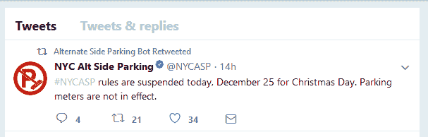

# 创建我的第一个推特机器人

> 原文：<https://dev.to/yechielk/creating-my-first-twitter-bot-1kj4>

我知道最近我有点安静，我几乎在光明节的时候停止了编码。所以昨晚我想，与其参与到沉迷于最美味的中国菜肴的古老犹太传统中，我不如呆在家里，做一个我一直想探索的项目；写一个推特机器人。

我选择了一些简单的东西开始。任何在纽约市拥有汽车的人都知道交替靠边停车(ASP)的痛苦。在一周的某些日子里，我们不被允许在任意的一个半小时内把车停在街道的某些一边。在指定的时刻，一群穿着蓝色制服的秃鹫会突然出现在这座城市，任何车主迟到几分钟的汽车都会被装饰上一个橙色的信封，上面写着昂贵的罚款。

[T2】](https://res.cloudinary.com/practicaldev/image/fetch/s--83GinmYT--/c_limit%2Cf_auto%2Cfl_progressive%2Cq_auto%2Cw_880/https://cdn-images-1.medium.com/max/640/0%2Aov13QrAGQ-sEoEV-.jpg)

值得庆幸的是，一年中有几天(主要是法定假日和大雪后的日子)我们可以得到缓刑。我决定做一个在那些日子里会发微博的机器人。

事实是，NYC 已经有了一个推特账号来发布 ASP 的状态( [@NYCASP](https://twitter.com/NYCASP) )，但是这个账号每天都在发布状态。我不希望我的 feed 在 ASP 规则生效的日子里变得混乱(这是大多数日子)，所以我想我会写一个机器人来为我跟随 [@NYCASP](http://twitter.com/NYCASP) ，并且只在 ASP 规则暂停的日子里转发。

谢天谢地，有一个名为 [twit](https://github.com/ttezel/twit) 的节点包，它提供了一个相当容易使用的 Twitter API 客户端。

为了设置我的机器人，我使用了我的朋友和同学熨斗学校毕业生[本·格林伯格](http://www.bengreenberg.org/)的这个很棒的教程。如果你想写自己的机器人，我建议按照他的帖子进行初始设置，以及如何部署到 Heroku 的说明，这样你的机器人就可以上线了。在这篇文章中，我将描述我是如何创建这个机器人的。

最后我的 bot 长这样:

```
const twit = require('twit');
require('dotenv').config()

const config = {
    consumer_key: process.env.consumer_key,
    consumer_secret: process.env.consumer_secret,
    access_token: process.env.access_token,
    access_token_secret: process.env.access_token_secret
}

const Twitter = new twit(config)

const userID = "102773464"

const stream = Twitter.stream('statuses/filter', {follow: [userID]})

stream.on('tweet', function (tweet) {
    if(tweet.text.includes("suspended")) {
        retweet(tweet.id_str)
    }
})

const retweet = function(id) {
   Twitter.post('statuses/retweet/:id', {id: id}, function(err,res){
      if(res){
         console.log("Successfully Retweeted")
      } else {
         console.log(error.message)
      }
   })
} 
```

Enter fullscreen mode Exit fullscreen mode

在第一行中，我导入了 twit 包，然后我定义了我的 bot 发布所需的配置。我将密钥隐藏在我使用`dotenv`访问的环境变量中。

然后我定义了几个变量:一个使用我的配置的 twit 新实例的`Twitter`变量，一个保存了 [@NYCASP](http://twitter.com/NYCASP) Twitter 帐户的用户 ID 的`userID`变量，最后，我打开了一个 twit `stream`，它监听与 [@NYCASP](http://twitter.com/NYCASP) twitter 帐户相关的所有活动。

现在我已经有了自己的流，我在流上附加了一个事件监听器，每当一条 tweet 被添加到流中时，它就会触发一个回调函数。该函数查看推文的文本，如果它包含单词`"suspended"`，它将触发另一个函数转发它。

真的很简单！

现在剩下的就是部署到 Heroku，等待圣诞节的早晨，看看我的机器人是否会转发那天早上的暂停:

[T2】](https://res.cloudinary.com/practicaldev/image/fetch/s--fuDntW3E--/c_limit%2Cf_auto%2Cfl_progressive%2Cq_auto%2Cw_880/https://cdn-images-1.medium.com/max/607/1%2AQ3jedEcg58l0e7oC2XD5sw.png)

头奖！成功了！

如果你是想关注我的机器人的纽约人，你可以在 [@AlterSideBot](https://twitter.com/AlterSideBot) 找到它

* * *

*这篇文章是从我的博客 [Rabbi On Rails](https://blog.yechiel.me/creating-my-first-twitter-bot-b5e0da5c8cbb) 交叉发布的。
你可以在那里了解更多关于我的编程之旅，或者在 Twitter 上关注我 [@yechielk](https://twitter.com/yechielk)*