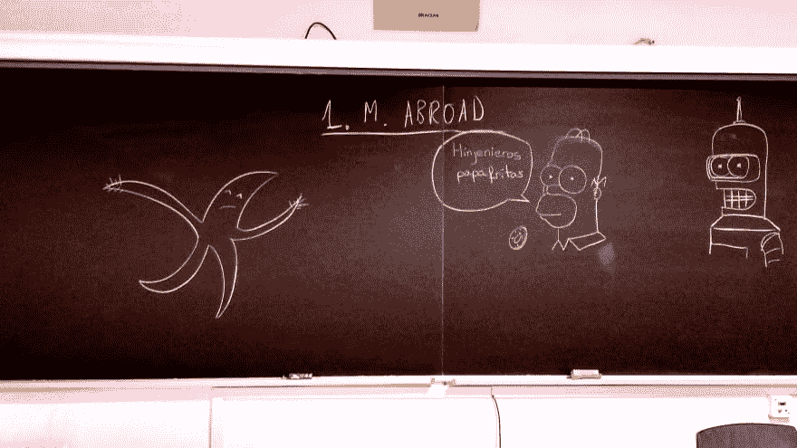

# 语法上的角色扮演

> 原文:[https://dev.to/jj/role-ing-on-the-grammars-1bd5](https://dev.to/jj/role-ing-on-the-grammars-1bd5)

[](https://res.cloudinary.com/practicaldev/image/fetch/s--CThvqJ7a--/c_limit%2Cf_auto%2Cfl_progressive%2Cq_auto%2Cw_880/https://thepracticaldev.s3.amazonaws.com/i/6o667tndvao6nezbwyzu.jpg) 
我们已经知道 [Perl6 确实扮演角色](https://dev.to/jj/assuming-roles-2dog)。但是这个系列[是关于语法](https://dev.to/jj/introduction-to-grammars-with-perl6-75e)的，所以迟早我们必须在文章中找到它们，对吗？

## 在语法中使用角色

我们已经知道语法实际上是类，一种在解析文本时返回 [`Match` es](https://dev.to/jj/matching-with-match-ima) 的特殊类型的类。但是我们正在处理的标记文本实际上是许多不同元素的组合。例如，段落是由(可能是增强的)单词组成的。我们不需要分层次地创建它们:我们可以在不同的 markdown 解析器中混合匹配*单词*角色，从最简单到最复杂。我们可以创建一个解析器，从单词开始，解析一个半像样的类似 markdown 的小语言。

> 这一系列文章的所有脚本是 GitHub
> 中的

```
role like-a-word {
    regex like-a-word { «\H+» }
} 
```

<svg width="20px" height="20px" viewBox="0 0 24 24" class="highlight-action crayons-icon highlight-action--fullscreen-on"><title>Enter fullscreen mode</title></svg> <svg width="20px" height="20px" viewBox="0 0 24 24" class="highlight-action crayons-icon highlight-action--fullscreen-off"><title>Exit fullscreen mode</title></svg>

`role`声明，你猜对了，一个角色。但是我们没有用方法填充它，而是使用了像`regex`这样的语法。语法角色只是角色。
和`regex` en 只是正则表达式，就像我们在 [the Match 文章](https://dev.to/jj/matching-with-match-ima)中看到的一样。他们匹配的东西。但是代币也能做到这一点，这就是它们目前所做的。但是[他们不会后退](https://stackoverflow.com/questions/42291598/perl6-need-help-to-understand-more-about-proto-regex-token-rule)。一旦他们开始匹配事物，发现一些不符合规则的东西，他们就会失败，不会回头说，等等，也许它匹配这个小东西。总之，它们的行为就像常规的正则表达式一样

> 我一直想这么说。

在这种情况下，我们使用它们，因为我们不知道这条规则将在哪里结束。允许它使用回溯将在以后被证明是有用的。而`regex`本身可能看起来很奇怪，因为有了`«»`和所有的一切。在 Perl6 中，它们只是单词边界。这个正则表达式将匹配任何不是水平空白直到单词边界的内容；这不包括垂直空格，因为它将有效地限制一个单词。这是描述单词的一种非常普遍的方式。

我们需要一些其他的结构来完成单词。像这样:

```
role span does like-a-word {
    regex span { <like-a-word>(\s+ <like-a-word>)* } 
} 
```

<svg width="20px" height="20px" viewBox="0 0 24 24" class="highlight-action crayons-icon highlight-action--fullscreen-on"><title>Enter fullscreen mode</title></svg> <svg width="20px" height="20px" viewBox="0 0 24 24" class="highlight-action crayons-icon highlight-action--fullscreen-off"><title>Exit fullscreen mode</title></svg>

声明这个也是一个角色，*允许* `like-a-word`使用声明的正则表达式，并在其中使用相同的名字。跨度就是一组看起来像单词的东西。但是我们可以在此基础上继续发展:

```
role pair-quoted does span {
    proto regex quoted {*}
    regex quoted:sym<em> { '*' ~ '*' <span> }
    regex quoted:sym<alsoem> { '~' ~ '~' <span> }
    regex quoted:sym<code> { '`' ~ '`' <span> }
    regex quoted:sym<strong> { '**' ~ '**' <span> }
    regex quoted:sym<strike> { '~~' ~ '~~' <span> }
} 
```

<svg width="20px" height="20px" viewBox="0 0 24 24" class="highlight-action crayons-icon highlight-action--fullscreen-on"><title>Enter fullscreen mode</title></svg> <svg width="20px" height="20px" viewBox="0 0 24 24" class="highlight-action crayons-icon highlight-action--fullscreen-off"><title>Exit fullscreen mode</title></svg>

我们希望用类似引号的东西来围绕这些跨度，以表达强调或其他类型的东西。我们使用 [`proto`](https://docs.perl6.org/language/functions#proto) ，这使得所有函数使用相同的签名，但是使用不同的代码，这取决于它们必须处理什么。语法可能会再次成为障碍，但我们将在稍后讨论这个问题。只要说我们在这里声明不同种类的跨度就够了。
理论上，我们已经可以用这个来匹配事物；然而，由于它们没有声明`TOP`，它们必须与真正的语法结合使用。就像这个:

```
grammar better-paragraph does pair-quoted {
    token TOP { <chunk>[ (\s+) <chunk>]* }
    regex chunk {  <quoted> | <span> }
} 
```

<svg width="20px" height="20px" viewBox="0 0 24 24" class="highlight-action crayons-icon highlight-action--fullscreen-on"><title>Enter fullscreen mode</title></svg> <svg width="20px" height="20px" viewBox="0 0 24 24" class="highlight-action crayons-icon highlight-action--fullscreen-off"><title>Exit fullscreen mode</title></svg>

这个语法只需要`do`我们已经声明的最复杂的角色，包括所有的角色。它包括一个`quoted`(取自`pair-quoted`角色)或一个`span`(取自`span`角色)。通过使用角色，我们已经简化了这种语法的结构，并且创造了一些对于阅读它的人来说容易理解的东西。一个`better-paragraph`是一个组块序列，可以是带引号的跨度，也可以是简单的跨度。

## 让我们学以致用吧。

让我们进行解析:

```
my $simple-thing = better-paragraph.parse("Simple **thing**");
$simple-thing<chunk>.map: { .put }; 
```

<svg width="20px" height="20px" viewBox="0 0 24 24" class="highlight-action crayons-icon highlight-action--fullscreen-on"><title>Enter fullscreen mode</title></svg> <svg width="20px" height="20px" viewBox="0 0 24 24" class="highlight-action crayons-icon highlight-action--fullscreen-off"><title>Exit fullscreen mode</title></svg>

第一行照常解析。我们知道这将返回一个 [`Match`对象](https://dev.to/jj/matching-with-match-ima)。这个[对象](https://dev.to/jj/matching-things-with-perl-6-grammars-ao9)可以像 hash 一样使用，它将可以从顶部解析的令牌作为关键字。这是我们在下一行中使用的:`$simple-thing<chunk>.map: { .put };`必须从左向右读取。`$simple-thing<chunk>`是从简单文本中提取的不同语块的列表。我们将把它们`map`到一个函数中，在这个例子中仅仅是打印它们的`put`；即`.put`实际做`(implicit loop variable).put`；我们可以用我们心爱的荆棘这样写:

```
$simple-thing<chunk>.map: { $^þ.put }; 
```

<svg width="20px" height="20px" viewBox="0 0 24 24" class="highlight-action crayons-icon highlight-action--fullscreen-on"><title>Enter fullscreen mode</title></svg> <svg width="20px" height="20px" viewBox="0 0 24 24" class="highlight-action crayons-icon highlight-action--fullscreen-off"><title>Exit fullscreen mode</title></svg>

这与打印完全相同:

```
Simple
**thing** 
```

<svg width="20px" height="20px" viewBox="0 0 24 24" class="highlight-action crayons-icon highlight-action--fullscreen-on"><title>Enter fullscreen mode</title></svg> <svg width="20px" height="20px" viewBox="0 0 24 24" class="highlight-action crayons-icon highlight-action--fullscreen-off"><title>Exit fullscreen mode</title></svg>

我们可能真的想去掉这些标记，只需要做一些记录，就可以标记出这个跨度。我们可以这样做:

```
$simple-thing<chunk>.map: { so $^þ<quoted> ??
                say "["~$^þ<quoted><span> ~ "]"!!
                $^þ.put}; 
```

<svg width="20px" height="20px" viewBox="0 0 24 24" class="highlight-action crayons-icon highlight-action--fullscreen-on"><title>Enter fullscreen mode</title></svg> <svg width="20px" height="20px" viewBox="0 0 24 24" class="highlight-action crayons-icon highlight-action--fullscreen-off"><title>Exit fullscreen mode</title></svg>

是引用的东西吗？`so $^þ<quoted> ??` `so`变成一个布尔型，无论它的右边是什么。如果它存在，那就是真的。然后下一个会踢进来:

```
say "[ "~$^þ<quoted><span> ~ "]" 
```

<svg width="20px" height="20px" viewBox="0 0 24 24" class="highlight-action crayons-icon highlight-action--fullscreen-on"><title>Enter fullscreen mode</title></svg> <svg width="20px" height="20px" viewBox="0 0 24 24" class="highlight-action crayons-icon highlight-action--fullscreen-off"><title>Exit fullscreen mode</title></svg>

我们不再直接打印`<quoted>`部分，而是更深入地进入`Match`对象，进入下一层，这里应该有一个。我们会得到和上面差不多的: 

```
Simple
[thing] 
```

<svg width="20px" height="20px" viewBox="0 0 24 24" class="highlight-action crayons-icon highlight-action--fullscreen-on"><title>Enter fullscreen mode</title></svg> <svg width="20px" height="20px" viewBox="0 0 24 24" class="highlight-action crayons-icon highlight-action--fullscreen-off"><title>Exit fullscreen mode</title></svg>

但这有点令人失望，对吧？大费周章却不能使用实际的引用。

## 使用未命名的捕获

我们在规则、令牌或正则表达式中放在括号内的任何内容都将被捕获。让我们这样稍微改变一下`pair-quoted`角色:

```
 regex quoted:sym<em> { ('*') ~ '*' <span> } 
```

<svg width="20px" height="20px" viewBox="0 0 24 24" class="highlight-action crayons-icon highlight-action--fullscreen-on"><title>Enter fullscreen mode</title></svg> <svg width="20px" height="20px" viewBox="0 0 24 24" class="highlight-action crayons-icon highlight-action--fullscreen-off"><title>Exit fullscreen mode</title></svg>

(剩下的也这样做)。我们将在匹配对象中有两个捕获；第一个将包含使用的引用操作符，第二个将与之前相同。我们也可以改变印刷`map` :

```
$simple-thing<chunk>.map: { so $^þ<quoted> ??
                say $^þ<quoted>[0] ~ " → " ~ $^þ<quoted><span> !!
                $^þ.put}; 
```

<svg width="20px" height="20px" viewBox="0 0 24 24" class="highlight-action crayons-icon highlight-action--fullscreen-on"><title>Enter fullscreen mode</title></svg> <svg width="20px" height="20px" viewBox="0 0 24 24" class="highlight-action crayons-icon highlight-action--fullscreen-off"><title>Exit fullscreen mode</title></svg>

现在`$^þ<quoted>[0]`包含了被捕获的操作符，剩下的和之前一样。这将打印:

```
Simple
** → thing 
```

<svg width="20px" height="20px" viewBox="0 0 24 24" class="highlight-action crayons-icon highlight-action--fullscreen-on"><title>Enter fullscreen mode</title></svg> <svg width="20px" height="20px" viewBox="0 0 24 24" class="highlight-action crayons-icon highlight-action--fullscreen-off"><title>Exit fullscreen mode</title></svg>

很漂亮，对吧？我们可以在最终的减价语法中很好地利用这一点。但是这要等到下一期了。