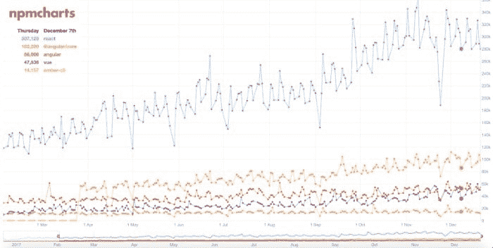

# 反应与角度:第一眼

> 原文：<https://dev.to/bengreenberg/react-vs-angular-a-first-look-4l3i>

<figure> 

<figcaption>(图片来自[本文](https://rubygarage.org/blog/react-vs-angularjs) )</figcaption>

</figure>

毫无疑问，在 Javascript 框架的世界里，React 显然赢得了流行度竞赛。对跟踪下载的 [npmcharts](https://npmcharts.com/compare/react,angular,@angular/core,ember-cli,vue?minimal=true) 在 12 月份任何一天的快速调查显示的结果与此类似:

<figure>

<figcaption>2017 年 12 月 7 日 npmcharts 统计:react — 307，128，angular — 102，200</figcaption>

</figure>

我学的第一个 Javascript 框架是 React。然而事实是 React 本质上并不是一个真正的框架。React 是一个库，虽然是一个强大的库，但它并没有为你的应用程序创建完整的 MVC(模型-视图-控制器)架构。这基本上是 MVC 的观点。Angular 为您的应用程序提供了完整的 MVC 架构，并且作为一个真正的框架运行。但是，话虽如此，人们，包括我自己，对待 React 就像一个框架。中间件的额外使用，如 Redux，进一步扩展了功能。

在过去的一周里，我需要为分配给我的一个小项目学习 Angular。通过这个过程，在第一次看 Angular 之后，我对 React vs Angular 有了一些反思，也有一个很大的教训要分享。当您考虑哪种方法可能更适合您的应用程序需求时，我希望这些思考对您有所帮助。

首先，大教训。分享你犯下的错误并不总是容易的，尤其是在公共论坛上，但我们的网络自我往往是我们生活中完美时刻的升华。真实的生活和成长经历了成功，也经历了错误。

所以，说了这么多，我最大的教训是知道你需要学习哪个版本！在项目开始之前，我花了几天时间学习 Angular，当项目开始时，我认为虽然我不是专家，但我已经掌握了它。我大错特错了。在没有意识到这一点的情况下，我已经花了几天时间学习 Angular 的第一个版本，并假设新版本会与此类似。我找到了一门我真正喜欢的课程，并坚持了下来。嗯，那是个大错误。Angular 2+和第一版差别很大。就像，实际上是一个完全不同的框架层次的差异。

### 大教训:在开始学习一个特定的版本之前，先研究一下技术的版本变化。

现在来谈谈对差异的初步思考:

**HTML 中的 Javascript 还是 Javascript 中的 HTML？**

React 向世界介绍了 JSX，它允许你直接在 Javascript 中编写 HTML。当然，正如人们所想象的，这需要一些修改才能工作。例如，Javascript 中的保留关键字在 JSX 需要用不同的名称来命名，这样才不会冲突，比如 HTML 的`class`。这允许您创建 React 组件，利用简单的逻辑向用户呈现视图。您可以部署一个三元运算符，根据检查的结果显示不同的数据。JSX 让你在同一个文件中完成所有这些工作。

在 Angular 2 中，开发人员利用了*指令*，这些指令可以直接插入到你的 HTML 中，代表核心 Angular 代码中定义的或你自定义编写的不同动作。例如，`ngIf`是一种在 HTML 标记中定义条件检查的方法，如果表单没有正确填写，您可以使用它来创建警告消息。表单的另一个常用工具是`ngSubmit`,它允许您定义当用户提交表单时调用的 Javascript 函数。

你希望你的框架有多固执己见？

React 是一个简单的为你的应用程序提供视图的库，而不是对你的应用程序的结构固执己见。有很多关于如何构建 React 应用程序的最佳实践，出于惯例和可伸缩性的考虑，我建议遵循这些实践。然而，如果你不想这样做，你就不需要这样做。例如，强烈建议将管理*状态*的组件和管理*无状态*的组件分开。构建在整个应用程序中可重用的代码也是一个好主意，但是同样，如果出于某种原因您不想做这些事情，您也不需要这样做。

在我学习 Angular 的过程中，我发现了一个非常固执己见的框架。React 和 Angular 都非常擅长显示错误，这些错误有助于推进您的应用程序并识别问题所在。然而，在 Angular 中，当使用有用的 Angular CLI 和`ng build`将应用程序编译到生产模式时，一个错误，即使是一个根本不影响应用程序运行的小错误，也会停止应用程序的构建。谷歌快速搜索显示，这是许多人沮丧的根源。

然而，你可以看到这也是一件好事。如果你正在为生产编译你的应用程序，你不应该留下任何错误！是的*和*这也是事实，尽管**应该**和**可能**是有区别的。在角度上你不能，在反应上你不应该但是可以。

你的数据:单行道还是双行道？

当您开始 React 之旅时，您学到的第一课就是数据的不变性。像 Flux 这样的编程约定和 Redux 这样的中间件在应用程序中实现单向数据流。无论您有一个*存储*数据还是多个*存储*、*调度器*或内置于*存储*中的*调度器*都是关于您希望如何设计您的应用程序的问题，但核心是数据单向流动的想法。无论您使用 Object.assign 还是 ES6 中的 spread 操作符来更新您的*状态*，您每次所做的都是创建一个新的*状态*，而不是修改您现有的状态。

另一方面，Angular 完全是双向数据绑定。HTML 中的`ngOnChanges`钩子可以监视用户输入的任何变化，以更新应用程序的数据。应用程序数据的可变性可以创造大量的动态性和灵活性。是的，您可以在 Angular 中使用 Immutable.js 或其他策略来增强不变性，但是这并不是框架的组织哲学所固有的。可变数据使跟踪变化变得更具挑战性，也可能对性能产生影响，因此根据我本周的研究，似乎越来越多的人也在他们的 Angular 应用程序中实施数据的不变性。

谁的学习曲线更陡？

如上所述，在过去的一周里，我对 Angular 的学习受到了一个旧版本的影响，该版本在很大程度上不再适用于当前版本。然而，抛开这些不谈，根据我的经验，Angular 的初始学习曲线比 React 更陡峭，而 React 在开始时学习起来更快，但一旦你开始很好地使用它，就需要更多的学习。

由于 Angular 更固执己见的本质和更严格的惯例，您需要在一开始就投入更多的时间来学习如何最初设置您的 Angular 应用程序。React，因为它很大程度上与你如何构建你的应用程序无关，所以开始学习时花费的时间更少。但是，一旦你度过了最初的阶段，开始考虑不仅如何让你的应用程序运行，而且如何做好它，情况就变了。正是因为 React 最初的结构化程度较低，所以它需要更多地学习如何在以后优化它的结构化。因此，在我看来，Angular 最初需要投入更多的时间，而 React 在你过了初级阶段后需要投入更多的时间。

谁赢了？

正如人们可能预料的那样，答案是视情况而定。这取决于您在寻找什么，您的业务需求是什么，您想要什么样的现成功能等等。React 和 Angular 都参与了围绕它们的全球社区，并且都得到主要行业领先公司的支持，因此您可以放心，它们将具有长期的保质期。

很明显，目前 React 是更受欢迎的产品，但是受欢迎程度并不是应用程序开发的唯一决定因素。在 Javascript 框架的世界里，仅仅根据流行程度可能意味着你每隔几周就要换一次最新最好的，因为传送带在快速地生产新的框架。我相信这两种框架都能很好地服务于企业或组织。