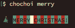

# 发布了 chochoi v0.0.6

> 原文：<https://dev.to/karad/released-chochoi-v006-5fi3>

发布 [chochoi](https://github.com/karad/chochoi) v0.0.6！

我添加了`merry`命令。

[T2】](https://res.cloudinary.com/practicaldev/image/fetch/s--gU86CtRK--/c_limit%2Cf_auto%2Cfl_progressive%2Cq_auto%2Cw_880/https://thepracticaldev.s3.amazonaws.com/i/67ajym6231bwcwa2zwrb.png)

你可以在下面跑。

```
$ npm i -g chochoi
$ chochoi merry 
```

Enter fullscreen mode Exit fullscreen mode