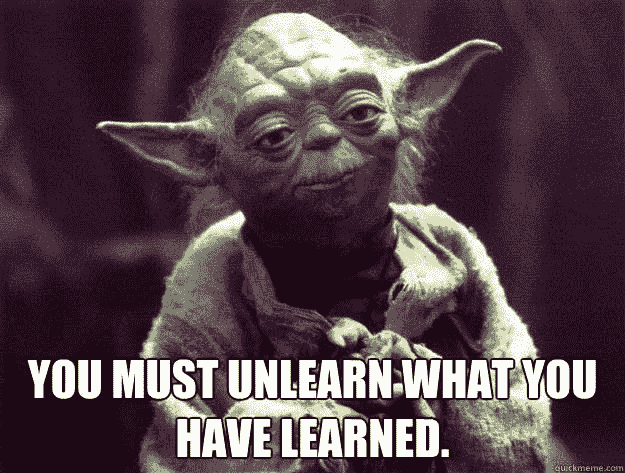

# 禁用所有智能手机通知

> 原文:[https://dev . to/yordiverkroost/disable-your-smart phone-notifications all-of-them-mj7](https://dev.to/yordiverkroost/disable-your-smartphone-notificationsall-of-them-mj7)

智能手机。没有他们我们会做什么？我们每天都在用智能手机做各种事情。它是一个日历，它是你如何与你周围的人保持联系，它是你如何通过阅读博客文章来学习新东西。但最重要的是，这是有史以来最令人分心的设备之一。见鬼，即使你在收到通知时不采取行动，[也一样让人分心](https://www.theatlantic.com/technology/archive/2015/07/push-notifications-versus-phone-calls/398081/)。

当你想到它的时候，它确实是可怕的。我们让智能手机——一个纯粹的电子设备——来控制我们自己，而不是我们来控制智能手机。技术不是应该在日常生活中帮助我们，而不是完全接管它吗？每天，我乘火车去上班，没有太多的例外，我总是遵循以下模式。要么人们已经深深地专注于他们的智能手机，要么在旅途中的某个地方他们收到通知，让他们拿起智能手机立即查看他们的朋友这次在 Instagram 上发布的任何照片。因为该死的，你绝对不能接受错过这些东西的事实。想象一下，你的朋友发现你没有点击那张图片上的“喜欢”按钮。地狱会失控，友谊会消亡。FOMO 是真实的。

[T2】](https://res.cloudinary.com/practicaldev/image/fetch/s--PjnykCZk--/c_limit%2Cf_auto%2Cfl_progressive%2Cq_auto%2Cw_880/https://cdn-images-1.medium.com/max/880/1%2Ado-l08U_o4KW_r0jDPKifA.jpeg)

别误会，我以前也是这么做的。在不超过半小时的火车旅程中，我收到了多个智能手机通知，这并不罕见。甚至不用再想它，通知意味着我必须从口袋里拿出我的智能手机来查看通知是关于什么的。我不得不这么做。直到有一天，我的一个朋友告诉我，他关掉了智能手机上的通知。全部都是。这让他感觉好多了。他害怕错过什么吗？一点也不。当他想阅读 WhatsApp 信息时，他又能控制自己了。他又能控制自己何时想看电子邮件了。他重新控制了自己的智能手机。那个孤独足以让我做同样的事。你知道吗？太牛逼了！

那么，你是怎么做的呢？网上有足够多的帖子很好地向你解释了这一点。只需谷歌“禁用 Android/iPhone 上的通知”就可以了。或者，如果你想跳过谷歌这一步，可以看看安卓版的[指南或者 iPhone 版](https://www.pcworld.com/article/2978403/phones/4-ways-to-turn-off-annoying-notifications-on-your-android-phone-or-iphone.html)的[指南。](https://www.tomsguide.com/us/turn-off-notifications-iphone,news-21195.html)

[T2】](https://res.cloudinary.com/practicaldev/image/fetch/s--iV5GR7-j--/c_limit%2Cf_auto%2Cfl_progressive%2Cq_auto%2Cw_880/https://cdn-images-1.medium.com/max/880/1%2A_ALr30B4wHSRy0yhseciSw.jpeg)

我并不认为关掉智能手机上的通知就能马上解决所有问题。如果你习惯于回复所有的通知，你仍然会不时地拿起你的智能手机来检查你是否收到了任何通知。这很正常，因为多年来这已经成为你的习惯了。也许是个坏习惯，但仍然是个习惯。在你抛弃这个旧习惯并建立一个新习惯之前，需要时间。这是一个过程，不要指望这会立刻改变你的世界。从一小步开始，一步步增加，直到你达到目标。如果一下子关闭所有通知让你很不舒服，那就从几个应用开始。每天或每周添加一到两个，直到它们全部关闭。无论你开始时有多挣扎，最终都会让你的生活变得更好。我保证。