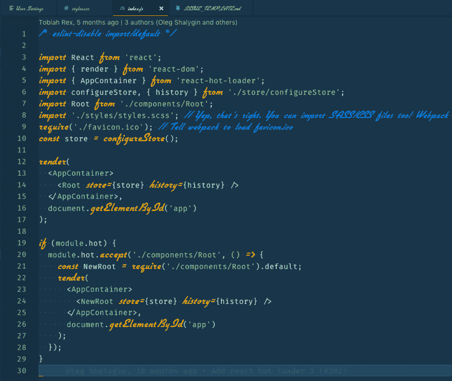
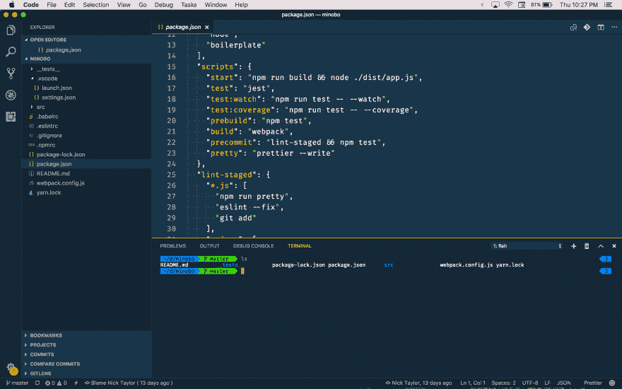
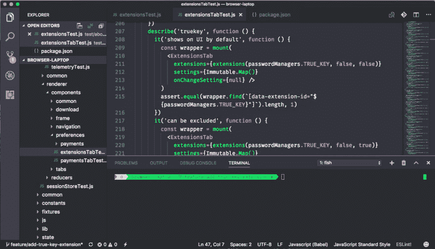

# 我的 Visual Studio 代码安装程序

> 原文:[https://dev . to/Nicky tonline/my-visual-studio-code-setup-2 IMA](https://dev.to/nickytonline/my-visual-studio-code-setup-2ima)

这篇文章也可以在[iamdeveloper.com](https://www.iamdeveloper.com/blog/2017-12-20-my-visual-studio-code-setup/)上找到。

这原本只是一个要点，但是我认为把它转换成一篇博客文章是有意义的。

正如今年的 stateofjs.com 调查所指出的，Visual Studio 代码正迅速成为许多网络开发者选择的 T2 编辑器。

液体错误:内部

[VS Code](https://code.visualstudio.com/Download) 是我选择的编辑器。这对 web 开发来说很棒，如果你正在用 [TypeScript](http://www.typescriptlang.org) 进行开发，这绝对是正确的选择。有趣的事实...它是用打字稿写的。如果你有兴趣了解更多关于 TypeScript 的知识，可以看看我的博客文章[考虑使用 TypeScript](https://dev.to/nickytonline/why-you-might-want-to-consider-using-typescript-6j3) 。

TypeScript 赋予了 VS 代码重构和智能感知的能力。最酷的部分来了。通过[自动类型获取](https://code.visualstudio.com/docs/languages/javascript#_automatic-type-acquisition)，即使你没有使用 TypeScript，你也可以获得类型化的智能感知。

好吧，我们开始吧。这是我当前的 [Visual Studio 代码](https://code.visualstudio.com)设置。

## 分机

VS Code 在他们的市场上有大量的扩展。以及扩展，2017 年，[扩展包](https://code.visualstudio.com/docs/extensionAPI/extension-manifest#_extension-packs)开始可用。TL；博士，它们是一组分机。

设置同步是一个必须的扩展，我推荐你把它作为第一个扩展来安装。有了这个扩展，你就可以将你的大部分设置备份到一个私人的文件夹中。从那里，恢复您的设置是非常容易的。它非常适合备份设置和同步设置，这是我在工作和个人笔记本电脑之间做的事情。

### 节点/JS

*   [节点扩展包](https://marketplace.visualstudio.com/items?itemName=waderyan.nodejs-extension-pack)(必须有)
*   [进口成本](https://marketplace.visualstudio.com/items?itemName=wix.vscode-import-cost)

### 格式化/林挺

*   [更漂亮的代码格式化程序](https://marketplace.visualstudio.com/items?itemName=esbenp.prettier-vscode)
*   [EditorConfig](https://marketplace.visualstudio.com/items?itemName=EditorConfig.EditorConfig)
*   [丝带](https://marketplace.visualstudio.com/items?itemName=eg2.tslint)
*   [美化 JSON](https://marketplace.visualstudio.com/items?itemName=mohsen1.prettify-json)
*   [markdownlint](https://marketplace.visualstudio.com/items?itemName=DavidAnson.vscode-markdownlint)
*   [ESLint](https://marketplace.visualstudio.com/items?itemName=dbaeumer.vscode-eslint)

### CSS

*   [CSS 类名的智能感知](https://marketplace.visualstudio.com/items?itemName=Zignd.html-css-class-completion)
*   [颜色高亮](https://marketplace.visualstudio.com/items?itemName=naumovs.color-highlight)
*   [颜色选择器](https://marketplace.visualstudio.com/items?itemName=anseki.vscode-color)
*   [HTML CSS 支持](https://marketplace.visualstudio.com/items?itemName=ecmel.vscode-html-css)
*   [颜色高亮](https://marketplace.visualstudio.com/items?itemName=naumovs.color-highlight)

### 调试

像 Go 和 Python(见下文)这样的语言扩展在安装后会得到所有合适的工具来调试这些特定的语言。这里还有一些其他的。开始调试最简单的方法是按下`F5`，VS Code 将为您提供调试配置。

*   [Chrome 调试器](https://marketplace.visualstudio.com/items?itemName=msjsdiag.debugger-for-chrome)

### 去吧

*   [Git 扩展包](https://marketplace.visualstudio.com/items?itemName=donjayamanne.git-extension-pack)(必备)
*   [饭桶怪](https://marketplace.visualstudio.com/items?itemName=waderyan.gitblame)
*   [gitflow](https://marketplace.visualstudio.com/items?itemName=vector-of-bool.gitflow)
*   [在 github/bitbucket/gitlab/visualstudio . com 中打开！](https://marketplace.visualstudio.com/items?itemName=ziyasal.vscode-open-in-github)

### 单元测试

*   [JavaScript 单元测试片段](https://marketplace.visualstudio.com/items?itemName=iZDT.javascript-unit-test-snippet)
*   [是](https://marketplace.visualstudio.com/items?itemName=Orta.vscode-jest)

### 做出反应

*   [React Redux ES6 片段](https://marketplace.visualstudio.com/items?itemName=timothymclane.react-redux-es6-snippets)
*   [Reactjs 代码片段](https://marketplace.visualstudio.com/items?itemName=xabikos.ReactSnippets)
*   [vs code-style-components](https://marketplace.visualstudio.com/items?itemName=jpoissonnier.vscode-styled-components)

### 其他语言

*   [出发](https://marketplace.visualstudio.com/items?itemName=lukehoban.Go)
*   [Python](https://marketplace.visualstudio.com/items?itemName=ms-python.python)

### 副本/游乐场

*   [Quokka.js](https://marketplace.visualstudio.com/items?itemName=WallabyJs.quokka-vscode) (查看[介绍 Quokka...](https://medium.com/@artem.govorov/introducing-quokka-the-live-scratchpad-for-javascript-free-developer-tool-a0eb15bb4f54))

### 观众

*   [图像预览](https://marketplace.visualstudio.com/items?itemName=kisstkondoros.vscode-gutter-preview)
*   [SVG 查看器](https://marketplace.visualstudio.com/items?itemName=cssho.vscode-svgviewer)
*   [在浏览器中查看](https://marketplace.visualstudio.com/items?itemName=qinjia.view-in-browser)
*   **更新 2018/02/16:** [Polacode](https://marketplace.visualstudio.com/items?itemName=pnp.polacode) ，本身不是一个查看器，但却是一个拍摄代码片段美丽图像的好方法。

液体错误:内部

### DevOpsy 的东西

*   [Jenkinsfile 支持](https://marketplace.visualstudio.com/items?itemName=secanis.jenkinsfile-support)
*   [码头工人](https://marketplace.visualstudio.com/items?itemName=PeterJausovec.vscode-docker)

### 黑客编辑

*   [导轨](https://marketplace.visualstudio.com/items?itemName=spywhere.guides)
*   [自定义 CSS 和 JS 加载器](https://marketplace.visualstudio.com/items?itemName=be5invis.vscode-custom-css)(目前用于[钴 2 主题](https://marketplace.visualstudio.com/items?itemName=wesbos.theme-cobalt2))。)

**更新 2018/01/28:** 自定义 CSS 和 JS 加载器也可以用于通过使用两种字体来获得一种操作员单色外观。见下面的推文。不过，我确实遇到了一些问题。主要原因是 CSS 类名发生了变化。只需阅读整个 tweet 线程的所有信息。

液体错误:内部

TLDR；查看[https://gist . github . com/Nicky tonline/8086319 BF 5836797 ee 3 DEA 802 a 77000d](https://gist.github.com/nickytonline/8086319bf5836797ee3dea802a77000d)。(也许博客帖子的另一个要点？😉).最终结果是这样的。不确定我是否喜欢代码中的草书，但也许它会让我越来越喜欢。

[T2】](https://res.cloudinary.com/practicaldev/image/fetch/s--k1g2W0A---/c_limit%2Cf_auto%2Cfl_progressive%2Cq_auto%2Cw_880/https://thepracticaldev.s3.amazonaws.com/i/hnlbb6v5eorv1u8mb70k.png)

### 杂项

*   [项目经理](https://marketplace.visualstudio.com/items?itemName=alefragnani.project-manager)
*   [书签](https://marketplace.visualstudio.com/items?itemName=alefragnani.Bookmarks)
*   [盖茨比片段](https://marketplace.visualstudio.com/items?itemName=nickytonline.vscode-gatsby-snippets)
*   [XML 工具](https://marketplace.visualstudio.com/items?itemName=DotJoshJohnson.xml)

## 主题

*   [钴 2](https://marketplace.visualstudio.com/items?itemName=wesbos.theme-cobalt2)
*   [吸血鬼主题](https://marketplace.visualstudio.com/items?itemName=dracula-theme.theme-dracula)
*   [一个暗亲](https://marketplace.visualstudio.com/items?itemName=zhuangtongfa.Material-theme)
*   [素材主题](https://marketplace.visualstudio.com/items?itemName=Equinusocio.vsc-material-theme)

### 当前主题设置

我目前正在用[钴 2](https://marketplace.visualstudio.com/items?itemName=wesbos.theme-cobalt2) 主题和鱼壳渔夫 Agnoster 主题玩一把。

[T2】](https://res.cloudinary.com/practicaldev/image/fetch/s--cwpkTJPl--/c_limit%2Cf_auto%2Cfl_progressive%2Cq_auto%2Cw_880/https://gist.githubusercontent.com/nickytonline/3d5ffeab871a6662d7a3f89bb0bed0f8/raw/c00e3c60587414e788f62f89a503bc5a9b220bd0/cobalt2_agnoster_theme.jpg)

我仍然喜欢使用[德古拉主题](https://marketplace.visualstudio.com/items?itemName=dracula-theme.theme-dracula)和鱼壳渔夫小丑主题，但是我想我应该稍微改变一下。

[T2】](https://res.cloudinary.com/practicaldev/image/fetch/s--jsZGDzCJ--/c_limit%2Cf_auto%2Cfl_progressive%2Cq_auto%2Cw_880/https://gist.githubusercontent.com/nickytonline/3d5ffeab871a6662d7a3f89bb0bed0f8/raw/c00e3c60587414e788f62f89a503bc5a9b220bd0/dracula_joker_theme.jpg)

我也用过[一个黑暗职业](https://marketplace.visualstudio.com/items?itemName=zhuangtongfa.Material-theme)，和[材质主题](https://marketplace.visualstudio.com/items?itemName=Equinusocio.vsc-material-theme)，也很棒。

## 外壳

我现在用的是不可知论者主题的[鱼壳](https://fishshell.com)和[渔夫](https://github.com/fisherman/fisherman)。

## 字体

我在 VS 代码中使用 [Fira 代码](https://github.com/tonsky/FiraCode)。一旦你[安装了](https://github.com/tonsky/FiraCode/wiki#installing-font) Fira 代码，代码的设置就相当容易了。

[T2】](https://camo.githubusercontent.com/3a8948f34284f378ead7af5846aa432035c687ad/687474703a2f2f732e746f6e736b792e6d652f696d67732f666972615f636f64655f6c6f676f2e737667)

打开您的用户设置并添加以下内容:

```
 //  Controls  the  font  family.  "editor.fontFamily":  "Fira Code",  "editor.fontLigatures":  true,  //  Controls  the  font  size.  "editor.fontSize":  14, 
```

<svg width="20px" height="20px" viewBox="0 0 24 24" class="highlight-action crayons-icon highlight-action--fullscreen-on"><title>Enter fullscreen mode</title></svg> <svg width="20px" height="20px" viewBox="0 0 24 24" class="highlight-action crayons-icon highlight-action--fullscreen-off"><title>Exit fullscreen mode</title></svg>

嘣！鲍勃是你的叔叔，你现在有 Fira 代码在所有它的可怕的连字(这是一个词吗？).

## 自定义按键绑定

```
//  Place  your  key  bindings  in  this  file  to  overwrite  the  defaults  [  {  "key":  "cmd+shift+z",  "command":  "workbench.action.terminal.focus"  },  {  "key":  "cmd+shift+a",  "command":  "workbench.action.terminal.focusNext"  },  {  "key":  "cmd+shift+s",  "command":  "workbench.action.terminal.focusPrevious"  },  {  "key":  "cmd+shift+x",  "command":  "workbench.action.terminal.kill"  }  ] 
```

<svg width="20px" height="20px" viewBox="0 0 24 24" class="highlight-action crayons-icon highlight-action--fullscreen-on"><title>Enter fullscreen mode</title></svg> <svg width="20px" height="20px" viewBox="0 0 24 24" class="highlight-action crayons-icon highlight-action--fullscreen-off"><title>Exit fullscreen mode</title></svg>

此外，如果你正在寻找关于 Visual Studio 代码的技巧和诀窍，请查看[www.vscodetips.com](https://www.vscodetips.com)。我真正期待的最后一件事是[现场分享](https://code.visualstudio.com/blogs/2017/11/15/live-share)的可用性。

有问题或意见吗？在推特上给我打电话。