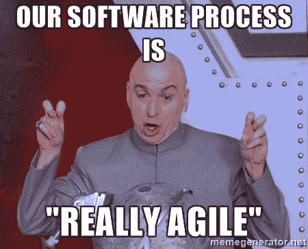

# 及时交付是一个观察细节的问题

> 原文:[https://dev . to/ivancrneto/delivering-in-time-is-a-matter-of-observing-the-details-i98](https://dev.to/ivancrneto/delivering-in-time-is-a-matter-of-observing-the-details-i98)

[T2】](https://res.cloudinary.com/practicaldev/image/fetch/s--zaAIpR01--/c_limit%2Cf_auto%2Cfl_progressive%2Cq_auto%2Cw_880/https://thepracticaldev.s3.amazonaws.com/i/e64isyfgiabbptifj3aw.jpg)

在经历了七年的软件开发、不同的公司和技术之后，我尝试了许多管理工作和团队的方法，我可以看到，不管你的团队有什么过程，你都会发现自己有问题要交付。

大多数软件规划失败的一个重要原因是浪费时间。在许多情况下，我们倾向于花费更多的时间，总的时间损失足以影响项目。

根据我的经验，这些情况大多与沟通有关，是一个很大的瓶颈:

1.  人们等待关于变更规范的答案或决定；
2.  任务被其他任务阻止；
3.  缺乏沟通或沟通缓慢。

这个星期我在做一个重要的任务，在截止日期的前一天有一个需求变更。一个小变化，但有两个文本选项，我们必须等待项目经理来决定。

等待时间不是很长，但足以产生一个[蝴蝶效应](https://en.wikipedia.org/wiki/Butterfly_effect)并在一天内延迟任务(冲突、其他任务中的新错误、QA 稍后开始、之前正在排队的另一个系统中的新部署等)。我们可以通过简单地创建一个基于 flag 或 A/B 测试的解决方案来解决这个问题，我们只需部署，然后根据 PM 的回答启用第一个或第二个文本。清理工作肯定会比等待时间短。

以下是一些可能会改进您的团队票证和流程的示例:

### 例 1——缓慢沟通

*   开发人员完成一项任务，提交一个 PR (Pull Request ),并且不告诉人们有一个新的评审要做。
*   评审者完成了一个评审，并且没有 ping 回开发人员来执行修复。
*   审查者批准了一个 PR，但没有让 QA 人员开始测试。

有时人们认为其他人会收到通知并迅速行动。这种情况不会发生。他们只会在三、四小时后，甚至一天后做。

**解决方案:**创造一种文化，只要任务状态有变化，就利用团队的主要沟通渠道与所有相关人员沟通。

### 例 2 -等待决定

*   有一个决定要做，开发人员正在等待。

**解决方案 1:** 试着想象一下什么是最合适的选择，选择它并努力去做。
**方案二:**让两者在一个开/关开关后面工作。

*注意:*上述解决方案高度依赖于决策的范围。

### 例 3 -等待另一个系统

*   在开发人员完成任务之前，需要完成另一个系统的 API 端点。

**解决方案:**将任务一分为二。第一个任务将记录日志，而不是调用 API。第二个任务将使用 API 调用替换日志。

### 例 4 -等待购票

*   没有新的工作票。

**解决方案:**代码评审，与另一个 dev 配对。

### 示例 5 -开发人员在票证中花费了太多时间

*   有时会有一些票没有被指定，我们最终会和一个开发人员单独工作很长一段时间。

**解决方案 1:** 尽可能把票拆分成非技术性的子任务，这样其他开发者就可以挑选每一个子任务。
**解决方案 2:** 将票据分割成包含可部署部分的技术子任务。这个特性可以在最后一部分被推送后被激活(例如，我们可以有一个任务来执行数据库更改，另一个任务来添加新的 HTML 模板，最后一个任务包括一个带有一些应用程序逻辑的 URL，显示页面并使用新的数据库更新)。

*注意:*在这种特殊情况下，解决方案 1 和 2 可以完美地结合在一起。例如，我们可以有三个子任务，而不是一个大任务，每个子任务有三个技术部分，许多开发人员可以在上面工作，而不是只有一个。

### 例 6 - QA 正在掌握流程的某个部分

*   QA 必须测试所有的东西，这减慢了整个过程

**解决方案 1:** 有些片段可以被推送，跳过 QA 流程，就像一个模板文件，在最终特征完成之前不会被使用。
**解决方案 2:** 即使是业务逻辑块也可以使用 A/B 测试标志，如果它们被默认关闭，QA 可以做一个小测试来验证没有任何问题，真正的测试可以在以后进行。

### 示例 7 -预发布版本中发现的错误

*   在预发布版本中发现了一个 bug，需要进行修复。

**解决方案 1:** 当然是修复 bug。
**解决方案 2:** 如果 bug 只发生在一个标志处于非活动状态时，则停用该标志，这样您就解除了推送的阻止，然后您可以进行修复并进行第二次推送。

*注意:*解决方案 2 只能在标志是新的并且要下一个版本的情况下进行。

### 例 8 -工作依赖于一个仍未完成的请购单

*   开发人员必须着手一项新任务，但这取决于仍在审查中的公关。

**解决方案:**在被检查的分支之上创建一个分支。这里的大多数开发人员倾向于说他/她被阻塞并等待。没有理由等待。在前一部作品的基础上工作，就是这样。当请购单被批准后，重新确定基础。

### 例 9——有人被屏蔽。你被封锁了

**解决方案:**问问自己:我需要做些什么来解除对她/他的封锁？我需要做什么来取消阻止我？
人们喜欢说“我被屏蔽了”或“我被某人/某事屏蔽了”，而对此不做任何处理。很舒服。有一个借口。你必须能够说“嘿，你可以做 X，Y，Z，完成，你是畅通无阻的”。

开始改变很难，但会有回报。在开始时，你真的必须不断监视每个人，检测每一个“浪费时间”的情况何时发生，并努力疏通人们。

当你开始感觉到他们自己在做，也就是说，这已经成为一种习惯，你当然可以期待更成功的交付。记住:作为开发人员，你的工作不仅仅是写代码，而是交付价值。