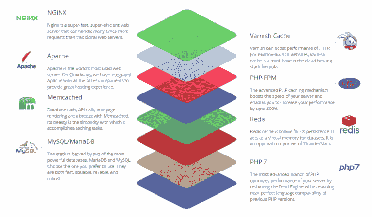
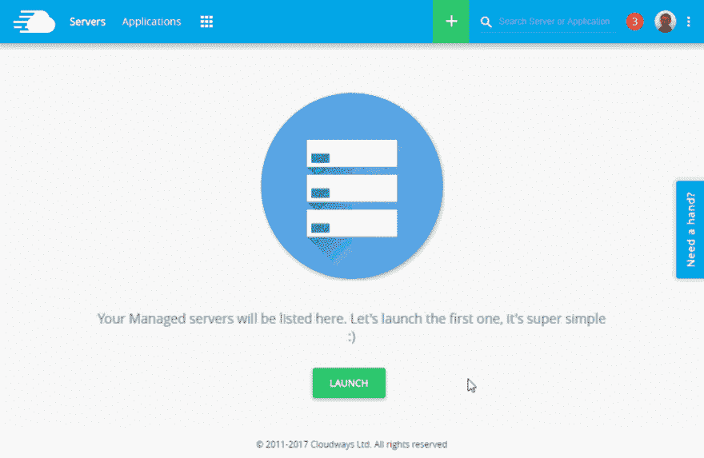

# 这是 Cloudways 给开发者的平安夜。

> 原文：<https://dev.to/_shahroznawaz/heres-what-cloudway-is-giving-to-developers-this-christmas-eve-bh4>

Cloudways 是一个托管的云托管平台，用于 PHP 应用程序、CMS 和框架。提供最好的六个提供商，包括 DigitalOcean、Linode、AWS、Vultr、Kyup 和 GCE。只需点击几下鼠标，您就可以启动上述提供商的服务器和应用程序，并享受折扣优惠。

## 雷栈

Cloudways 工程师在最佳技术的基础上构建了他们自己的 PHP Thunderstack:

[T2】](https://res.cloudinary.com/practicaldev/image/fetch/s--B-sbnpLT--/c_limit%2Cf_auto%2Cfl_progressive%2Cq_auto%2Cw_880/https://www.cloudways.com/blog/wp-content/uploads/stack-linode-cloudways-768x448.png)

## 卓越的特性

这里有一些你必须知道的特性。

1.从多个云基础设施中进行选择，如 DigitalOcean、Google、Amazon 等。

2.部署多个 web 应用程序，包括 WordPress、Magento、Drupal、WooCommerce 和 PHP 应用程序。

3.借助集成的 CloudwaysBot，在热门渠道上实时了解您的服务器。

4.在多个数据中心部署服务器

5.Cloudways 通过实时聊天和票务系统为您提供全天候支持

6.Cloudways 上的大多数操作都可以一键完成，比如克隆、备份、恢复和服务器扩展。

7.通过在平台内与您的团队协作，构建出色的 web 应用程序。

8.在内置的分级机制
上运行之前，测试您的 web 应用程序，从平台内部监控 15 个以上的应用程序。

9.您可以从“让我们来加密”中一键部署免费的 SSL。

10.内部缓存配方 Thunderstack 可确保您的网站加载速度比平均速度快 100 倍。

11.使用项目功能从 Cloudways 平台管理大量网站。

## 坐好&放松

那么，这个圣诞节你需要做什么🎄？什么都不用做，放松，用鼠标点击控制你的网络应用和服务器。这是演示:

[T2】](https://res.cloudinary.com/practicaldev/image/fetch/s--3NUUamwN--/c_limit%2Cf_auto%2Cfl_progressive%2Cq_66%2Cw_880/http://www.cloudways.com/blog/wp-content/uploads/launch-linode.gif)