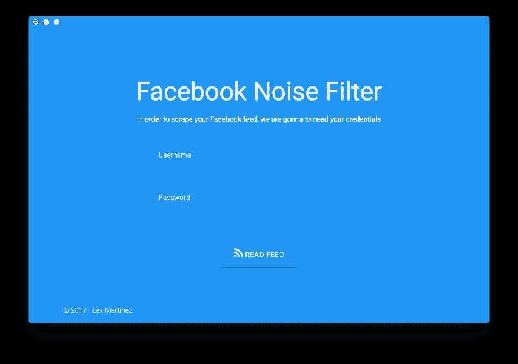
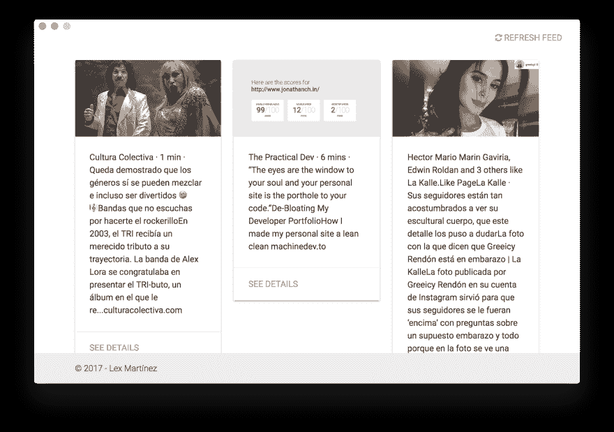

# 脸书噪声滤波器

> 原文:[https://dev.to/lexmartinez/facebook-noise-filter-2m75](https://dev.to/lexmartinez/facebook-noise-filter-2m75)

*原发表于我的[博客](https://redknot.io/articles/writing-realtime-poll-w-go)*

有时我们的脸书新闻有点嘈杂，很多人发表他们的想法，很多有趣或搞笑的事情和任何其他无用的东西，我说无用是因为在一些特定的时刻，我们不想得到那种内容。

在很多情况下，我们很想关闭我们的脸书账户，但在某些情况下，这并不太简单，因为我们有外部服务链接到我们的账户，如 Spotify 或 Airbnb，甚至脸书开发项目

本周，我在思考一个新的开源项目，我称之为`Facebook Noise Filter`，最初的想法是一个简单的`puppeteer`抓取脚本，它为我登录脸书，并根据特定的关键字集过滤新闻内容。

几天后，脚本完成了，我看到了它的潜力，并决定用`electron`将其实现为桌面应用程序，今天我完成了桌面应用程序的概念验证，我想与大家分享这个想法和原型，并公开邀请大家贡献或评论它，欢迎大家的想法！

这个项目的源代码可以在[这里](https://github.com/lexmartinez/facebook-noise-filter)找到，这里有一些我们原型的截图..我希望你喜欢它！

[T2】](https://res.cloudinary.com/practicaldev/image/fetch/s--NurFgPSh--/c_limit%2Cf_auto%2Cfl_progressive%2Cq_auto%2Cw_880/https://github.com/lexmartinez/facebook-noise-filter/raw/master/screenshots/screenshot-1.png)

[T2】](https://res.cloudinary.com/practicaldev/image/fetch/s--w_WZhVRI--/c_limit%2Cf_auto%2Cfl_progressive%2Cq_auto%2Cw_880/https://github.com/lexmartinez/facebook-noise-filter/raw/master/screenshots/screenshot-feed.png)