# 配置 Chef Automate 以触发寻呼机工作警报

> 原文:[https://dev . to/mattstratton/configuring-chef-automate-to-trigger-page duty-alerts-556 l](https://dev.to/mattstratton/configuring-chef-automate-to-trigger-pagerduty-alerts-556l)

[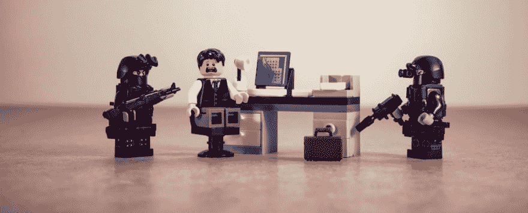T2】](https://res.cloudinary.com/practicaldev/image/fetch/s--ZY6Vleru--/c_limit%2Cf_auto%2Cfl_progressive%2Cq_auto%2Cw_880/https://cdn-images-1.medium.com/max/1024/1%2AeqMy_PLqsx_kHWQMUHg6BQ.png)

如果我们可以在系统不符合时生成一个事件，那不是很好吗？通过简单的 webhooks，将 [Chef Automate](https://www.chef.io/automate/) 和[page duty](https://www.pagerduty.com)结合起来，我们完全可以做到这一点。

### 先决条件

我做出以下假设:

1.  您已经安装了 Chef Automate，其中至少有一个节点被配置为向 Automate 发送合规信息(如果您需要帮助进行配置，我推荐 Nick Rycar 的这篇精彩文章[)。](https://blog.chef.io/2017/07/17/detect-correct-chef-automate-audit-cookbook/)
2.  您有一个寻呼机关税帐户。

### 在 PagerDuty 为厨师合规创建服务

我们首先在 PagerDuty 中创建一个服务。一个“服务”代表了一个应用程序、组件或者团队——在这种情况下，我们认为遵从性是一个整体状态。目前，Chef Automate 没有为我们提供过滤哪些节点被报告的功能，但是在以后的文章中，我将深入研究 PagerDuty 中的进一步配置，以将这些节点划分到不同的服务中。目前，我们会将整个车队的合规性视为我们整体关心的事情。

要创建服务，请从 PagerDuty 网站点击**配置|服务**，然后**添加新服务**。

[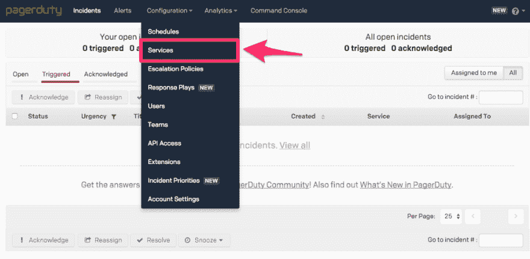T2】](https://res.cloudinary.com/practicaldev/image/fetch/s--eCl7D5UO--/c_limit%2Cf_auto%2Cfl_progressive%2Cq_auto%2Cw_880/https://cdn-images-1.medium.com/max/1024/1%2A-Dl4_QtFs_lf4tBltEak7w.png)

[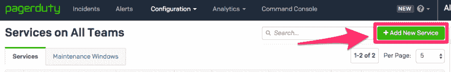T2】](https://res.cloudinary.com/practicaldev/image/fetch/s--wu9e6t2Z--/c_limit%2Cf_auto%2Cfl_progressive%2Cq_auto%2Cw_880/https://cdn-images-1.medium.com/max/935/1%2AreKp2nPZIRRLQ7AN_qKe0w.png)

1.  将服务命名为厨师合规。
2.  提供可选描述。
3.  集成类型应该是自定义事件转换器。
4.  集成名称应为 Chef Automate Compliance Webhook
5.  为您的组织配置适当的其余设置。

[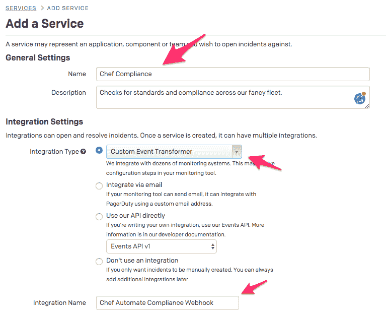T2】](https://res.cloudinary.com/practicaldev/image/fetch/s--kQB5cAk0--/c_limit%2Cf_auto%2Cfl_progressive%2Cq_auto%2Cw_880/https://cdn-images-1.medium.com/max/767/1%2Aaae4qI_PVUf0gauIItxVtA.png)

保存这个新服务后，您会看到它被列出。单击集成名称(Chef Automate Compliance Webhook ),以便我们对其进行配置:

[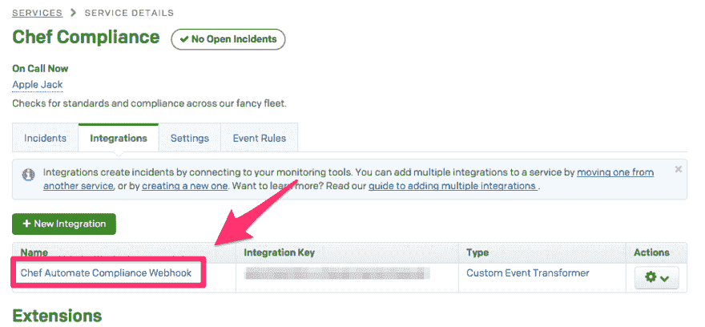T2】](https://res.cloudinary.com/practicaldev/image/fetch/s--L46QyXJb--/c_limit%2Cf_auto%2Cfl_progressive%2Cq_auto%2Cw_880/https://cdn-images-1.medium.com/max/931/1%2AxvR5HY4aaC2bVT14asJtOQ.png)

点击**编辑积分**

[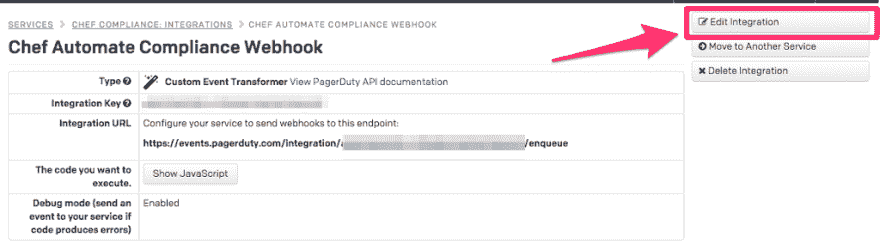T2】](https://res.cloudinary.com/practicaldev/image/fetch/s--B5scweN9--/c_limit%2Cf_auto%2Cfl_progressive%2Cq_auto%2Cw_880/https://cdn-images-1.medium.com/max/1024/1%2AcJeu_q2m4sEec7nGH0GU0g.png)

将 JavaScript 替换为以下内容:

```
var webhook = PD.inputRequest.body;

var normalized_event = {
  event_type: PD.Trigger,
  incident_key: webhook.node_uuid,
  description: "InSpec found a critical control failure on "+webhook.node_name,
    "details": {
    "Number of failed critical tests": webhook.number_of_failed_critical_tests,
    "Total number of critical tests": webhook.number_of_critical_tests
  },
  client: "Chef Automate",
  client_url: "https://automate.mattstratton.io/viz/#/compliance/reporting/nodes/"+webhook.node_uuid
};

PD.emitGenericEvents([normalized_event]); 
```

<svg width="20px" height="20px" viewBox="0 0 24 24" class="highlight-action crayons-icon highlight-action--fullscreen-on"><title>Enter fullscreen mode</title></svg> <svg width="20px" height="20px" viewBox="0 0 24 24" class="highlight-action crayons-icon highlight-action--fullscreen-off"><title>Exit fullscreen mode</title></svg>

您最终会想要禁用设置调试模式，但是让它打开进行测试也是可以的。还要确保用你自己的 Automate 服务器的 FQDN 来替换`automate.mattstratton.io`！

[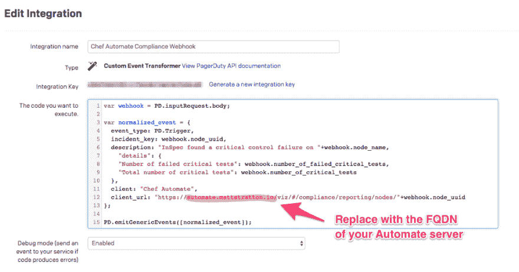T2】](https://res.cloudinary.com/practicaldev/image/fetch/s--KTWXssri--/c_limit%2Cf_auto%2Cfl_progressive%2Cq_auto%2Cw_880/https://cdn-images-1.medium.com/max/1024/1%2AxAMuYUJCGm3XTSpLGOFw2A.png)

### 配置厨师自动通知

您将需要来自 Chef Automate Compliance Webhook Integration 的集成 URL。应该是类似`https://events.pagerduty.com/integration/XXXXXXXXXXXX/enqueue`的东西

打开 Chef Automate 控制台，切换到**节点**选项卡:

[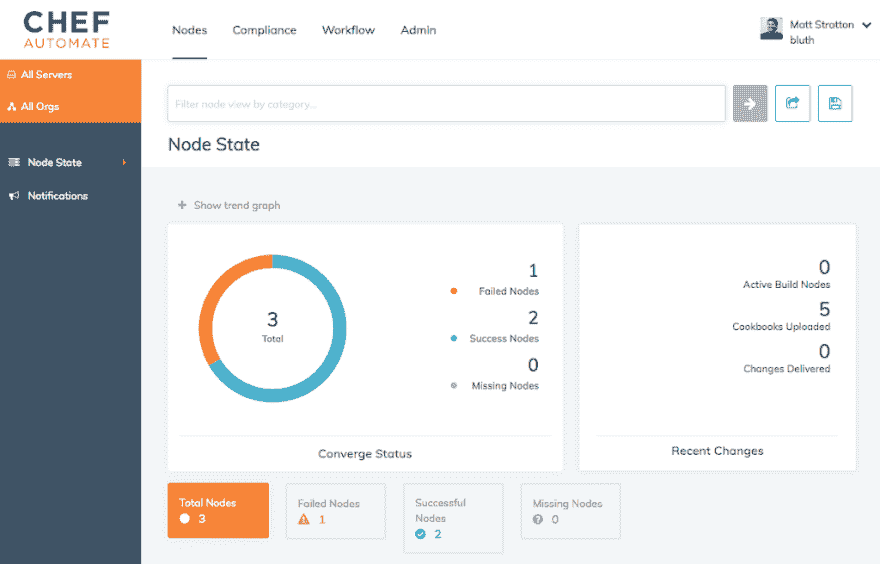T2】](https://res.cloudinary.com/practicaldev/image/fetch/s--zDkoG75N--/c_limit%2Cf_auto%2Cfl_progressive%2Cq_auto%2Cw_880/https://cdn-images-1.medium.com/max/1024/1%2A402wY5iKNiDaoAAHowTnGg.png)

点击**通知|创建通知**:

[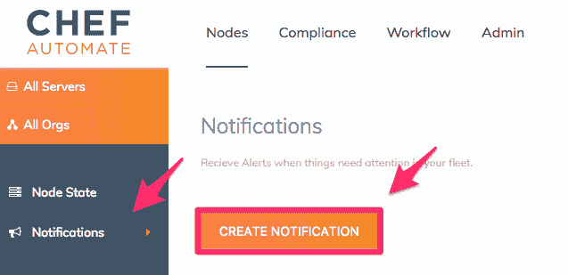T2】](https://res.cloudinary.com/practicaldev/image/fetch/s--Gm0NCJXJ--/c_limit%2Cf_auto%2Cfl_progressive%2Cq_auto%2Cw_880/https://cdn-images-1.medium.com/max/637/1%2A-XIP0XJ6WwhzijUTT3fvQw.png)

我们想要添加一个 **Webhook** 通知，所以选择它。

[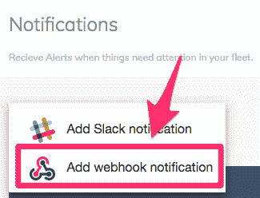T2】](https://res.cloudinary.com/practicaldev/image/fetch/s--ek8HzPfi--/c_limit%2Cf_auto%2Cfl_progressive%2Cq_auto%2Cw_880/https://cdn-images-1.medium.com/max/800/1%2Awt2RqFmib_oEaNovfG1fWg.png)

选择检查扫描失败，并粘贴到您的集成 URL。调用页面责任检查扫描失败通知，点击**保存。**

[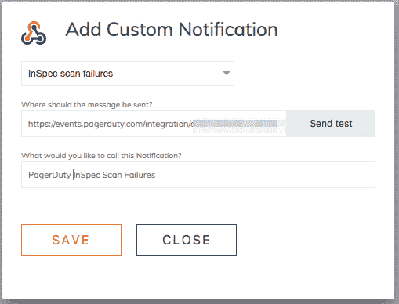T2】](https://res.cloudinary.com/practicaldev/image/fetch/s--QPC1UmJK--/c_limit%2Cf_auto%2Cfl_progressive%2Cq_auto%2Cw_880/https://cdn-images-1.medium.com/max/800/1%2AHbPD3uShtJgnCwXwViAD4Q.png)

### 测试通知

假设我们有一个节点没有通过配置的合规性配置文件，我们所要做的就是在该节点上运行 chef-client，我们应该看到它出现在 PagerDuty 中，如下所示:

[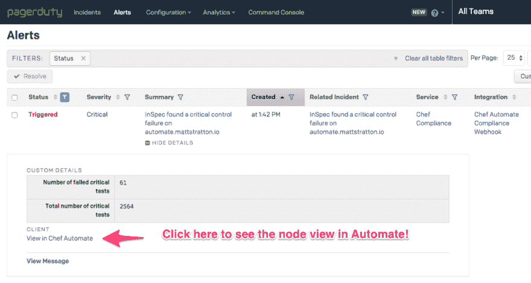T2】](https://res.cloudinary.com/practicaldev/image/fetch/s--v5wUT9yC--/c_limit%2Cf_auto%2Cfl_progressive%2Cq_auto%2Cw_880/https://cdn-images-1.medium.com/max/1024/1%2AOlIce-p4aeMzhh4QYQYB1g.png)

下面是在 PagerDuty 中生成的事件的样子:

[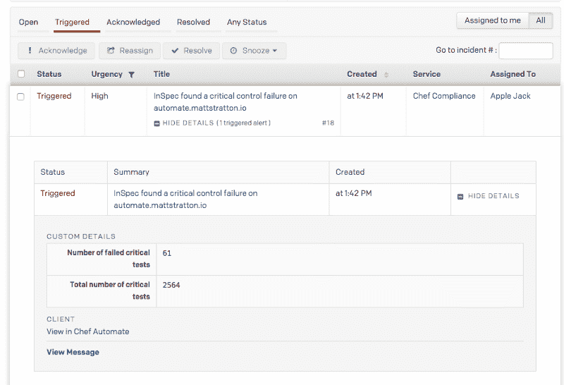T2】](https://res.cloudinary.com/practicaldev/image/fetch/s--H-ppVabT--/c_limit%2Cf_auto%2Cfl_progressive%2Cq_auto%2Cw_880/https://cdn-images-1.medium.com/max/800/1%2AZv66OiUcy0dO-vGMq73UJQ.png)

更奇妙的是，我们可以在移动应用程序 PagerDuty 中看到它:

[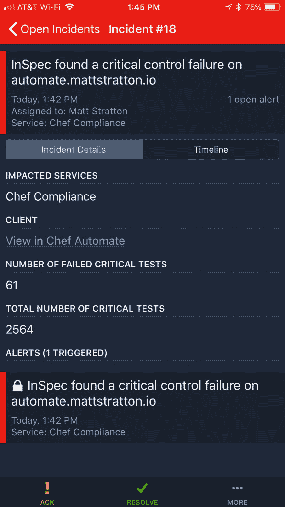T2】](https://res.cloudinary.com/practicaldev/image/fetch/s--qVxwt_zP--/c_limit%2Cf_auto%2Cfl_progressive%2Cq_auto%2Cw_880/https://cdn-images-1.medium.com/max/1024/1%2ABt1rm9UBaGC4Hiw6LTOhSQ.jpeg)

### 在 PagerDuty 中报告厨师客户端错误

与合规性失败类似，我们也可以在 chef-client 运行失败时生成警报和事件。这是一个非常相似的过程:

1.  在 PagerDuty 中创建一个新服务，但这一次，将其称为 Chef Client。
2.  像以前一样使用自定义事件转换器，但是将其命名为 Chef Automate Chef Client Webhook(或者不太冗长的名称，如果您愿意的话)。
3.  使用以下 JavaScript 进行集成:

```
var webhook = PD.inputRequest.body;

var normalized_event = {
  event_type: PD.Trigger,
  incident_key: webhook.node_uuid,
  description: "Chef client failed on "+webhook.node_name+" with error: "+webhook.exception_message,
  details: webhook.exception_backtrace,
  client: "Chef Automate",
  client_url: webhook.automate_failure_url
};

PD.emitGenericEvents([normalized_event]); 
```

<svg width="20px" height="20px" viewBox="0 0 24 24" class="highlight-action crayons-icon highlight-action--fullscreen-on"><title>Enter fullscreen mode</title></svg> <svg width="20px" height="20px" viewBox="0 0 24 24" class="highlight-action crayons-icon highlight-action--fullscreen-off"><title>Exit fullscreen mode</title></svg>

在 Automate 中，您将创建一个类似于 Compliance 的通知，但不是报告 InSpec 失败，而是选择 Chef 客户端运行失败的选项

[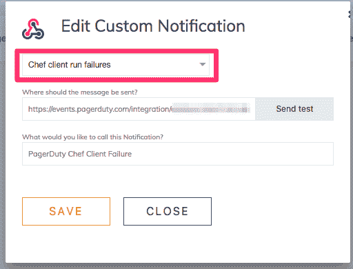T2】](https://res.cloudinary.com/practicaldev/image/fetch/s--G-8raeR6--/c_limit%2Cf_auto%2Cfl_progressive%2Cq_auto%2Cw_880/https://cdn-images-1.medium.com/max/512/1%2AuCyL3Xe5CQSWXSuxwhk8sw.png)

PagerDuty 中的报告与此略有不同—它将给出来自 chef-client 的错误信息，以及回溯信息:

[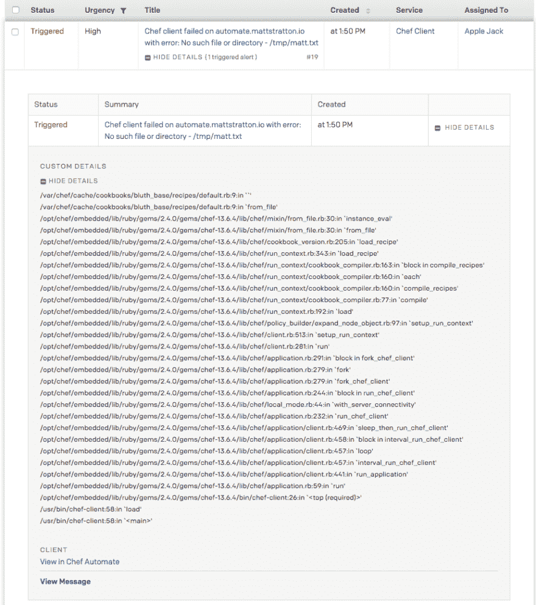T2】](https://res.cloudinary.com/practicaldev/image/fetch/s--YZqEPX4X--/c_limit%2Cf_auto%2Cfl_progressive%2Cq_auto%2Cw_880/https://cdn-images-1.medium.com/max/923/1%2A25M6kPdAuHEVHl1QvXLpVg.png)

### 总结

这是一个非常基本的集成，但希望它说明了将这两者结合在一起是多么容易。在以后的文章中，我将深入研究将特定的遵从失败发送给特定团队的方法。让我知道我能为你解答什么问题！