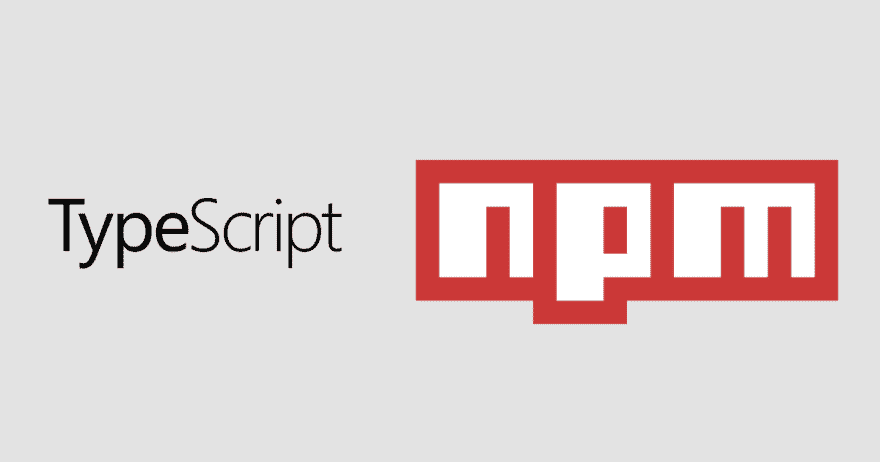

# 将打字稿模块发布到 NPM

> 原文:[https://dev . to/orkon/publishing-a-typescript-module-to-NPM-e5n](https://dev.to/orkon/publishing-a-typescript-module-to-npm-e5n)

[T2】](https://res.cloudinary.com/practicaldev/image/fetch/s--BFrXZ9Sj--/c_limit%2Cf_auto%2Cfl_progressive%2Cq_auto%2Cw_880/https://60devs.com/img/guide-publishing-a-typescript-module-to-npm/poster.png)

本指南旨在以简明的分步方式总结向 NPM 发布 Typescript 模块的所有方面，同时提供足够的上下文来理解某些事情是以这样或那样的方式完成的。如果您从未发布过 TypeScript 模块，本指南将对您有所帮助。

## 第一步。创建文件夹结构

*   为您的模块创建一个新文件夹
*   运行`git init`来初始化 git 存储库
*   在模块文件夹中创建以下文件或文件夹:
    *   `index.ts`，这是你的模块的入口文件
    *   `package.json`，包含 NPM 要求的模块元数据
    *   `tsconfig.json`，包含类型脚本编译的配置
    *   `.gitignore`忽略 git 存储库的某些文件
    *   (可选)`lib`内部 TypeScript 模块的目录
    *   (可选)`test`测试目录

`index.ts`应该导出你的模块的公共接口，例如:

```
export async function myFunction() {
  throw new Error('Not implemented');
} 
```

<svg width="20px" height="20px" viewBox="0 0 24 24" class="highlight-action crayons-icon highlight-action--fullscreen-on"><title>Enter fullscreen mode</title></svg> <svg width="20px" height="20px" viewBox="0 0 24 24" class="highlight-action crayons-icon highlight-action--fullscreen-off"><title>Exit fullscreen mode</title></svg>

`.gitignore`至少应包含:

```
dist # compiled version of your module will be placed here by typescript compiler
node_modules # local dependencies of your module will be put by npm here 
```

<svg width="20px" height="20px" viewBox="0 0 24 24" class="highlight-action crayons-icon highlight-action--fullscreen-on"><title>Enter fullscreen mode</title></svg> <svg width="20px" height="20px" viewBox="0 0 24 24" class="highlight-action crayons-icon highlight-action--fullscreen-off"><title>Exit fullscreen mode</title></svg>

## 第二步。配置 Typescript

使用在上一步中创建的`tsconfig.json`来管理 Typescript 配置。以下是你可以入手的最低配置:

```
{
  "compilerOptions": {
    "module": "commonjs",
    "target": "es5",
    "outDir": "./dist",
    "moduleResolution": "node",
    "declaration": true
  },
  "include": [
    "test/**/*.ts",
    "lib/**/*.ts",
    "index.ts"
  ]
} 
```

<svg width="20px" height="20px" viewBox="0 0 24 24" class="highlight-action crayons-icon highlight-action--fullscreen-on"><title>Enter fullscreen mode</title></svg> <svg width="20px" height="20px" viewBox="0 0 24 24" class="highlight-action crayons-icon highlight-action--fullscreen-off"><title>Exit fullscreen mode</title></svg>

编译器选项告诉 TypeScript 编译器，它将使用节点模块，并且应该将您的 Typescript 代码编译为 EcmaScript 5 并生成类型声明文件。`include`属性定义只有来自`test`和`lib`文件夹和`index.ts`的文件才会被 Typescript 编译。编译后的代码将被放入 dist 文件夹中。编译到 ES5 允许您的模块与更广泛的 NodeJS 版本一起使用。由于生成了类型定义文件，TypeScript 用户将能够使用与编译后的代码相对应的类型信息。

## 第三步。配置 NPM

`package.json`负责定义 NPM 将向全球注册管理机构发布的内容。此外，它允许定义脚本，以确保最新版本的代码在发布前正确编译，并且只有编译后的版本才发布到 NPM。开始的最小`package.json`是:

```
{
  "name": "$TODO-module-name",
  "version": "0.0.1",
  "description": "Describe your project TODO",
  "main": "dist/index",
  "typings": "dist/index",
  "scripts": {
    "prepublishOnly": "npm run compile",
    "compile": "npm run clean && tsc -p .",
    "watch": "tsc -w -p .",
    "clean": "rm -rf dist"
  },
  "bugs": {
    "url": "http://github.com/$TODO-github-username/$TODO-module-name/issues"
  },
  "repository": {
    "type": "git",
    "url": "http://github.com/$TODO-github-username/$TODO-module-name.git"
  },
  "keywords": [
    "your keywords TODO"
  ],
  "author": "your name <your.contact.email@service.com> TODO",
  "license": "MIT",
  "devDependencies": {
    "@types/node": "^8.0.0",
    "typescript": "^2.6.1"
  },
  "files": [
    "dist/index.js",
    "dist/index.d.ts",
    "dist/lib"
  ]
} 
```

<svg width="20px" height="20px" viewBox="0 0 24 24" class="highlight-action crayons-icon highlight-action--fullscreen-on"><title>Enter fullscreen mode</title></svg> <svg width="20px" height="20px" viewBox="0 0 24 24" class="highlight-action crayons-icon highlight-action--fullscreen-off"><title>Exit fullscreen mode</title></svg>

重要的属性是`main`和`typings`，它们允许从 JavaScript 和 TypeScript 中使用你的模块。注意，这些属性指向`dist`目录。按照`files`属性的定义，只有`dist`目录将被发布到 NPM。如果您想发布更多文件，您需要将它们列在`files`列表中。

另一个重要的部分是`prepublishOnly`脚本。每当您运行`npm publish`并编译您的模块时，这个脚本就会被调用。为了方便开发，您可以使用`npm run watch`在对您的。ts 文件。

请确保在发布前调整所有标记为 TODO 的属性。还要运行`npm install`来安装 Typescript 和节点类型作为您的开发依赖项。NPM 脚本将使用本地版本，因此您不需要全局安装 Typescript。

## 第四步。出版

运行 npm 发布以将您的更改发布到 NPM:

```
npm publish 
```

<svg width="20px" height="20px" viewBox="0 0 24 24" class="highlight-action crayons-icon highlight-action--fullscreen-on"><title>Enter fullscreen mode</title></svg> <svg width="20px" height="20px" viewBox="0 0 24 24" class="highlight-action crayons-icon highlight-action--fullscreen-off"><title>Exit fullscreen mode</title></svg>

不要忘记提交并把最终版本推送到您的 git 库。

## 进一步阅读

*   工作原理[https://git-scm.com/docs/gitignore](https://git-scm.com/docs/gitignore)
*   `tsconfig.json`参考[https://www . typescriptlang . org/docs/handbook/ts config-JSON . html](https://www.typescriptlang.org/docs/handbook/tsconfig-json.html)
*   `package.json`参考[https://docs.npmjs.com/files/package.json](https://docs.npmjs.com/files/package.json)
*   `npm publish`docs[https://docs.npmjs.com/cli/publish](https://docs.npmjs.com/cli/publish)

这个指南有帮助吗？说说你的想法。