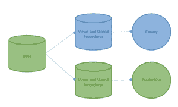

# 开发运维与数据库的速度差距

> 原文:[https://dev . to/iedaddy/devo PS-and-databases-velocity-gap-282h](https://dev.to/iedaddy/devops-and-databases-velocity-gap-282h)

推送代码很容易，现在有很多工具可以自动完成这些部署。但是，仍然手动完成的部署经常有一个被忽略的方面。数据库部署通常仍然是一个手动过程。这些部署通常会降低我们的交付速度，它们速度慢、容易出错且资源密集，因为这仍然是一个手动流程，会干扰开发和运营之间的清晰交接。

有些人将此称为“速度差距”。这是我们在交付中最大的限制，因为我们只能和最慢的成员一样快，而且往往最终是数据库实现。如果我们的目标是每天交付 10 次，10 次手动数据库部署可能会造成相当大的瓶颈。

与安全性类似，数据库造成这种障碍的原因是因为它通常是最后一个进入生命周期的团队。数据库不能像应用程序功能一样被还原或替换。它旨在保存和保护数据，因此必须保存数据本身。解决应用程序交付的这一部分是一个复杂的问题，因为与代码交付不同，在代码交付中，回滚包括部署以前的构建工件，数据库总是处于不断的运动中，并且通常情况下，您不能只是及时返回到以前的状态，因为输入到系统中的数据仍然必须保留。例如，在一个基于订单的系统中，你不能因为发现了一个错误，需要回滚，就放弃最近 3 天的购买。

这从根本上涉及到数据库是如何设计的。就像开发人员必须学习如何构建他们的代码来支持自动化和单元测试一样，数据库架构师现在必须学习如何构建弹性数据库来支持 devOps 发布节奏。为了成功地将数据库引入 devOps，数据库管理员应该融入团队，了解开发，并信任开发过程。DevOps 意味着拥有跨职能团队，因此数据库管理员应该是团队的一部分，能够以传统的方式参与体系结构，当发生变化时，数据库管理员通常不知道为什么会发生变化，也不知道它将如何影响整个产品。将他们带到团队中不仅能帮助他们理解产品的功能，还能让他们参与到架构中来。

这非常重要，因为我们数据库中的传统数据结构不支持 devOps 模型，因为我们缺少一个抽象层。当我们考虑重新构建数据库以支持 devOps 部署模型时，经常会遇到这种情况。在选择如何构建我们的数据库及其部署流程时，需要考虑一些关键的基本原则:

*   **可测试的**:在生产数据库上运行之前，我可以测试任何数据库更改。
*   **自动化**:我可以把整个过程自动化，这样就不会出错了。
*   **Trackable** :每个数据库都应该有一个日志，记录对其模式做了什么。
*   **原子:**更新过程必须成功完成或完全回滚。
*   **可恢复**:每次更新都要自动做备份，以防最坏的情况发生。

出于这个原因，我发现一个非常有效的模型是这样一个概念:拥有处理数据的核心数据表，然后拥有一个接口数据库，负责视图、存储过程和原始数据之外的业务逻辑。

通过在同一个服务器上拆分成两个独立的数据库，可以很容易地让两个外观数据库“动态运行”,同时仍然依赖核心数据保持不变。小的改变、更新和特性被应用于一个门面，以支持金丝雀构建或蓝绿色部署模型。

[T2】](http://iedaddy.com/wp-content/uploads/2017/12/canary-1.png)

> 通过分解数据库代码并将其从原始数据存储中分离出来，它允许我们使用金丝雀或环形部署在生产中并行运行。

这是不是在所有情况下都有效？不会。但它确实大大有助于我们快速部署和回滚我们的许多更改，同时仍然保留我们的“动态”数据，就像各种电子商务应用程序一样。通过在一个数据库中以视图和存储过程的形式抽象我们的数据库“功能”,在另一个数据库中抽象原始数据，我们可以快速回滚更改，同时保留我们的实际数据。

不过，从根本上说，这将改变您的部署和工件的结构。您需要尽早让您的 DBA 参与进来，并解释该结构背后的原因以及它对他们的实际意义。

帖子 [DevOps 和数据库速度差距](http://iedaddy.com/2017/12/devops-databases-velocity-gap/)最早出现在一个内陆帝国老爸的[经历上。](http://iedaddy.com)