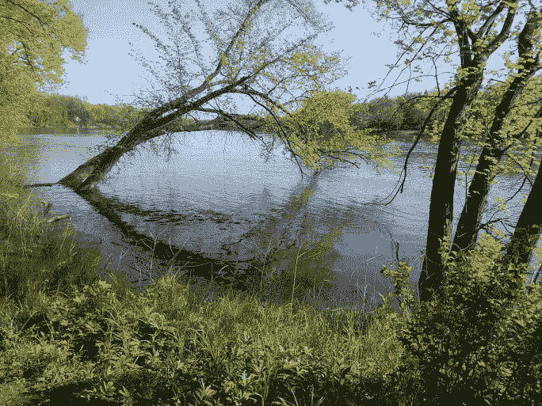

# 没有什么金子可以留下

> 原文:[https://dev.to/wiredferret/nothing-gold-can-stay-2ibl](https://dev.to/wiredferret/nothing-gold-can-stay-2ibl)

这个月标志着对我来说非常重要的两个组织的结束，我想告诉你们关于它们的事情。

## Alterconf

[T2】](https://res.cloudinary.com/practicaldev/image/fetch/s--QBeccW5y--/c_limit%2Cf_auto%2Cfl_progressive%2Cq_auto%2Cw_880/http://www.heidiwaterhouse.com/wp-content/uploads/2017/12/alterconf-logo.png)

Alterconf 徽标

Alterconf 是一个发生在世界各地的会议系列。组织精神是阿什·德莱顿。她将自己在科技行业、游戏和会议方面的所有经验用于创造新的独特的东西。对于一个很小的会议系列(相对而言)，Alterconf 将奥弗顿之窗拉向了公正和平等访问。一些功能在它出现时几乎是闻所未闻的，现在越来越普遍:

*   浮动入场费
*   实时转录
*   儿童保育
*   当地小企业的包容性餐饮
*   付钱给素描者、实时推特者和其他当地记者
*   公平公开地支付给所有演讲者

他们还确保所有的谈话都被记录下来。Alterconf 选择做的一切都与开放访问、消除参与障碍联系在一起。我现在能想到的演讲圈里的很多人都是从 Alterconf 开始的。

我的 Alterconf 演讲是关于女性社会化看护角色和数字安全的交集:[https://alterconf.com/speakers/heidi-waterhouse](https://alterconf.com/speakers/heidi-waterhouse)

我孩子的第一次会议演讲也是 Alterconf:[https://alterconf.com/speakers/sebastian-w](https://alterconf.com/speakers/sebastian-w)

他谈到了在 13 岁之前作为一个孩子在互联网上是什么样的。

主题是个人的，各种各样的，衷心的，有意义的。发言者不是通常的嫌疑人。看看这些美丽的人代表了巨大的不同经历。

[https://alterconf.com/speakers/](https://alterconf.com/speakers/)

Alterconf 对我个人和技术对话文化来说意义重大。我在那里学到的东西给了我勇气。

> 如果 Alterconf，以滑动比例入场，能够支付演讲者，我将*永远不会*接受更大、更贵、赞助更好的会议不能。我尤其对那些甚至不给演讲者免费通行证的会议感到愤怒。

所以谢谢你，Ashe，以及所有让 Alterconf 发生的人。我很抱歉它不能持续更长时间，但我明白任何人都只能倾吐这么多。

* * *

## 严格来说

[T2】](https://res.cloudinary.com/practicaldev/image/fetch/s--VPRaFHv1--/c_limit%2Cf_auto%2Cfl_progressive%2Cq_auto%2Cw_880/http://www.heidiwaterhouse.com/wp-content/uploads/2017/12/techspeaklogo-150x150.jpg)

从技术角度讲，徽标

从技术角度讲，时事通讯也在本月结束了，原因大致相同——在一个项目成为一种浪费而不是一份礼物之前，我们能投入的自我是有限的。Chiu-Ki Chan 和 Cate Huston 编写了一份有用、信息丰富、鼓舞人心的时事通讯，适用于新的/有抱负的演讲者和有经验的人。

这是固执己见，这是一个好处。有很多会议，如果有人帮我策划付费会议或我感兴趣的会议，并写下预期的内容，那就太有用了！他们还策划了相关主题的链接，从幻灯片设计到服装选择到冒名顶替综合症，无所不包。你总是可以依靠一些有用的数据来使你成为一个更好的演讲者，或者一个更好的会议组织者。他们并不回避谈论基于会议的争议——比如，如果一个受邀的演讲者变成了一个问题，你该怎么办？你如何评价是否退出一个会议？对演讲者来说，什么是危险信号？

它也是一个社区，尽管是以一种怪异的新媒体方式。还有其他人，其他女性正在经历一些我曾经经历过的奇怪事情，我可能看不到他们，因为我不在科技的那个角落，但是这些经历很容易翻译。我们互相鼓励，在会议上互相关注，记得尽可能团结一致，因为我们贴在贴纸上的座右铭是*我有话要说*。

> 我有话要说。从技术上来说教会了我怎么说。

技术上来说存档:[https://tinyletter.com/techspeak/archive](https://tinyletter.com/techspeak/archive)

* * *

## 决议

我讨厌这些事情不会在 2018 年发生，或者永远不会发生，但没有人欠我什么。我只是要记住，当它们发生的时候，它们对我来说是重要的，而我纪念投入其中的工作的最好方式是，尽我所能，在不伤害我自己的情况下，用我能做到的方式，把我学到的东西教给其他人。

为此，我正在组织一个关于如何撰写和提交 CFP 的小型网络研讨会。我开始这样做是为了工作，帮助 LaunchDarkly 帮助那些想做演讲的客户，但是当我在 Twitter 上发布我将在我的客户身上使用它们之前测试我的想法时，30 多人告诉我他们想要我完全没有尝试过的课程。所以…我会测试，给我的客户，然后把它记录下来。这将是我能给这个世界的一点小东西，从技术上来说，它不是 Alterconf，但仍然建立在他们的经验之上。我会确保在最终版本中有字幕。我会记得，在你提交会议报告的最初几次，它是怪异和不透明的。我希望我能为走在我后面的人多开辟一点道路，就像走在前面的人为我开辟道路一样。

[T2】](https://res.cloudinary.com/practicaldev/image/fetch/s--zA_iGcKu--/c_limit%2Cf_auto%2Cfl_progressive%2Cq_auto%2Cw_880/http://www.heidiwaterhouse.com/wp-content/uploads/2017/12/nothing_gold.jpg)

* * *

# 没有什么金子可以留下来

## [罗伯特·弗罗斯特](https://www.poets.org/node/45684)，1874–1963

```
Nature’s first green is gold, 
Her hardest hue to hold. 
Her early leaf’s a flower; 
But only so an hour. 
Then leaf subsides to leaf. 
So Eden sank to grief, 
So dawn goes down to day. 
Nothing gold can stay. 
```

<svg width="20px" height="20px" viewBox="0 0 24 24" class="highlight-action crayons-icon highlight-action--fullscreen-on"><title>Enter fullscreen mode</title></svg> <svg width="20px" height="20px" viewBox="0 0 24 24" class="highlight-action crayons-icon highlight-action--fullscreen-off"><title>Exit fullscreen mode</title></svg>