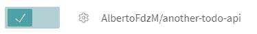
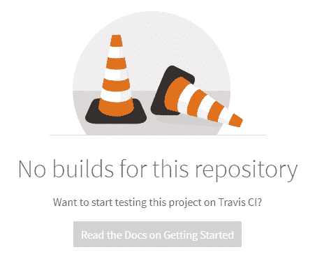
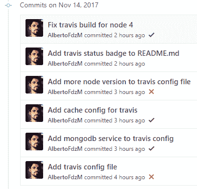
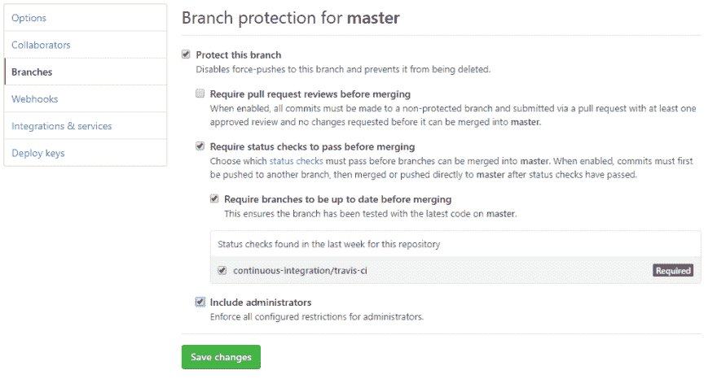
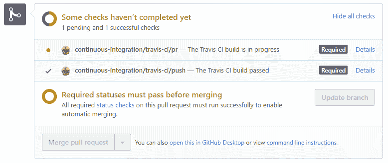

# Express APIs 与 Travis CI 的持续集成

> 原文:[https://dev . to/albertofdzm/continuous-integration-for-express-API-with-Travis-ci-1ie 7](https://dev.to/albertofdzm/continuous-integration-for-express-apis-with-travis-ci-1ie7)

本文介绍了如何将 Travis CI 服务与 NodeJS 一起用于 GitHub 上的一个开源项目。最后，您将能够使用**持续集成(CI)** 设置一个基本的构建管道来自动验证您的代码。

***注:**这是关于**用 Express** 构建 API 系列文章的**第 6 篇**。这篇文章的代码将在上一篇文章的[生成代码](https://github.com/AlbertoFdzM/another-todo-api/tree/post/05)的基础上进行开发( [**对照文档**](http://onlythepixel.com/2017/09/06/testing-an-api-against-documentation/) 测试 API)。*

## 特拉维斯词

[Travis CI](https://travis-ci.com/) 是开源社区中使用最多的[持续集成](https://en.wikipedia.org/wiki/Continuous_integration)服务之一。为 GitHub 项目启用它是如此容易，真是可笑。要激活它，首先我需要在 travis-ci.org 有一个帐户给它访问 GitHub 项目的[，然后在](https://travis-ci.org/auth) [Travis CI 个人资料页面](https://travis-ci.org/profile/)激活该项目的服务。

[T2】](https://res.cloudinary.com/practicaldev/image/fetch/s--AqbX_Oq---/c_limit%2Cf_auto%2Cfl_progressive%2Cq_auto%2Cw_880/http://onlythepixel.com/conteimg/2017/11/travis-ci-service-activation.PNG)

这就是我所需要的，谢谢你的阅读！啊...好吧，也许需要更多的东西...

[T2】](https://res.cloudinary.com/practicaldev/image/fetch/s--vu-2uPGd--/c_limit%2Cf_auto%2Cfl_progressive%2Cq_auto%2Cw_880/http://onlythepixel.com/conteimg/2017/11/travis-ci-no-builds.PNG)

好了，要开始用 Travis 构建东西，我必须更新代码。一旦 Travis **在回购上检测到一些新的分支或提交**，它**将运行代码为**的构建，但此时，它将失败。

## 为节点设置 Travis CI

是的，在特拉维斯开始顺利工作之前，还有一件小事要做。它不知道如何处理 GitHub 库，为了帮助解决这个问题，repo 必须有一个**配置文件(`.travis.yml`)，告诉 Travis 如何处理代码**。如果没有找到这个文件，它将尝试使用 Ruby 构建项目。

### `.travis.yml`

```
language: node_js # Sets which engine use to build the project 
node_js: "node" # Specifies node version to use "node"="latest" 
```

<svg width="20px" height="20px" viewBox="0 0 24 24" class="highlight-action crayons-icon highlight-action--fullscreen-on"><title>Enter fullscreen mode</title></svg> <svg width="20px" height="20px" viewBox="0 0 24 24" class="highlight-action crayons-icon highlight-action--fullscreen-off"><title>Exit fullscreen mode</title></svg>

这是在 NodeJS 中开始构建的最简单的 Travis CI 配置文件。

***注:**关于用 JavaScript 为 Travis 编写的[文档上的配置的更多信息。](https://docs.travis-ci.com/user/languages/javascript-with-nodejs/)*

### 第一次建造

在提交这个文件并上传到 GitHub 之后，Travis 将开始一个新的构建，在这种情况下使用下面的日志:

```
Worker information  
hostname: b4baa4ff-edbd-48aa-b09f-bc84b287b798@1.i-0a50124-production-2-worker-org-ec2.travisci.net  
version: v3.4.0 https://github.com/travis-ci/worker/tree/ce0440bc30c289a49a9b0c21e4e1e6f7d7825101  
instance: 7917cbf travisci/ci-garnet:packer-1503972846 (via amqp)  
startup: 571.280161ms  
Build system information  
Build language: node_js

...

MongoDB version  
MongoDB 3.2.16

...

$ git clone --depth=50 --branch=post/06 https://github.com/AlbertoFdzM/another-todo-api.git AlbertoFdzM/another-todo-api
Cloning into 'AlbertoFdzM/another-todo-api'...  
remote: Counting objects: 124, done.  
remote: Compressing objects: 100% (2/2), done.  
remote: Total 124 (delta 0), reused 2 (delta 0), pack-reused 121  
Receiving objects: 100% (124/124), 79.47 KiB | 15.89 MiB/s, done.  
Resolving deltas: 100% (54/54), done.

$ cd AlbertoFdzM/another-todo-api
$ git checkout -qf dac5b5b13eef6d36ec76538c8194ce32923d628a
$ export PATH=./node_modules/.bin:$PATH
Updating nvm  
$ nvm install node
Downloading and installing node v9.1.0...  
Downloading https://nodejs.org/dist/v9.1.0/node-v9.1.0-linux-x64.tar.xz...  
######################################################################## 100.0%
Computing checksum with sha256sum Checksums matched!  
Now using node v9.1.0 (npm v5.5.1)

$ node --version
v9.1.0  
$ npm --version
5.5.1  
$ nvm --version
0.33.6  
$ yarn
yarn install v0.27.5  
[1/4] Resolving packages...
[2/4] Fetching packages...
[3/4] Linking dependencies...
[4/4] Building fresh packages...
Done in 131.09s.

$ npm test

> another-todo-api@0.0.0 test /home/travis/build/AlbertoFdzM/another-todo-api
> dredd

info: Configuration './dredd.yml' found, ignoring other arguments.  
warn: Apiary API Key or API Project Subdomain were not provided. Configure Dredd to be able to save test reports alongside your Apiary API project: https://dredd.readthedocs.io/en/latest/how-to-guides/#using-apiary-reporter-and-apiary-tests  
info: Starting backend server process with command: npm start  
info: Waiting 3 seconds for backend server process to start

> another-todo-api@0.0.0 start /home/travis/build/AlbertoFdzM/another-todo-api
> set DEBUG=another-todo:* && node bin/www

(node:4653) UnhandledPromiseRejectionWarning: Unhandled promise rejection (rejection id: 1): MongoError: failed to connect to server [localhost:27017] on first connect [MongoError: connect ECONNREFUSED 127.0.0.1:27017]
info: Beginning Dredd testing...  
info: Found Hookfiles: 0=/home/travis/build/AlbertoFdzM/another-todo-api/docs/hooks.js  
error: GET (200) /tasks duration: 120101ms  
error: Error connecting to server under test!  
GET /v1/tasks - - ms - -  
error: POST (201) /tasks duration: 120105ms  
error: Error connecting to server under test!  
error: GET (200) /tasks/586e88337106b038d820a54f duration: NaNms  
error: TypeError: Cannot read property 'body' of undefined  
    at replaceUrlForCreatedTaskId (/home/travis/build/AlbertoFdzM/another-todo-api/docs/hooks.js:10:89)

...

complete: 0 passing, 0 failing, 10 errors, 0 skipped, 6 total  
complete: Tests took 720719ms  
complete: See results in Apiary at: https://app.apiary.io/public/tests/run/91a01c82-f849-4736-8681-469d8e4d7ba9  
info: Backend server process exited  
npm ERR! Test failed. See above for more details.  
The command "npm test" exited with 1\.  
Done. Your build exited with 1. 
```

<svg width="20px" height="20px" viewBox="0 0 24 24" class="highlight-action crayons-icon highlight-action--fullscreen-on"><title>Enter fullscreen mode</title></svg> <svg width="20px" height="20px" viewBox="0 0 24 24" class="highlight-action crayons-icon highlight-action--fullscreen-off"><title>Exit fullscreen mode</title></svg>

***注:**为了提高可读性，省略了一些日志痕迹。整个日志可以在[特拉维斯 CI 构建报告](https://travis-ci.org/AlbertoFdzM/another-todo-api/builds/302110299)T5 中找到。*

### 发生了什么事？

有一些好的方面和一些不好的方面需要注意。第一个是 Travis 用 NodeJS 做了一个 build！它提供了很多关于在“云”中构建项目的机器上发生了什么的信息(操作系统版本、节点版本、npm 版本，系统中安装了什么..)

1.  克隆回购:`git clone --depth=50 --branch=post/06 https://github.com/AlbertoFdzM/another-todo-api.git AlbertoFdzM/another-todo-api`
2.  安装 nodejs:t0]
3.  安装项目依赖项:`yarn`(它检测到我们在项目中有一个`yarn.lock`文件)
4.  执行测试:`npm test`(NodeJS 上 Travis 的默认构建命令**)**
***   测试失败:`npm ERR! Test failed. See above for more details.`😢*   构建失败:`Done. Your build exited with 1.`(提示:1 为坏，0 为好)**

 **问题:

```
(node:4653) UnhandledPromiseRejectionWarning: Unhandled promise rejection (rejection id: 1): MongoError: failed to connect to server [localhost:27017] on first connect [MongoError: connect ECONNREFUSED 127.0.0.1:27017] 
```

<svg width="20px" height="20px" viewBox="0 0 24 24" class="highlight-action crayons-icon highlight-action--fullscreen-on"><title>Enter fullscreen mode</title></svg> <svg width="20px" height="20px" viewBox="0 0 24 24" class="highlight-action crayons-icon highlight-action--fullscreen-off"><title>Exit fullscreen mode</title></svg>

它还没有连接到 MongoDB 数据库，尽管 MongoDB 已经安装在系统中:

```
MongoDB version  
MongoDB 3.2.16 
```

<svg width="20px" height="20px" viewBox="0 0 24 24" class="highlight-action crayons-icon highlight-action--fullscreen-on"><title>Enter fullscreen mode</title></svg> <svg width="20px" height="20px" viewBox="0 0 24 24" class="highlight-action crayons-icon highlight-action--fullscreen-off"><title>Exit fullscreen mode</title></svg>

这是因为 [Travis 不会启动服务，除非你告诉它这样做](https://docs.travis-ci.com/user/database-setup/)。

让我们修理它。

### `.travis.yml`

```
language: node_js  
node_js: "node"  
services: mongodb 
```

<svg width="20px" height="20px" viewBox="0 0 24 24" class="highlight-action crayons-icon highlight-action--fullscreen-on"><title>Enter fullscreen mode</title></svg> <svg width="20px" height="20px" viewBox="0 0 24 24" class="highlight-action crayons-icon highlight-action--fullscreen-off"><title>Exit fullscreen mode</title></svg>

提交、推送、[检查构建](https://travis-ci.org/AlbertoFdzM/another-todo-api/builds/302132559)和...🎉`Done. Your build exited with 0.`(提醒:0 为好)

关掉机器，我们终于可以回家了。

## 等待...这篇文章是为一个只有 3 行的文件写的吗？

是的，但是已经做了一些事情，比如在`package.json`中良好定义的依赖关系，以及使用 NodeJS 标准实践和`npm test`定义的测试。

想要更多吗？好了，还有更多的事情要做。

### 特拉维斯 CI 缓存

Travis 配置文件可以定义应该缓存哪些文件夹以缩短构建时间。在这种情况下，我将缓存`node_modules`文件夹以减少安装依赖项的时间，同时也是为了`yarn`。

#### `.travis.yml`

```
language: node_js  
node_js: "node"  
services: mongodb  
cache:  
  directories:
    - "node_modules"
  yarn: true 
```

<svg width="20px" height="20px" viewBox="0 0 24 24" class="highlight-action crayons-icon highlight-action--fullscreen-on"><title>Enter fullscreen mode</title></svg> <svg width="20px" height="20px" viewBox="0 0 24 24" class="highlight-action crayons-icon highlight-action--fullscreen-off"><title>Exit fullscreen mode</title></svg>

***注:**[Travis CI 缓存文档](https://docs.travis-ci.com/user/caching)中的更多信息。*

### Travis 构建多个 NodeJS 版本

Travis CI 可以配置为在每次构建时针对多个 NodeJS 版本运行，以确保项目在这种环境中正确工作。

对于这个项目，它将运行 NodeJS v4.x 和 NodeJS v7.x 的“最新”版本的构建。

#### `.travis.yml`

```
language: node_js  
node_js:  
  - "node"
  - "7"
  - "4"
services: mongodb  
cache:  
  directories:
    - "node_modules"
  yarn: true 
```

<svg width="20px" height="20px" viewBox="0 0 24 24" class="highlight-action crayons-icon highlight-action--fullscreen-on"><title>Enter fullscreen mode</title></svg> <svg width="20px" height="20px" viewBox="0 0 24 24" class="highlight-action crayons-icon highlight-action--fullscreen-off"><title>Exit fullscreen mode</title></svg>

### 特拉维斯身份徽章

[T2】](https://travis-ci.org/AlbertoFdzM/another-todo-api)

这是我们所有人与 Travis 整合项目的唯一原因。成为 GitHub 上最狂热的人，戴着一堆蓝/绿徽章，说一切都好，都是最新的。

要获取代码，请在项目的 Travis CI 页面上单击徽章，将会出现一个对话框，向您显示关于您想要哪个分支和哪种代码的不同选项。

该图像将显示所选分支的更新构建状态。

#### `README.md`

```
# Another boring TODO API

[](https://travis-ci.org/AlbertoFdzM/another-todo-api)

... 
```

<svg width="20px" height="20px" viewBox="0 0 24 24" class="highlight-action crayons-icon highlight-action--fullscreen-on"><title>Enter fullscreen mode</title></svg> <svg width="20px" height="20px" viewBox="0 0 24 24" class="highlight-action crayons-icon highlight-action--fullscreen-off"><title>Exit fullscreen mode</title></svg>

### GitHub 代码监督用 Travis CI

Travis 可以做的另一件很酷的事情是检查项目中更改的每一点代码，避免将更改合并到关键分支中，并通知有关破坏构建的提交。

检查集成了 Travis 的[提交历史记录](https://github.com/AlbertoFdzM/another-todo-api/commits/post/06)，会出现对勾和叉号，指示为该提交执行的构建是否正常，通过单击它们，您可以转到 Travis 构建日志。

[T2】](https://res.cloudinary.com/practicaldev/image/fetch/s--Ee2KKOsk--/c_limit%2Cf_auto%2Cfl_progressive%2Cq_auto%2Cw_880/http://onlythepixel.com/conteimg/2017/11/github-commits-with-travis-status.PNG)

为了避免直接提交 GitHub 中的分支，而是通过 Pull 请求向其添加代码，您可以在 Branches 部分的项目设置下激活分支保护。选择要保护的分支，然后选中“保护该分支”、“合并前要求通过状态检查”、“合并前要求分支保持最新”、“持续集成/travis-ci”和“包括管理员”。

[T2】](https://res.cloudinary.com/practicaldev/image/fetch/s--sPKmgevC--/c_limit%2Cf_auto%2Cfl_progressive%2Cq_auto%2Cw_880/http://onlythepixel.com/conteimg/2017/11/github-branch-protection.PNG)

通过这种方式，该分支中所有要修改的代码都必须通过 PR，然后与 Travis 一起完成一次成功的构建。

[T2】](https://res.cloudinary.com/practicaldev/image/fetch/s--_JXKAdjw--/c_limit%2Cf_auto%2Cfl_progressive%2Cq_auto%2Cw_880/http://onlythepixel.com/conteimg/2017/11/travis-ci-pr-check.PNG)

## 结论

Travis CI 非常适合确保代码的健全性，并保持项目的良好实践，它还有助于检测由重构或项目功能变化引起的可能错误。但这还不是全部，通过高级构建，您可以部署到生产服务器或为最终用户构建编译版本。

和往常一样，本文的[生成代码在 GitHub](https://github.com/AlbertoFdzM/another-todo-api/tree/post/06) 上。**