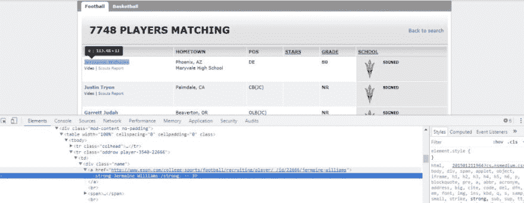

# 使用 Python BeautifulSoup 和 Requests 进行 Web 抓取

> 原文:[https://dev . to/kashaziz/web-scraping-with-python-beautiful soup-and-requests-2n 71](https://dev.to/kashaziz/web-scraping-with-python-beautifulsoup-and-requests-2n71)

这是我最近写的一篇关于如何使用 Python BeautifulSoup 和 Requests 库来废弃网页的博文的概述。

### 什么是网页抓取:

Web 抓取是从网站自动提取信息的过程。网络抓取，或数据抓取，对于研究人员、营销人员和对汇编、过滤和重新包装数据感兴趣的分析师来说是有用的。

提醒一句:一定要尊重网站的隐私政策，在刮之前检查 robots.txt。如果一个网站提供 API 来与它的数据交互，那么最好使用 API 而不是抓取。

### 用 Python 和 BeautifulSoup 进行网页抓取:

Python 中的 Web 抓取轻而易举。有多种方法可以访问网页并删除其中的数据。为此，我使用了 Python 和 BeautifulSoup。

在这个例子中，我从 ESPN 网站上搜集了大学足球运动员的数据。

### 流程:

*   安装请求和美化组库
*   获取网页并将其存储在一个 BeautifulSoup 对象中。
*   设置一个解析器来解析网页中的 HTML。我使用了默认的 html.parser
*   提取玩家姓名，学校，城市，游戏位置和等级。
*   将数据附加到列表中，该列表将在稍后阶段写入 CSV 文件。

[T2】](https://res.cloudinary.com/practicaldev/image/fetch/s--9B8ZT2A---/c_limit%2Cf_auto%2Cfl_progressive%2Cq_auto%2Cw_880/http://www.kashifaziz.me/wp-content/uploads/2017/10/college-footballer-data-scraping-python-beautifulsoup-code.jpg)

### 代码: