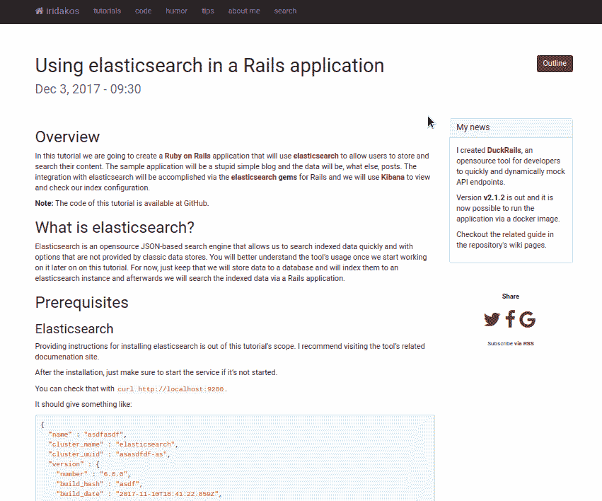

# 刚刚发布:jquery.docout

> 原文：<https://dev.to/iridakos/just-published-jquerydocout-1n8p>

我使用 GitHub pages 来托管我的个人博客,由于我的一些帖子是长教程，我创建了一个可定制的 jQuery 插件来呈现文档大纲。

[jquery.docout GitHub 资源库](https://github.com/iridakos/jquery.docout)

[T2】](https://res.cloudinary.com/practicaldev/image/fetch/s--AbBMW8dA--/c_limit%2Cf_auto%2Cfl_progressive%2Cq_66%2Cw_880/https://raw.githubusercontent.com/iridakos/jquery.docout/master/doc/resourcimg/document-outline.gif)

欢迎任何反馈！