# 万能解释道

> 原文:# t0]https://dev . to/idanarye/omni peniten-5g 5l

我的 Vim 的 Omnipytent 插件是我工作流程的核心部分，但是对于其他人来说似乎有点困难。更具体地说——理解他们为什么需要这样的东西。所以——我发这个帖子来解释 Omnipytent 背后的基本原理，并证明它的价值。

# 问题:运行命令

TL；这部分解释了为什么我需要为大多数开发者创建一个插件...去吧。如果你不关心理由，就跳过它，直接进入下一个会话——“*使用 Omnipytent* ”。

这看起来像是一个已经解决的问题——在你成为全能之心之前，你已经运行过命令了。见鬼——您可能在听说过 Vim 之前就运行命令了！为什么你需要一个插件呢？这就是命令行的作用！

作为 Vimmers，我们倾向于坚持“Unix 是我的 IDE”的哲学——每个开发任务都有一个命令行工具，我们只是用我们需要的参数运行它。所以，我的项目可以用简单的命令构建和运行。我知道这些命令。但是...

*   我真的需要每次运行时都键入相同的命令吗？
*   如果我需要用不同的参数来构建——我需要在每次输入构建命令时添加它们吗？或者我应该更改实际的构建文件，使它们成为默认文件吗？
*   我想运行一个特定的测试——我需要每次都输入它的名字吗？或者，我可以粘贴它，但是我需要把它保存在剪贴板上，或者每次都复制它...
*   我需要用某些参数运行工具(是的，这应该是一个测试，我会让这成为一个测试，我保证！)-我每次都要输入这些参数吗？

你明白了——我很懒，不想一遍又一遍地输入相同的命令行命令。我能怎么做呢？

### 如此...映射一些键？

一个显而易见的选择——如果有一个命令你经常使用并且想要快速访问，只需设置一个键映射。一个简单的解决方案——但至少对我来说，不够灵活:

*   我在不同的语言和环境中从事几个项目，并且我需要不同的命令来构建每个项目。通常的 Vim 解决方案是使用`:nnoremap <buffer>` s `:autocmd` s 或者在 filetype 插件中——但是我要设置什么键呢，例如，对于 XML 文件？我可能想在其中的一个里建造！

*   即使在相同的环境中，我也需要不同的方式来运行(有时构建)不同的项目。每个项目都有自己的入口点，除非您只处理单文件脚本，否则入口点不会是您当前缓冲区中的文件。每个项目有不同的配置是不可伸缩的。

*   即使在同一个项目中，我也经常想改变这些命令。用不同的标志构建，用不同的参数运行。每次改变键映射太麻烦了。

不...我想要一些我可以轻易改变的东西——不用碰我的`.vimrc`！

### 就像其他人一样使用命令行历史

一个简单的解决方案——如果你经常使用一个命令，它会出现在历史记录中，所以只需在 Bash 中使用`Ctrl+r`就可以找到它。

当你做一个项目的时候，这很好，但是对于很多项目来说，它们会覆盖彼此的历史。因此...我还是喜欢更好的。此外，我可能冒着被吊销 Vim 卡的风险——但是我真的不希望每次我想构建或运行我正在处理的东西时都切换到终端仿真器。Vim 自己的历史也不容易浏览——更不用说我需要它来执行命令模式的命令了...

### 你这个被宠坏的顽童！将这些命令放在`.sh`文件中，然后完成它！

这是另一种常见的解决方案(尽管显然不如前两种常见)——为命令创建简单的脚本。从 shell 或 Vim 的`:!`中，很容易完成并启动这些脚本。我甚至可以为不同的脚本设置键映射，让相同的键映射在不同的项目中做特定于项目的事情！

但是...所有这些分散在整个项目中的文件造成了巨大的混乱。因此，我们需要:

## 有一个*单*文件包含了*所有*这些命令

现在我们有所进展了！它可以是一个简单的 bash 脚本，第一个参数是`case`,您可以设置它包含任意多的命令。或者——你可以去幻想和滥用一个构建系统，它通常有更好的语法，并使用它们的任务作为命令。

这就是我所做的——我选择了 [Rake](https://github.com/ruby/rake) ，因为它不会与现有的构建系统冲突(它主要用于 RoR，我真的不需要在那里有构建和运行命令(至少一开始不需要))，并且我可以用 Ruby 而不是 Bash 编写我的任务。耶！

但是我仍然想要更多。我想，如果我有一个插件来简化新任务的创建，为我自动完成任务名称，帮助我容易地使用一个不同于目标文件的文件而不需要额外的参数，等等，会怎么样呢？等等。

然后我意识到——Rake 是一个 Ruby 库！如果我可以用 Ruby 接口将它加载到 Vim 中，我就可以在 Vim 中运行我的任务，并且它们可以访问我的 Vim 实例！这开启了一个新的可能性世界——我可以让一个任务以常规的`:!`运行，或者以[错误的](https://github.com/idanarye/vim-erroneous)运行，以填充快速修复列表，或者在 [VimShell](https://github.com/Shougo/vimshell.vim) 终端中运行(Vim 当时没有`:terminal`，Neovim 甚至还没有构想出来)，或者在缓冲区中加载一个日志文件，或者...或者任何我想要的东西！

就这样 [Integrake](https://github.com/idanarye/vim-integrake) 诞生了。当我不得不放弃 Ruby 以便搬到 Neovim 时——我用 Pyhton 重写了整个东西——那就是 [Omnipytent](https://github.com/idanarye/vim-omnipytent) 。

# 使用 Omnipytent

to https://thepractical dev . S3 . Amazon AWS . com/I/229 bjqis 5 lejr 6ma 3 rhc . gif 演示 Omnipytent 我将使用[这个例子 Java Spring 项目](https://github.com/spring-projects/spring-petclinic)。

## 简单的任务和命令

因此，在克隆了存储库之后，假设我想要运行测试。这是一个 Maven 项目，所以我们用`mvn test`运行测试。我要用 Omnipytent 来做:

[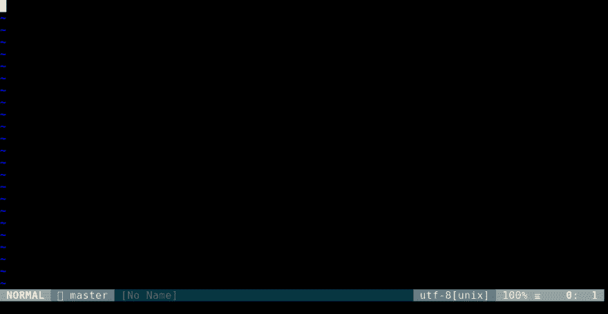T2】](https://res.cloudinary.com/practicaldev/image/fetch/s--75hU5fGP--/c_limit%2Cf_auto%2Cfl_progressive%2Cq_66%2Cw_880/https://thepracticaldev.s3.amazonaws.com/i/oitwbejpnwnnilyqychs.gif)

因此...这里发生了什么？

首先，我已经在我的`.vimrc` :
中设置了这些

```
let g:omnipytent_filePrefix = '.idanarye'
let g:omnipytent_defaultPythonVersion = 3 
```

<svg width="20px" height="20px" viewBox="0 0 24 24" class="highlight-action crayons-icon highlight-action--fullscreen-on"><title>Enter fullscreen mode</title></svg> <svg width="20px" height="20px" viewBox="0 0 24 24" class="highlight-action crayons-icon highlight-action--fullscreen-off"><title>Exit fullscreen mode</title></svg>

这意味着我希望我的任务文件以我的名字开始并被隐藏(`.idanarye`)，我希望使用 Python 3(你可以用 Python 2 或 Python 3 编写你的任务文件)。任务文件应该是个人的，所以我们不需要花费精力使它可移植以允许其他开发人员使用。我们不会将它签入源代码控制，即使我们签入了——碰巧使用 Omnipytent 的其他开发人员也会有他们自己的不同名称的任务文件。

因此，当 Vim 在存储库的根目录中打开时，我运行`:OPedit test`，它打开那个项目的任务文件- `.idanarye.omnipytent.3.py`。因为该文件在添加一些导入之前并不存在，并且因为我想要编辑一个不存在的任务，所以它为该任务创建了一个框架——剩下的就是编写任务的主体:

```
import vim
from omnipytent import *

@task
def test(ctx):
     BANG << 'mvn test' 
```

<svg width="20px" height="20px" viewBox="0 0 24 24" class="highlight-action crayons-icon highlight-action--fullscreen-on"><title>Enter fullscreen mode</title></svg> <svg width="20px" height="20px" viewBox="0 0 24 24" class="highlight-action crayons-icon highlight-action--fullscreen-off"><title>Exit fullscreen mode</title></svg>

那么，我们这里有什么？Imports 是 imports——我们有`vim`——Pyhton 的 Vim 的内置接口——和一个来自`omnipytent`的 start import，其中包含了您想要在任务文件中使用的常见内容。其中一个是`task`——一个我们用来创造惊喜任务的装饰者。另一个是`BANG`——一个*外壳命令执行器*。Shell 命令执行器是运行 shell 命令的句柄- `BANG`特别是使用 Vim 的 bang 命令(`:!`)。还有其他 shell 命令执行器，您可以定义自己的执行器——都在文档中。shell 命令执行器中的`<<`操作符可以用来执行一个字符串作为 shell 命令。一旦我保存了任务文件并运行了`:OP test`，Omnipytent 就会执行`test`任务的代码并运行所有的测试。

`<<`操作符按原样执行字符串。你也可以把它当作一个函数来使用——它会引用每个参数(如果你从变量中得到它们会更好):

```
@task
def test(ctx):
     BANG('mvn', 'test') 
```

<svg width="20px" height="20px" viewBox="0 0 24 24" class="highlight-action crayons-icon highlight-action--fullscreen-on"><title>Enter fullscreen mode</title></svg> <svg width="20px" height="20px" viewBox="0 0 24 24" class="highlight-action crayons-icon highlight-action--fullscreen-off"><title>Exit fullscreen mode</title></svg>

使用 shell 命令执行器的第三种方式是使用 [Plumbum](https://plumbum.readthedocs.io/en/latest/) -一个 shell 组合器库，用于使用 Pythonic 语法编写 shell 命令。如果你安装了它，并且在你的任务文件中有`import omnipytent.interation.plumbum`，你可以使用 shell 命令执行器，比如 [Plumbum 的背景和前景修改器`BG`和`FG`](https://plumbum.readthedocs.io/en/latest/local_commands.html#guide-local-commands-bgfg) 。因为你通常希望 [Plumbum 的`local`](https://plumbum.readthedocs.io/en/latest/local_commands.html#local-commands) 来启动命令，你可以从`omnipytent.interation.plumbum` :
中导入

```
from omnipytent.integration.plumbum import local
local['mvn']['test'] & BANG 
```

<svg width="20px" height="20px" viewBox="0 0 24 24" class="highlight-action crayons-icon highlight-action--fullscreen-on"><title>Enter fullscreen mode</title></svg> <svg width="20px" height="20px" viewBox="0 0 24 24" class="highlight-action crayons-icon highlight-action--fullscreen-off"><title>Exit fullscreen mode</title></svg>

因为我们将会大量使用 Maven，所以不妨全局绑定`local['mvn']`:

```
import vim
from omnipytent import *
from omnipytent.integration.plumbum import local

mvn = local['mvn']

@task
def test(ctx):
    mvn['test'] & BANG 
```

<svg width="20px" height="20px" viewBox="0 0 24 24" class="highlight-action crayons-icon highlight-action--fullscreen-on"><title>Enter fullscreen mode</title></svg> <svg width="20px" height="20px" viewBox="0 0 24 24" class="highlight-action crayons-icon highlight-action--fullscreen-off"><title>Exit fullscreen mode</title></svg>

好的——但是`:!`并不是一种非常方便的测试方式——当然，对于像 Maven 这样的文本工具来说更是如此。不如我们用终端模拟器来运行它？很简单——我们所要做的就是使用一个不同的 shell 命令执行器——`TERMINAL_PANEL`——它将创建一个 Vim 8 或 Neovim 的终端仿真器:

[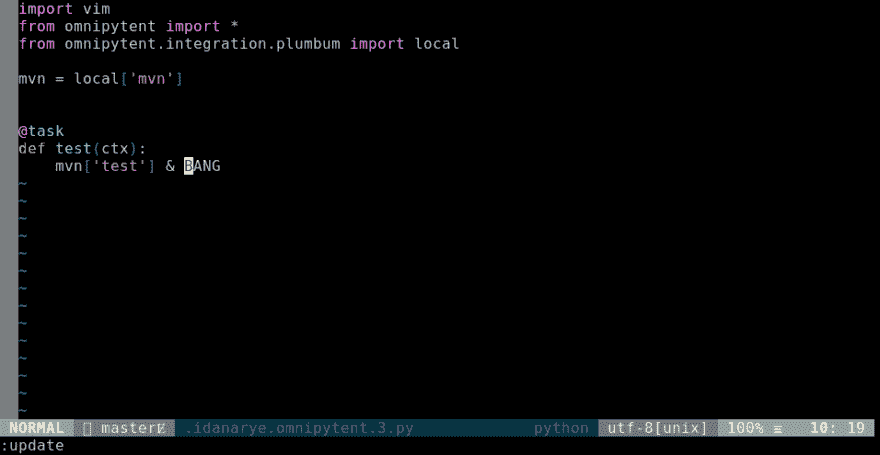T2】](https://res.cloudinary.com/practicaldev/image/fetch/s--rZSEBrB6--/c_limit%2Cf_auto%2Cfl_progressive%2Cq_66%2Cw_880/https://thepracticaldev.s3.amazonaws.com/i/avjc9prdphp84acfqtuj.gif)

## 好的...但是为什么呢？

到目前为止，我们并不真的**需要**Omnipytent——我们不能直接从 Vim 的命令模式运行这些命令吗？是的，但是用 Omnipytent 运行它们有两个优点:

1.  这是一个 Maven 项目，所以命令是`:!mvn test`。如果这是一个 Gradle 项目，我需要`:!gradle test`。和蚂蚁一起，我需要`:!ant test`。又或许是 [`:!ant junit`](https://www.mkyong.com/ant/ant-and-junit-task-example/) ？蚂蚁就是那样自由奔放，所以它可以是任何东西。

    你有时需要设置的标志呢？这只是 Java——其他语言都有自己的各种构建系统...

    对于 Omnipytent，它总是`:OP test`——因为您不依赖于项目的创建者选择什么构建系统以及他们选择如何配置它——您总是创建您自己的 Omnipytent 任务`test`来运行它。您甚至可以为它映射一个键，它将适用于任何项目(在您为它创建任务之后)。就我个人而言，我将许多简短的通用动词映射到“Omnipytent leader ”,后跟它们的第一个字母:

    [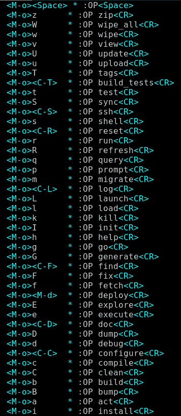T2】](https://res.cloudinary.com/practicaldev/image/fetch/s--A-YorvF3--/c_limit%2Cf_auto%2Cfl_progressive%2Cq_auto%2Cw_880/https://thepracticaldev.s3.amazonaws.com/i/dr8h5wpnbo1nk8x45b5b.png)

    他们并不在我所有的项目中做一些事情，但是随着项目变大，我倾向于有许多不同的有用的任务，有键映射对他们来说是很好的。

2.  有时命令需要参数——比如当您想要运行一个特定的测试时，需要测试的名称。你不能在你的**全局** `.vimrc`中绑定它，因为它是不断变化的——但是编辑一个 Omnipytent 文件是很容易的:

```
import vim
from omnipytent import *
from omnipytent.integration.plumbum import local

mvn = local['mvn']

@task
def test(ctx):
    mvn['test']['-Dtest=ClinicServiceTests#shouldFindOwnersByLastName'] & TERMINAL_PANEL 
```

<svg width="20px" height="20px" viewBox="0 0 24 24" class="highlight-action crayons-icon highlight-action--fullscreen-on"><title>Enter fullscreen mode</title></svg> <svg width="20px" height="20px" viewBox="0 0 24 24" class="highlight-action crayons-icon highlight-action--fullscreen-off"><title>Exit fullscreen mode</title></svg>

[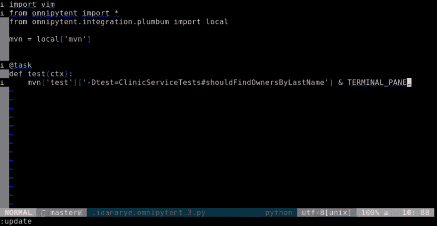T2】](https://res.cloudinary.com/practicaldev/image/fetch/s--WpyzCMgl--/c_limit%2Cf_auto%2Cfl_progressive%2Cq_66%2Cw_880/https://thepracticaldev.s3.amazonaws.com/i/babjbvkv13hz3gfutt4d.gif)

因此——我们可以使用`:OP test`(或者我们映射到它的键)来运行这个测试，当我们想要在不同的测试上工作时——我们可以只编辑任务文件。

好吧，但是如果我们想要更有活力的东西呢？也许我们不想每次都编辑任务文件，而更喜欢把测试交给命令？我们也可以这样做——通过任务参数:

## 任务论证和完成情况

```
@task
def test_specific(ctx, testname):
    mvn['test']['-Dtest=' + testname] & TERMINAL_PANEL 
```

<svg width="20px" height="20px" viewBox="0 0 24 24" class="highlight-action crayons-icon highlight-action--fullscreen-on"><title>Enter fullscreen mode</title></svg> <svg width="20px" height="20px" viewBox="0 0 24 24" class="highlight-action crayons-icon highlight-action--fullscreen-off"><title>Exit fullscreen mode</title></svg>

现在，我们只需要给我们的任务一个参数:

```
:OP test_specific ClinicServiceTests#shouldFindOwnersByLastName 
```

<svg width="20px" height="20px" viewBox="0 0 24 24" class="highlight-action crayons-icon highlight-action--fullscreen-on"><title>Enter fullscreen mode</title></svg> <svg width="20px" height="20px" viewBox="0 0 24 24" class="highlight-action crayons-icon highlight-action--fullscreen-off"><title>Exit fullscreen mode</title></svg>

[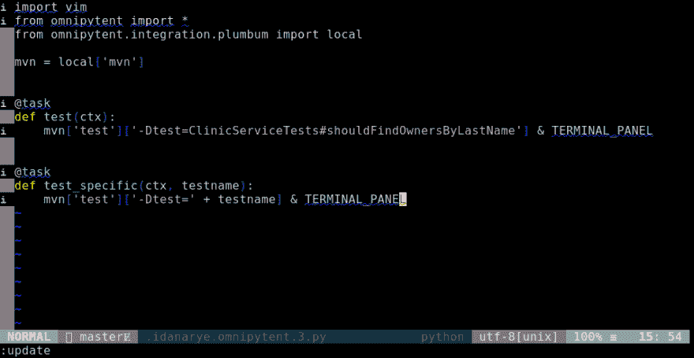T2】](https://res.cloudinary.com/practicaldev/image/fetch/s--LMHwLr7l--/c_limit%2Cf_auto%2Cfl_progressive%2Cq_66%2Cw_880/https://thepracticaldev.s3.amazonaws.com/i/nu2pshhdbjj82qjbl78o.gif)

Aaaaannnd...我们又回到了起点——因为如果我们要输入测试的名字，我们可以使用:

```
:terminal mvn test -Dtest=ClinicServiceTests#shouldFindOwnersByLastName 
```

<svg width="20px" height="20px" viewBox="0 0 24 24" class="highlight-action crayons-icon highlight-action--fullscreen-on"><title>Enter fullscreen mode</title></svg> <svg width="20px" height="20px" viewBox="0 0 24 24" class="highlight-action crayons-icon highlight-action--fullscreen-off"><title>Exit fullscreen mode</title></svg>

那么，为什么要用 Omnipytent 呢？正如您可能已经从该小节的标题中猜到的那样——完成！Omnipytent 已经为您提供了任务名称的命令模式完成，如果您愿意，您可以轻松地为任务参数定义完成。

如果我要为 Java 测试创建一个通用的完成插件，我需要让它超级健壮，以适应不同的风格和惯例。也许甚至可以运行 Maven/Ant/Gradle，用一些注入的目标来发射它们。但是在这里我只需要它们用于一个特定的项目——所以我不需要付出所有的努力，并且可以只依赖于测试的特性:

*   都在`src/test/java`里面。
*   都是`void`方法。
*   他们的上面一行都有`@Test` **。**

所以-我所要做的就是 grep 寻找`@Test`行，获取它们后面的行，并从这些行中提取文件名和方法名。我可以快速写出这样的东西:

```
import re
pattern = re.compile(r'(\w+)\.java-.*void (\w+)')
for line in local['rg']['-e', '@Test']['--after-context', 1]['src/test/java']().splitlines():
    m = pattern.search(line)
    if m:
        class_name, test_name = m.groups()
        yield '%s#%s' % (class_name, test_name) 
```

<svg width="20px" height="20px" viewBox="0 0 24 24" class="highlight-action crayons-icon highlight-action--fullscreen-on"><title>Enter fullscreen mode</title></svg> <svg width="20px" height="20px" viewBox="0 0 24 24" class="highlight-action crayons-icon highlight-action--fullscreen-off"><title>Exit fullscreen mode</title></svg>

这肯定不是插件级的-但对于我个人的搜索片段，只是为了这个项目，这是可以接受的。现在剩下的就是让它成为`test_specific` :
的完成函数

```
@task
def test_specific(ctx, testname):
    mvn['test']['-Dtest=' + testname] & TERMINAL_PANEL

@test_specific.complete
def test_specific__completion(ctx):
    import re
    pattern = re.compile(r'(\w+)\.java-.*void (\w+)')
    for line in local['rg']['-e', '@Test']['--after-context', 1]['src/test/java']().splitlines():
        m = pattern.search(line)
        if m:
            class_name, test_name = m.groups()
            yield '%s#%s' % (class_name, test_name) 
```

<svg width="20px" height="20px" viewBox="0 0 24 24" class="highlight-action crayons-icon highlight-action--fullscreen-on"><title>Enter fullscreen mode</title></svg> <svg width="20px" height="20px" viewBox="0 0 24 24" class="highlight-action crayons-icon highlight-action--fullscreen-off"><title>Exit fullscreen mode</title></svg>

[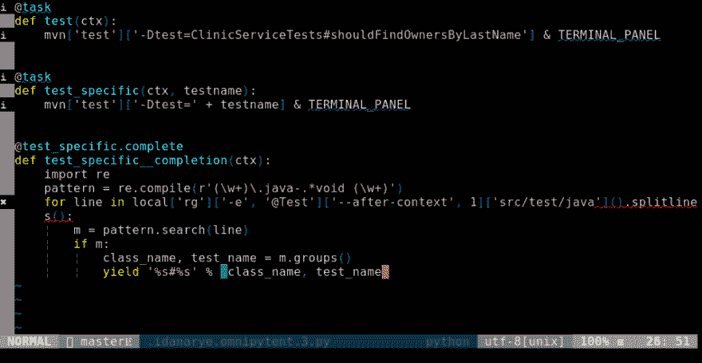T2】](https://res.cloudinary.com/practicaldev/image/fetch/s--H8nYVksW--/c_limit%2Cf_auto%2Cfl_progressive%2Cq_66%2Cw_880/https://thepracticaldev.s3.amazonaws.com/i/ncxq5t9uq51is21w3nw0.gif)

## 与 Vim 互动

运行测试很好——但是我们也想构建项目，不是吗？“使用`:make`”——一千个 Vim 用户会立刻尖叫(如果...他们同时在读这个)。好，我们用`:make`:

[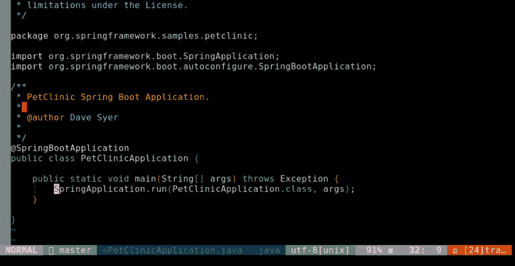T2】](https://res.cloudinary.com/practicaldev/image/fetch/s--0nJ2XG-D--/c_limit%2Cf_auto%2Cfl_progressive%2Cq_66%2Cw_880/https://thepracticaldev.s3.amazonaws.com/i/6tyb8zlvgze28rqg04lg.gif)

哦，对了——我的`&makeprg`设置为 Java 文件的 Gradle，这是一个 Maven 项目。嗯——我不想把我的`.vimrc`改成使用 Maven——所以让我们使用一个 Omnipytent 任务吧！

我运行`:OPedit compile`来支撑`compile`任务，并写下这个:

```
@task
def compile(ctx):
    with OPT.changed(makeprg='mvn', errorformat=r'[ERROR] %f:[%l\,%v] %m'):
        CMD.make.bang('compile') 
```

<svg width="20px" height="20px" viewBox="0 0 24 24" class="highlight-action crayons-icon highlight-action--fullscreen-on"><title>Enter fullscreen mode</title></svg> <svg width="20px" height="20px" viewBox="0 0 24 24" class="highlight-action crayons-icon highlight-action--fullscreen-off"><title>Exit fullscreen mode</title></svg>

这是怎么回事？

*   `OPT` -设置 Vim 选项的助手。我们可以使用`OPT.makeprg`或`OPT['makeprg'] to get and set the`或& makeprg `选项。
*   一个上下文管理器，用于临时改变一些 Vim 选项的值。在这种情况下——`&makeprg`和`&errorformat`。
*   `CMD` -运行 Vim 命令的助手。
*   `CMD.make` - Vim 的`:make`命令-可以像函数一样使用。
*   `CMD.make.bang` -这是`:make!`(因为我不喜欢跳到第一个错误)

一起——当我们运行`compile`任务时，它会暂时设置`&makeprg`和`&errorformat`，运行`:make! compile`，然后设置`&makeprg`和`&errorformat`返回。这将导致执行`mvn compile`并通过适当的错误格式运行其输出，以填充快速修复列表:

[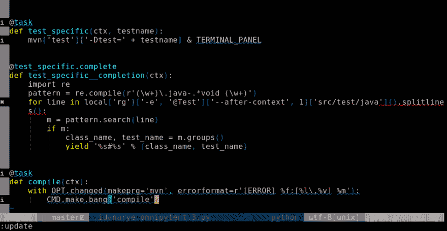T2】](https://res.cloudinary.com/practicaldev/image/fetch/s--2VbVFpdU--/c_limit%2Cf_auto%2Cfl_progressive%2Cq_66%2Cw_880/https://thepracticaldev.s3.amazonaws.com/i/dr0nw6q61x78h4h2uf2t.gif)

当然，你可以使用`:make`替代`CMD.make`，例如，你可以安装 [dispatch.vim](https://github.com/tpope/vim-dispatch) 并使用`CMD.Make`。或者您可以使用`CMD`做其他与构建项目无关的事情...

## 分机

在每个任务文件中编写错误格式没有什么意义。我可能会在许多不同的项目中使用相同的错误格式。对于我们在任务文件中定义的其他东西，情况可能也是如此。

为了方便重用这些东西，Omnipytent 支持一种扩展机制。插件可以将 Python 源文件放在它的`omnipytent/`目录下，它将成为`omnipytent.ext`的子模块。例如， [my MakeCFG 插件](https://github.com/idanarye/vim-makecfg)就公开了这样一个接口——一个`makecfg`函数，用于为其数据库中的条目设置`&makeprg`和`&errorformat`。

所以——如果我安装了 MakeCFG，我可以这样写我的`compile`任务:

`

```
@task
def compile(ctx):
    from omnipytent.ext.makecfg import makecfg
    with makecfg('mvn'):
        CMD.make.bang('compile') 
```

<svg width="20px" height="20px" viewBox="0 0 24 24" class="highlight-action crayons-icon highlight-action--fullscreen-on"><title>Enter fullscreen mode</title></svg> <svg width="20px" height="20px" viewBox="0 0 24 24" class="highlight-action crayons-icon highlight-action--fullscreen-off"><title>Exit fullscreen mode</title></svg>

## 将任务结合在一起

在开发过程中，我们经常希望与我们正在开发的应用程序进行交互。我们选择的是一个 web 应用程序，所以我们希望运行它，向它发送命令，然后停止它。Omnipytent 也可以实现自动化！

先说跑步吧。自述文件说我们需要使用`./mvnw spring-boot:run`——所以让我们编写一个任务，在 Vim 终端中运行它:

```
@task.window
def launch(ctx):
    mvn['spring-boot:run'] & TERMINAL_PANEL 
```

<svg width="20px" height="20px" viewBox="0 0 24 24" class="highlight-action crayons-icon highlight-action--fullscreen-on"><title>Enter fullscreen mode</title></svg> <svg width="20px" height="20px" viewBox="0 0 24 24" class="highlight-action crayons-icon highlight-action--fullscreen-off"><title>Exit fullscreen mode</title></svg>

有什么新发现吗？我用了`@task.window`而不是`@task`。这创建了一种特殊类型的测试，称为*窗口任务*。在窗口任务中，您可以创建新的 Vim 窗口，这些窗口可以在其他任务中使用(我们将在后面看到)。就其本身而言，它的行为就像一个普通的任务——除了:

*   如果您在该任务期间转到另一个窗口(您需要创建一个窗口)，当窗口任务结束时，您将返回到开始时的窗口。
*   如果您在上次创建的窗口仍然打开的情况下运行任务，它将在任务运行之前关闭。

[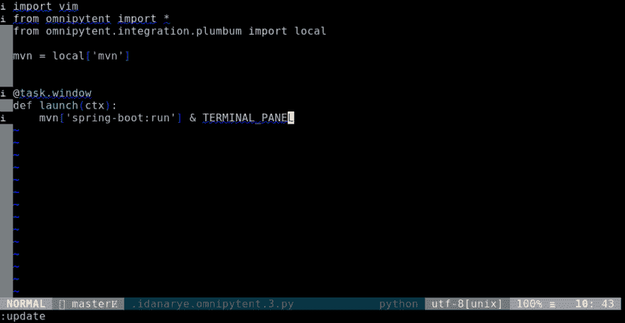T2】](https://res.cloudinary.com/practicaldev/image/fetch/s--rKY30AbQ--/c_limit%2Cf_auto%2Cfl_progressive%2Cq_66%2Cw_880/https://thepracticaldev.s3.amazonaws.com/i/bosggtn2y3h4bvthg3p8.gif)

好的——所以我们可以随时启动服务器，而且一次只能运行一个。但是当我们不需要它的时候呢？我们必须手动杀死它吗？不——我们写一个任务:

```
@task(launch)
def kill(ctx):
    from omnipytent.util import other_windows
    with other_windows(ctx.dep.launch):
        CMD.bdelete.bang() 
```

<svg width="20px" height="20px" viewBox="0 0 24 24" class="highlight-action crayons-icon highlight-action--fullscreen-on"><title>Enter fullscreen mode</title></svg> <svg width="20px" height="20px" viewBox="0 0 24 24" class="highlight-action crayons-icon highlight-action--fullscreen-off"><title>Exit fullscreen mode</title></svg>

这里有几个新东西:

1.  `@task`得到一个论点——`launch`！这使得`launch`任务成为了`kill`任务的依赖项——所以每当我们调用`kill`时，它都会被调用。
2.  `ctx.dep.launch` -我们在任务中经常遇到的奇怪的`ctx`论点是任务的执行上下文——它提供了与 Omnipytent 本身交互的方法，当我们想要组合任务时很有用——就像我们现在做的那样。`ctx.dep`是从依赖项传递给我们的 Python 对象的访问点——在这种情况下，因为`launch`是一个窗口任务，所以它自动传递它创建的窗口对象(`:help python-window`)。
3.  是一个上下文管理器，它允许我们进入其他窗口，并承诺让我们回到开始的地方。它还接受一个窗口对象参数，当它这样做时，它把我们带到那个窗口——所以我们可以在里面做一些事情。

窗口任务在用作依赖项时有一个特殊的行为——当它们应该创建的窗口已经存在时，它们不执行，而是传递它们之前传递的相同的东西。因此，当我们调用`kill`，`launch`将把前一个`launch`任务创建的窗口传递给它。然后我们用`other_windows`进入那个窗口，删除那个缓冲区，终止程序并关闭窗口:

[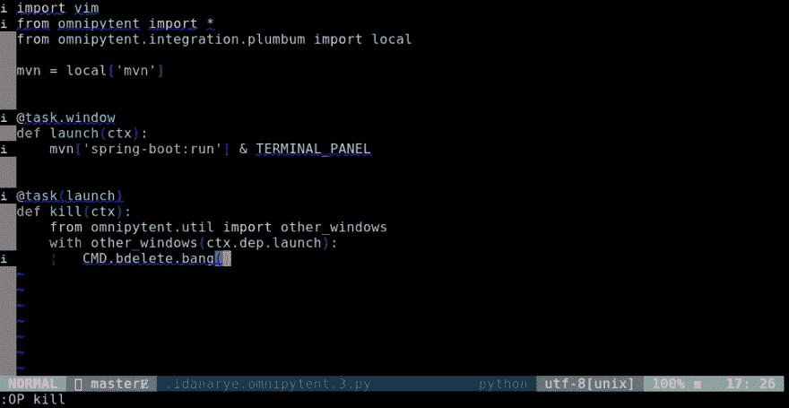T2】](https://res.cloudinary.com/practicaldev/image/fetch/s--eIqC9cs2--/c_limit%2Cf_auto%2Cfl_progressive%2Cq_66%2Cw_880/https://thepracticaldev.s3.amazonaws.com/i/k0tpxb4udd8ng9puwvdr.gif)

好——我们的服务器正在运行——我们如何使用它？这个服务器接受 JSON 请求来寻找一个 vet——我们不要创建一些东西来查询它:

```
@task.window
def queries_terminal(ctx):
    shell = local['sh'] & TERMINAL_PANEL.vert.size(50)
    ctx.pass_data(shell)

@task(queries_terminal)
def find_vet(ctx, name):
    import json
    name = json.dumps(name)
    cmd = local['curl']['-s']
    cmd = cmd['localhost:8080/vets.json']
    cmd = cmd | local['jq']['.[] | map(select(.firstName == %s))' % name]
    cmd & ctx.dep.queries_terminal 
```

<svg width="20px" height="20px" viewBox="0 0 24 24" class="highlight-action crayons-icon highlight-action--fullscreen-on"><title>Enter fullscreen mode</title></svg> <svg width="20px" height="20px" viewBox="0 0 24 24" class="highlight-action crayons-icon highlight-action--fullscreen-off"><title>Exit fullscreen mode</title></svg>

好...这开始变得复杂了。`queries_terminal`创建一个终端，我们可以用它来运行我们与`curl`的查询。为了使结果更容易阅读，这次它使它成为一个垂直终端(`.vert`)，并将其设置为 50 列(`.size(50)`)。它用终端打开命令的结果调用`ctx.pass_data`？这是怎么回事？

终端打开的结果是一个 shell 命令执行器，您可以使用它与终端进行交互。然后我们使用`ctx.pass_data`将它传递给相关的任务。一个窗口任务将自动通过窗口——但在这种情况下，我们希望通过终端处理程序，以便相关任务能够在其中运行。

这将我们引向`find_vet`，它构造了一个`curl` & `jq`命令来查找具有给定名称的 vet，并使用`ctx.dep.queries_terminal` -我们从`queries_terminal`获得的 shell 命令执行器来执行这个命令。

让我们看看它的运行情况(因为屏幕空间的原因，我将服务器的终端移到了一个选项卡上):

[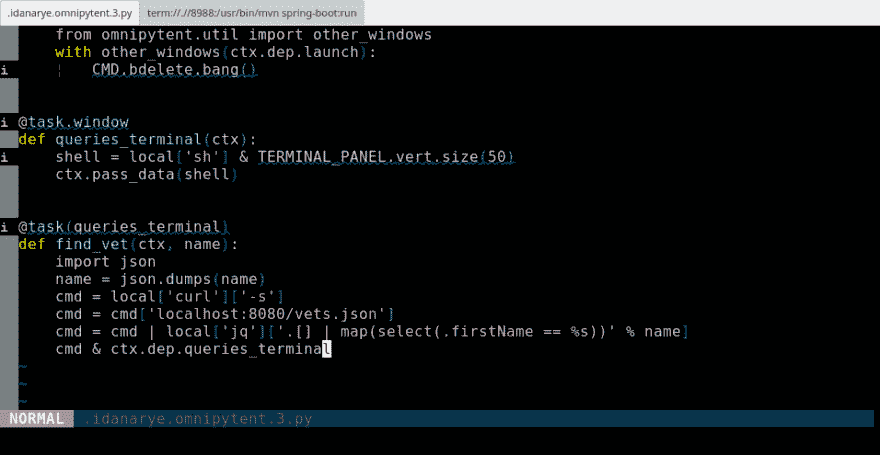T2】](https://res.cloudinary.com/practicaldev/image/fetch/s--KCXw7kq2--/c_limit%2Cf_auto%2Cfl_progressive%2Cq_66%2Cw_880/https://thepracticaldev.s3.amazonaws.com/i/gug7udxdcwpmxoxkt3r4.gif)

轻松点。

JSON 不错，但是显然 PetClinic 也支持 XML。如果我们想同时修补两者呢？我们可以把它变成一个论点，或者重复这个任务，或者...使用选项任务！

```
@task.options
def query_format(ctx):
    json = dict(suffix='.json',
                filter=lambda name: local['jq']['.[] | map(select(.firstName == %s))' % name])
    xml = dict(suffix='.xml',
               filter=lambda name: local['xmllint']['--xpath', '//vetList[firstName=%s]' % name, '-']
               | local['xmllint']['--format', '-'])

@task(queries_terminal, query_format)
def find_vet(ctx, name):
    import json
    name = json.dumps(name)
    cmd = local['curl']['-s']
    cmd = cmd['localhost:8080/vets' + ctx.dep.query_format['suffix']]
    cmd = cmd | ctx.dep.query_format['filter'](name)
    cmd & ctx.dep.queries_terminal 
```

<svg width="20px" height="20px" viewBox="0 0 24 24" class="highlight-action crayons-icon highlight-action--fullscreen-on"><title>Enter fullscreen mode</title></svg> <svg width="20px" height="20px" viewBox="0 0 24 24" class="highlight-action crayons-icon highlight-action--fullscreen-off"><title>Exit fullscreen mode</title></svg>

哇哦。那是什么？不要惊慌——大多数只是用于过滤数据的外壳管道。让我们来关注一下主要的新东西——`@task.options`。这就创建了一个*选项任务*——一个用于选择选项的任务。这个任务使用了一种奇怪的语法——它创建的每个局部变量都是一个选项。在这种情况下——`xml`和`json`。

如果您没有先选择一个选项就运行`find_vet`，Omnipytent 会提示您选择一个。之后它会记住你的选择——但是你可以通过直接调用`query_format`来改变它(用一个参数来选择选项或者用一个参数来得到提示)。

[T2】](https://res.cloudinary.com/practicaldev/image/fetch/s--m_HVqlnR--/c_limit%2Cf_auto%2Cfl_progressive%2Cq_66%2Cw_880/https://thepracticaldev.s3.amazonaws.com/i/n1b726tqrhvywmo7s73z.gif)

# 结论

如果您知道一些基本的 Vimscript，您可以为我演示的所有内容创建命令。但是...你可能不会。太麻烦了，你只能在终端输入。即使你愿意，你也不会额外增加完成和选择缓存。对于只能在一个项目中使用的东西，工作量太大...

Omnipytent 的力量不在于允许你做事情——而在于让这些事情更*可及*。当添加任务变得如此简单时(只需用 Python 编写代码),它们突然变得值得了——即使你只打算运行一个任务几次。

所以自动化你的工作流程——因为你可以！

# 跟进:

[](/idanarye) [## Omnipytent 1.3.0:异步任务和选择 ui

### idan Arye 11 月 15 日 189 分钟阅读

#vim #workflow #automation](/idanarye/omnipytent-130-async-tasks-and-selection-uis-2e0o)