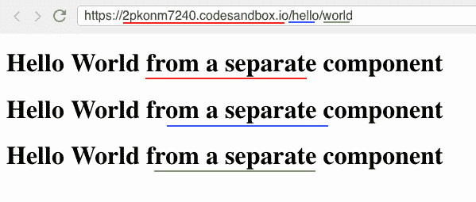

# React 路由器简介

> 原文:[https://dev.to/aurelkurtula/introduction-to-react-router-ha](https://dev.to/aurelkurtula/introduction-to-react-router-ha)

之前我复习了 react 的[基础知识。在该教程结束时，我们有了一个简单的 todo 应用程序。今天我将探讨 react 路由器的基础知识。](https://dev.to/aurelkurtula/introduction-to-react-532)

正如我们在之前的教程中所做的，你可以通过运行`create-react-app some-name`或 [codesandbox](https://codesandbox.io/s) 来启动这个项目。

我将假设您正在使用 codesandbox，主要是因为它对我们所有人来说都很容易快速上手。如果你知道如何使用终端，那么你就不需要这方面的指导，你可以简单地跟着做。

同样，当导航到 [codesandbox](https://codesandbox.io/s) 时，点击“react ”,你将得到一个启动项目。

## 安装路由器

Routes 在一个单独的包中，所以我们需要安装`react-router-dom`。

如果你想跟随 codesandbox，然后点击右边的“Dependencies ”,已经安装的包就会显示出来，然后简单地选择“Add Packages ”,然后搜索“react-router-dom”。

记住，对于终端用户，运行:

```
yarn add react-router-dom 
```

<svg width="20px" height="20px" viewBox="0 0 24 24" class="highlight-action crayons-icon highlight-action--fullscreen-on"><title>Enter fullscreen mode</title></svg> <svg width="20px" height="20px" viewBox="0 0 24 24" class="highlight-action crayons-icon highlight-action--fullscreen-off"><title>Exit fullscreen mode</title></svg>

## 我们开始吧

在`index.js`中，用以下代码替换现有代码。

```
import React from 'react';
import { render } from 'react-dom';
import { BrowserRouter, Route, Link } from 'react-router-dom';
const App = () => (
  <BrowserRouter>
    <div>
      Hello world 
    </div>
  </BrowserRouter>
);
render(<App />, document.getElementById('root')); 
```

<svg width="20px" height="20px" viewBox="0 0 24 24" class="highlight-action crayons-icon highlight-action--fullscreen-on"><title>Enter fullscreen mode</title></svg> <svg width="20px" height="20px" viewBox="0 0 24 24" class="highlight-action crayons-icon highlight-action--fullscreen-off"><title>Exit fullscreen mode</title></svg>

注意我们是如何从`react-router-dom`包中取出`BrowserRouter`、`Route`和`Link`的。

基于[文档](https://reacttraining.com/react-router/web/api/BrowserRouter),`BrowserRouter`为

> 一个，它使用 HTML5 历史 API (pushState、replaceState 和 popstate 事件)来保持用户界面与 URL 同步。

正如您在我们的代码中看到的，您可以将`BrowserRouter`视为应用程序的父包装器。但是，请注意，我们仍然需要使用 html 包装器来包装代码。

## 创建第一条路线

让我们使用`Route`模块创建第一条路线。

```
 <BrowserRouter>
    <div>
      <Route path='/' render={props => {
        return (
          <h1>Hello World</h1>
        )
      }} />
    </div>
  </BrowserRouter> 
```

<svg width="20px" height="20px" viewBox="0 0 24 24" class="highlight-action crayons-icon highlight-action--fullscreen-on"><title>Enter fullscreen mode</title></svg> <svg width="20px" height="20px" viewBox="0 0 24 24" class="highlight-action crayons-icon highlight-action--fullscreen-off"><title>Exit fullscreen mode</title></svg>

现在你会看到“你好，世界”印在主页上。

理解这些代码非常容易，我们已经确保当客户端导航到主页——换句话说，导航到指定的路径(`path='/'`)时，我们会呈现一些代码。

我们正在渲染的代码看起来像一个组件，它是一个组件。因此，“有三种方法来渲染带有`<Route>`的东西”( [ref](https://reacttraining.com/react-router/web/api/Route/Route-render-methods)

*   `<Route component>`
*   `<Route render>`
*   `<Route children>`

让我们使用组件方法。当然，组件方法需要一个组件，所以我们先创建一个基本组件。创建一个名为`Helloworld.js`的新文件，并添加以下内容:

```
import React from 'react';
const HelloWorld = () => (
  <h1>Hello world from a separate component</h1>
);
export default HelloWorld; 
```

<svg width="20px" height="20px" viewBox="0 0 24 24" class="highlight-action crayons-icon highlight-action--fullscreen-on"><title>Enter fullscreen mode</title></svg> <svg width="20px" height="20px" viewBox="0 0 24 24" class="highlight-action crayons-icon highlight-action--fullscreen-off"><title>Exit fullscreen mode</title></svg>

现在回到`index.js`让我们导入组件，然后使用它

```
 import Helloworld from './HelloWorld'
  <BrowserRouter>
    <div>
      <Route path='/' component={Helloworld} />
    </div>
  </BrowserRouter> 
```

<svg width="20px" height="20px" viewBox="0 0 24 24" class="highlight-action crayons-icon highlight-action--fullscreen-on"><title>Enter fullscreen mode</title></svg> <svg width="20px" height="20px" viewBox="0 0 24 24" class="highlight-action crayons-icon highlight-action--fullscreen-off"><title>Exit fullscreen mode</title></svg>

## 使用多条路线

显然，路由的用处在于拥有多条路由。为了保持代码简单，让我们只粘贴上面的`Route`几次

```
 import Helloworld from './HelloWorld'
  <BrowserRouter>
    <div>
      <Route path='/' component={Helloworld} />
      <Route path='/hello' component={Helloworld} />
      <Route path='/hello/world' component={Helloworld} />
    </div>
  </BrowserRouter> 
```

<svg width="20px" height="20px" viewBox="0 0 24 24" class="highlight-action crayons-icon highlight-action--fullscreen-on"><title>Enter fullscreen mode</title></svg> <svg width="20px" height="20px" viewBox="0 0 24 24" class="highlight-action crayons-icon highlight-action--fullscreen-off"><title>Exit fullscreen mode</title></svg>

这样，`Helloworld`组件将在所有三条路径上呈现。

**然而，有一个意想不到的副作用，**如果我们导航到`/hello/world`，我们会看到所有三个组件都呈现在页面上。

[T2】](https://res.cloudinary.com/practicaldev/image/fetch/s--wrMLdeNN--/c_limit%2Cf_auto%2Cfl_progressive%2Cq_auto%2Cw_880/https://thepracticaldev.s3.amazonaws.com/i/eks1x8c643cx711ra0zp.png)

有时候这就是我们想要的效果，但这次不是！有两种方法可以解决这个问题。我们可以使用`react-router-dom`给我们的`Switch`。或者我们可以使用`exact`作为每个`Route`的属性。

参考[文件](https://reacttraining.com/react-router/web/api/Switch):

> `<Switch>`的独特之处在于它只呈现一条路线。相比之下，每个与位置匹配的`<Route>`都包含性地渲染

所以我们用一个`Switch`来包装我们的路线:

```
 <BrowserRouter>
    <Switch>
      <Route path='/' component={Helloworld} />
      <Route path='/hello' component={Helloworld} />
      <Route path='/hello/world' component={Helloworld} />
    </Switch>
  </BrowserRouter> 
```

<svg width="20px" height="20px" viewBox="0 0 24 24" class="highlight-action crayons-icon highlight-action--fullscreen-on"><title>Enter fullscreen mode</title></svg> <svg width="20px" height="20px" viewBox="0 0 24 24" class="highlight-action crayons-icon highlight-action--fullscreen-off"><title>Exit fullscreen mode</title></svg>

现在每条路线都将被单独渲染。

另一种方法是只使用`exact`作为`Route`中的属性。

```
 <BrowserRouter>
    <div>
      <Route exact path='/' component={Helloworld} />
      <Route exact path='/hello' component={Helloworld} />
      <Route exact path='/hello/world' component={Helloworld} />
    </div>
  </BrowserRouter> 
```

<svg width="20px" height="20px" viewBox="0 0 24 24" class="highlight-action crayons-icon highlight-action--fullscreen-on"><title>Enter fullscreen mode</title></svg> <svg width="20px" height="20px" viewBox="0 0 24 24" class="highlight-action crayons-icon highlight-action--fullscreen-off"><title>Exit fullscreen mode</title></svg>

最后，我们能够使用`Link`来链接这些路线。使用`Link`代替通常的锚标签。

```
 <BrowserRouter>
    <div>
      <Link to="/">Home</Link>
      <Link to="/hello">Hello</Link>
      <Link to="/hello/world">world</Link>
    </div>
  </BrowserRouter> 
```

<svg width="20px" height="20px" viewBox="0 0 24 24" class="highlight-action crayons-icon highlight-action--fullscreen-on"><title>Enter fullscreen mode</title></svg> <svg width="20px" height="20px" viewBox="0 0 24 24" class="highlight-action crayons-icon highlight-action--fullscreen-off"><title>Exit fullscreen mode</title></svg>

注意`Link`必须在包装 div 中使用。

这就是 react 中路由的基础知识。