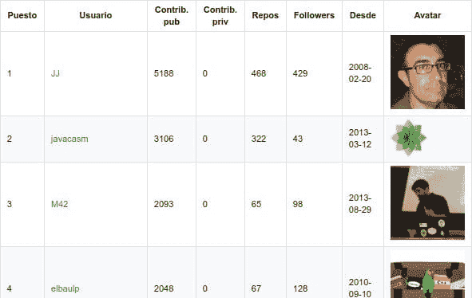

# 让我们研究一下你的开源社区

> 原文:[https://dev . to/iblancasa/let-study-your-open-source-community-b2p](https://dev.to/iblancasa/lets-study-your-open-source-community-b2p)

<figure> 

<figcaption>一些人在参加黑客马拉松</figcaption>

</figure>

开源很神奇。由于开源，你可以学到很多关于编程语言、技术或工作流程的知识。怎么会？这很容易！你可以搜索一个项目，看看人们实际上是如何工作的:代码审查，拉请求，代码约定，模块是如何分离的…你可以说你遵循一种方法，但如果你的项目是开源的，我们可以看到你是否告诉我们真相。

这很好，但是，这些人在哪里？大概他们到目前为止。例如:我来自西班牙，我跟踪的大部分项目都是由美国的人或公司创建的。如果我与开发商联系，我可以与他们交换几封电子邮件。或者我可以和他们见个面。如果我开始为一个项目做贡献，我可以加入这个“项目的大家庭”。我可以在对话中分享我的印象和知识。但是我们知道，这和“面对面”是不一样的。因此，本地开发者社区非常重要。因为你可以和其他有相同兴趣的人直接交谈。

社区对我来说很重要:4 年来，我一直在组织黑客马拉松、会议、代码实验室和聚会。我从“社区”中学到了很多。大概你的故事和我的差不多。但是……我们对当地社区了解多少呢？我的意思是:你真的知道你所在城市的人们在做什么吗？项目？编程语言？大概不会！这很重要。我完全确定你没有遇到你所在城市的大部分开发商。

<figure> 

<figcaption>GitHub 排名来自格拉纳达</figcaption>

</figure>

我开发了一个图书馆(很快，我将发布关于它的完整故事)来研究给定位置的社区。事实上，你可以用它做很多事情。这个库叫做 [**GitHubCity**](https://github.com/iblancasa/GitHubCity) **。**使用这个库，[我得到了来自西班牙所有省份的所有用户，并按照公共贡献的数量对他们进行分类](https://github.com/iblancasa/GitHubRankingsSpain)。但是你可以让你所在城市的所有 GitHub 用户只知道你有多少…或者找到你所在城市的发言者。或者找人创建一个新的开发者社区。

<figure> 

<figcaption>生成排名</figcaption>

</figure>

在以前版本的库(不是我开发的)中，有人得到了一些关于西班牙一些城市的有趣数据。例如:我们测量了一个地方的开发商数量/居民数量之间的关系，或者开发商的数量如何随着时间的推移而变化。[这一切在本文中有所描述:“衡量本地 GitHub 开发者社区](https://arxiv.org/abs/1501.06857)”。

那么，这个图书馆的目标是什么？正如我所说的，你可以使用这个库做任何事情。我们决定将社区“游戏化”以促进开源。它之所以有效，是因为每个人都想成为排名第一的人。排名增加了人们对开源的兴趣:现在，贡献更有趣了，正如我所说的，还有奖励。此外，正如我向你们展示的，我们研究了社区。

我们注意到一些不同公司的招聘人员正在查看排名。为什么？这是一种找到程序员并检查他们技能的简单方法。而且，如果你正在开发开源软件，那是因为你有学习的动力。

我会写更多关于排名的帖子:完整的故事，图书馆如何工作，未来的项目等等！