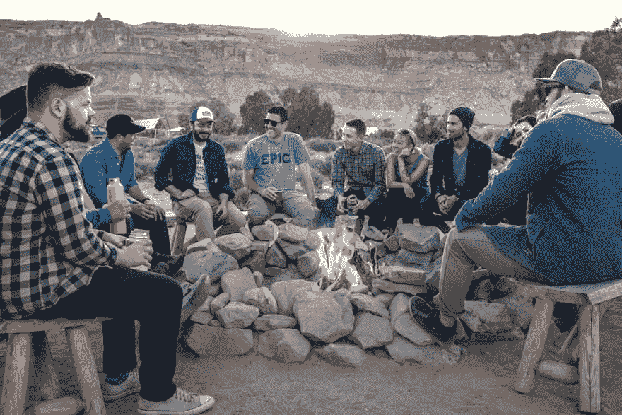

# 你如何管理社区网站中违反行为准则的行为？

> 原文:[https://dev . to/django tricks/how-do-you-manage-code-of-conduct-code-violations-in-community-websites-27ei](https://dev.to/djangotricks/how-do-you-manage-code-of-conduct-violations-in-community-websites-27ei)

[T2】](https://res.cloudinary.com/practicaldev/image/fetch/s--Ms829jDH--/c_limit%2Cf_auto%2Cfl_progressive%2Cq_auto%2Cw_880/https://thepracticaldev.s3.amazonaws.com/i/9490egaviqot4pi0xt0p.jpg)

我正在开发一个涉及公共交流的网络平台。为了保持积极的氛围，我在这里加入了行为准则。关于内容审核，我应该知道哪些问题？在您的案例中，每月需要花费多少时间来处理此类问题？有没有有用的工具或方法来加快审核过程？关于处理适度内容，有哪些常见的做法或者你自己的做法？