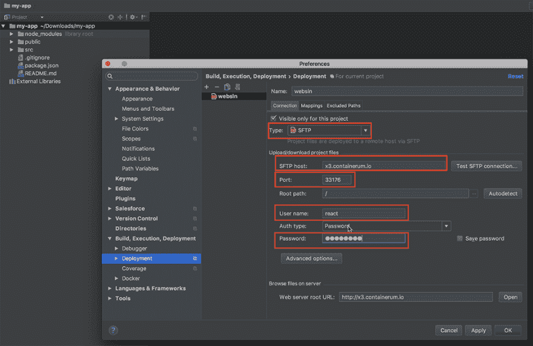
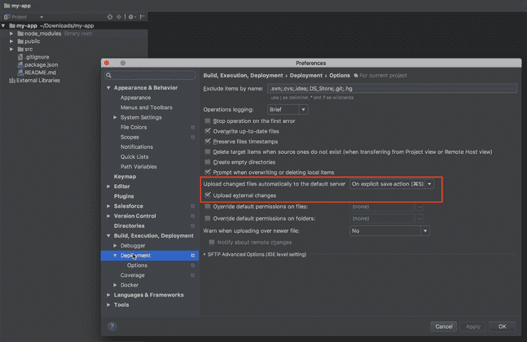
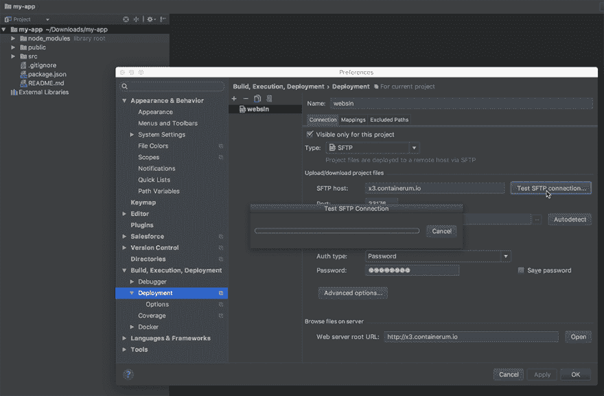
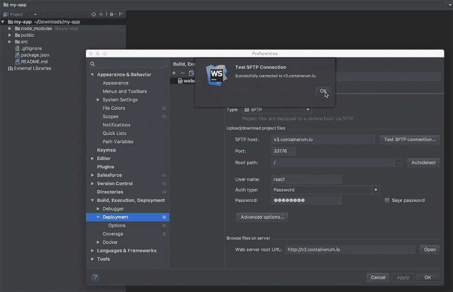
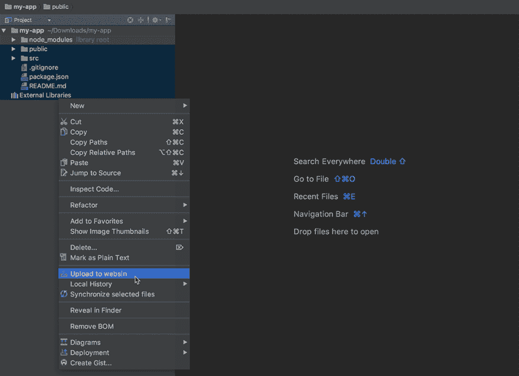
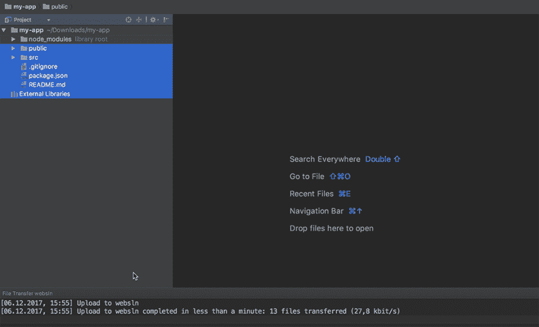
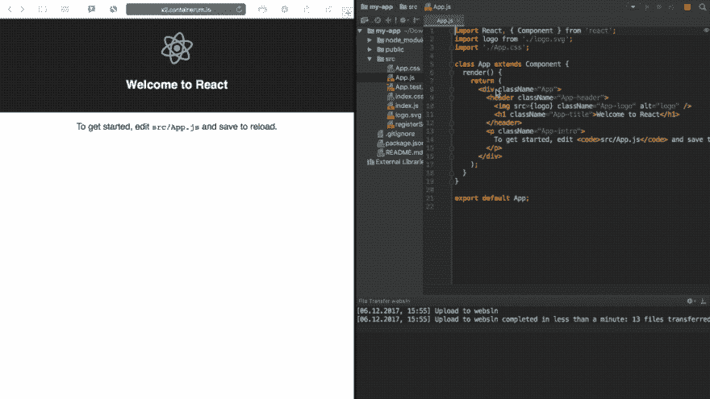

# 带 WebPack 的 SSH 服务器

> 原文：<https://dev.to/romanbon/ssh-server-with-webpack-3m1l>

嗨！

我刚刚做了一个很好的解决方案，想和你分享一下。这是一个带有 WebPack 的 SSH 服务器，面向使用 JavaScript 的前端开发人员。我喜欢这个东西的原因是我在编写代码时不必依赖我的机器资源——我只需将我的本地开发人员环境(例如 WebStorm 或其他 IDE)与云自托管机器同步，并且不会浪费我的本地资源来运行 WebPack 应用程序。

## 工作原理:

SSH 服务器捕获本地项目文件中的所有更改，并立即将它们与您托管的项目文件同步。Webpack 配置您的项目构建，并在您的浏览器中实时显示。

或者可以使用 sshfs 通过 SSH 挂载远程文件系统。

### 它由:

*   Ubuntu:16.04
*   OpenSSH-服务器
*   Nodejs
*   web pack-开发-服务器
*   Webpack 3.8.1
*   纱线 1.3.2

要在[Containerum.com](https://containerum.com/)推出该解决方案，注册该服务，下载并使用 [Containerum CLI](https://github.com/containerum/chkit) `chkit`。

#### 1。使用`chkit solution`运行解决方案:

```
$ chkit solution run containerum/webpack-3.8-ssh-solution -e USER=react -e USER_PASS=12345678 -e NAME=websln -e CPU=500m -e RAM=500Mi 
```

Enter fullscreen mode Exit fullscreen mode

*   用户-用户名，
*   用户密码，
*   名称-解决方案名称
*   CPU、RAM -此解决方案的计算资源

#### 2。确保解决方案正在运行:

```
$ chkit get deploy

+-------------------+------+-------------+------+-------+-----+
| NAME              | PODS | PODS ACTIVE | CPU  | RAM   | AGE |
+-------------------+------+-------------+------+-------+-----+
| websln-13k4y      | 1    | 1           | 500m | 500Mi | 22m |
+-------------------+------+-------------+------+-------+-----+ 
```

Enter fullscreen mode Exit fullscreen mode

#### 3。使用`chkit get`命令检查服务列表，标记用于连接正在运行的虚拟机的端口:

```
$ chkit get svc

+--------------+-----------------+----------+-------------------+-------------+-----+
| NAME         | CLUSTER-IP      | EXTERNAL | HOST              | PORT(S)     | AGE |
+--------------+-----------------+----------+-------------------+-------------+-----+
| websln-13k4y | 10.105.25.198   | true     | x3.containerum.io | 33176:22/TCP| 18m |
+--------------+-----------------+----------+-------------------+-------------+-----+ 
```

Enter fullscreen mode Exit fullscreen mode

#### 4。连接到正在运行的机器:

```
$ ssh react@x3.containerum.io -p33176 
```

Enter fullscreen mode Exit fullscreen mode

#### 5。创建工作目录:

```
react@websln:~$ mkdir react 
```

Enter fullscreen mode Exit fullscreen mode

并跳转到该目录:

```
react@websln:~$ cd react 
```

Enter fullscreen mode Exit fullscreen mode

#### 6。在您的本地机器上安装一个示例 react 应用程序【https://github.com/facebookincubator/create-react-app: T2】

```
$ npm install -g create-react-app 
```

Enter fullscreen mode Exit fullscreen mode

注意:你需要在你的机器上安装节点> = 6。

并新建一个 app:

```
$ create-react-app my-app

$ cd my-app 
```

Enter fullscreen mode Exit fullscreen mode

在您的机器上打开 WebStorm，并设置以下项目设置:

[](https://res.cloudinary.com/practicaldev/image/fetch/s--GWI5rfMj--/c_limit%2Cf_auto%2Cfl_progressive%2Cq_auto%2Cw_880/https://thepracticaldev.s3.amazonaws.com/i/kwohm5dcqk7gi58ip11h.png)
[](https://res.cloudinary.com/practicaldev/image/fetch/s--Gpz-Dk1O--/c_limit%2Cf_auto%2Cfl_progressive%2Cq_auto%2Cw_880/https://thepracticaldev.s3.amazonaws.com/i/s1xjr3ncqtyez5y1nmkh.png)
[](https://res.cloudinary.com/practicaldev/image/fetch/s--PzaW9R5L--/c_limit%2Cf_auto%2Cfl_progressive%2Cq_auto%2Cw_880/https://thepracticaldev.s3.amazonaws.com/i/3mnxap6w21gnpdpgqssw.png)

测试连接:

[](https://res.cloudinary.com/practicaldev/image/fetch/s--a2mT92oa--/c_limit%2Cf_auto%2Cfl_progressive%2Cq_auto%2Cw_880/https://thepracticaldev.s3.amazonaws.com/i/4kkyc81w1vuscgglign9.png)
[T6】](https://res.cloudinary.com/practicaldev/image/fetch/s--yepAYcnM--/c_limit%2Cf_auto%2Cfl_progressive%2Cq_auto%2Cw_880/https://thepracticaldev.s3.amazonaws.com/i/slteqwipe1xtpvgx3svq.png)

将选定的项目文件夹上传到正在运行的虚拟机:

[](https://res.cloudinary.com/practicaldev/image/fetch/s--5eeq7-3c--/c_limit%2Cf_auto%2Cfl_progressive%2Cq_auto%2Cw_880/https://thepracticaldev.s3.amazonaws.com/i/hu9v38o8izc5n7c1jkgt.png)
[T6】](https://res.cloudinary.com/practicaldev/image/fetch/s--fAMfkOUd--/c_limit%2Cf_auto%2Cfl_progressive%2Cq_auto%2Cw_880/https://thepracticaldev.s3.amazonaws.com/i/mfdmd7tf22ypm47el1je.png)

#### 7。在正在运行的计算机上运行以下命令:

```
react@websln:~$ npm i

react@websln:~$ npm start 
```

Enter fullscreen mode Exit fullscreen mode

#### 8。为了提供对已启动解决方案的访问，我们将在本地使用`chkit expose`命令创建一个服务:

```
chkit expose deploy websln-13k4y -p portname:3000:TCP 
```

Enter fullscreen mode Exit fullscreen mode

#### 9。使用`chkit get`获取访问运行解决方案的地址和端口:

```
$ chkit get svc

+-------------------+-----------------+----------+-------------------+---------------+-----+
| NAME              | CLUSTER-IP      | EXTERNAL | HOST              | PORT(S)       | AGE |
+-------------------+-----------------+----------+-------------------+---------------+-----+
| websln-13k4y      | 10.105.25.198   | true     | x3.containerum.io | 33176:22/TCP  | 22m |
+-------------------+-----------------+----------+-------------------+---------------+-----+
| websln-13k4y-3ac7 | 10.111.121.79   | true     | x2.containerum.io | 19451:3000/TCP| 9s  |
+-------------------+-----------------+----------+-------------------+---------------+-----+ 
```

Enter fullscreen mode Exit fullscreen mode

`http://x2.containerum.io:19451`

#### [10](#10-all-changes-that-you-make-in-raw-srcappjs-endraw-are-now-immediately-reflected-in-your-project-and-can-be-viewed-in-your-browser-at-raw-httpx2containerumio19451-endraw-)。您在`src/App.js`中所做的所有更改现在会立即反映在您的项目中，并且可以在`http://x2.containerum.io:19451`时在您的浏览器中查看

[T2】](https://res.cloudinary.com/practicaldev/image/fetch/s--Nujs6juS--/c_limit%2Cf_auto%2Cfl_progressive%2Cq_66%2Cw_880/https://thepracticaldev.s3.amazonaws.com/i/f3kujcb0poulzqpi1uas.gif)

很漂亮，对吧？它节省了你的本地资源，所以你可以在任何机器上快速工作。我希望你也会觉得有用。如果你有任何问题或建议，或者如果我错过了什么，请评论。