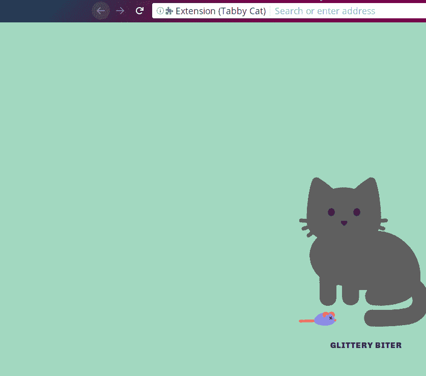
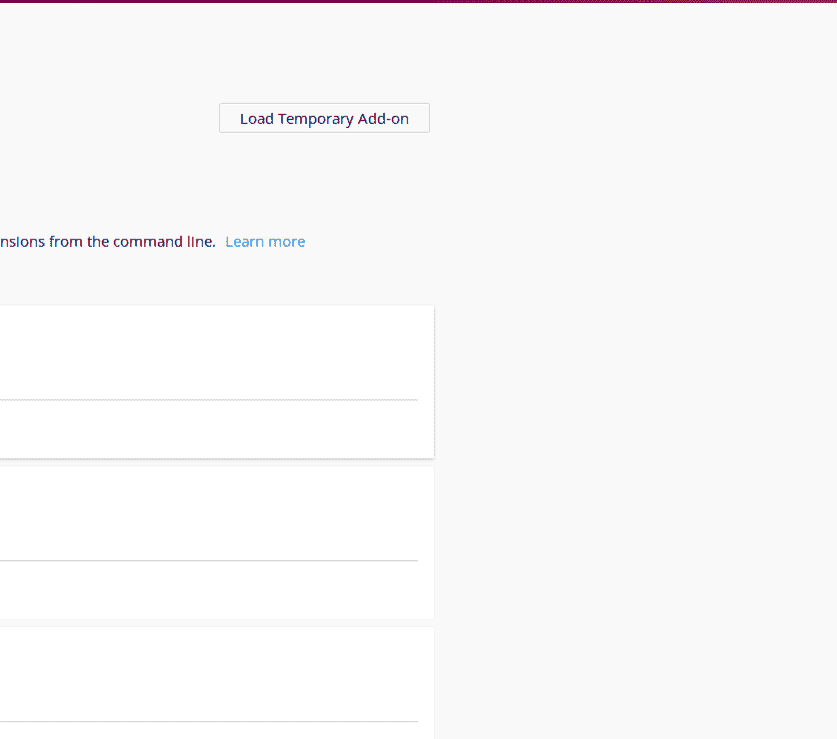
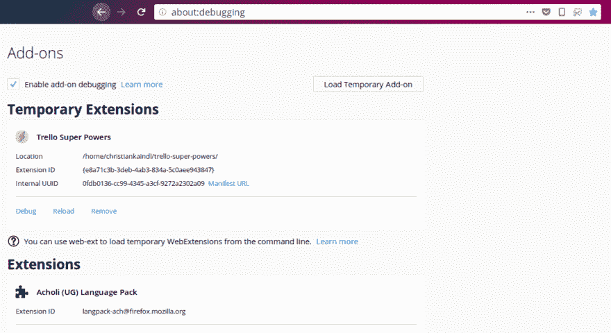
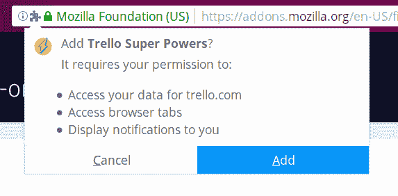
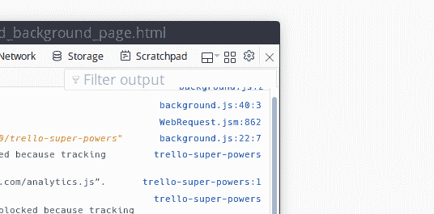
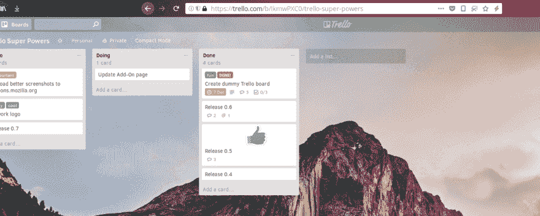
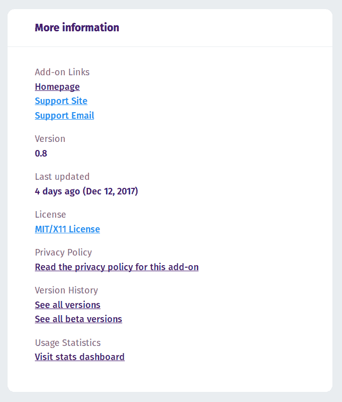
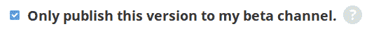

# 网络扩展指南

> 原文：<https://dev.to/christiankaindl/a-webextension-guide-36ag>

对于那些不知道的人来说，WebExtension 是一个新的附加架构/规范，甚至可以跨浏览器使用(在某种程度上)。它是一个浏览器本地 API 接口，通过它你可以用 web 技术编写扩展。WebExtension API 的核心是标准化的，以便于将来的开发。对于这篇文章，我将写在 Firefox 的扩展开发的背景下，但有些事情对于其他浏览器也可能是真的。

* * *

# 入门

扩展的核心和起点是它的**清单**。清单是一个 JSON 文件，它包含了关于附加组件的各种信息:名称、版本、描述、权限、UI 元素、图标等等。

为了尽可能创建最简单的 web 扩展，`manifest.json`可能是这样的:

```
 {  "manifest_version":  2,  "name":  "Super Awesome Extension 👓",  "version":  "1"  } 
```

Enter fullscreen mode Exit fullscreen mode

上面显示的 3 个 JSON 键是清单中唯一的强制键。但是，在您添加一些奇特的功能之前，让我向您展示如何在浏览器中安装一个本地插件:

1.  使用您的地址栏转到“关于:调试”:

    [T2】](https://res.cloudinary.com/practicaldev/image/fetch/s--qWfkH_9E--/c_limit%2Cf_auto%2Cfl_progressive%2Cq_66%2Cw_880/https://thepracticaldev.s3.amazonaws.com/i/2ll5kpkoaq50jdgwfcx3.gif)

2.  单击“加载临时加载项”并从本地加载项中选择 manifest.json:

    [T2】](https://res.cloudinary.com/practicaldev/image/fetch/s---dWAk7Ye--/c_limit%2Cf_auto%2Cfl_progressive%2Cq_66%2Cw_880/https://thepracticaldev.s3.amazonaws.com/i/h2o9ilhqol2m2mv77ui7.gif)

你的扩展现在会显示在火狐的附加页面上(右上角的地址栏或汉堡菜单中的“关于:附加项”，然后是“附加项”)，并且可以使用了！这就是让您的附加组件正常运行所需了解的全部内容。你可以现在就去试试，我在这里等。注意:当你在开发过程中对你的插件做任何修改时，不要忘记点击`about:debugging`页面上的`Reload`按钮。

* * *

如果您想从您的附加组件中看到潜在的错误和/或`log`语句，有一个单独的调试窗口(您将需要它)。

要打开它，请转到“关于:调试”(如上所示)，并加载您的附加组件(也如上所示)。在那里，选中“启用加载项调试”复选框，然后为您的加载项单击“调试”:

[T2】](https://res.cloudinary.com/practicaldev/image/fetch/s--GpHQzIS0--/c_limit%2Cf_auto%2Cfl_progressive%2Cq_66%2Cw_880/https://thepracticaldev.s3.amazonaws.com/i/3redngq619nhg1852lgs.gif)

*近*所有的调试信息都会显示在这个窗口中，我们稍后会看到为什么只有*近*。

**链接:**
> [Web-ext 工具](https://developer.mozilla.org/en-US/Add-ons/WebExtensions/Getting_started_with_web-ext)
> [在 MDN 上调试](https://developer.mozilla.org/en-US/Add-ons/WebExtensions/Debugging)

* * *

# JavaScript！

对于 WebExtensions，所有 API 都存在于`browser`名称空间中。这意味着您的脚本可以访问名为`browser`的 JavaScript 对象，该对象包含所有默认 API 和您通过清单授予权限的所有 API 的方法。例如，如果你想从你的脚本中打开一个新标签，你可以写`browser.tabs.create({});`

***注意:** Google Chrome 为其 API 使用了非标准的`chrome`命名空间。`browser`使用 JavaScript 承诺作为异步 API 的返回值，`chrome`使用回调。对于跨浏览器扩展，有一个可以在 Google Chrome 中使用的`browser`名称空间的 polyfill。火狐同时支持`browser`和`chrome`，使得从谷歌 Chrome 移植扩展更加容易。如果你开发了一个新的跨浏览器兼容的扩展，使用带有 polyfill for Google Chrome 的名称空间`browser`。*

在 WebExtension 世界中有三种类型的脚本:

1.  后台脚本是你的扩展可以运行的最高级别的脚本。它可以访问所有默认 API 和您通过清单授予的所有 API(这种脚本称为“特权脚本”)。后台脚本独立于任何标签运行**(事实上，在新的 Firefox 中，它们甚至有自己的内容进程)，这意味着它在浏览器启动(或附加安装)时开始它的生命，在你关闭浏览器(或卸载附加)时结束它的生命。后台脚本也跨多个浏览器实例运行(例如，您同时打开了多个 Firefox 窗口)。因此，后台脚本是您的首选 1)繁重的工作(有一个 API 来检测用户是否空闲，这可能是繁重任务的好时机！*(拜托，不要做加密采矿。Ups。)*)、2)确保独立于网站工作的特性，以及 3)使用特权 API。您还可以从后台脚本注册网站访问等事件，然后以编程方式插入脚本。**

2.  **内容脚本**或者以编程方式(例如通过后台脚本)插入，或者自动(使用`content_scripts`清单密钥)插入网站。一旦进入，他们可以直接与站点的 DOM 交互。内容脚本不是特权脚本，这意味着它们只能有限地访问 WebExtension APIs。注意:如果您不确定您的选择是什么，您可以在这篇 MDN 文章中找到所有可用于内容脚本[的 API，或者您可以始终使用一个`console.info(browser);`语句并在控制台中检查其附加方法。](https://developer.mozilla.org/en-US/Add-ons/WebExtensions/Content_scripts#WebExtension_APIs)

3.  来自 WebExtension UIs 的脚本。这些包括侧边栏中的页面、页面和浏览器操作弹出窗口以及开发人员工具。它们与内容脚本有一个相似之处，即一旦弹出窗口/面板/侧边栏关闭，它们就会被终止。它们的调试信息与后台脚本一起显示在调试窗口中，它们也是特权脚本。事实上，在弹出窗口中执行的脚本只有在弹出窗口打开时才有效，这是一个限制因素。因此，根据您的用例，很可能您还需要一个背景脚本页面。

*使用`browser.extension.getViews()`可以访问其他特权脚本的范围，或者使用`browser.extension.getBackgroundPage()`* 只能访问后台脚本的范围

**链接:**
>[`browser``chrome`](https://developer.mozilla.org/en-US/Add-ons/WebExtensions/API)
>[剖析一个扩展概述](https://developer.mozilla.org/en-US/Add-ons/WebExtensions/Anatomy_of_a_WebExtension)(后台脚本、内容脚本、侧边栏、弹出窗口、选项页)
> [更多关于内容脚本](https://developer.mozilla.org/en-US/Add-ons/WebExtensions/Content_scripts)

* * *

您可以使用的 API 数量受到以下因素的限制:1)您通过清单授予的权限；2)所讨论的脚本是特权脚本(后台脚本、侧栏、弹出窗口)还是内容脚本。

内容脚本只能使用某些 web 扩展 API，但是也可以访问它们被注入的页面的 DOM。

特权脚本可以访问所有 WebExtension APIs(除了那些需要权限的 API，在这种情况下，只有当您指定了相应的清单键时)。如果特权脚本带有 HTML 页面(侧边栏、弹出窗口)，它们可以访问自己的 DOM。后台脚本也可以访问自己的 DOM，但是不会在任何地方呈现。

要获得除默认权限之外的权限，您可以将它们包含在清单中，然后在用户安装附加组件时向他们显示。

[T2】](https://res.cloudinary.com/practicaldev/image/fetch/s--kk2p9Bev--/c_limit%2Cf_auto%2Cfl_progressive%2Cq_auto%2Cw_880/https://thepracticaldev.s3.amazonaws.com/i/9qmvyajg81twgaivo3za.png)

添加了权限、图标和描述后，您的清单可能如下所示:

```
 {  "manifest_version":  2,  "name":  "Super Awesome Extension 👓",  "version":  "1",  "description":  "Super awesome Add-on for super awesome people.",  "icons":  {  "16":  "assets/logos/logo_small.svg",  "32":  "assets/logos/logo_small.svg",  "48":  "assets/logos/logo_small.svg",  "64":  "assets/logos/logo.svg",  "128":  "assets/logos/logo.svg"  },  "permissions":  [  "tabs",  "storage",  "https://awesome.com/*/",  "notifications",  "downloads"  ]  } 
```

Enter fullscreen mode Exit fullscreen mode

* * *

# 用户界面

你的插件可以在没有任何用户界面元素的情况下完全运行(例如，只有一个后台脚本),但是你很可能需要一些。幸运的是，浏览器帮助我们做到了这一点。以下是您可以在加载项中使用的 UI 元素列表:

*   **浏览器动作**。这是一个显示在工具栏中的图标，就在其他工具栏图标的旁边。当图标被点击时，您的后台脚本会触发一个事件，您可以使用`browser.browserAction.onClicked.addListener()`订阅该事件。你也可以选择当图标被点击时显示一个弹出窗口。

*   **页面动作**。这是一个显示在*地址栏*中的图标。与浏览器操作不同的是，它只在某些网站上显示(您可以定义)。当图标被点击时，您的后台脚本会触发一个事件，您可以使用`browser.pageAction.onClicked.addListener()`订阅该事件。你也可以选择当图标被点击时显示一个弹出窗口。

*   **侧栏**。这将添加一个侧边栏(默认在左边)并显示一个普通的 HTML 页面(就像你在普通网站上做的一样)。在 Firefox 的情况下，threre 是一个全局侧边栏，它有一个用于在侧边栏之间切换的下拉菜单。如果你使用这个 UI 元素，你的侧边栏会被添加到下拉列表中。

*   **开发工具**面板。是的，如果你想增强火狐的开发者工具，你可以。

*   **内容脚本**。这不是一个直接的用户界面组件，但是它是一种与用户交互的方式。正如下面进一步解释的，内容脚本被注入到网站中，可以直接与网站的 DOM 交互。

*   **通知**。做它所说的。

*   **地址栏**建议。这让你可以监听地址栏中的输入，然后建议链接或动作。相当酷。

浏览器动作、页面动作、内容脚本(可选)、侧栏和开发工具在清单中定义，然后可以与扩展的(后台)脚本交互。

## 调试弹出窗口

如果你使用弹出窗口，你很快就会想如何调试它，因为当它失去焦点时会自动关闭。也就是说，当您希望在弹出窗口打开的情况下切换到调试窗口时，它不会如您所愿地工作。为了克服这一点，我们可以将弹出窗口“锁定”到它们所在的位置:

1.  在先前打开的调试窗口中，单击“禁用弹出窗口自动隐藏”按钮。这确保了弹出窗口总是在顶部(而不是像通常那样自己关闭)。*注意，即使你切换到一个不同的应用程序*，它实际上总是停留在顶部。**完成后不要忘记再次禁用这个选项，(它甚至会在重启后保存)，否则你会以[很多弹出窗口](https://thepracticaldev.s3.amazonaws.com/i/kdx4eocf670zfiwbmmrs.png)** 结束。

    [T2】](https://res.cloudinary.com/practicaldev/image/fetch/s--1MNm8WfU--/c_limit%2Cf_auto%2Cfl_progressive%2Cq_66%2Cw_880/https://thepracticaldev.s3.amazonaws.com/i/zaiz6asbtkbdq3v3z8sm.gif)

2.  在前面左边的按钮上，选择您的弹出目标:
    *(按钮显示‘选择一个 iframe 作为当前目标文档’)*

    [T2】](https://res.cloudinary.com/practicaldev/image/fetch/s--V1II7-MC--/c_limit%2Cf_auto%2Cfl_progressive%2Cq_66%2Cw_880/https://thepracticaldev.s3.amazonaws.com/i/qa223klvg62p8hzt2sl5.gif)

您现在可以轻松地检查弹出窗口。

* * *

让我们向清单中添加一个示例页面动作:

```
 {  "manifest_version":  2,  "name":  "Super Awesome Extension 👓",  "version":  "1",  "description":  "Super awesome Add-on for super awesome people.",  "icons":  {  "16":  "assets/logos/logo_small.svg",  "32":  "assets/logos/logo_small.svg",  "48":  "assets/logos/logo_small.svg",  "64":  "assets/logos/logo.svg",  "128":  "assets/logos/logo.svg"  },  "permissions":  [  "tabs",  "storage",  "https://awesome.com/*/",  "notifications",  "downloads"  ],  "page_action":  {  "browser_style":  true,  "default_icon":  {  "16":  "/assets/page-action/page-action-16.svg",  "19":  "/assets/page-action/page-action-19.svg",  "32":  "/assets/page-action/page-action-32.svg",  "38":  "/assets/page-action/page-action-38.svg"  },  "default_title":  "Awesome Page Action!",  "default_popup":  "/page-action/index.html"  }  } 
```

Enter fullscreen mode Exit fullscreen mode

**链接:**
> [UI 最佳实践](https://developer.mozilla.org/en-US/Add-ons/WebExtensions/User_experience_best_practices)
> UI 元素:

*   [浏览器动作](https://developer.mozilla.org/en-US/Add-ons/WebExtensions/manifest.json/browser_action)
*   [页面动作](https://developer.mozilla.org/en-US/Add-ons/WebExtensions/manifest.json/page_action)
*   [侧边栏](https://developer.mozilla.org/en-US/Add-ons/WebExtensions/manifest.json/sidebar_action)
*   [开发工具](https://developer.mozilla.org/en-US/Add-ons/WebExtensions/manifest.json/devtools_page)
*   [内容脚本](https://developer.mozilla.org/en-US/Add-ons/WebExtensions/manifest.json/content_scripts)
*   [通知](https://developer.mozilla.org/en-US/Add-ons/WebExtensions/API/notifications)
*   [地址栏建议](https://developer.mozilla.org/en-US/Add-ons/WebExtensions/user_interface/Omnibox)

* * *

内容脚本只能访问有限的 API，但是有时您需要只有特权脚本才能从内容脚本中提供的功能。这就是消息传递 API 的用武之地。消息传递 API 是一种与脚本通信的简单方式。不管是后台脚本、内容脚本、弹出窗口还是侧边栏。

要开始使用，可以使用以下 API:

```
 // Sends a message to all privileged scripts (can be used by Content Scripts, but can't be used to send to Content Scripts)
browser.runtime.sendMessage(optionalID, messageData); 

// Sends a message to a Content Script (from a privileged script)
browser.tabs.sendMessage(tabId, optionalObject); 

// Receive messages sent via methods above
browser.runtime.onMessage(function); 
```

Enter fullscreen mode Exit fullscreen mode

*注意:你不能在后台脚本之间通信，因为它们共享相同的作用域(就像一个网站)。您可以包含多个，但它们都在同一个背景环境中执行*

如果我在一个内容脚本中使用`runtime.sendMessage()`，那么所有特权脚本(比如后台脚本)都会收到这条消息。但是，如果我必须为两个不同的任务发送两个不同的消息，我怎么知道哪个是哪个呢？

你也可以在信息中发送对象，所以我是这样解决这个问题的:

```
/* EXAMPLE */

/* contentScript.js */

// Send a message. In this case, we send an object
browser.runtime.sendMessage({
type: "notification", // Include a 'type' property so the receiving scripts know what to do
data: { url: "example.com", numbers: [1, 2, 3, 4, 5] } // Some data you want to send
});

// ==================

/* background.js */

// Listen for messages
browser.runtime.onMessage(handleMessage);

// Handle received messages
function handleMessage( message ) {
  console.log( message.type )           // "notification"
  console.log( message.data.url )       // "example.com"
  console.log( message.data.numbers )   // Array[1, 2, 3, 4, 5]
} 
```

Enter fullscreen mode Exit fullscreen mode

通过发送一个对象并赋予它一个`type`属性，我可以很容易地将通知与脚本可能得到的其他消息区分开来。*(使用`type`和`data`只是虚构的属性，我可以使用任何东西来代替)*

对于更高级的通信需求，您还可以使用`runtime.connect()`和`tabs.connect()`来建立一个长期的通信渠道，您可以随时知道是谁发送了消息。

此外，您可以选择将返回值发送回发送方:

```
/* EXAMPLE */

/* contentScript.js */

// Send a message. Assuming async function context, otherwise we would get a promise back
var returnValue = await browser.runtime.sendMessage({
type: "notification",
data: { url: "example.com", numbers: [1, 2, 3, 4, 5] }
});

// ==================

/* background.js */

// Listen for messages
browser.runtime.onMessage(handleMessage);

// Handle received messages
function handleMessage( message ) {
  // Do something with received message...

  // Return a "response" and fulfill the promise for the message sender
  return 42;
} 
```

Enter fullscreen mode Exit fullscreen mode

**链接:**
> [JavaScript API 概述](https://developer.mozilla.org/en-US/Add-ons/WebExtensions/API)
>[runtime . sendmessage()](https://developer.mozilla.org/en-US/Add-ons/WebExtensions/API/runtime/sendMessage)
>[runtime . on message()](https://developer.mozilla.org/en-US/Add-ons/WebExtensions/API/runtime/onMessage)
[tabs . sendmessage()](https://developer.mozilla.org/en-US/Add-ons/WebExtensions/API/tabs/sendMessage)

* * *

# 出版

为了让你能够永久地安装火狐扩展，你必须先签名。这可以在 Mozilla 的附加网站上完成。要让人们使用你的插件(也就是发布它),你有两个选择:

1.  上传到 Mozilla 的附加网站。这大概是大多数人的选择。你的扩展得到审查，然后在网站上列出和搜索，你也可以得到方便的使用统计。

2.  **自己发**。在 addons.mozilla.org(AMO)，你可以选择只签署你的扩展，而不是把它列在网站上。然后，您可以自己分发已签名的附加组件(例如，从您的网站)。为了提供对扩展的更新，您必须提供一个`update_url`清单密钥。

### 关于 AMO 的笔记

AMO 只在第一次提交 时使用 *[货单上的图标作为他们的附加页面。这意味着如果你想改变你的图标显示在 AMO 之后，你只能通过他们的网络界面来改变它。如果你第一次上传没有图标的插件，然后通过更新添加它们，你也必须通过 AMO 手动添加它们(我真的希望这在未来的某个时候改变。*这只适用于 AMO 网站的图标，不适用于火狐的插件管理器或其他地方*。](https://discourse.mozilla.org/t/manifest-specified-icons-on-amo/17443)*

此外，我建议你有一个充实的“更多信息”面板。这确实有助于人们了解你的附加产品，并给访问者留下良好的印象。提供一个网站(如果你的插件是开源的，留下一个到库的链接(例如 GitHub))，支持电子邮件，支持网站(例如 bug 追踪器，论坛，或者 GitHub 上的“问题”页面)。此外，您可以添加许可证(MIT、GPL 等。)和隐私政策(如果您的附加组件变得更大，您将需要这一点)。所有这些提到的信息都可以通过 AMO 网络界面添加。

[T2】](https://res.cloudinary.com/practicaldev/image/fetch/s--7UvoADX7--/c_limit%2Cf_auto%2Cfl_progressive%2Cq_auto%2Cw_880/https://thepracticaldev.s3.amazonaws.com/i/pqb43gyfb5ru08ab6duq.png)

最后一点，你也可以在 AMO 上获得附加软件的测试版。

> "版本以|alpha|b|beta|pre|rc 结尾并带有可选数字的文件被检测为 beta。"

因此，如果您的清单的`version`是“1.2”，并且是预发布版本，您可以添加提到的字母之一，例如“1.2a”。上传时，AMO 会向您显示此选项:

[T2】](https://res.cloudinary.com/practicaldev/image/fetch/s--jVZStFnH--/c_limit%2Cf_auto%2Cfl_progressive%2Cq_auto%2Cw_880/https://thepracticaldev.s3.amazonaws.com/i/m0anfr27myzxgf3xzdsk.png)

**链接:**
> [更多发布信息](https://developer.mozilla.org/en-US/Add-ons/WebExtensions/Publishing_your_WebExtension)
> [Mozilla 的附加网站(AMO)](https://addons.mozilla.org/en-US/firefox/)

### 关于自我分配的说明

当您选择自分发路线时，您很可能需要一个`update_url`密钥。这是通过`applications`键中的`gecko`键完成的，如下图:

```
{  "applications":  {  "gecko":  {  "update_url":  "https://example.com/updates.json"  }  } 
```

Enter fullscreen mode Exit fullscreen mode

指定的 URL 是更新清单。这是一个 JSON 文件，专门用来告诉浏览器最新的版本是什么以及在哪里可以获得它。

**链接:**
> [更多关于自发布](https://developer.mozilla.org/en-US/Add-ons/WebExtensions/Alternative_distribution_options)
>[‘应用’清单键](https://developer.mozilla.org/en-US/Add-ons/WebExtensions/manifest.json/applications)
> [更新清单](https://developer.mozilla.org/en-US/Add-ons/Updates)

* * *

# 更多的东西

**国际化(i18n)**
根据您的附加组件的范围，您可能希望将其翻译成其他语言，以便更多的用户可以使用他们的母语。这可以通过 WebExtensions 实现。建议你看[本指南](https://developer.mozilla.org/en-US/Add-ons/WebExtensions/Internationalization)入门，但是 TL；博士是这样的:

1.  所有的语言环境都位于插件根目录下的一个名为`_locales`的文件夹中
2.  每种语言在`_locales`文件夹中都有它自己的文件夹，该文件夹以它的[适当的语言短代码](https://r12a.github.io/app-subtags/)命名
3.  每个语言文件夹中都有一个名为`messages.json`的文件，其中包含该语言的所有字符串
4.  您可以通过从脚本中调用`browser.i18n.getMessage('yourStringYouWantLocalised')`来获得本地化的字符串。

注意，你必须自己翻译你的 ui(HTML 页面)。这意味着，当一个 HTML 页面被加载时，你需要某种机制来*将翻译后的字符串*应用到你的 HTML 中。使用我的插件，我通过给 HTML 中每个可翻译的元素赋予一个`data-translate`属性来解决这个问题。当加载 HTML 页面时，我有一个名为`translate()`的小助手函数，用一个`data-translate`属性替换每个元素的文本内容。该函数使用`data-translate`的值来获取在`messages.json`文件中指定的相应翻译字符串。

**论坛**
如果你有时觉得运气不好，找不到路，还有一个官方的 AMO 论坛。我不知道我最初是如何找到它的，因为它不是不容易找到的东西。你可以去看看这里的。

**设置页面**
你可能会发现自己处在一个想为自己的附加组件做一个设置页面的位置。第一步是在您的清单中指定一个`options_ui`键。你可以输入一个`page`键并指定一个 HTML 页面，如下所示:

```
{  "options_ui":  {  "page":  "settings/options.html",  }  } 
```

Enter fullscreen mode Exit fullscreen mode

现在，当你在插件管理器中访问你的插件页面时，你会在底部看到你指定的 HTML 页面。在这里，您可以添加一些表单元素，让用户选择他们的偏好。需要注意两件事:

1.  您必须实际保存设置。这可以通过存储 API: `browser.storage.set()`)来实现。
2.  加载设置 HTML 页面时，您必须将输入元素初始化为其存储值。要从存储器中获取值，您可以使用`browser.storage.get()`。

**链接:**
> [AMO 论坛](https://discourse.mozilla.org/c/add-ons)
> [存储 API](https://developer.mozilla.org/en-US/Add-ons/WebExtensions/API/storage)
> [设置页面指南](https://developer.mozilla.org/en-US/Add-ons/WebExtensions/Implement_a_settings_page)
> [我的翻译方法](https://github.com/christiankaindl/trello-super-powers/blob/master/CONTRIBUTE.md#translating-ui-elements)
> [链接到我的`translate()`助手功能](https://github.com/christiankaindl/trello-super-powers/blob/master/translate.js)

* * *

在 Firefox 57 中，Mozilla 完全放弃了传统的扩展支持，转而支持这种新的架构。在 WebExtensions 出现之前——作为开发 Firefox 扩展的开发者——你也可以使用浏览器内部的东西。这导致了糟糕的兼容性体验，因为更新很容易中断，而且经常没有这些内部功能的文档。Mozilla 试图通过提供 SDK 来简化开发，但它仍然不够完美。所以现在，编写一个 WebExtension 是获得一个可用的 Firefox 插件的唯一方法。

唷！如果你能走到这一步，恭喜你！写这篇文章不容易，但也很有趣。如果你有任何问题或者我有什么不清楚的地方，请留下评论，我会很乐意回答。谢谢你。

WebExtensions 的可能性比我在这篇文章中可能展示的要多得多，所以请务必查看 MDN 上的所有 API 和清单键[。](https://developer.mozilla.org/de/Add-ons/WebExtensions)

*我在开始时谈到的附件(显示在 gif 中)是[特雷罗超能力](https://addons.mozilla.org/en-US/firefox/addon/trello-super-powers/)。这是一个简单的扩展，为您的 Trello 板添加了一些漂亮的功能。而且对了，它是开源的，所以你可以在 GitHubT5 上查看*