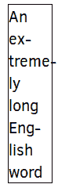

# 是否在开发目标上使用连字符？

> 原文:[https://dev . to/Christian kindl/use-hyphenation-on-dev to-5a5h](https://dev.to/christiankaindl/use-hyphenation-on-devto-5a5h)

我认为让文章使用连字符会很酷，这样它们的行在长度上更相似。

```
p {
  hyphens: auto;
} 
```

这可以用今天的 CSS 来完成，并且有所有主流浏览器的基本支持。嘿，如果一个浏览器不支持它，没关系，句子会显示得很好。我猜这就是渐进增强的定义:)
通过一个简单的@-规则，它可以和`text-align: justify`一起使用！< -这看起来非常棒，非常专业。#前沿:)
[MDN 上的断字文档](https://developer.mozilla.org/en-US/docs/Web/CSS/hyphens)

[T2】](https://res.cloudinary.com/practicaldev/image/fetch/s--kuNiH9ZD--/c_limit%2Cf_auto%2Cfl_progressive%2Cq_auto%2Cw_880/https://thepracticaldev.s3.amazonaws.com/i/aqgkktjaq5yuvdk87xf2.png)

我最近读了一篇使用它的文章，我很惊讶这已经是可能的了，所以我认为它会给大多数人一个非常好的体验，即使它只是❤的一个小增加

其他人对此有什么看法？