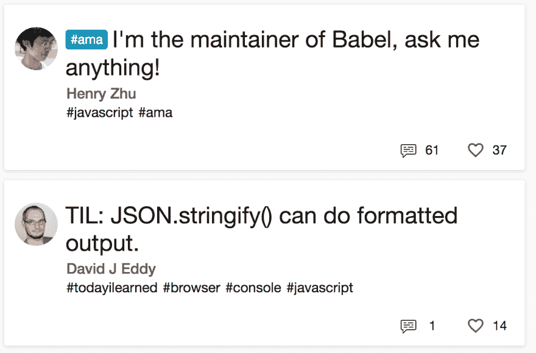

# 杀死所有孤儿！

> 原文：<https://dev.to/ardennl/kill-all-orphans-319f>

是的，这将是一个欢快的圣诞节！需要澄清的是，我指的是标题中的最后一个词，它会单独另起一行。也许我只是太为此烦恼了。

[T2】](https://res.cloudinary.com/practicaldev/image/fetch/s--nuyZbCmx--/c_limit%2Cf_auto%2Cfl_progressive%2Cq_auto%2Cw_880/https://thepracticaldev.s3.amazonaws.com/i/si59ht55899vs7wnh3fk.png)