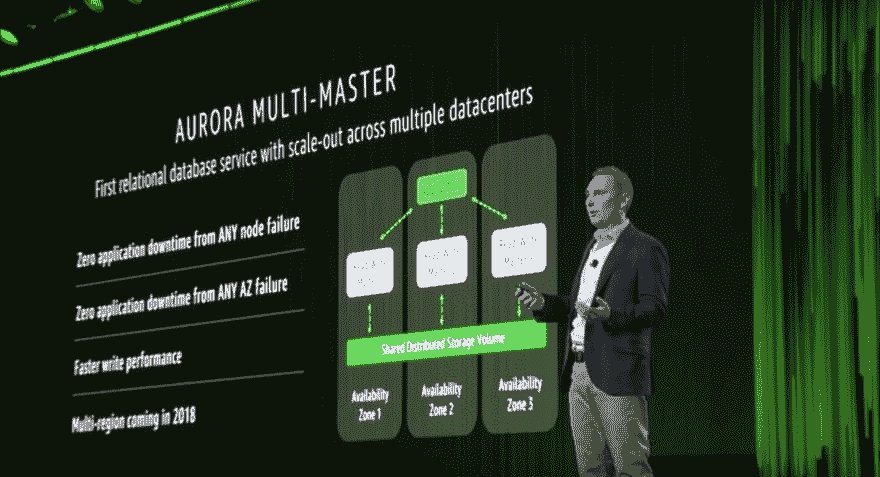
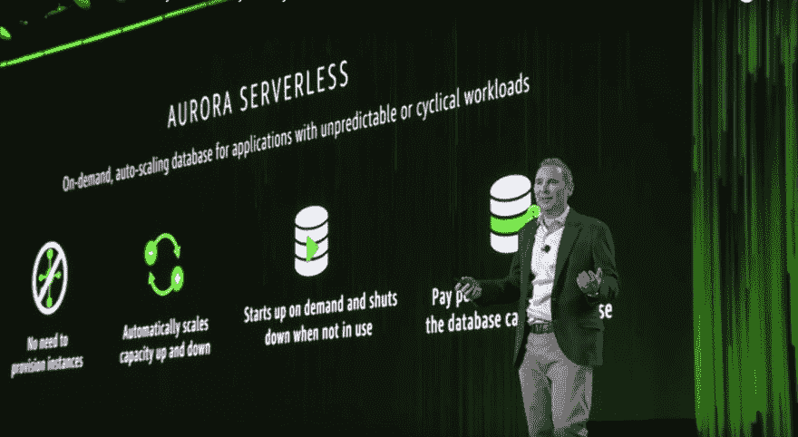
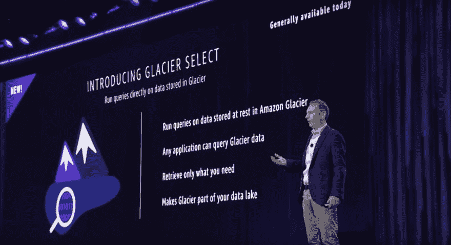
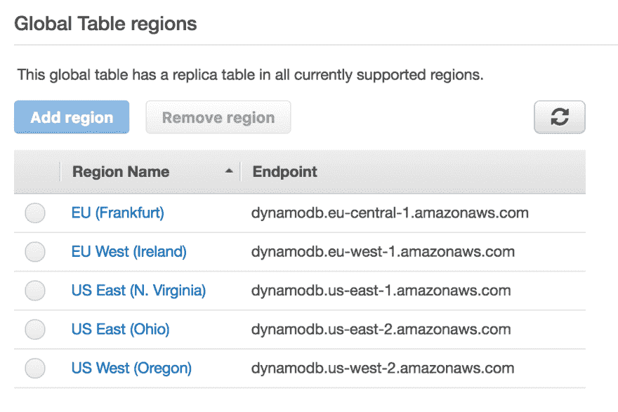
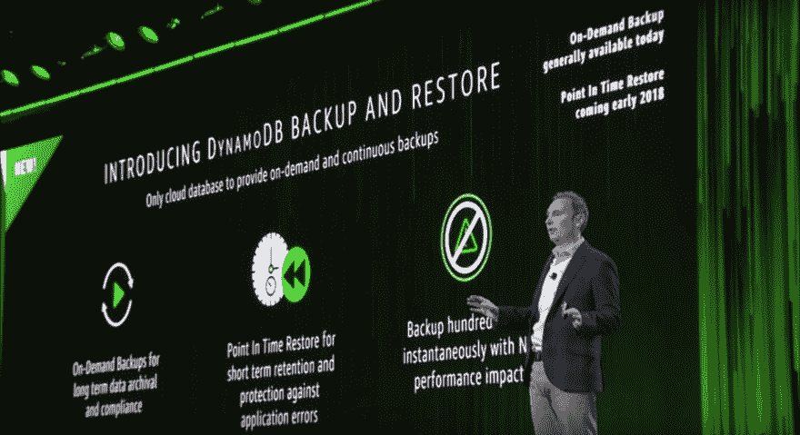
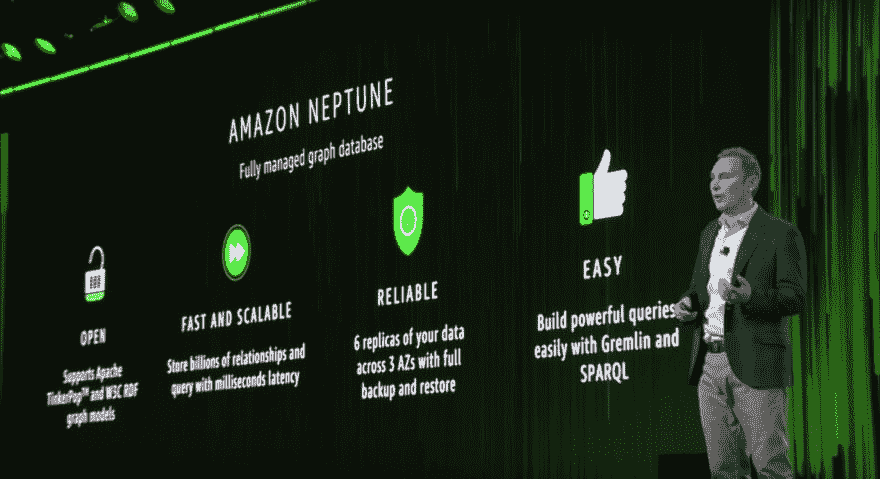
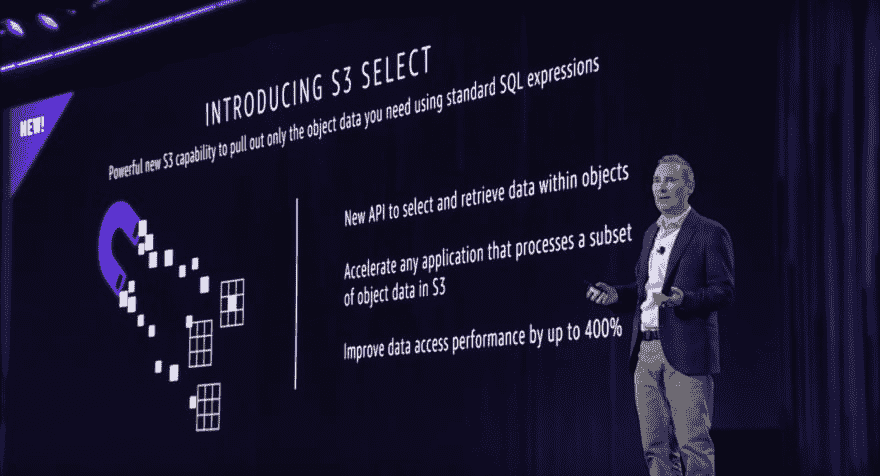

# 数据库新闻:来自 AWS re:Invent 2017 的 7 个更新

> 原文:[https://dev . to/Alex Casal boni/database-news-7-updates-from-AWS-reinvent-2017-2fa](https://dev.to/alexcasalboni/database-news-7-updates-from-aws-reinvent-2017-2fa)

继 AWS re:Invent 2017 之后，我们已经发布了 40 多项新的或改进的 AWS 服务。今天，我们将讨论我们为 2018 年您应该关注的新数据库和存储服务挑选的产品。

## 数据库世界有什么新变化？

如果你对幻方图感兴趣，以下是在 AWS re:invent 发布前一个月，Gartner 对运营数据库管理系统的评论。看到这些文件这么快就过时了，真有趣！:)

尽管绝大多数新服务都与人工智能和物联网有关，但 AWS 也宣布了几种新的令人兴奋的方法来管理现有数据库并与之交互，全新的托管服务，甚至是从更传统的存储服务(如 S3 和冰川)中获取数据的新的优化方法。坏消息是，以下七个公告中有四个仍在预览中。然而，我敢打赌，它们将在几个月内正式上市，最好是在 2018 年 Q1 奥运会结束之前。让我们深入了解一下新的数据库公告。

### 1)亚马逊极光多主(预览)

亚马逊 Aurora 是一个**云原生 DBMS** ，它同时兼容众所周知的开源数据库(目前只有 MySQL 和 PostgreSQL)，承诺与大多数商业数据库同等水平的**性能**，并且比**便宜 10 倍**。

Amazon Aurora 已经提供了跨不同可用性区域甚至多个区域扩展多达 15 个读取副本的能力，默认自动扩展，以及从副本故障中无缝恢复。你可以在这里找到[与普通 MySQL 集群的不同之处，你也可以在这里](https://www.vividcortex.com/blog/three-things-that-differentiate-amazon-aurora-from-mysql)看到一系列[有趣的基准测试。](https://www.percona.com/blog/2016/05/26/aws-aurora-benchmarking-part-2/)

[T2】](https://res.cloudinary.com/practicaldev/image/fetch/s--uyNqt1g3--/c_limit%2Cf_auto%2Cfl_progressive%2Cq_auto%2Cw_880/https://d2f9gqwlnfnjcb.cloudfront.net/blog/wp-content/uploads/2017/12/Screenshot-2017-12-14-11.59.53.png)

[在 Andy Jassy 的 re:Invent 主题演讲](https://www.youtube.com/watch?v=1IxDLeFQKPk)中，他宣布了 Aurora Multi-Master，它允许 Aurora 集群通过跨可用性区域提供多个主节点来**扩展读写操作**。此次更新使 Aurora 集群的**吞吐量**和**可用性**更高。有趣的是，Jassy 预先宣布 Aurora 也将在 2018 年的某个时候进入多地区。

虽然预览版只与 MySQL 兼容，但我希望一旦 PostgreSQL 普遍可用，它也将适用于 PostgreSQL。

与此同时，[您可以在这里申请预览](https://pages.awscloud.com/amazon-aurora-multimaster-preview.html)，并开始使用云学院上的[亚马逊 Aurora 动手实验室。](https://cloudacademy.com/amazon-web-services/labs/getting-started-with-amazon-aurora-database-engine-86/)

### 2)亚马逊极光无服务器(预览)

在宣布 Aurora Multi-Master 后不到 60 秒，Andy Jassy 宣布了 Aurora Serverless，它改变了您对不频繁、间歇或不可预测工作负载的数据库的看法。

[T2】](https://res.cloudinary.com/practicaldev/image/fetch/s--USnI1Jg5--/c_limit%2Cf_auto%2Cfl_progressive%2Cq_auto%2Cw_880/https://d2f9gqwlnfnjcb.cloudfront.net/blog/wp-content/uploads/2017/12/Screenshot-2017-12-14-12.01.19.png)

因为 Aurora Serverless 可以根据当前的查询负载随时启用或禁用，所以实际上它是第一个具有**按秒付费模式**的按需关系数据库。事实上，您需要为**计算能力**、**存储**和 **I/O** 单独付费。换句话说，Aurora Serverless 根据请求总数(每百万 0.20 美元)、数据库的总大小(每月每 GB 0.10 美元)以及基于并发 Aurora 容量单位的总查询执行时间(秒)(每小时每 ACU 0.06 美元)收费。

这里的要点是，一旦停止运行查询，**acu 的数量将下降到零**。只要 Aurora Serverless 被禁用，您只需为数据库存储付费。如果你熟悉 AWS Lambda，这与 Lambda 函数的收费方式没有太大区别(存储往往非常便宜)。 [Aurora Serverless 仍处于预览阶段](https://pages.awscloud.com/amazon-aurora-serverless-preview.html)，并且仅针对 MySQL，但它确实有望用于大量的无服务器用例。首先，它符合[我最喜欢的无服务器定义](https://medium.com/@PaulDJohnston/a-simple-definition-of-serverless-8492adfb175a)(也就是说，当没人使用它的时候，你“什么都不用”。其次，它将解决许多与无服务器应用程序和关系数据库相关的问题，如连接池、网络、自动伸缩、基于 IAM 的凭证等。当与 Aurora 多主机和多区域相结合时，它将最终实现由可水平扩展的关系数据库支持的高度可用的无服务器应用程序。

### 3)亚马逊 DynamoDB 全局表(GA)

DynamoDB 在 2012 年推出时，很快成为使用最多的 NoSQL 数据库之一。当涉及到数据设计时，它不是最容易使用的数据库([在这里了解更多信息](https://cloudacademy.com/amazon-web-services/working-with-amazon-dynamodb-course/))，但是它无疑解决了与可伸缩性、性能、安全性、可扩展性等相关的大多数问题。

AWS 早在 2015 年就宣布并发布了首批支持 DynamoDB 跨区域复制的工具和构建模块(即[跨区域复制 Java 库](https://github.com/awslabs/dynamodb-cross-region-library)和 DynamoDB 流)。然而，手动设置一切是[仍然有点麻烦](https://dzone.com/articles/real-time-cross-region-dynamodb-replication-using)，尤其是考虑到超过两三个地区的时候。

[T2】](https://res.cloudinary.com/practicaldev/image/fetch/s--osrjL2Gl--/c_limit%2Cf_auto%2Cfl_progressive%2Cq_auto%2Cw_880/https://d2f9gqwlnfnjcb.cloudfront.net/blog/wp-content/uploads/2017/12/Screenshot-2017-12-14-16.50.52.png)

新发布的 DynamoDB 全局表将通过启用**多主机和多区域自动复制**来为您处理这种复杂性。这是非常强大的，尤其是如果你正在设计一个由 API Gateway、Lambda 和 DynamoDB 支持的单区域无服务器应用程序。只需几次点击，您就可以轻松启用全局表，将堆栈部署到多个区域，[执行一些 ACM 和 Route53 技巧](https://aws.amazon.com/blogs/compute/building-a-multi-region-serverless-application-with-amazon-api-gateway-and-aws-lambda/)，最终获得一个多区域无服务器应用。

[T2】](https://res.cloudinary.com/practicaldev/image/fetch/s--jL47f3s8--/c_limit%2Cf_auto%2Cfl_progressive%2Cq_auto%2Cw_880/https://d2f9gqwlnfnjcb.cloudfront.net/blog/wp-content/uploads/2017/12/Screenshot-2017-12-14-13.34.57.png)

最有趣的部分是，您不需要重写应用程序代码，因为 DynamoDB 会处理 IAM 角色、流、函数等。此外，您还可以访问本地和全局表指标。

另一方面，**只有空表可以成为全局表**的一部分，这意味着您不能轻松地使用现有的 DynamoDB 表进行多区域操作。

另外，请记住，从全局表中删除一个区域不会删除本地 DynamoDB 表，该表在您实际删除它之前是可用的，但是您也不能将它重新添加到全局表中(除非它仍然是空的)。基本上，在开始向全局表中写入任何数据之前，您必须仔细选择全局表的区域。我们希望很快会有人想出一个聪明的变通办法。

### 4)亚马逊 DynamoDB 按需备份(GA)

备份和恢复 DynamoDB 表的能力过去需要[专用工具和变通办法](https://github.com/bchew/dynamodump)，这通常需要很长时间，并且会影响生产数据库的性能。AWS 最终宣布了一个内置机制，来创建 DynamoDB 表的**完整备份**和**时间点恢复**功能。

[T2】](https://res.cloudinary.com/practicaldev/image/fetch/s--f8-0udZT--/c_limit%2Cf_auto%2Cfl_progressive%2Cq_auto%2Cw_880/https://d2f9gqwlnfnjcb.cloudfront.net/blog/wp-content/uploads/2017/12/Screenshot-2017-12-14-13.43.37-1-2.png)

备份对于处理法规要求和应用程序错误都非常有用。您可以在 web 控制台上或通过 API 创建备份。虽然没有自动创建定期备份的内置方法，但我们在 Serverless Inc .的朋友已经开发了一个[无服务器框架插件](https://serverless.com/blog/automatic-dynamodb-backups-serverless/)来自动完成这项任务。

我最喜欢的一点是，按需备份绝对不会对生产数据库产生任何影响。我也喜欢它们是**即时操作**，感谢 DynamoDB 如何处理快照和变更日志。值得注意的是，每次备份都会保存您的**表的数据以及您的容量设置和索引**。此外，备份和恢复都根据数据量收费(备份每月每 GB 0.10 美元，恢复每 GB 0.15 美元)。

唯一的坏消息是，时间点恢复功能将于明年晚些时候推出，而按需备份现在已经推出。

### 5)亚马逊海王星(预览)

亚马逊 Neptune 是这个列表中唯一的新服务。这是一个完全管理的图形数据库，你可以在这里注册有限的预览。

[T2】](https://res.cloudinary.com/practicaldev/image/fetch/s--KSnPVCg0--/c_limit%2Cf_auto%2Cfl_progressive%2Cq_auto%2Cw_880/https://d2f9gqwlnfnjcb.cloudfront.net/blog/wp-content/uploads/2017/12/Screenshot-2017-12-14-12.04.46.png)

Neptune 适用于需要**高度关联的数据集**但不适合关系模型的用例。如果您已经有了一个图形数据库，您可以将它迁移到 Neptune 中，因为它已经附带了 Property Graph 和 W3C 的 RDF 支持。这意味着可以用 Gremlin (TinkerPop 模型)和 SPARQL (RDF 模型)查询。

从技术上来说，Neptune 可以存储数十亿个节点和边，它可以保证毫秒级延迟和高可用性和吞吐量，这要归功于跨多个 az 的 15 个副本、VPC 安全性、自动备份到 S3、时间点恢复功能、自动故障转移和静态加密。

在定价方面，Neptune 根据实例类型(db.t2.medium 或 db.r4.*)、请求总数**(每百万 0.20 美元)、总存储量**(每月每 GB 0.10 美元)和数据传输(传输到 CloudFront 是免费的)按小时收费**！).******

 ****### 6)亚马逊 S3 精选(预览)

亚马逊 S3 是所有亚马逊服务的始祖，它不断创新你对数据存储的看法。

如此多的用例采用 S3 作为他们构建**数据湖**的首选解决方案，在其中许多用例中，获取准确数据量的能力可以显著提高性能和成本。有一整个系列的服务可以自动写入 S3(例如[亚马逊 Kinesis Firehose](https://cloudacademy.com/blog/everything-you-ever-wanted-to-know-about-amazon-kinesis-firehose/) )或查询 S3 对象而无需管理服务器(例如[亚马逊 Athena](https://cloudacademy.com/blog/amazon-athena-advantages-for-security-and-speed/) )。然而，大多数情况下，您需要的数据分布在多个 S3 对象中；检索它的唯一方法是获取所有这些对象。

[T2】](https://res.cloudinary.com/practicaldev/image/fetch/s--EKDJG_hM--/c_limit%2Cf_auto%2Cfl_progressive%2Cq_auto%2Cw_880/https://d2f9gqwlnfnjcb.cloudfront.net/blog/wp-content/uploads/2017/12/Screenshot-2017-12-14-15.09.07.png)

S3 选择将通过在您的 S3 对象上启用标准 SQL 表达式来优化数据检索性能和成本。使用 S3 选择，您可以编写简单的查询来提取数据的子集。例如，您可以只获取每个对象的特定子字段，或者只获取满足给定条件的对象。

这样，所有的过滤逻辑都由 S3 直接执行，客户端将收到一个二进制编码的响应。其优势在于需要传输的数据更少，从而降低了大多数应用程序的延迟和成本。例如，读取 S3 数据的 Lambda 应用程序将能够减少总的执行时间。类似地，EMR 应用程序将能够使用相应的 **Presto 连接器**来极大地改进对 S3 的查询，而根本不需要改变查询代码。

S3 精选仍在有限的预览中，你可以[在这里](https://pages.awscloud.com/amazon-s3-select-preview.html)注册预览。它已经支持 CSV 和 JSON 文件，无论是否 gzipped。目前，加密对象还不被支持，尽管我确信一旦 S3 选择变得普遍可用，它们就会被支持。

我最喜欢 S3 精选的部分是，它将得到其他服务的原生支持，如亚马逊雅典娜和红移光谱。这意味着它会自动使你的查询更快更便宜。

### 7)冰川选择(GA)

与查询效率相关的 S3 限制同样适用于 Amazon Glacier，额外的限制是等待几分钟(或几小时，取决于检索类型)。

Glacier Select 现已上市，它提供了与 Glacier 对象上的 S3 Select 相同的标准 SQL 接口，有效地**将您的数据湖扩展到冷存储**。最棒的是，Glacier Select 还将集成亚马逊雅典娜和红移光谱。这听起来很棒，但我不确定 Athena 查询如何运行三个小时来等待冰川数据。

[T2】](https://res.cloudinary.com/practicaldev/image/fetch/s--osrjL2Gl--/c_limit%2Cf_auto%2Cfl_progressive%2Cq_auto%2Cw_880/https://d2f9gqwlnfnjcb.cloudfront.net/blog/wp-content/uploads/2017/12/Screenshot-2017-12-14-16.50.52.png)

Glacier Select 附带了完全相同的 SQL 接口，一旦对象被归档到 Glacier 中，您就可以重用 S3 选择查询。由于 Glacier 不需要检索整个存档，获取存档数据将变得更便宜，并且您仍然可以选择检索类型(标准、加速或批量)。

根据检索类型的不同，Glacier Select 将根据选择查询的总数、扫描了多少数据以及检索了多少数据来收费。当然，检索的数据将比扫描的数据更贵(贵 25%到 150%，取决于检索类型)，而在快速检索的情况下，请求的收费为每个请求 0.01 美元，标准检索的每个请求 0.00005 美元，批量检索的每个请求 0.000025 美元(价格也取决于地区)。

### 接下来是什么？

我期待着自己尝试这些新的服务和功能，因为我仍然在等待有限的预览。我很高兴有可能用 SQL 或 NoSQL 轻松创建一个全局数据层。

随着 Amazon Aurora 成为一种超级云原生数据库，我对即将宣布的许多新功能特别好奇。例如，从 re:Invent 开始，它现在支持在 MySQL 查询中同步调用 AWS Lambda 函数。

同时，我将使用 DynamoDB 全局表并构建我的第一个全球可用的无服务器应用程序，它由 DynamoDB、Route53、Lambda 和 API Gateway 支持。

当然，在这个列表中，我最喜欢的更新是 Aurora Serverless，我迫不及待地想看看它，并最终从我的架构中删除每个固定成本(同时仍然使用我们心爱的 SQL)。

在云学院博客上了解更多我们的 re:Invent 2017 recaps for[Amazon Rekognition Video](https://cloudacademy.com/blog/amazon-rekognition-video-feature-announcement/)、 [Amazon GuardDuty](https://cloudacademy.com/blog/aws-reinvent-amazon-guardduty/) 和 [AppSync](https://dev.to/alexcasalboni/aws-reinvent-2017-day-2-aws-appsync--graphql-as-a-service-2m38-temp-slug-2274054) 。

我们很想听听你最喜欢的 AWS re:Invent 公告，以及你打算用它来构建什么！****