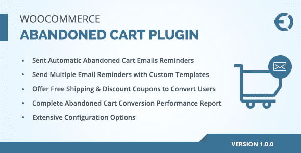
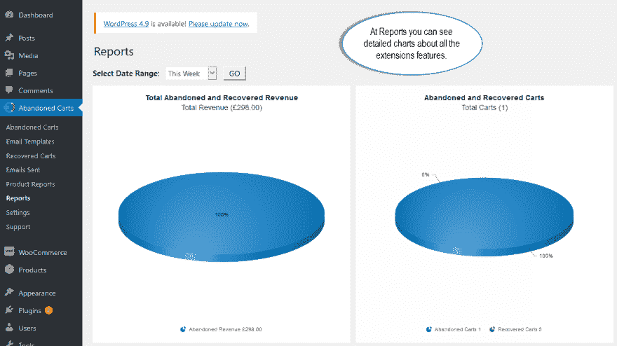
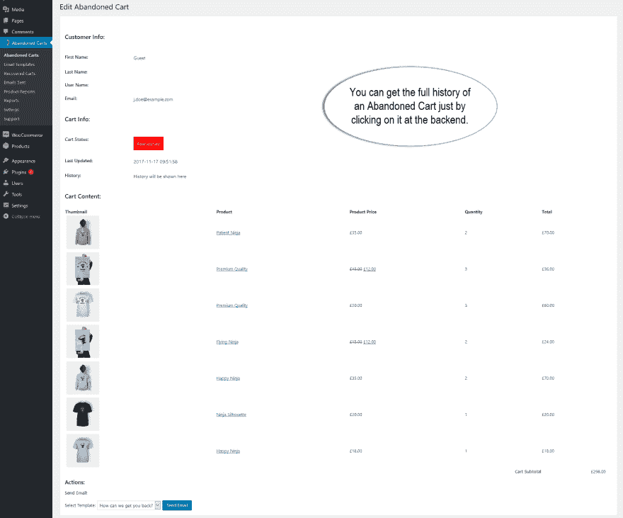
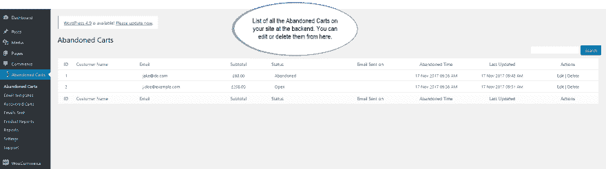

# WooCommerce 废弃的购物车插件

> 原文:[https://dev . to/carolynhall 123/woo commerce-abused-cart-plugin-1nb](https://dev.to/carolynhall123/woocommerce-abandoned-cart-plugin-1nb)

[T2】](https://res.cloudinary.com/practicaldev/image/fetch/s--quiRlBXy--/c_limit%2Cf_auto%2Cfl_progressive%2Cq_auto%2Cw_880/https://thepracticaldev.s3.amazonaws.com/i/6vg4atd4npubfjz1spne.png)

WooCommerce 废弃购物车插件帮助您向客户发送关于不完整购物车的自动电子邮件。您可以自定义电子邮件模板，如主题和正文内容，使其更有效。 **[WooCommerce 弃车](https://codecanyon.net/item/woocommerce-abandoned-cart-plugin/21032154)** 扩展还允许您在鼓励客户完成弃车的电子邮件中添加折扣券。这个有用的插件可以增加你的销售，你可以通过业绩报告评估成功率。
它只花了你 39 美元，你可以得到这个插件 100%退款保证。

**截图**

[T2】](https://res.cloudinary.com/practicaldev/image/fetch/s--IDlY6cRW--/c_limit%2Cf_auto%2Cfl_progressive%2Cq_auto%2Cw_880/https://thepracticaldev.s3.amazonaws.com/i/r92q8ovcm8t3l1s93vj8.png)

[T2】](https://res.cloudinary.com/practicaldev/image/fetch/s--yVuYz1Hd--/c_limit%2Cf_auto%2Cfl_progressive%2Cq_auto%2Cw_880/https://thepracticaldev.s3.amazonaws.com/i/pgyh3bfwslxdlcagd8ha.png)

[T2】](https://res.cloudinary.com/practicaldev/image/fetch/s--RctJLtuH--/c_limit%2Cf_auto%2Cfl_progressive%2Cq_auto%2Cw_880/https://thepracticaldev.s3.amazonaws.com/i/txsmjdcc1l07yayjlbeo.png)

[T2】](https://res.cloudinary.com/practicaldev/image/fetch/s--ZQHjAbmq--/c_limit%2Cf_auto%2Cfl_progressive%2Cq_auto%2Cw_880/https://thepracticaldev.s3.amazonaws.com/i/t5gzcgzs4uznqdvcishp.png)