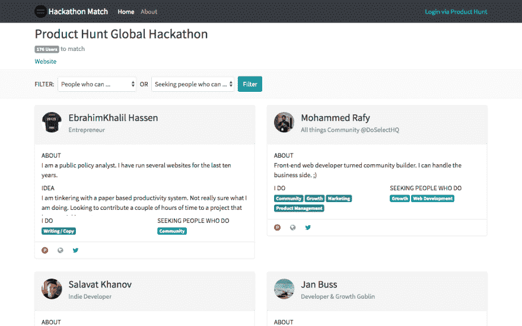
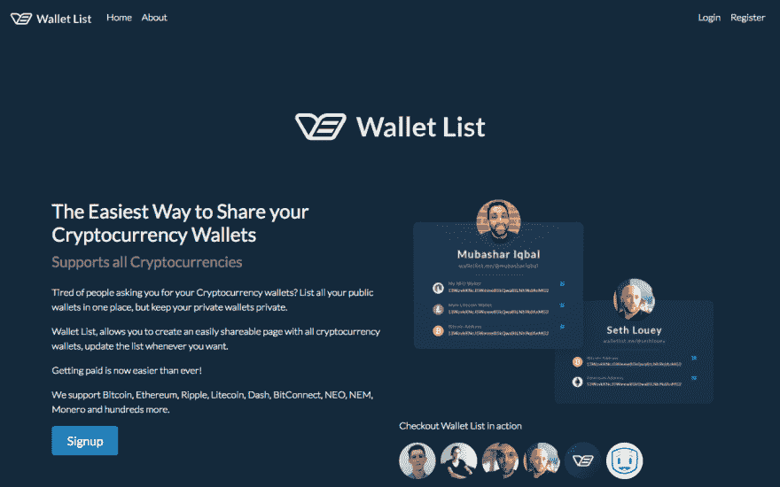
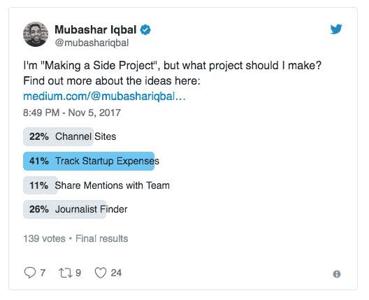
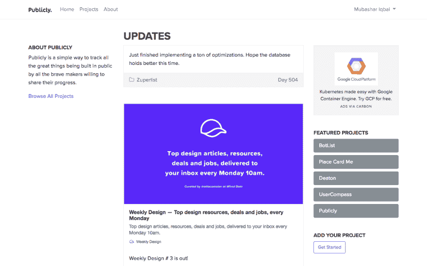
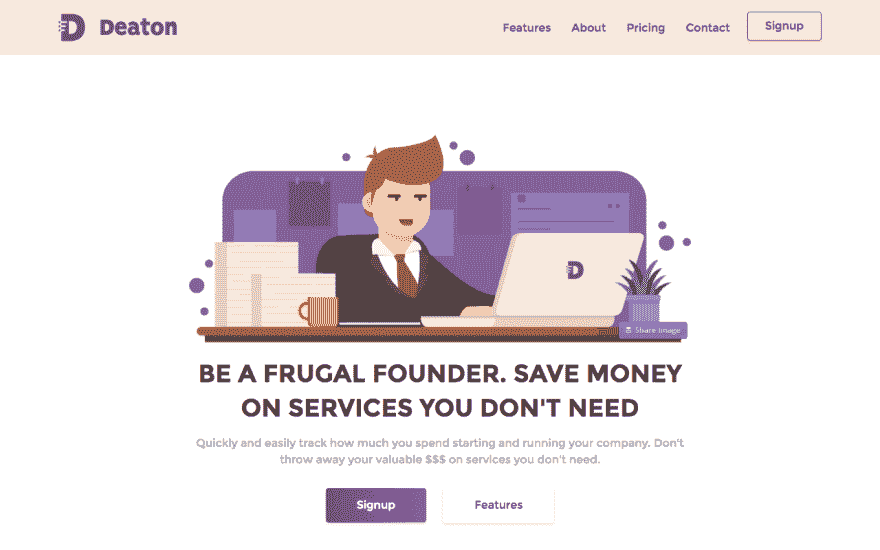

# 在 35 天内建立 4 个网站

> 原文：<https://dev.to/mubashariqbal/building-4-websites-in-35-days-3l11>

<small>*原载于[制作方项目](https://medium.com/makesideproject/building-4-websites-in-35-days-a3c46c09280b)。*</small>

十月底到十一月底对我来说是一段忙碌的时间，感谢 [Product Hunt](https://producthunt.com) (在[独立黑客](https://indiehackers.com)和其他人的帮助下)组织了一次伟大的黑客马拉松。

[T2】](https://res.cloudinary.com/practicaldev/image/fetch/s--BZguj3Hl--/c_limit%2Cf_auto%2Cfl_progressive%2Cq_auto%2Cw_880/https://cdn-images-1.medium.com/max/1600/0%2AtP855L5B18Jq1JP2.jpg)

## 十月二十六日:第一天

在黑客马拉松开始之前，我在想我是应该单干还是找一个团队参与其中。

当我读到关于黑客马拉松的消息，看到人们发推文和帖子说他们将会参加。我突然想到，没有一个地方列出所有想要参与的人，或者那些可能正在寻找其他团队成员加入他们项目的人。

所以我决定建造一些东西。黑客马拉松前的黑客马拉松。

因为我想为人们构建一些东西来组织黑客马拉松，这将在不到一周的时间内开始，所以我必须很快推出一些东西。

这将意味着保持事情非常简单，但仍然是一个有用的工具。

## 十月二十六日:第二天

经过一些深夜黑客攻击后，第二天我发起了黑客马拉松比赛。我写了这个过程:[为黑客马拉松制作东西](https://medium.com/makesideproject/hackathon-match-20f2427500f7)

很自然地，这个网站被贴在了[产品搜索](https://www.producthunt.com/posts/hackathon-match)上，在那里它做得相当好。它目前拥有 320 多张选票。

[T2】](https://res.cloudinary.com/practicaldev/image/fetch/s--4WsYlyMo--/c_limit%2Cf_auto%2Cfl_progressive%2Cq_auto%2Cw_880/https://cdn-images-1.medium.com/max/1600/0%2AAJ-21WKF0fW-YHXv.png)

超过 200 人在网站上发布了他们的个人资料，我相信这会为在黑客马拉松中寻找合作伙伴的人带来一些匹配。

在接下来的几天里，我对网站进行了改进和更新，以便将来可以用于其他黑客马拉松。一些组织者已经表达了兴趣，所以我期待看到它被用于其他黑客马拉松，甚至是未来的产品搜索黑客马拉松。

## 11 月 1 日:第 7 天

黑客马拉松终于开始了！

我决定和 Seth Louey 一起在加密货币领域做点什么。我们都对加密货币领域感兴趣，看看比特币会发生什么，谁不感兴趣。

我们注意到，向其他人发送加密货币是一个痛苦的过程，甚至是要求人们拿出钱包以便我们知道我们正在向正确的目的地发送资金的过程，因此我们决定解决这一部分。

WalletList 允许您轻松地建立和维护您希望接收加密货币的钱包列表。为了安全起见，一般建议不要将资金放在这些钱包中，而将它们转移到更安全的私人钱包中。

一旦你建立了你的列表，你可以很容易地与人分享你的页面，他们知道你想在哪里接收比特币或其他加密货币。

那天早上，Seth 在设计我们的产品 Wallet List 时做了一个现场直播。不幸的是，该流不再可用，但观看 Seth 设计我们的产品，并接受观众的实时反馈，这很酷。

我大部分时间都在做这个，但是当夜晚来临的时候，我投入到构建中，整合了 Seth 设计的东西。

Seth 和我把这次黑客马拉松当作一次常规的高强度黑客马拉松，而不是 Product Hunt 为我们计划的 30 天。我们工作到深夜，为第二天做好一切准备。

## 11 月 2 日:第 8 天

在黑客马拉松[的第二天，钱包清单](https://walletlist.me/)已经准备好发布。

[T2】](https://res.cloudinary.com/practicaldev/image/fetch/s--2TX1pW8T--/c_limit%2Cf_auto%2Cfl_progressive%2Cq_auto%2Cw_880/https://cdn-images-1.medium.com/max/1600/0%2AM9DoDcJImdsH7wL4.png)

您可以了解更多:[或者我应该在哪里向您发送加密货币？](https://medium.com/makesideproject/wallet-list-5e6dcacb7eb6)

已经有超过 200 人创建了钱包，当有人问我比特币钱包的地址时，我曾亲自使用过这个网站，我希望其他人也这样做过。

## 11 月 3 日-13 日 9-19 日

我将注意力转向了我的另一个黑客马拉松项目。我决定在年底前建立“另一个”大项目，并记录我的过程。我甚至不确定我要造什么，但我有一些想法。我在[媒体](https://medium.com/@mubashariqbal)上与读者分享了这些，并在[推特](https://twitter.com/mubashariqbal)上与我的粉丝分享了这些，请他们帮助我决定构建什么。

[T2】](https://res.cloudinary.com/practicaldev/image/fetch/s--IaZSb9ip--/c_limit%2Cf_auto%2Cfl_progressive%2Cq_auto%2Cw_880/https://cdn-images-1.medium.com/max/1600/0%2Ayo4xtMUSi94UiVxr.png)

在接下来的几天里，我经历了验证构建一个有助于跟踪启动费用的应用程序的想法、决定功能、规划网站、设计网站和开始构建的过程。

我创建了一个中型出版物，让所有的帖子都容易找到。

## 11 月 14 日:第二十天

大约一周前，丹尼尔·肯普(Daniel Kempe)联系了我们，讨论为黑客马拉松做些什么的可能性，但我们还没有决定做什么。我之前和丹尼尔一起制作过 [Quuu](https://www.quuu.co/) ，所以我知道我们只需要等待灵感来临时，我们就能做出非常酷的东西。

灵感在第 20 天出现。我们在很大程度上公开建造了 Quuu，而我则完全公开建造了 Deaton。我知道其他一些人，像皮特·里维斯(T1)、T2、弗雷德·里维特(T3)和 T4·塞思·路易(T5)都在公开创建自己的公司。我们都以不同的方式分享了我们的进步。一些人发推特，在 Dribbble 上发布照片，或者在 YouTube 上发布视频，在媒体上发布帖子。很难跟上每个人在做什么。

我想知道我们是否需要一个专门的网站来帮助人们发表文章，并让人们在公开场合跟踪他们建立的公司。由于我们正在进行黑客马拉松，其他人正在分享他们的进展，这似乎是测试这个想法的好时机。

## 十一月十六日:第二十二天

我已经为现在所谓的[公开](https://publicly.io/)的特性建立了一个坚实的基础，并且本着公开建立的精神，在 Medium 上的一个帖子中分享了我的计划:[公开建立](https://medium.com/makesideproject/building-in-public-dd3e88b166d8)

## 十一月二十六日:第三十二天

在过去的 10 天里，我一直在开发 Deaton 和 public，但是我觉得 public 现在已经准备好正式发布了。

我们不仅完成了设计和开发，我们还成功说服了 20 个人发布他们的项目并开始分享他们的进展。

[T2】](https://res.cloudinary.com/practicaldev/image/fetch/s--s5xbbLSH--/c_limit%2Cf_auto%2Cfl_progressive%2Cq_auto%2Cw_880/https://cdn-images-1.medium.com/max/1600/0%2AaeiKPGoqipxnL9vY.png)

我写了更多关于公开的内容:[公开构建](https://medium.com/makesideproject/publicly-fc70e7e9466f)

我们在[产品搜索](https://www.producthunt.com/posts/publicly)上发起了一个很大的反响。我们是当天的头号猎物，获得了 500 多张选票。

## 十一月二十九日:第三十五天

在黑客马拉松仅剩一天的时候，我能够在 [Deaton](https://www.deaton.io/) 上完成我想做的最后的修改。

[T2】](https://res.cloudinary.com/practicaldev/image/fetch/s--C4hT5JgE--/c_limit%2Cf_auto%2Cfl_progressive%2Cq_auto%2Cw_880/https://cdn-images-1.medium.com/max/1600/0%2AWowIxBKOXniXElaY.png)

Deaton 是一个非常简单的方法来跟踪你在开始或经营你的公司时发生的费用。它支持一次性或经常性费用。

我决定将 [Deaton](https://www.deaton.io/) 的正式发布推迟到结果公布之后，现在我们已经接近假期，可能要等到新年了。

## 向前看

我现在有 4 个项目，我对 2018 年非常兴奋。在接下来的几周里，我将制定明年的计划，决定我将专注于哪一项(或者全部)。

我喜欢酝酿多个项目，如果我不喜欢做一个特定的项目，我可以选择花一点时间在其他事情上，但仍然觉得自己很有效率。

最后，我要提一下，黑客马拉松给了我一个构建 bug。自从黑客马拉松结束后，我已经建立了一个小得多的站点集合，几乎不需要维护。我对加密货币领域感到非常兴奋，所以我建立了许多有趣的东西:[一个比特币值多少钱](http://www.howmuchisabitcoinworth.com/) -这是我在[观看足球比赛时建立的网站](https://medium.com/makesideproject/how-much-is-a-bitcoin-worth-7283a3f61206)，这也促使我建立了[以太坊值多少钱？](http://howmuchisaethereumworth.com/)和[有多少比特币？](http://www.howmanybitcoinsarethere.com/)

在那之后，我决定将加密货币的市值与其他金融资产进行比较，这可能是一个好主意，因此 [Cap Compare](http://capcompare.com/) 就是[诞生的](https://medium.com/makesideproject/cap-compare-84663a735bd8)。

非官方数据显示，我在 49 天内发现了 8 个地点，但是谁会去计算呢？

<small>*原载于[制作方项目](https://medium.com/makesideproject/building-4-websites-in-35-days-a3c46c09280b)。*</small>