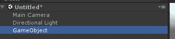
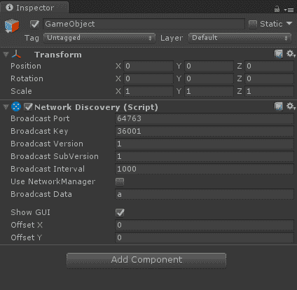
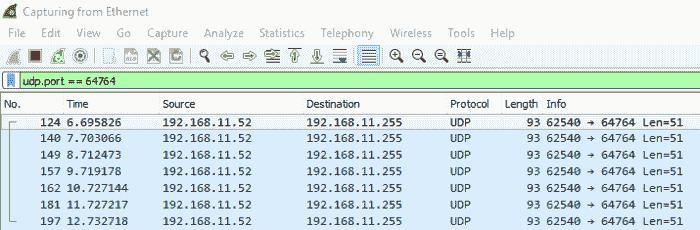
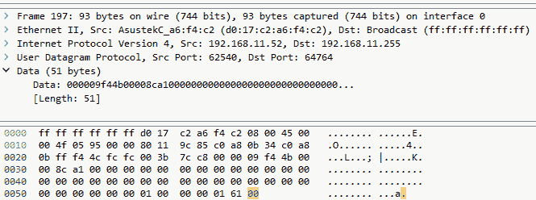
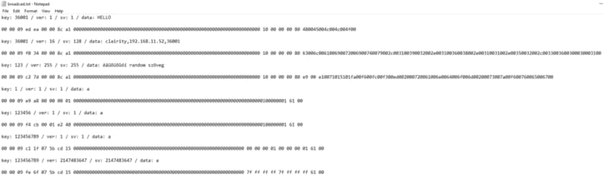
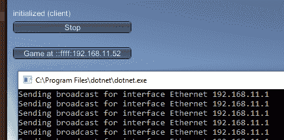

# 对 Unity 网络发现协议进行反向工程

> 原文:[https://dev . to/Tom zorz/reverse-engineering-the-unity-network-discovery-protocol-167 f](https://dev.to/tomzorz/reverse-engineering-the-unity-network-discovery-protocol-167f)

我正在做一个项目，其中. net 核心后端被用作服务器，为多个 Unity 客户端提供数据。为了简化 Unity 的开发和使用，如果我们能使用内置的网络发现模块就太好了，所以我就这么做了。

### 第一步:如何在 Unity 中工作 [#](#first-steps%3A-how-it-works-in-unity)

点击次数点击:[新建项目]，[新建>创建空项目]，[添加组件]，[网络发现]。点击播放按钮后，我们会看到一个简单的 GUI，允许我们开始播放或收听。

<figure>[](https://res.cloudinary.com/practicaldev/image/fetch/s--Xu5vRyMD--/c_limit%2Cf_auto%2Cfl_progressive%2Cq_auto%2Cw_880/https://shoreparty.org/img/1_ty4q3ju6ljqK1Mw5TuBdzQ.png) 

<figcaption>我喜欢危险地生活，我甚至没有保存场景</figcaption>

</figure>

<figure>[](https://res.cloudinary.com/practicaldev/image/fetch/s--A7bbWfko--/c_limit%2Cf_auto%2Cfl_progressive%2Cq_auto%2Cw_880/https://shoreparty.org/img/1_COW7aP8fFe8V84o4QwQx2A.png) 

<figcaption>为什么我不能持有所有这些字段？</figcaption>

</figure>

我注意到该组件的末尾写着“(脚本)”，所以让我们在使用 Wireshark 之前检查一下。单击小[cog]图标并选择[edit script]不会产生任何结果，因为它已被编译到 UnityEngine.Networking.dll 中。幸运的是，快速搜索得到了源的结果，我们可以看到 StartAsServer 方法调用了 NetworkTransport。StartBroadcastDiscover 方法。再稍微搜索一下，找到[网络传输源](https://github.com/MattRix/UnityDecompiled/blob/master/UnityEngine/UnityEngine.Networking/NetworkTransport.cs) *以及兔子洞有多深。*

```
[GeneratedByOldBindingsGenerator]
[MethodImpl(MethodImplOptions.InternalCall)]
private static extern bool StartBroadcastDiscoveryWithoutData(int hostId, int broadcastPort, int key, int version, int subversion, int timeout, out byte error); 
```

<svg width="20px" height="20px" viewBox="0 0 24 24" class="highlight-action crayons-icon highlight-action--fullscreen-on"><title>Enter fullscreen mode</title></svg> <svg width="20px" height="20px" viewBox="0 0 24 24" class="highlight-action crayons-icon highlight-action--fullscreen-off"><title>Exit fullscreen mode</title></svg>

### 嗯，Wireshark 就是……[#](#well%2C-wireshark-it-is%E2%80%A6)

选择您的主网络接口，并输入 udp.port == 64764 作为过滤器，以匹配组件中指定的端口。如果您现在开始在 Unity 中广播，您将看到以下内容:

<figure>[](https://res.cloudinary.com/practicaldev/image/fetch/s--1LJQPFYh--/c_limit%2Cf_auto%2Cfl_progressive%2Cq_auto%2Cw_880/https://shoreparty.org/img/1_eoII0XQwUsiGAkCI8PXjIw.png) 

<figcaption>数据包，每秒一个，如上所述</figcaption>

</figure>

选择任何数据包并打开数据部分，会向我们展示有趣的东西:

<figure>[](https://res.cloudinary.com/practicaldev/image/fetch/s--OfSn6ZAw--/c_limit%2Cf_auto%2Cfl_progressive%2Cq_auto%2Cw_880/https://shoreparty.org/img/1_2f2PJusbufJsA5Zz8MhKqA.png) 

<figcaption>我们不关心前 4 件事，除了记下子网广播地址:192.168.xxx.255</figcaption>

</figure>

### 我们需要更多的数据 [#](#we-need-more-data)

让我们再次打开 Unity，开始改变值，看看数据字节会发生什么。经过一些变化后，我得到了下面的文本文件:

<figure>[](https://res.cloudinary.com/practicaldev/image/fetch/s--7YegYtxk--/c_limit%2Cf_auto%2Cfl_progressive%2Cq_auto%2Cw_880/https://shoreparty.org/img/1_BYLc2r0jM1_-v8KOtgKzdQ.png) 

<figcaption>关键，版本，颠覆，数据(以防不清楚)</figcaption>

</figure>

我们可以立即看到模式出现:

*   所有的样本中间都有一串零

*   所有样本都从[0x00 0x00 0x09]开始

*   数据字段在末尾，因为开头看起来足够相似

通过一点点尝试和错误，不难发现这一切:

1.  我们从提到的[0x00 0x00 0x09]序列开始

2.  插入两个随机字节，它们在广播会话中保持不变(因此，如果您除了重新开始广播之外什么也不改变，它们将会不同)

3.  密钥整数以 4 个字节的形式出现，使用 windows 默认的反向字节顺序。

4.  我们看到 8 个 4 字节的零块，可能是未来的字段

5.  我们在相同的逆序 4 字节上有版本整数

6.  我们用同样的方法得到 subversion 整数

7.  最后我们看到数据字符串，ASCII 编码，每个字符之间有一个 0x00 字节

用 C#复制这一点非常简单，几个字节数组、一点 LINQ 和一个位转换器——[这里是. net 核心控制台应用程序](https://gist.github.com/tomzorz/4ee9a03af84d2e83056b6a7acedcd16e)的 GitHub 要点。

为了确保我们做的一切都是正确的，让我们来看看实际情况:

<figure>[](https://res.cloudinary.com/practicaldev/image/fetch/s--Y4KkzVOo--/c_limit%2Cf_auto%2Cfl_progressive%2Cq_auto%2Cw_880/https://shoreparty.org/img/1_KTYBKc1CK0XKzkgmUqj4NQ.png)

<figcaption>【o/</figcaption>

</figure>

我希望这是对网络协议逆向工程的一点介绍，也有助于与 Unity 的交互。