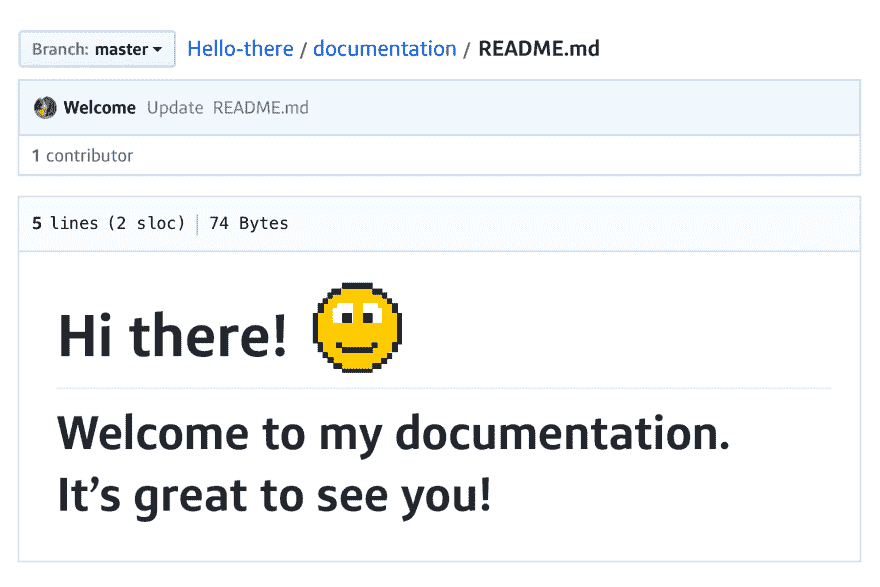

# 客座博文:Capital One 开发者体验

> 原文:[https://dev . to/wired ferret/guest-post-capital-one-developer-experience-15ka](https://dev.to/wiredferret/guest-post-capital-one-developer-experience-15ka)

我最近有机会为 Capital One DevEx 博客写了一篇关于 API 好客的文章。能够把一篇演讲改写成一篇文章，让人们更容易参考，这总是件好事。

[T2】](https://ecm.capitalone.com/DevPortal/asseimg/community/blog/hospitality_header.png)

欢迎 API 文档