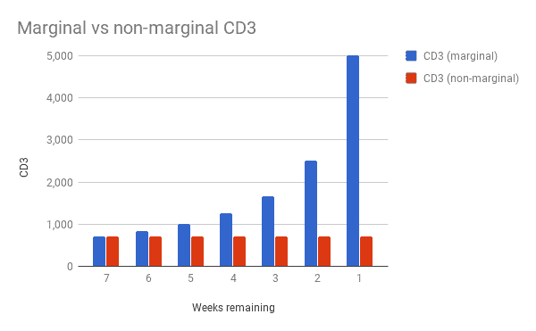
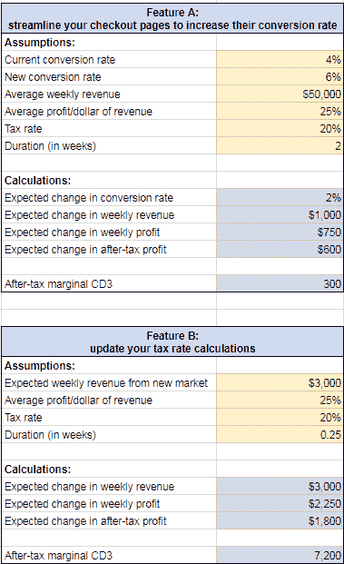
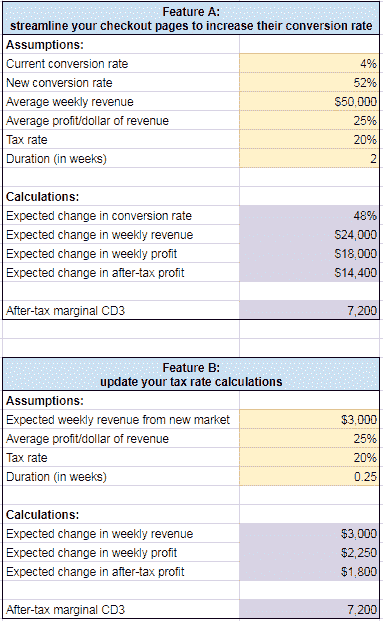

# 延误成本:如何计算延误的定量成本和 CD3

> 原文:[https://dev . to/bosepchuk/cost-of-delay-how-to-calculate-quantitative-cost-of-delay-and-cd3-6ho](https://dev.to/bosepchuk/cost-of-delay-how-to-calculate-quantitative-cost-of-delay-and-cd3-6ho)

在我的上一篇文章中，我向您介绍了[延迟的定性成本和 CD3](https://smallbusinessprogramming.com/cost-of-delay-prioritize-your-product-backlog-by-cd3/) 。我认为 rational 团队应该为了最大的经济利益而排序他们的待办事项，并且你可以使用延迟成本除以持续时间(CD3)来做到这一点。因为软件开发人员不是会计师，我在我的例子中使用了更容易理解的 ***定性*** 延迟成本和 CD3。但是在这篇文章中，我将讨论转换到 ***的优势，定量*** 延迟的成本。

我知道这些东西没有阅读人工智能的最新进展或你最喜欢的框架有趣。但是相信我，当我说学会用量化的 CD3 来排序你的待办事项将会帮助你把你的效率提升到一个新的水平。

### 为什么要计算延误的定量成本？

*延迟的定性成本*只是给我们一个无单位的分数。这是对一个故事的紧迫性和价值的粗略衡量。当你把它除以持续时间，你可以用它来粗略地排序你的待办事项，但仅此而已。*定量的 CD3* 比*定性的 CD3* 更准确，这是一个巨大的好处。但这仅仅是你可以用延迟的量化成本做些什么的开始。

#### 使用延迟的量化成本做出更好的权衡

您可以使用延迟的量化成本来对您的团队每天做出的数百个大大小小的权衡决策做出理性的决策。

例如，最好是:

*   今天发布一个新版本的软件还是花一个月的时间来修复漏洞？
*   雇用另一个软件开发人员或与现有人员合作？
*   现在重构一个混乱的模块还是留待下次？
*   更新稍有误导性的变量名，以便下一个人更容易阅读代码，还是放弃它？
*   让您的员工保持忙碌，还是降低他们的利用率并专注于减少周期时间？

你可以用延迟的量化成本来帮助你回答这类问题，甚至更多。我计划在以后的文章中告诉你如何做到这一点。

#### 讲商业语言

金钱是商业语言。如果你想让你的想法和改变得以实现，向你公司的决策者展示你的想法的经济效益。

想解决一些技术债务吗？向他们展示不解决这个问题会让你的公司付出多大的代价。想买些软件让东西跑得更快吗？给他们看看数字。想花些时间提高您的安全性吗？给他们看看影响。

### 如何计算延误的定量成本

好吧，那么你实际上如何计算延误的定量成本呢？简单的回答是，你**计算你的潜在行动对税后生命周期利润**的边际影响。

不要惊慌。我保证事情没有听起来那么糟。我将为你把它分成几个小步骤。首先，我要给你一些一般性的建议。然后我会给你们看一些例子。

#### 与贵公司的专家合作，帮你计算延迟的成本

你可能需要一个伙伴来帮你解决这个问题。这可能是产品所有者，会计部门的人，或者对你的项目经济学有专门知识的人。商务人士习惯于用美元和美分来思考，一旦你解释了你要做的事情，你应该不会有太多的麻烦来让他们帮助你。

#### 使用适当程度的努力和严谨

与在你的公司博客上添加时事通讯注册表格相比，你需要在为一架新的战斗机开发所有软件的延迟成本计算上有不同的严格程度。

运用常识，当你有足够好的答案时就停止。例如，如果你的待办事项列表中的前三个故事的 cd3 比你的待办事项列表中的其他故事大几个数量级，你现在可能不需要分析那些其他的故事。

在大多数情况下，一个故事对税后生命周期利润的边际影响将主要由几个因素驱动。这意味着你可以用简单的模型得到足够好的答案。

提示:您可以使用[约束理论](https://smallbusinessprogramming.com/theory-of-constraints-10x-programmers/)来引导您找到潜在的有价值的故事，这些故事通常与您的系统约束有关。

#### 使用电子表格

如果您在电子表格中构建延迟成本模型，并明确您的假设，您会发现随着新信息的出现，更新和更改您的假设会更容易(参见下面的示例)。

#### 边际经济学的重要性

你只想考虑会随着你的决定而改变的成本和利润。很多人，甚至是商人，都会在这里犯错误。人们犯的最大错误是当他们考虑“沉没成本”时。沉没成本是你已经发生的成本(或者你还没有发生但你无法避免的成本)。

让我们看一个简单的例子。如果你已经在一个功能上工作了五个星期，还有两个星期，那么前五个星期就是沉没成本。随着时间的推移，这会对你的 CD3 产生有趣的影响。如果假设延迟的固定成本为每周 5，000 美元，那么 CD3 可能为 5，000 美元/7 周= 714。项目进行了五周，你只剩下两周，所以计算结果是这样的:5000 美元/两周= 2500 美元。随着剩余时间的减少，您的 CD3 分数将接近无穷大。

仔细想想，这是有道理的。你会搁置一个每周能赚 5000 美元税后利润、一个小时就能完成的功能吗？我不会(除非另一个故事有更高的 CD3)。让我们算出 CD3。一周工作 40 小时中的一小时= 0.025。所以，5000 美元/.025 = 20 万。这与你计算非边际 CD3 时得到的 CD3 714 是非常不同的答案。

这是以图形方式显示的相同数据(CD3 随着剩余持续时间的减少而增加)。

[T2】](https://res.cloudinary.com/practicaldev/image/fetch/s--zMUDDFUY--/c_limit%2Cf_auto%2Cfl_progressive%2Cq_auto%2Cw_880/https://thepracticaldev.s3.amazonaws.com/i/86a0xpdq1bmftjeww5vb.png)

#### 生命周期利润与现金流

当您计算延迟的定量成本时，大多数时候您应该对生命周期利润感兴趣。然而，有些情况下现金流更重要。增长率极高的公司或为生存而战的公司可能更需要担心现金流，而不是生命周期利润。

如果你在这种情况下，明智的做法是牺牲一些长期盈利能力，以确保你能够履行短期财务义务(如制作工资单和支付供应商)。你可能知道自己是否处于这种情况，但如果你不确定你公司的任何业务类型肯定知道答案。根据需要调整延迟成本的计算，以满足公司的目标。

### 计算延误和 CD3 的定量成本的例子

假设您在一家电子商务网站工作，您正在考虑两个新功能，并且您想使用定量 CD3 来确定哪个功能具有更高的优先级:

*   特点 A:简化你的结帐页面，以提高其转化率。
*   功能 B:更新您的税率计算，这样您就可以用不同的税率拓展新的市场。

我做了一个电子表格来计算延迟和 CD3 的成本。看起来是这样的:

[T2】](https://res.cloudinary.com/practicaldev/image/fetch/s--JFcJIHa9--/c_limit%2Cf_auto%2Cfl_progressive%2Cq_auto%2Cw_880/https://thepracticaldev.s3.amazonaws.com/i/10pjrta8or7t7ovr77rm.PNG)

在我使用的假设中，特征 A 的 CD3 值为 300，特征 B 的 CD3 值为 7，200。因此，如果每个人都同意这些假设，你应该首先研究特性 B。

但是，每个人可能都不同意。如果是这样的话，你可以很容易地调整你的假设(黄色单元格)，看看它们如何影响你的结果(紫色单元格)。软件开发人员已经熟悉估计持续时间。这只是那个想法的一个小小的延伸。

你也可以采取另一种方法。您可能会问，要使功能 A 的 CD3 分数与功能 B 的 CD3 分数相同，功能 A 的对话率需要提高多少？让我们看看那是什么样子。

[T2】](https://res.cloudinary.com/practicaldev/image/fetch/s--YKBG4_zV--/c_limit%2Cf_auto%2Cfl_progressive%2Cq_auto%2Cw_880/https://thepracticaldev.s3.amazonaws.com/i/8ay2ht93z488m3unsvoc.PNG)

我输入了几个“新转换率”的值，发现它必须是 52%，才能与功能 b 具有相同的 CD3 分数。我从未听说过长期电子商务网站的转换率为 52%。所以，我敢说功能 B 比功能 a 优先级更高。

### 包装完毕

我知道你可能对花时间计算延误成本和 CD3 不感兴趣。但是你的团队将很难有效率，除非有人在做这件事，你会发现通过一点点的练习也会变得更容易。我们寻找和处理最有价值的东西的直觉还不足以即兴发挥。如果你花些时间量化高优先级待办事项的延迟成本，你会对你的发现感到震惊。

在本系列的下一篇文章中，我将向您展示如何处理其紧迫性随时间变化的故事。敬请关注。

*同意、不同意、意见或问题？我很乐意收到你的来信。*

### 附加资源

您可能会发现以下延迟成本资源很有帮助:

*   优秀的[网站](http://blackswanfarming.com/cost-of-delay/)有一个很棒的三分钟解说视频
*   书:“产品开发流程的原则:第二代精益产品开发”(唐纳德·赖纳森)第二章
*   书:《基本 Scrum:最流行敏捷过程的实践指南》(肯尼斯·鲁宾)第 16 章
*   Donald Reinertsen 关于产品开发的[演讲视频](https://youtu.be/L6v6W7jkwok)