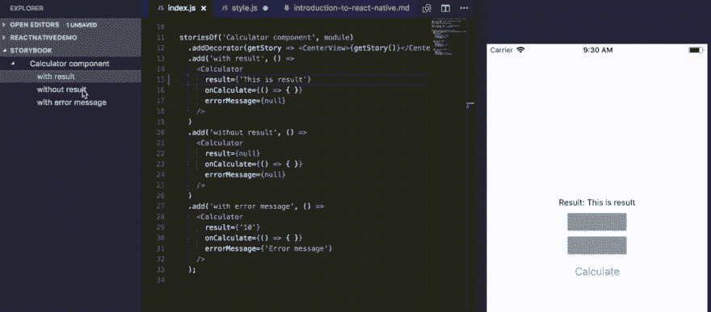
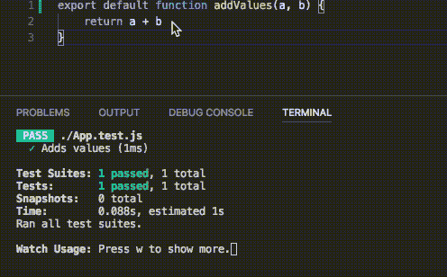
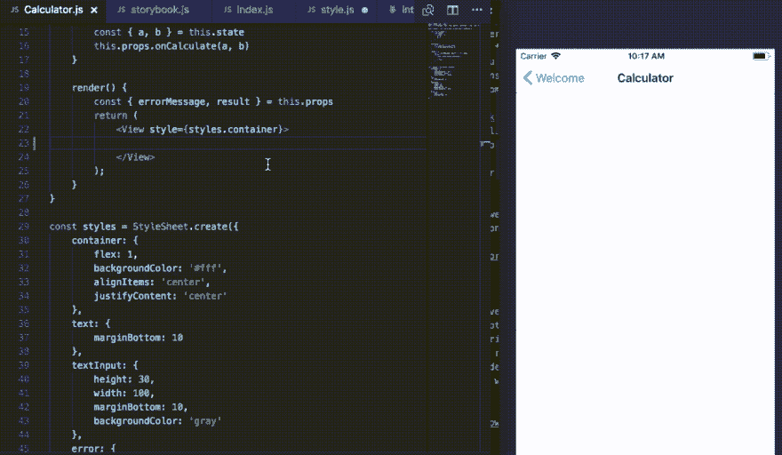

# React Native -作为移动开发人员，改进工作流程的 4 个步骤

> 原文:[https://dev.to/brightdevs/react-native-移动开发者改进工作流程的四个步骤-c6n](https://dev.to/brightdevs/react-native---4-steps-to-improve-your-workflow-as-a-mobile-developer-c6n)

[T2】](https://res.cloudinary.com/practicaldev/image/fetch/s--b-LfHROU--/c_limit%2Cf_auto%2Cfl_progressive%2Cq_auto%2Cw_880/https://thepracticaldev.s3.amazonaws.com/i/b9e4wobt7qwhlqyrsx8l.jpeg)

“开发人员需要工具来支持他/她的工作流，以充分发挥生产力”。嗯，我想这句话适用于你能想到的任何职业。对我来说，感觉到我工作的环境真的支持我的流程，并与我的软件开发方法很好地合作，这真的很重要。这就是为什么，今天我想分享一些在 React Native 中创建移动应用程序时提高我工作效率的事情。

下面的列表是由来自原生 iOS 背景的开发人员准备的。如果你有 web 背景，那么这些东西对于一个纯移动体验的开发者来说，不会有那么大的革命性。；)

## 1。[打字稿](https://www.typescriptlang.org/)

如果你的背景是 Swift、Kotlin 或其他“移动”语言的开发，并且你转向了 JavaScript 领域，那么如果你错过了 Swift/Kotlin 在 IDE 中的支持，或者只是想再次使用强类型语言，我不会感到惊讶。“可伸缩的 JavaScript。”-这是您在进入 TypeScript 主页时会发现的语句。TypeScript 是 JavaScript 的一个超集，它允许你实现更好的代码完成，强类型，给你的代码添加接口等等。但是，您必须记住，TypeScript 不会强迫您立即适应新的编码约定。如何配置由您决定。最终，输出会比编写纯 JavaScript 更令人愉快。

不要害怕尝试 TypeScript。它被转换成 JavaScript 代码，看起来与您编写的类型脚本非常相似，所以如果您对结果不满意，您可以随时返回到您的纯 JavaScript(剧透:您不会的)。

## 2。[故事书](https://github.com/storybooks/storybook)

我再怎么强调我有多爱故事书都不为过。这个工具本身可以极大地改善应用程序 UI 部分的工作流。Storybook 允许你创建故事，在故事中你用数据准备预先填充的 UI 元素，这些数据可能在正常的应用程序生命周期中出现。稍后，您可以在几秒钟内轻松浏览您描述的所有故事，并查看它们在您的设备/仿真器上的外观，而不需要在普通应用流程中浏览所有这些状态，这需要花费很长时间。

这是一个小例子，但是如果你开发一个普通的应用程序，你肯定会有更多这样的例子，它们可能会覆盖你的组件所有可能的 UI 状态。

[T2】](https://res.cloudinary.com/practicaldev/image/fetch/s--Du9A0PIi--/c_limit%2Cf_auto%2Cfl_progressive%2Cq_66%2Cw_880/https://thepracticaldev.s3.amazonaws.com/i/x92wiftf22kguq3otbdn.gif)

## 3。快速测试

如果您以前做过原生移动开发，那么您可能习惯于为了运行测试而切换您的目标，并且您肯定会知道它们没有您可能希望的那样快。这可以在切换到 JavaScript 或 TypeScript 开发时进行更改。如果您的应用程序增长，很容易猜测测试不会在几毫秒内运行，但在您保存文件后的 1-3 秒内得到结果仍然是正常的。这允许您在开发应用程序时保持测试运行，并在您更改导致问题的代码时发现任何问题。这也鼓励你写更多的测试，因为你知道，测试运行人员会尽最大努力帮助你。

[T2】](https://res.cloudinary.com/practicaldev/image/fetch/s--f1GB7kmu--/c_limit%2Cf_auto%2Cfl_progressive%2Cq_66%2Cw_880/https://thepracticaldev.s3.amazonaws.com/i/r4j7yuhe4ta922nf5c4k.gif)

## 4。分工

作为第一个客户，能够轻松地使用应用程序中的独立 UI，并使用测试处理逻辑代码，可以极大地提高您的工作效率。你将会得到更快的反馈循环和独立创建的组件，这将会使以后共享它们变得更容易。当您准备好 UI 组件和逻辑以供使用时，剩下的唯一事情就是最终将它们集成到主应用程序中。这项任务也将得到简化，因为您可以利用热重新加载功能，并受益于这样一个事实，即您不必等待您的应用程序重新编译，以检查您的工作结果。更好的是，你可以在 Android 和 iOS 设备上快速地检查这一点。

[T2】](https://res.cloudinary.com/practicaldev/image/fetch/s--MWsJnnwM--/c_limit%2Cf_auto%2Cfl_progressive%2Cq_66%2Cw_880/https://thepracticaldev.s3.amazonaws.com/i/oi5ig7zrd0p5ba3mkwu2.gif)

有哪些事情可以改善你的工作流程？我很高兴听到他们的消息！

最初发布于 [brightinventions.pl](https://brightinventions.pl/blog/)

由 Eliasz Sawicki，软件工程师@光明发明
[博客](http://eliaszsawicki.com/)，[推特](https://twitter.com/EliSawic?lang=en)