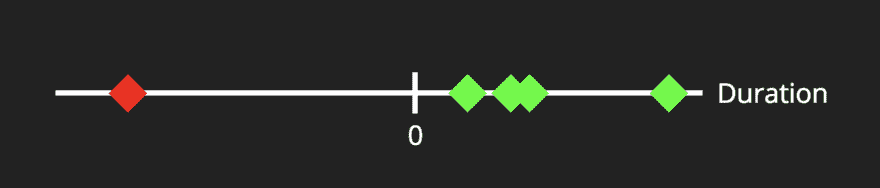

# 监控数据科学应用中的数据质量

> 原文:[https://dev . to/fros nerd/monitoring-data-quality-in-data-science-applications-3 h8](https://dev.to/frosnerd/monitoring-data-quality-in-data-science-applications-3h8)

## 简介

处理数据并不容易。通常情况下，您没有所需的可用数据。但即使如此，新的挑战已经在等待着。这些挑战可能因项目阶段、数据源和数据源的不同而不同，并且取决于您的技术堆栈。

在这篇博文中，我们将进一步探讨与*数据质量*相关的挑战。数据质量如何影响您的结果？你如何衡量它？怎么才能改善呢？我前段时间发表的一个 Spark 包会回答其中的一些问题:[醉酒数据质量](https://github.com/FRosner/drunken-data-quality)。它提供了在项目生命周期的不同阶段测量和监控数据质量的帮助功能。

如果您不熟悉 [Apache Spark](https://spark.apache.org) ，也不用担心。下一节中介绍的概念适用于任何数据驱动的软件解决方案。代码是用 Scala 写的，但是任何有一点编程经验的人都应该可以理解。

## 处理数据

### 任务

在开发新的数据驱动应用程序或解决方案之前，您通常需要评估方法的可行性。将会有一个初始的原型或研究，在那里你会收到对你的应用很重要的数据集(或样本)的一次性交付。

然后你最有可能去探索数据，了解里面是什么，它的特征是什么。这可以通过使用描述性统计、数据可视化、无监督学习方法等技术来实现。

如果第一项研究是成功的，建立更复杂的工作流程和过程是有意义的。数据将通过批处理或流式方式连续传送。由于开发的代码可能会存活几个星期以上，您开始修改持续集成、交付和部署等主题。

### 挑战

在每个阶段，对于任何与数据相关的任务，您都可能面临不同的挑战。

读取数据时，有不同的文件格式和结构。也许您通过 ETL 过程从一个数据源获得 CSV 文件，从另一个数据源获得日志文件，按行结构化的 [Avro](https://avro.apache.org/) 文件，或者按列结构化的 [Parquet](https://parquet.apache.org/) 。如果负责数据源的部门考虑了分析，您可能能够直接查询生产数据库的只读副本。

如果数据是非结构化或半结构化的，解析它会很有用。您需要考虑字符编码、分隔符、日期格式等等。是否有任何缺失值？它们是如何编码的(`null`、`"NA"`、`"-"`、`"--"`、`""`、`" "`)？你想怎么处理他们？

在您设法将数据转换成正确的格式和结构以便进行分析之后，您必须考虑语义约束。哪些客户 id 是有效的？一个人的年龄可以是负数吗？允许重复吗？重复是如何定义的？两个表之间有联系吗？它们是如何建模的(例如外键)？

### 代码

您拥有的数据源越多、越丰富，面临的挑战就越复杂、越多。为了应对复杂性，我们编写代码，使用库和工具。数据解析、提取和验证的典型查询包括:

```
awk -F "\"*,\"*" '{print $3 $1}' contracts.csv 
```

```
sed 's/\(\([^,]\+,\)\{1\}\)[^,]\+,\(.*\)/\1\3/' flights.csv 
```

```
SELECT TRIM(name), age
FROM customers
WHERE age > 0 AND age < 150 
```

```
val distinctBefore = base.distinct.count
val join = base.join(ref, joinColumns)
val matchingRows = join.distinct.count
val matchPercentage = matchingRows.toDouble / distinctBefore 
```

前两个例子处理数据，而另外两个例子试图检查某些约束或假设。我们在 shell 中运行这些转换和检查，或者在像 [Jupyter](http://jupyter.org/) 或 [Zeppelin](https://zeppelin.apache.org/) 这样的笔记本中运行，或者在预定的工作流程中运行。

## 数据质量

### 定义

数据质量被定义为对结果有影响的数据的不同方面。

#### 方面的数据

*   正确性(客户年龄是否正确？)
*   完整性(我的所有客户都在数据库中吗？)
*   精度(我的温度传感器有多大的容差？)
*   可靠性(承诺的约束是否适用于所有数据点？)
*   一致性(不同表格中测量距离的单位是否相同？)
*   可访问性(数据可供我访问吗？)
*   相关性(表格包含回答我的问题所需的信息吗？)
*   不变性(下次我重新运行我的分析时，数据会是相同的吗？)
*   ...

#### 对结果的影响

*   正确性(计算出的年龄段是否正确？)
*   完整性(我是否致电了所有需要致电的客户？)
*   准确性(我对加热的输入准确吗？)
*   可靠性(我的结果会一直保持承诺的质量吗？)
*   一致性(对于不同的交通工具，我的预计到达时间是相同的单位吗？)
*   可访问性(客户能访问结果吗？)
*   相关性(我的预测有助于解决我的业务问题吗？)
*   再现性(下次重新运行分析时，结果是否相同？)
*   ...

或者总结为:垃圾输入，垃圾输出(GIGO)

### 举例:取消合同

让我们看一个实际的例子。想象你是一个手机服务商。您将合同数据存储在一个数据库中，并从中提取了以下存储合同信息的快照表:

| 田 | 类型 |
| --- | --- |
| `ContractID` | `String` |
| `CustomerID` | `String` |
| `StartDate` | `Date` |
| `EndDate` | `Date` |
| `DataVolumeMB` | `Int` |
| `MonthlyPriceCent` | `Int` |

现在，您想预测尚未取消的新客户的合同期限。为了获得训练数据集，您可以执行以下步骤:

1.  筛选出尚未结束的现有合同
2.  工程师目标变量`ContractDuration` = `EndDate` - `StartDate`
3.  工程特征变量，可能与客户表连接
4.  训练回归模型以预测持续时间

什么会出错？嗯，有几件事。现在让我们只看看设计目标变量`ContractDuration` = `EndDate` - `StartDate`的步骤。

*   如果没有定义`StartDate`会怎么样？
*   如果`StartDate` > `EndDate`会怎么样？

[T2】](https://res.cloudinary.com/practicaldev/image/fetch/s--qbHwJuaQ--/c_limit%2Cf_auto%2Cfl_progressive%2Cq_auto%2Cw_880/https://thepracticaldev.s3.amazonaws.com/i/s8dimjv60avsxw8hoslg.png)

如果您之前没有考虑这些问题，您的模型可能会因为糟糕的数据质量而被负合同期限打乱。你应该写下这些假设，把它们写在代码中，并在每次收到新数据时检查它们。那么你应该考虑一个策略来减轻质量问题。大多数情况下，丢弃坏的数据点就足够了，但是您可能还想纠正它们。

问题是，如何表达您对这个特定数据集的数据质量的定义(例如，结束日期应该总是大于开始日期)？我们能不能以一种既能记录又能自动检查的方式写下我们对数据的假设？我们能否在最初的研究阶段采用一种有效的方法，在这一阶段，快速的结果至关重要，但在随后的高效、有计划的工作流程中，将质量检查与我们的监控和警报系统连接起来？

答案是*是的*！

## 醉酒数据质量

*[醉酒数据质量](https://github.com/FRosner/drunken-data-quality) (DDQ)是一个用于检查 Spark 数据结构约束的小库。它可用于确保一定水平的数据质量，尤其是在发生连续导入时。*

### 用法举例

我们正在启动我们的 Spark shell，指定我们想要使用 DDQ 包。

```
spark-shell --packages FRosner:drunken-data-quality:4.1.1-s_2.11 
```

现在让我们定义两个虚拟表。

```
case class Customer(id: Int, name: String)
case class Contract(id: Int, customerId: Int, duration: Int)

val customers = spark.createDataFrame(List(
  Customer(0, "Frank"),
  Customer(1, "Alex"),
  Customer(2, "Alex")
))

val contracts = spark.createDataFrame(List(
  Contract(0, 0, 5),
  Contract(1, 0, 10),
  Contract(0, 1, 6)
)) 
```

最后，我们将对它们进行一些约束。

```
import de.frosner.ddq.core._

Check(customers)
  .hasNumRows(_ >= 3)
  .hasUniqueKey("id")
  .run()

Check(contracts)
  .hasNumRows(_ > 0)
  .hasUniqueKey("id", "customerId")
  .satisfies("duration > 0")
  .hasForeignKey(customers, "customerId" -> "id")
  .run() 
```

结果将显示在控制台上。

> **检查[id: int，name: string]**
> 
> 它总共有 2 列和 3 行。
> 
> *   *成功*:行数满足(计数> = 3)。
> *   *成功*:列 id 是一个键。
> 
> 正在检查[id: int，customerId: int...1 更多字段]
> 
> 它总共有 3 列和 3 行。
> 
> *   *成功*:行数满足(计数> 0)。
> *   *成功*:列 id、customerId 是一个键。
> *   *成功*:满足约束持续时间> 0。
> *   *成功*:列 customerId- > id 定义了一个指向引用表[id: int，name: string]的外键。

### 特性

DDQ 由约束、跑步者和记者组成。首先，在数据上定义一个或多个约束。然后，您选择将处理约束结果的记者。最后，将两者都传递给运行程序，运行程序将对数据运行约束。更多详情请参见[官方文档](https://github.com/FRosner/drunken-data-quality/wiki/Drunken-Data-Quality-4.1.1)。

目前支持以下类型的约束:

*   列约束(例如 null、日期格式、正则表达式)
*   表约束(例如行数、唯一键)
*   关系约束(例如，外键、可连接性)
*   用户定义的约束

您可以向以下报告者报告您的约束结果:

*   控制台(例如从火花壳)
*   降价(例如，将报告存储在文件中)
*   齐柏林飞艇(来自[阿帕奇齐柏林飞艇](https://zeppelin.apache.org)笔记本)
*   Log4j(例如，当使用 Kibana 进行质量监控时)
*   电子邮件(例如用于直接警报)

此外，约束结果将从流道返回，因此可以通过编程访问它们。

如果您喜欢使用 PySpark，也可以使用 Python API([pyddq](https://pypi.python.org/pypi/pyddq/4.1.1))。然而，Scala API 更加强大，也更加可定制。

## 提高数据质量

“如果我们不知道数据应该是什么样子，我们就不知道它是对还是错。” - [当坏数据发生在好公司身上](https://www.sas.com/content/dam/SAS/en_us/doc/whitepaper1/bad-data-good-companies-106465.pdf)

定义和衡量数据质量是成功的数据驱动应用程序的关键步骤。衡量数据质量后，下一个合乎逻辑的步骤是努力避免它。但是如何提高数据质量呢？

1.  了解业务背景。与数据所有者交谈，问一些聪明的问题。明确你的假设，并定期挑战它们。
2.  在将数据用于任何其他用途之前，确定数据质量问题(最好是 DDQ :P)。
3.  沟通问题。尝试通过降低复杂性、消除数据流中不必要的步骤来解决根本原因。尽可能避免 ETL，让数据所有者对分析更加敏感，这样他们就可以避免数据孤岛。

## 结论

我们已经看到，处理数据并不像人们想象的那么容易。在不同的发展阶段有不同的挑战。DDQ 提供了一个易于使用，灵活和流畅的 API 来定义和检查数据质量的限制。然而，为了长期解决这些问题，所有不同的利益攸关方需要共同努力。

您有过哪些数据质量差的经历？您是否曾基于低质量的数据做出对业务有负面影响的决策？你有没有和那些相信大数据技术可以让你逃离 GIGO 原理的人聊过？请评论，让我知道你的想法！