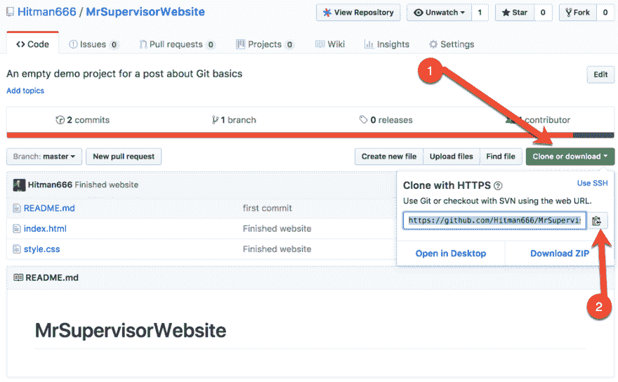
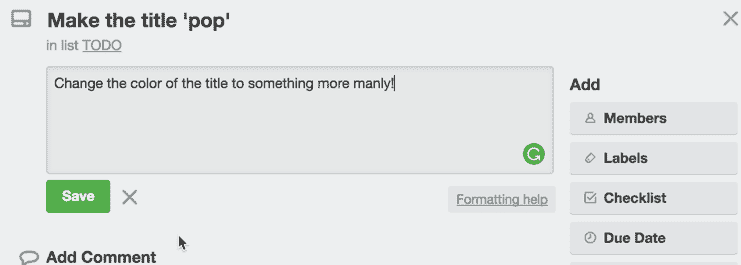
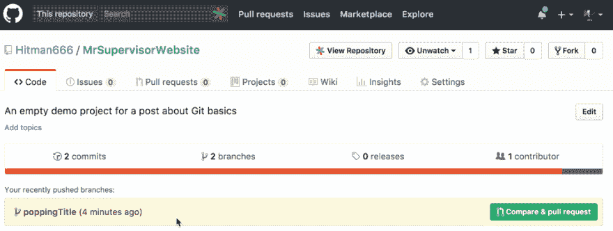
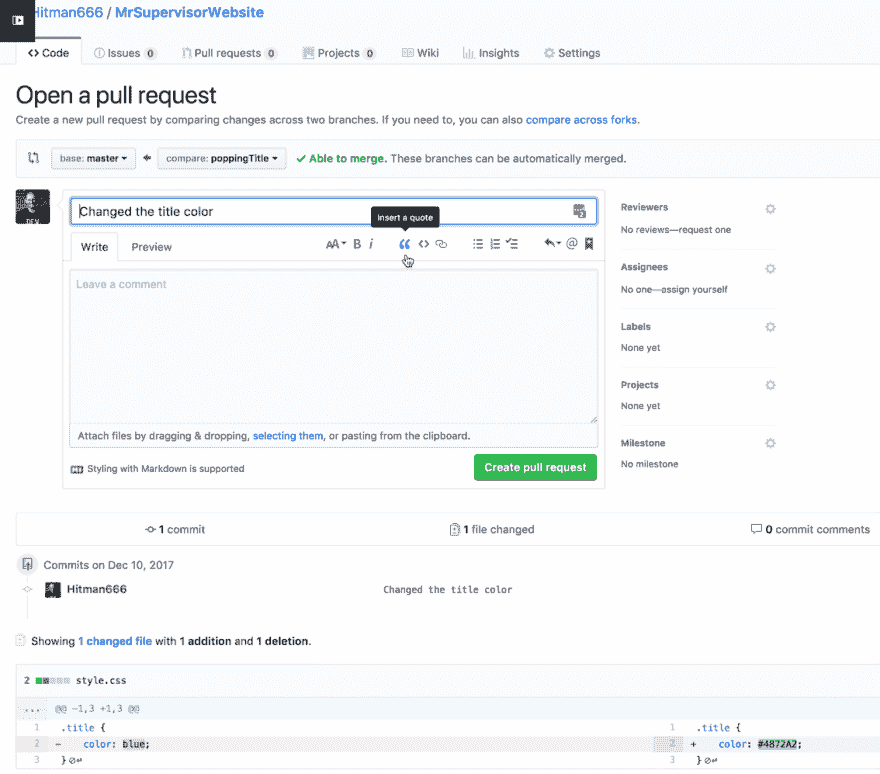
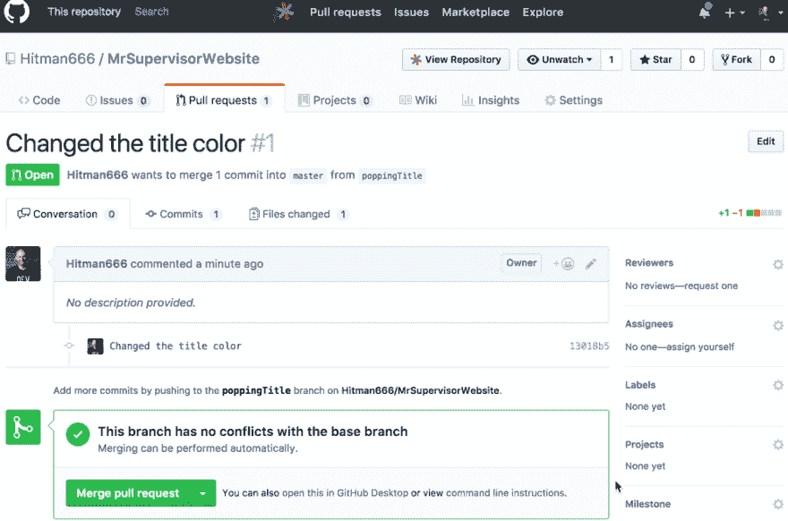
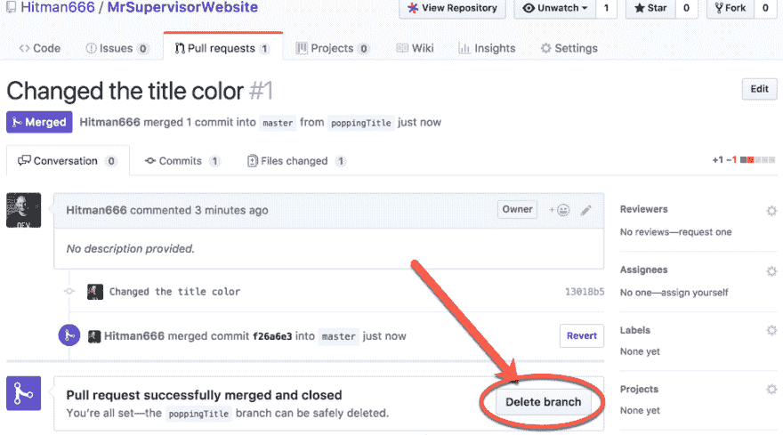
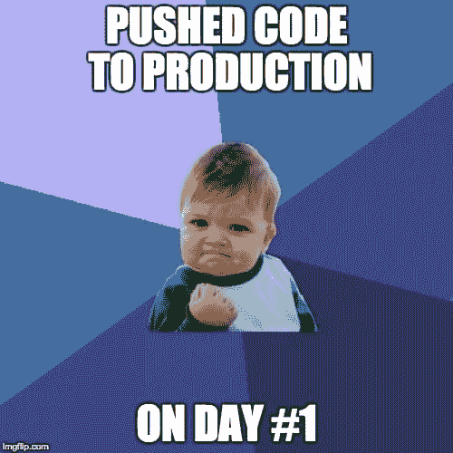

# 快速学习 Git，就好像你的工作依赖于它一样

> 原文：<https://dev.to/nikola/learn-git-fast-as-if-your-job-depends-on-it-dgj>

[T2】](https://res.cloudinary.com/practicaldev/image/fetch/s--FvsVTy_D--/c_limit%2Cf_auto%2Cfl_progressive%2Cq_auto%2Cw_880/https://thepracticaldev.s3.amazonaws.com/i/fd17sya3is4g5q2pcl0t.jpg)

*更新:喜欢视频课程吗？我在 [Skillshare 上做了第一个，去看看](https://skl.sh/2qE11BP)。*

*原载于[我的博客](http://www.nikola-breznjak.com/blog/miscellaneou/learn-git-fast-job-depends/)*

## TL；速度三角形定位法(dead reckoning)

在这篇文章中，带着一点幽默，我将向你展示你需要学习的最少数量的 Git 命令，以便开始有效率地将代码从你的机器下载到公司的 Git 服务器。此外，我还将介绍一些理论和 Git 安装。

## 免责声明

> ⚠️:感谢上帝，这个故事中的任何人、任何机构或公司都不是基于现实世界中真实的人或机构。但是我可以告诉你。随着我在软件丛林中的旅程的推进，我逐渐意识到，与现实相比，我的故事就像一张节日明信片一样平淡无奇。~约翰·勒·卡雷

## 设置舞台

所以，我们来设定一个场景；这是你大学毕业后作为初级开发人员的第一天。你开始工作，向你的上级打招呼，他应该对你负责，因为他忙着扑灭刚刚冒出来的火，相反，当你试图继续走到一边时，他告诉你这样的话:

> 我已经为你设置了访问我的网站项目的 Git 权限。
> 
> 我们的项目管理工具为您分配了一个票证。别担心，这只是一些需要改变的简单的东西。
> 
> 只要查看邮件详细信息，你就可以立即开始。
> 
> 我知道您可能不熟悉 Git。我不是想做个混蛋，但只是面对它，学习它，好吗？难道他们现在在学校什么都不教你们吗？
> 
> 啊，我得走了。
> 
> 哦，还有一件事，查一下分支，永远不要，我重复一遍，永远不要，向主人承诺；改做公关吧！祝你好运，回头见！

好的。你坐在你的隔间里，打开你的电子邮件客户端，登录，在那里你看到了电子邮件(当然，没有主题行)，内容如下:

> 这里有一个 Github 上 Git 回购的链接。
> 
> 祝你好运，优越先生

## 现实设定在

> ⚠️:如果你问我的话，这本身就是一个糟糕的入职，但我个人已经见过太多次了，所以下面是你需要做的事情，以快速获得生产力并尽快学会诀窍。

所以现在你，在缺乏更好的词，搞砸了(你知道确切的词，但我们不应该在这里使用亵渎，ae？).

你迷路了。你以前听说过 Git，但是从来没有用过。现在你在为自己没有好好学习而自责。但是，事情就是这样，既然你真的下定决心要在这个“编程”的世界里成功，你就准备好去做需要做的事情。

[T2】](https://res.cloudinary.com/practicaldev/image/fetch/s--NxwQkxMA--/c_limit%2Cf_auto%2Cfl_progressive%2Cq_auto%2Cw_880/https://i.imgur.com/YZ4W1Ao.jpg)

我想问的是，如果你“如此投入”，为什么你还没有学会，但正如 Superior 先生所说，我不想做一个混蛋😉

因此，扣好安全带，年轻的学徒，你要上路了！

## 这是什么饭桶东西？

首先，让我从几个问题开始:

*   假设您正在编写一个研讨会，您做了一些更改，保存它们，退出文本编辑器，返回，您想查看文件中您最后做的所有更改。或者，举例来说，你想撤销你昨晚做的一些改变(从聚会回来后写一篇研讨会是一种高尚的行为，但不是很聪明的行为！).
*   在撰写本研讨会时，您创建了同一个文件的多个版本，而您甚至不知道哪个版本中有什么变化；你真的很想知道，比如说，在几天前的版本的基础上，当前版本有什么变化。
*   你正在做一个团队项目，有人“不小心”删除了你的修改。

VCS 倾向于解决这些问题。首先，让我说，不，你不需要使用 VCS *只*来写代码(因此研讨会的例子)。您可以将它用于任何文本项目。VCS 的解决方案之一是 [Git](https://git-scm.com/) 。另一个流行的 VCS 是 [Subversion](https://subversion.apache.org/) ，今天在某种程度上仍在使用。你可以在这里看到版本控制系统[的详细列表。](https://en.wikipedia.org/wiki/List_of_version_control_software)

Git 是由 Linux 之父 Linus Torvalds 创造的:

[T2】](https://res.cloudinary.com/practicaldev/image/fetch/s--_fbw4n7d--/c_limit%2Cf_auto%2Cfl_progressive%2Cq_auto%2Cw_880/https://i.imgur.com/ESoSiQq.jpg)

Git 是一个分布式版本控制系统(VCS)。

**版本控制**意味着你用它来存储你的文档版本。的确，它似乎在开发人员中很受欢迎，但是设计师和其他人(稍微懂点技术的)也用它来跟踪他们文件的版本。

这整个**分布式**部分是它与其他 VCS 不同的地方之一。在 Git 中，每个开发人员的工作副本也是一个储存库，可以包含所有变更的**完整历史**，而不是像 CVS 或 Subversion 等曾经流行的 VCS 那样，只有一个单一的位置来保存软件的完整版本历史。

## 好吧，但是 Github 是什么？

> 类似于 Dropbox，但为 Git 定制。

Github 是 Git 项目的托管服务，包括一些额外的电池，我们现在不打算讨论，因为时间紧迫。把它想象成一个存放你的 Git“东西”的地方。

## 安装 Git

要安装 Git，去[官方网站](https://try.github.io/)下载你机器的可执行文件。我不打算讨论安装细节，因为它们实际上只是一系列的步骤。*关于恶意软件 OFC* ，我是开玩笑的。

要确保安装成功，请在终端/命令提示符下运行以下命令:

`git --version`

您应该会看到这样的内容:

`git version 2.10.1`

## 提取回购

好了，让我们终于开始行动吧。在您的电子邮件中，您收到了一个 Git 存储库的 URL。事情是这样的:https://github.com/Hitman666/MrSupervisorWebsite。你点击链接，你会看到这样的内容:

[T2】](https://res.cloudinary.com/practicaldev/image/fetch/s--8Ju9M67U--/c_limit%2Cf_auto%2Cfl_progressive%2Cq_auto%2Cw_880/https://i.imgur.com/nvz9ulq.png)

点击`Clone or download`按钮，确保看到弹出窗口右上角的`Use SSH`，然后复制链接。

要将这个存储库安装到您的计算机上，您必须在您的终端/命令提示符下执行以下命令(我将在本文的剩余部分使用终端):

`git clone https://github.com/Hitman666/MrSupervisorWebsite.git`

该命令的输出应该如下所示:

```
Cloning into 'MrSupervisorWebsite'...
remote: Counting objects: 7, done.
remote: Compressing objects: 100% (4/4), done.
remote: Total 7 (delta 0), reused 7 (delta 0), pack-reused 0
Receiving objects: 100% (7/7), done. 
```

## 检出代码

现在，进入新创建的`MrSupervisorWebsite`文件夹，在编辑器中打开它。

您应该会看到三个文件:`index.htmnl`、`style.css`和`README.md`。

你赶紧去点击打开`README.md`文件，但你看到的都是这个:

```
# MrSupervisorWebsite 
```

嗯，所以，没有帮助。

你打开`index.html`文件，你会看到:

```
<!DOCTYPE html>
<html lang="en">
<head>
    <meta charset="UTF-8">
    <meta name="viewport" content="width=device-width, initial-scale=1.0">
    <meta http-equiv="X-UA-Compatible" content="ie=edge">
    MrSupervisorWebsite
    <link rel="stylesheet" href="style.css">
</head>
<body>
    <h1 class="title">Welcome to MrSupervisorWebsite!</h1>
</body>
</html> 
```

好了，终于有你熟悉的东西了！您还打开了`style.css`文件，您会看到:

```
.title {
    color: blue;
} 
```

接下来，您看一看 Superior 先生提到的项目管理工具中分配给您的票证，它看起来类似于:

[T2】](https://res.cloudinary.com/practicaldev/image/fetch/s--UsH47Y3W--/c_limit%2Cf_auto%2Cfl_progressive%2Cq_auto%2Cw_880/https://i.imgur.com/UV33DqY.png)

你深吸一口气，终于知道该怎么处理了！💪

你对“男子气概的颜色”有点吃惊，所以你去问谷歌:

[T2】](https://res.cloudinary.com/practicaldev/image/fetch/s--7A05awZY--/c_limit%2Cf_auto%2Cfl_progressive%2Cq_auto%2Cw_880/https://i.imgur.com/lgoY0Ui.png)

你选择了`4872A2,`，你很开心。你对自己说:好的，现在我只需要改变`style.css`文件中的颜色，以某种方式将它添加到 Git 中并‘发布’它。

你说得对，但不要这么快！你还记得主管先生给你的那张纸条吗？你永远都不要把自己托付给师父。

## 创建新的分支

那么，这个`master`到底是什么？你上网，你会发现:

> Git 有分支，它的主分支叫做`master`。您可以在任何其他现有的基础上创建任意数量的项目。

此外，您还会阅读一些关于公关的资料，并了解到:

> PR 是拉动请求的简称。Pull 请求允许你告诉其他人你已经推送到 GitHub 上的库的变更。一旦打开了一个拉请求，您就可以与协作者讨论和检查潜在的变更，并在将变更合并到存储库中之前添加后续的提交。

所以，这很聪明，对吧？您可以将您的代码添加到 Git repo 中，而不破坏任何现有的`master`分支，然后通过这个 PR，您可以请一个更有经验的开发人员对您的 PR 进行 CR(代码审查)并决定是否接受它。

你很聪明；你可以看到这与仅仅向`master`提交一些东西并可能在生产中破坏一些东西相比的巨大好处。

现在，让我们回头解释一下，为什么你会打碎东西！？嗯，有个东西叫 CI(持续集成)和 CD(持续部署)，你可以多读一些，但本质上是这样的:

> 每当有人向`master`分支提交一个新的提交时，就会触发一整套部署脚本，本质上，被提交的新代码将会出现在生产中。

这意味着，如果你改变颜色并提交给`master`(你马上就会知道如何实际做这个`commit`动作)，它会“自动”出现在网站的制作中。

⚠️当然，前提是服务一开始就被设定成那样。

因此，您获得了附加分支的点和值，并且通过在终端中执行以下命令,**创建了一个新分支**:

`git checkout -b poppingTitle`

上面的命令是两个命令的快捷方式:

```
git branch poppingTitle
git checkout poppingTitle 
```

第一个从您当前所在的分支创建一个名为`poppingTitle`的新分支(在我们的例子中是`master`)。第二个是“检查一下”。意思是，它把你放在那个分支上。

## 添加一些代码

现在您终于准备好添加一些代码了！

打开`style.css`文件，改变颜色，并保存文件。现在应该是这样的:

```
.title {
    color: #4872A2;
} 
```

您会经常用到的一个有用的命令是`git status`，它会告诉您 git 项目的状态。如果您在您的终端中执行该命令，您将看到`style.css`文件被修改:

```
On branch poppingTitle
Changes not staged for commit:
  (use "git add <file>..." to update what will be committed)
  (use "git checkout -- <file>..." to discard changes in working directory)

    modified:   style.css

no changes added to commit (use "git add" and/or "git commit -a") 
```

如您所见，在输出的指令中，这些更改还没有添加到提交中。为此，执行命令`git add style.css`。当然，如果你有多个文件，你不需要列出每一个文件，你只需要使用`git add .`命令。

如果您再次运行`git status`命令，您将看到我们已经准备好提交变更:

```
On branch poppingTitle
Changes to be committed:
  (use "git reset HEAD <file>..." to unstage)

    modified:   style.css 
```

## 提交代码

要将添加的更改提交到您的本地存储库(为了更清楚起见，这里可以使用 save 或 apply 这样的词)，只需运行:

`git commit -m "Changed the title color"`

当然，提交消息可以是任何内容，但是请帮自己一个忙，编写有意义的提交消息。

如果您再次运行`git status`命令，您会看到我们有了一个干净的存储库:

```
On branch poppingTitle
nothing to commit, working tree clean 
```

## 推送到远程存储库

因此，很好，此时您已经在您的存储库中本地进行了更改，但是您希望将它返回到 Github(所谓的远程存储库，或者通常称为`origin`)。

为此，您必须执行以下命令:

`git push origin poppingTitle`

您应该得到类似如下的输出:

```
Counting objects: 3, done.
Delta compression using up to 8 threads.
Compressing objects: 100% (2/2), done.
Writing objects: 100% (3/3), 299 bytes | 0 bytes/s, done.
Total 3 (delta 1), reused 0 (delta 0)
remote: Resolving deltas: 100% (1/1), completed with 1 local object.
To github.com:Hitman666/MrSupervisorWebsite.git
 * [new branch]      poppingTitle -> poppingTitle 
```

## 做公关

如果你现在查看 Github，你会发现我们已经推出了这个新分支:

[T2】](https://res.cloudinary.com/practicaldev/image/fetch/s--ktZ1ERJH--/c_limit%2Cf_auto%2Cfl_progressive%2Cq_auto%2Cw_880/https://i.imgur.com/hoaLPE4.png)

现在，点击`Compare & pull request`按钮。

在这里，您可以添加一些注释来总结您的拉动式请求:

[T2】](https://res.cloudinary.com/practicaldev/image/fetch/s--Yt8uC3Tb--/c_limit%2Cf_auto%2Cfl_progressive%2Cq_auto%2Cw_880/https://i.imgur.com/NZDFScl.png)

最后，点击`Create pull request`按钮。

现在(如果我们是按常规出牌的话)你团队中的其他人会过来审查你的代码。在这一点上，你可以通过你的项目管理工具(JIRA、特雷罗、Leankit、Kanbanflow 等)让别人知道这一点...)将此任务/卡片放在适当的栏中。

## 您的 PR 被接受

当 pull 请求被批准时(当有人批准或拒绝它时，您会收到来自 Github 的通知)，您作为作者回到 Github，只需点击`Merge pull request`按钮，就这样:

[T2】](https://res.cloudinary.com/practicaldev/image/fetch/s--rMnvThD7--/c_limit%2Cf_auto%2Cfl_progressive%2Cq_auto%2Cw_880/https://i.imgur.com/oDzK7ZE.png)

最后，单击`Delete branch`按钮，因为不在远程存储库中保留合并的分支是一个好习惯:

[T2】](https://res.cloudinary.com/practicaldev/image/fetch/s--VV-7niLX--/c_limit%2Cf_auto%2Cfl_progressive%2Cq_auto%2Cw_880/https://i.imgur.com/2XZfov5.png)

## 你又活了一天

您与`master`的合并进行得很顺利，它是自动部署的，您检查了网站，一切都很顺利。您可以通过将票证放入“已部署”列(或类似名称的列)来更新您的票证系统中的票证。

现在是 17:12，你合上笔记本电脑，兴高采烈地回家去了解更多关于这个可怕的东西。💪

[T2】](https://res.cloudinary.com/practicaldev/image/fetch/s--trvqQX_J--/c_limit%2Cf_auto%2Cfl_progressive%2Cq_auto%2Cw_880/https://i.imgur.com/0jaodld.jpg)