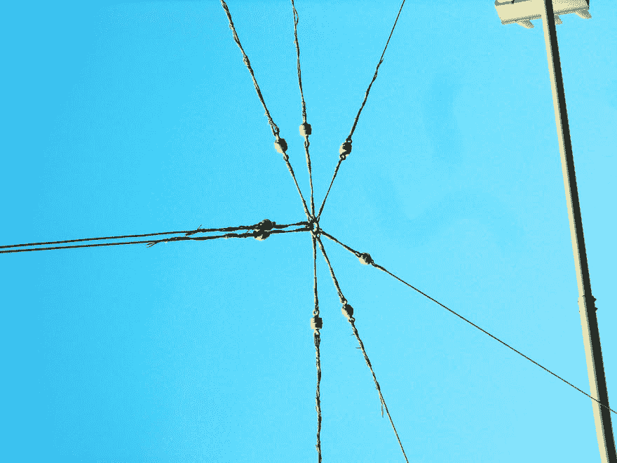

# 用 Perl 6 语法匹配事物

> 原文:[https://dev.to/jj/matching-things-with-perl-6-grammars-ao9](https://dev.to/jj/matching-things-with-perl-6-grammars-ao9)

[](https://res.cloudinary.com/practicaldev/image/fetch/s---Yyn7us0--/c_limit%2Cf_auto%2Cfl_progressive%2Cq_auto%2Cw_880/https://farm2.staticflickr.com/1252/1431171781_b202afca84_b_d.jpg) 
在本系列之前，我们[学习了如何在 Perl6](https://dev.to/jj/introduction-to-grammars-with-perl6-75e) 中定义一个语法，以及如何使用它来解析一个段落。我说*我们*是因为这是我开始时的目标，学会自己使用语法，这样我就可以很好地使用它们。最后，我想做一个 [Markdown 解析器](https://github.com/markdown-it/markdown-it)，如果这样的事情是可能的，但是在编码中，路径比目的地更重要，我打算带你一起去。

markdown 的特点之一是匹配类似*的*结构，比如我在这篇文章的来源中使用的星号，使`quote-like`突出为斜体，或者我用于`quote-like`的反勾。我们可以这样为(可能)引用的单词创建一个迷你语法:

```
grammar Simple-Quoted {
    token TOP { ^  <quoted> $}
    token quoted { <quote>? <letters> <quote>?  } 
    token quote { "*"|"`" }
    token letters { \w+ }
}

my $quoted = "*enhanced*";
my $parsed = Simple-Quoted.parse($quoted);
say $parsed; 
```

<svg width="20px" height="20px" viewBox="0 0 24 24" class="highlight-action crayons-icon highlight-action--fullscreen-on"><title>Enter fullscreen mode</title></svg> <svg width="20px" height="20px" viewBox="0 0 24 24" class="highlight-action crayons-icon highlight-action--fullscreen-off"><title>Exit fullscreen mode</title></svg>

我们总是从`TOP`规则开始，它说应该有一个引用的单词，就这样。这就是为什么我们使用`^`和`$`来锚定开始和结束。如果有一个以上的字，就不行。这将，它将打印:

```
｢*enhanced*｣
 quoted => ｢*enhanced*｣
  quote => ｢*｣
  letters => ｢enhanced｣
  quote => ｢*｣ 
```

<svg width="20px" height="20px" viewBox="0 0 24 24" class="highlight-action crayons-icon highlight-action--fullscreen-on"><title>Enter fullscreen mode</title></svg> <svg width="20px" height="20px" viewBox="0 0 24 24" class="highlight-action crayons-icon highlight-action--fullscreen-off"><title>Exit fullscreen mode</title></svg>

这是一个类似于[匹配](https://docs.perl6.org/type/Match)的结构的打印输出，它再次使用了方括号`｢｣`，首先是匹配的字符串，然后是一个散列，它有效地包括了树结构中的不同部分，这些部分已经从输入中被析构了。这并不可怕，缩进告诉你一些关于结构的信息，但并不是全部。我们将使用布莱恩·d·福伊的 [PrettyDump](http://perltricks.com/article/pretty-printing-perl-6/) 来检验一下。让我们把最后一行改成

```
say $parsed.perl; 
```

<svg width="20px" height="20px" viewBox="0 0 24 24" class="highlight-action crayons-icon highlight-action--fullscreen-on"><title>Enter fullscreen mode</title></svg> <svg width="20px" height="20px" viewBox="0 0 24 24" class="highlight-action crayons-icon highlight-action--fullscreen-off"><title>Exit fullscreen mode</title></svg>

重新格式化后，看起来像这样:

```
 Match.new(
    list => (),
    made => Any,
    pos => 10,
    hash => Map.new(
    (:quoted(Match.new(
            list => (),
            made => Any,
            pos => 10,
            hash => Map.new(
                (:letters(
                 Match.new(
                     list => (),
                     made => Any,
                     pos => 9,
                     hash => Map.new(()),
                     orig => "*enhanced*",
                     from => 1)),
                 :quote(
                 [Match.new(
                     list => (),
                     made => Any,
                     pos => 1,
                     hash => Map.new(()),
                     orig => "*enhanced*",
                     from => 0),
                  Match.new(
                      list => (),
                      made => Any,
                      pos => 10,
                      hash => Map.new(()),
                      orig => "*enhanced*",
                      from => 9)]))),
            orig => "*enhanced*",
            from => 0)))),
    orig => "*enhanced*",
    from => 0) 
```

<svg width="20px" height="20px" viewBox="0 0 24 24" class="highlight-action crayons-icon highlight-action--fullscreen-on"><title>Enter fullscreen mode</title></svg> <svg width="20px" height="20px" viewBox="0 0 24 24" class="highlight-action crayons-icon highlight-action--fullscreen-off"><title>Exit fullscreen mode</title></svg>

我们在这里看到的是语法创建了一组递归的匹配。这只是一个简单的散列，但是我们也可以使用 [`Match`](https://docs.perl6.org/type/Match) 方法来访问它；每个`key`大概有一个方法，Perl 6 中的键是粗箭头之前的那些东西。所以

```
say $parsed.hash; 
```

<svg width="20px" height="20px" viewBox="0 0 24 24" class="highlight-action crayons-icon highlight-action--fullscreen-on"><title>Enter fullscreen mode</title></svg> <svg width="20px" height="20px" viewBox="0 0 24 24" class="highlight-action crayons-icon highlight-action--fullscreen-off"><title>Exit fullscreen mode</title></svg>

将返回

```
Map.new((quoted => ｢*enhanced*｣
 quote => ｢*｣
 letters => ｢enhanced｣
 quote => ｢*｣)) 
```

<svg width="20px" height="20px" viewBox="0 0 24 24" class="highlight-action crayons-icon highlight-action--fullscreen-on"><title>Enter fullscreen mode</title></svg> <svg width="20px" height="20px" viewBox="0 0 24 24" class="highlight-action crayons-icon highlight-action--fullscreen-off"><title>Exit fullscreen mode</title></svg>

但这其实是第`Match`级的大数据结构。如果我们想访问最里面的结构，我们必须做:

```
 $parsed.hash<quoted>.hash 
```

<svg width="20px" height="20px" viewBox="0 0 24 24" class="highlight-action crayons-icon highlight-action--fullscreen-on"><title>Enter fullscreen mode</title></svg> <svg width="20px" height="20px" viewBox="0 0 24 24" class="highlight-action crayons-icon highlight-action--fullscreen-off"><title>Exit fullscreen mode</title></svg>

它将返回`Map.new((letters => ｢enhanced｣, quote => [｢*｣ ｢*｣]))`。那是我们想去的地方。我们有引语，以及里面的内容。我们可以利用这一点。

> 别担心，做那件事有更简单的方法。继续看这个系列。

## 不匹配的匹配

机智的读者可能已经注意到，不匹配的引号也会被愉快地解析:

```
> Simple-Quoted.parse("*mismatch`");
｢*mismatch`｣
 quoted => ｢*mismatch`｣
  quote => ｢*｣
  letters => ｢mismatch｣
  quote => ｢`｣ 
```

<svg width="20px" height="20px" viewBox="0 0 24 24" class="highlight-action crayons-icon highlight-action--fullscreen-on"><title>Enter fullscreen mode</title></svg> <svg width="20px" height="20px" viewBox="0 0 24 24" class="highlight-action crayons-icon highlight-action--fullscreen-off"><title>Exit fullscreen mode</title></svg>

这可不好。一点都不好。我们必须改变语法，实际上要考虑到单词开头和结尾的引号必须相同。让我们从正则表达式中得到一个提示，并把它重新表述如下:

```
grammar Quoted {
    token TOP { ^ <letters> | <quoted> $}
    token quoted { (<quote>) <letters> $0  } 
    token quote { "*"|"`" }
    token letters { \w+ }
} 
```

<svg width="20px" height="20px" viewBox="0 0 24 24" class="highlight-action crayons-icon highlight-action--fullscreen-on"><title>Enter fullscreen mode</title></svg> <svg width="20px" height="20px" viewBox="0 0 24 24" class="highlight-action crayons-icon highlight-action--fullscreen-off"><title>Exit fullscreen mode</title></svg>

唯一的变化是在`quoted`标记中，现在*捕获*第一个引用，并且只匹配最后是否相同；`$0`变量就是这样做的；储存火柴，不会让那种陶器过关。现在

```
*enhanced` 
```

<svg width="20px" height="20px" viewBox="0 0 24 24" class="highlight-action crayons-icon highlight-action--fullscreen-on"><title>Enter fullscreen mode</title></svg> <svg width="20px" height="20px" viewBox="0 0 24 24" class="highlight-action crayons-icon highlight-action--fullscreen-off"><title>Exit fullscreen mode</title></svg>

会失败并返回`Any`，也就是嗯“我们不要 grokk 这个，这是坏事”。通过括号我们捕获，用`$0`我们复制之前捕获的任何东西。如果不是同一个东西，它就失败了，但是如果是同一个引用，它就没问题。

## 更多语法

在本系列的两篇文章之间，[“卖火柴的小女孩”](https://perl6advent.wordpress.com/2017/12/14/day-14-the-little-match-girl-building-and-testing-big-grammars-in-perl-6/)是在 Perl 6 降临节日历中写的，它向您展示了如何创建和测试复杂而庞大的语法。当然，你也可以随时查看使用 Perl 6 正则表达式和语法的[解析:解析的递归下降](http://amzn.to/2B11zsN)，这是一本由知识渊博(并且很有帮助)[莫里茨·伦茨](https://github.com/moritz)撰写的优秀书籍。