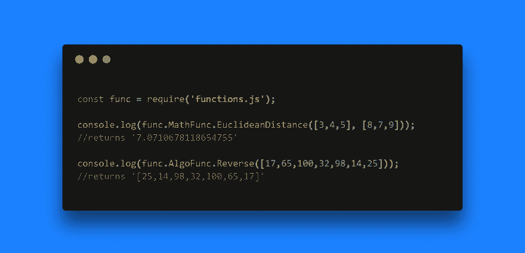

# 函数. js

> 原文:[https://dev.to/theiyd/functionsjs-3kf](https://dev.to/theiyd/functionsjs-3kf)

> **functions.js** 是各种函数或方法的中枢，这些函数或方法根据其功能的不同而不同。

该项目最初被命名为 [**okay-string**](https://www.npmjs.com/package/okay-string) ，它只有字符串验证方法。为了在学习过程中更进一步，我想到将其重命名为***functions . js***&create，练习更多的函数，为开源社区做出贡献。

[T2】](https://res.cloudinary.com/practicaldev/image/fetch/s--WGKFtAAp--/c_limit%2Cf_auto%2Cfl_progressive%2Cq_auto%2Cw_880/https://thepracticaldev.s3.amazonaws.com/i/dwndmi7521fz56x395mo.png)

该项目正在进行中，即越来越多的功能需要实施，以便在 JavaScript 编程中脱颖而出。该项目通过拉动请求向**贡献**开放。

该项目在 [**Github**](https://github.com/theIYD/functions.js) 上开源，可在 [**npm**](https://www.npmjs.com/package/functions.js) 上下载。

我希望你喜欢这个项目&这个小快速阅读。

**编码快乐！❤️**