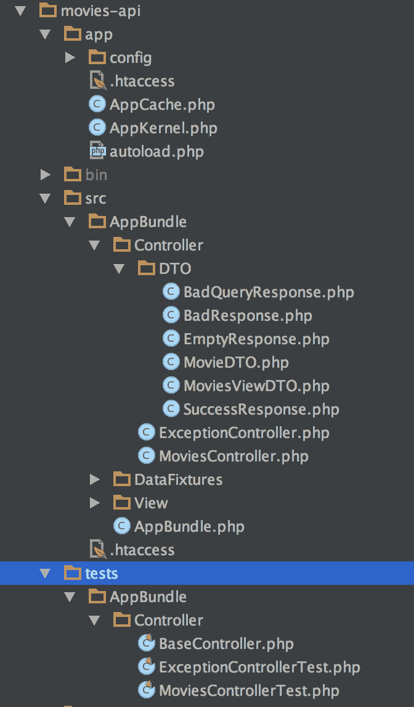
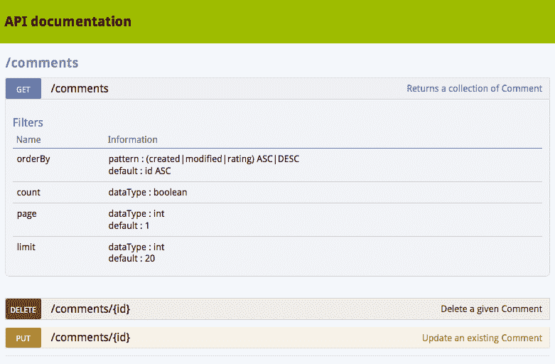
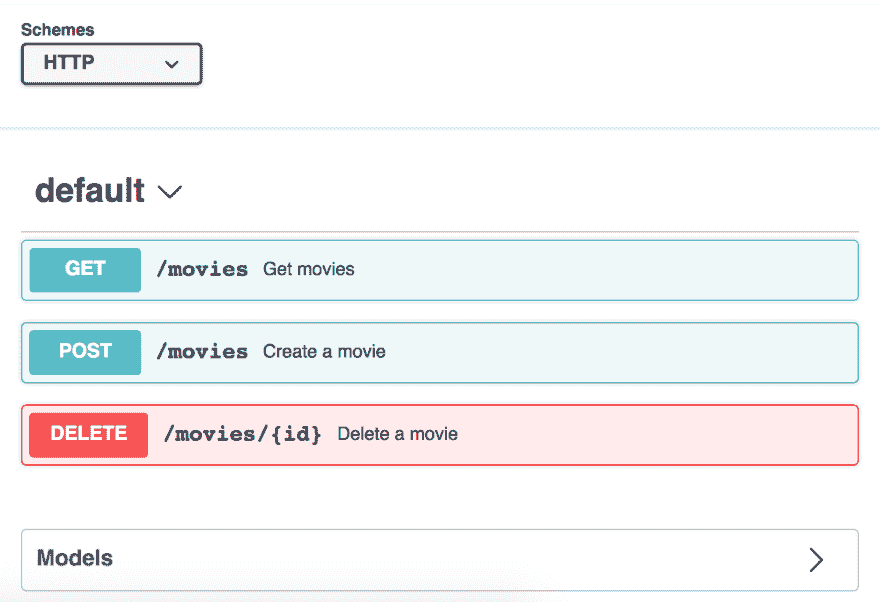
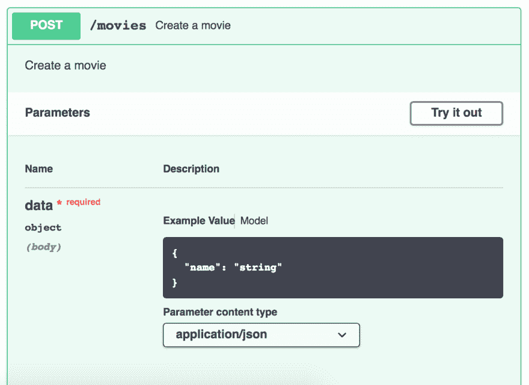
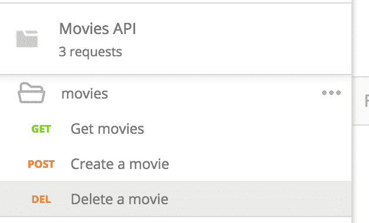
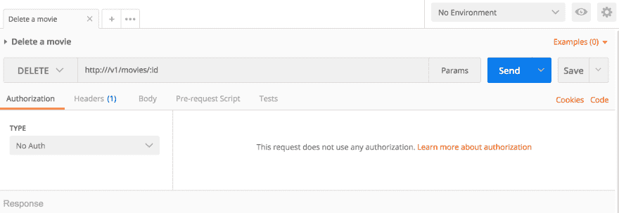

# 使用 Swagger 记录 Symfony API

> 原文:[https://dev . to/matks/use-swagger-to-document-a-symfony-API-790](https://dev.to/matks/use-swagger-to-document-a-symfony-api-790)

Web APIs 正在成为趋势！

它们现在无处不在:它们为 Javascript 单一应用程序页面提供数据，它们允许开发者管理弹性搜索实例，它们被用来将单一应用程序解耦为微服务...

因为它们在现代 web 应用程序中被广泛使用，我们可以看到 API 的工具也升级了很多。自动化 API 文档系统、API 客户端 SDK、REST 用户友好客户端...

我想分享一些我今年学到的很酷的工具组合技巧。这篇文章将向你展示如何将一些工具结合起来，为 php API 构建:

*   一个使用 Swagger 的精确的 HTML 文档
*   一个使用 Jane 的 PHP API 客户端 SDK
*   使用 Behat 的 API 测试

因为这篇文章很长，所以我把它分成了两部分。

# API

在这个例子中，我使用一个简单的 [Symfony](http://symfony.com/) REST API 来处理一个电影数据库。
它有 3 个端点:

*   从数据库中获取电影，该数据库接受一些参数:dir(排序方向，“asc”或“desc”)、page(分页)和 sort(选择排序的字段)
*   `POST /v1/movie`将新电影注册到数据库中
*   `DELETE /v1/movie/{id}`从数据库中删除现有电影

删除端点是软删除:记录被标记为已删除，但并未真正删除。

该 API 是使用 Symfony 3.1 构建的，Symfony 3.1 是一个由 DoctrineORM 和库 FOSRestBundle 处理的 mysql 数据库。这里没有什么不寻常的，Symfony 开发人员会认识到一些非常标准的东西:

[T2】](https://res.cloudinary.com/practicaldev/image/fetch/s--Ba0feQ_y--/c_limit%2Cf_auto%2Cfl_progressive%2Cq_auto%2Cw_880/https://user-images.githubusercontent.com/3830050/33962320-7af63958-e051-11e7-9e2e-86dc6fc54518.png)

你可以在这里看看代码[。](https://github.com/matks/ApiCycle/tree/master/apps/movies-api)

# 昂首阔步

好玩的来了。该 API 是建立和测试，现在我想其他开发人员使用它(例如建立一个很酷的 JS 前端)。

这些开发人员会问我“文档在哪里？”因为他们无法猜测 API 是如何工作的。

我不想写这个文档，因为我是一个开发人员，所以我喜欢自动化一切(尤其是无聊的任务)，也因为我不想每次修改 API 时都更新它。这就是为什么我希望它从代码中生成。

如果我能够从我的代码中生成文档，那么每当我修改代码时，文档也会更新。不再有过时的文档，不再有错误的参数。

有多种方法可以构建一个自动化的 HTML API 文档。对于 Symfony 应用程序，官方文档重定向到 [NelmioApiDocBundle](https://symfony.com/doc/master/bundles/NelmioApiDocBundle/index.html) ，它易于使用且高效。它解析你的一些应用程序配置，并要求你对无法猜测的内容进行注释。它会生成一个很棒的 HTML 文档，如下所示:

[T2】](https://res.cloudinary.com/practicaldev/image/fetch/s--5DmRoXPi--/c_limit%2Cf_auto%2Cfl_progressive%2Cq_auto%2Cw_880/https://symfony.com/doc/master/bundles/NelmioApiDocBundle/_images/webview.png)

我选择不使用它，而是为我的 API 生成一个 Swagger 文件。Swagger 是一种标准的 API JSON 规范格式，它定义了如何在 JSON 文件中描述 API。它的酷之处在于许多 API 工具都支持这种格式，因此拥有一个关于 API 的 Swagger 文件可以让您轻松使用所有这些工具。

举个例子，

*   允许开发者基于你的 Swagger 文件可视化你的 API 并与之交互
*   可以从你的 Swagger 文件构建一个文档门户
*   Postman 可以使用 Swagger 文件来生成请求体和模板，让你轻松消费 API

## 标注 API

所以我需要生成一个描述我的 API 的 Swagger 文件。我首先尝试使用 NelmioApiDocBundle 的 [Swagger 选项](https://symfony.com/doc/master/bundles/NelmioApiDocBundle/swagger-support.html),它允许将 API 描述转储为一个 Swagger 文件。然而，生成的文件使用的是 Swagger v1.2 规范，而我将在本文后面使用的工具需要一个 Swagger v2 文件。

有像 [api-spec-converter](https://github.com/LucyBot-Inc/api-spec-converter) 这样的工具可以将 Swagger v1 文件转换成 Swagger v2 文件，但是由于这种转换，我遇到了很多问题，所以我决定直接使用 v2 文件。

我使用了 [swagger-php](https://github.com/zircote/swagger-php) 项目向我的 Symfony API 添加注释，然后可以解析这些注释来生成想要的文件。基本上，您需要注释您的控制器和正在使用的模型(请求体和响应体)。

例如，下面是描述 GET 端点所需的注释:

```
 /**
     * @SWG\Get(
     *     path="/movies",
     *     summary="Get movies",
     *     description="Get movies",
     *     operationId="getMovies",
     *     produces={"application/json"},
     *     @SWG\Parameter(
     *         name="order",
     *         in="query",
     *         description="Order criterion",
     *         type="string",
     *     ),
     *     @SWG\Parameter(
     *         name="dir",
     *         in="query",
     *         description="Sort criterion",
     *         type="string",
     *     ),
     *     @SWG\Parameter(
     *         name="page",
     *         in="query",
     *         description="Page number",
     *         type="integer",
     *     ),
     *     @SWG\Response(
     *         response=200,
     *         description="Success",
     *         @SWG\Schema(ref="#/definitions/MoviesViewDTO"),
     *     )
     * )
     */
    public function getMoviesAction(Request $request) 
```

<svg width="20px" height="20px" viewBox="0 0 24 24" class="highlight-action crayons-icon highlight-action--fullscreen-on"><title>Enter fullscreen mode</title></svg> <svg width="20px" height="20px" viewBox="0 0 24 24" class="highlight-action crayons-icon highlight-action--fullscreen-off"><title>Exit fullscreen mode</title></svg>

语法非常简单，您必须描述端点接受什么作为参数/请求体，以及它返回什么。

关于请求和响应体，如果提供一些注释，Swagger-php 能够分析 php 模型以提取它们的结构:

```
/**
 * @SWG\Definition()
 */
class MoviesViewDTO
{
    /**
     * @var int
     *
     * @SWG\Property()
     */
    public $total;
    ... 
```

<svg width="20px" height="20px" viewBox="0 0 24 24" class="highlight-action crayons-icon highlight-action--fullscreen-on"><title>Enter fullscreen mode</title></svg> <svg width="20px" height="20px" viewBox="0 0 24 24" class="highlight-action crayons-icon highlight-action--fullscreen-off"><title>Exit fullscreen mode</title></svg>

因此，如果您接受并返回 dto(也称为 POPOs ),您可以很容易地提取它们的结构并写入 Swagger 文件。

一旦您注释了您的路线和模型，您就可以在您的项目上运行 swagger php 二进制文件，它会生成您的 swagger 文件。看起来是这样的:

```
{
    "swagger": "2.0",
    "info": {
        "title": "Movies API",
        "version": "1.0"
    },
    "basePath": "/v1",
    "schemes": [
        "http"
    ],
    "paths": {
        "/movies": {
            "get": {
                "summary": "Get movies",
                "description": "Get movies",
                "operationId": "getMovies",
                "produces": [
                    "application/json"
                ],
                "parameters": [
                    {
                        "name": "order",
                        "in": "query",
                        "description": "Order criterion",
                        "type": "string"
                    },
                    {
                        "name": "dir",
                        "in": "query",
                        "description": "Sort criterion",
                        "type": "string"
                    },
                    ...
} 
```

<svg width="20px" height="20px" viewBox="0 0 24 24" class="highlight-action crayons-icon highlight-action--fullscreen-on"><title>Enter fullscreen mode</title></svg> <svg width="20px" height="20px" viewBox="0 0 24 24" class="highlight-action crayons-icon highlight-action--fullscreen-off"><title>Exit fullscreen mode</title></svg>

完整的文件可以在 [github](https://github.com/matks/ApiCycle/blob/master/apps/movies-api-client/swagger/swagger.json) 上找到。

恭喜:霸气档案写好了！

## 使用 Swagger 文件

### HTML 文档

现在我们得到了这个文件，我们可以使用 [swagger-editor](https://editor.swagger.io/) 来看看 HTML 文档是什么样子的。我们只需将 JSON 内容转储到编辑器中，它就会呈现 HTML 文档:

[T2】](https://res.cloudinary.com/practicaldev/image/fetch/s--CIh1bcnH--/c_limit%2Cf_auto%2Cfl_progressive%2Cq_auto%2Cw_880/https://user-images.githubusercontent.com/3830050/33962334-83b5a6b4-e051-11e7-9e66-b67ca921c692.png)

然后可以将文档转储并托管在 web 服务器上，这样开发者就可以随时查看它。如果您使用 SwaggerUI，您甚至可以获得沙箱功能来执行真正的 HTTP 请求，以实时查看 API 的行为！

[T2】](https://res.cloudinary.com/practicaldev/image/fetch/s--4iUfbGcw--/c_limit%2Cf_auto%2Cfl_progressive%2Cq_auto%2Cw_880/https://user-images.githubusercontent.com/3830050/33962346-8c0d8b92-e051-11e7-9370-e37bc8157d1b.png)

### 配合 REST 客户端使用

我们也可以在 [Postman](https://www.getpostman.com/) 中输入，获得一个预先配置好的 REST 客户端与 API 进行交互:

[](https://res.cloudinary.com/practicaldev/image/fetch/s--vdaJiidg--/c_limit%2Cf_auto%2Cfl_progressive%2Cq_auto%2Cw_880/https://user-images.githubusercontent.com/3830050/33962356-95c8c692-e051-11e7-8764-7abf7d283aca.png)
[T6】](https://res.cloudinary.com/practicaldev/image/fetch/s---fEsfSmX--/c_limit%2Cf_auto%2Cfl_progressive%2Cq_auto%2Cw_880/https://user-images.githubusercontent.com/3830050/33962367-9bb55700-e051-11e7-8caa-a7407eb1b50c.png)

请求是预先配置好的，现在从客户端执行 HTTP 请求非常容易。这在一个新开发人员加入团队时特别有用，所以他在几秒钟内就准备好了他的开发/调试工具！

## 把它作为团队协作的工具

如果你的公司有一个开发 API 的后端团队和一个使用该 API 的前端团队，他们需要讨论并就 API 行为达成一致。

使用 Swagger 规范可能是有用的:当工作在一个新的特性上时，两个团队一起工作在 Swagger 文件上，并且同意更新的文件是 API 需要的特性。然后后端团队开始致力于 Swagger 规范的实现，而前端团队可以开始工作，因为他们知道 API 将接受和返回什么。一些工具甚至可以使用 Swagger 文件生成模拟 API，以便为前端团队提供模拟 API，直到后端团队完成其工作。

## 简&行为

本帖第二部分见:)