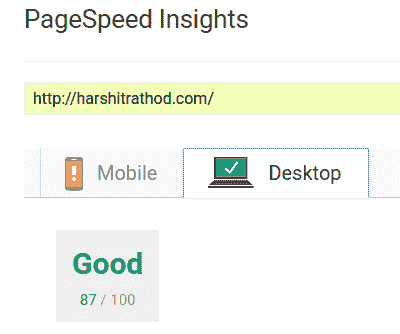
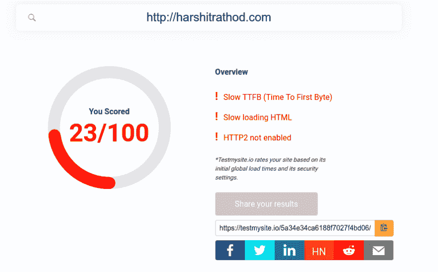
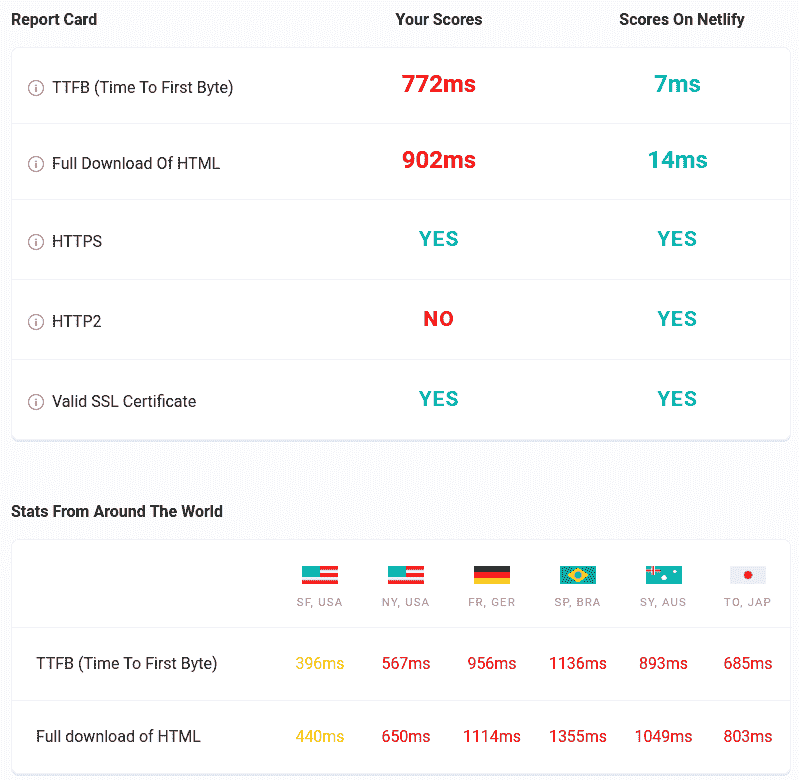
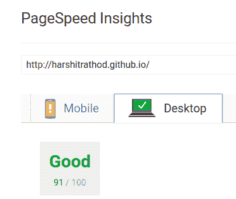
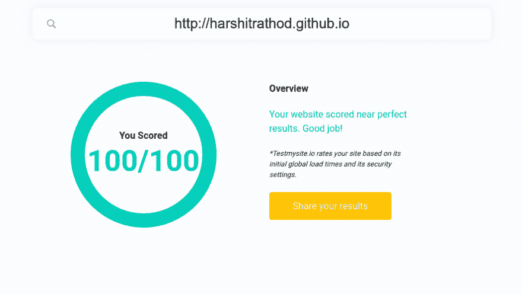
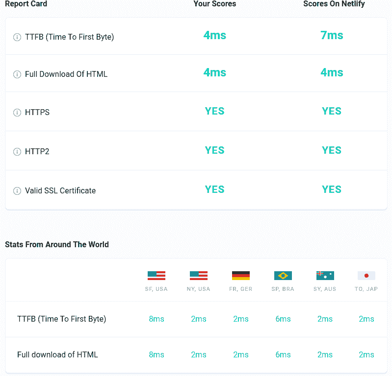

# 我花了 16 个小时来迁移我的站点！这是结果

> 原文：<https://dev.to/harshitrathod/i-spent-16-hours-to-migrate-my-site-here-is-result-85j>

旧址:[harshitrathod.com](https://harshitrathod.com)

本周我对我的博客流量做了详细的分析，我对其表现非常失望。我在博客上使用 WordPress。我向我的一些朋友征求反馈。我还在不同的网站上测试了一个网站，结果非常糟糕。

表现在 google insight 上:
 

表现在 Testmysite.io 上:
 

因为这个原因，我决定解决这个问题。昨天我发布了一个关于用静态网站代替 WordPress 的问题。昨天 IST 时间晚上 10 点左右，我开始将我的网站转换成静态网站。我连续花了 16 个小时来创建一个新的博客网站。

我用了 [Jekyll](https://jekyllrb.com/) + Github，这样可以降低托管费用。

这里是新的站点:[harstitrathod . github . io](https://harshitrathod.github.io)

表现在 google insight 上:
 

表现在 Testmysite.io 上:
 

仅待定测试 GitHub +自定义域。一周内我不会在新网站上发表任何东西，我愿意接受反馈。如果一切顺利，我将启用自定义域和旧网站将无法访问。