# 如何改进我们现有的 Ionic3 计算器应用程序

> 原文:[https://dev . to/Nikola/how-to-polish-our-existing-ion C3-calculator-application-2i7](https://dev.to/nikola/how-to-polish-our-existing-ionic3-calculator-application-2i7)

[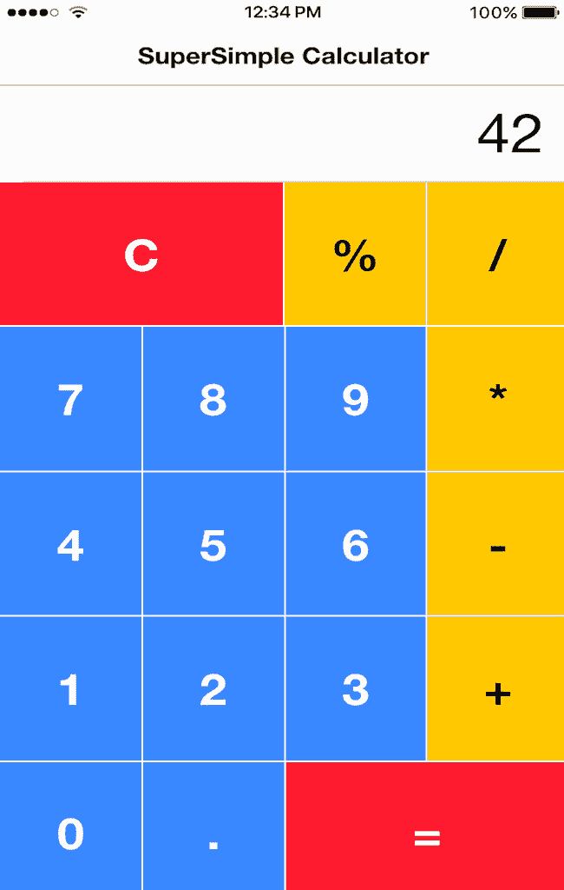T2】](https://res.cloudinary.com/practicaldev/image/fetch/s--VmvqYK_2--/c_limit%2Cf_auto%2Cfl_progressive%2Cq_auto%2Cw_880/https://thepracticaldev.s3.amazonaws.com/i/vy9jmglij9m3yj0i7kwk.png)

*原载于[我的博客](http://www.nikola-breznjak.com/blog/javascript/ionic3/polish-existing-ionic3-calculator-application/)*

这是一系列帖子中的第三篇，这些帖子将教你如何利用你的 web 开发知识为 iOS 和 Android 构建混合应用程序。本系列的第一篇帖子是关于如何在 Windows 和 Mac 上开始使用 Ionic framework 3 的[，第二篇是关于如何通过使用 Ionic Creator for UI 用 Ionic framework 3 创建一个计算器应用的](https://dev.to/hitman666/how-to-get-started-with-ionic-framework-3-on-mac-and-windows)。

在这篇文章中，你将学到:

*   如何改进您现有的计算器应用程序
*   如何自动创建图标和闪屏图像
*   如何实现 Google AdMob 广告
*   如何在不通过应用商店的情况下与其他用户分享您的应用
*   如何在真实的物理设备和模拟器上测试应用程序

因此，如果你一直在关注这一系列的帖子，那么你可能已经准备好了计算器应用程序，并通过使用`ionic lab`命令在你的机器上运行。

如果你只是路过，或者你想从头开始，那么你可以从 [Github](https://github.com/Hitman666/Ionic3_2ndTutorial) 克隆第二个教程的完成版本。克隆之后，您必须运行`npm install`来安装所有的依赖项。在这之后，命令`ionic lab`应该在您的计算机上本地运行应用程序，并且您应该看到它在您的默认浏览器中打开。*当然，如果你正确安装了 Ionic，所有这些都应该可以工作。如果没有，请查看[第一教程](http://www.nikola-breznjak.com/blog/javascript/ionic3/get-started-ionic-framework-3-mac-windows/)中的说明。*

至此，我们有了一个简单的计算器应用程序，它缺少一些清理检查和设计改进。我们将在本节中解决这个问题。

## 卫生处理检查

在我们当前的应用程序中，我们没有针对可能的畸形输入的安全措施。例如，可以一个接一个地输入两个加号(`+`)，这将因此产生错误。

因此，为了处理这个问题，我们将把我们的评估代码行包装在`try/catch`块中，并且我们将使用 [AlertController](https://ionicframework.com/docs/api/components/alert/AlertController/) 对话框(作为依赖项注入到`CalculatorPage`类构造函数中)向用户显示一个警告。`calculator.ts`文件的全部内容现在应该是这样的:

```
import { Component } from '@angular/core';
import { NavController } from 'ionic-angular';
import { AlertController } from 'ionic-angular';

@Component({
    selector: 'page-calculator',
    templateUrl: 'calculator.html'
})
export class CalculatorPage {
    constructor(public navCtrl: NavController, private alertCtrl: AlertController) { }

    result = '';

    btnClicked(btn) {
        if (btn == 'C') {
            this.result = '';
        }
        else if (btn == '=') {
            if (this.result == '') {
                return;
            }

            try {
                this.result = eval(this.result).toFixed(2);
            } catch (error) {
                this.showAlert();
                this.result = '';
            }
        }
        else {
            this.result += btn;
        }
    }

    showAlert() {
        this.alertCtrl.create({
            title: 'Malformed input',
            subTitle: 'Ooops, please try again...',
            buttons: ['Dismiss']
        }).present();
    }
} 
```

此外，我们正在检查在按下 equals 按钮时`result`变量是否包含任何内容，以避免否则会发生的`undefined`错误。*您可以通过运行应用程序，点击等号按钮`=`，然后点击按钮`5`，您会看到文本`undefined5`出现在结果区域。*

另外，您可能已经注意到，我们在我们的`eval`函数调用之后添加了 [toFixed(2)](http://www.w3schools.com/jsref/jsref_tofixed.asp) ，以显示格式化为**两位小数的结果**。

如果您在输入公式时故意出错，您将得到以下消息:

[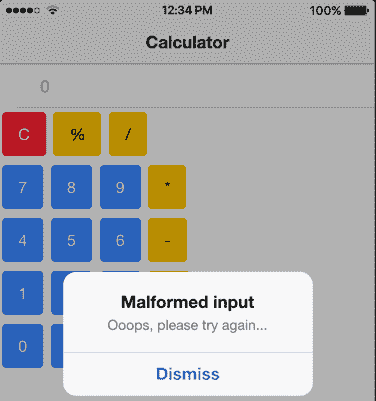T2】](https://res.cloudinary.com/practicaldev/image/fetch/s--pc5DqQrP--/c_limit%2Cf_auto%2Cfl_progressive%2Cq_auto%2Cw_880/https://i.imgur.com/VNaGioK.png)

> 显然，有多种方法可以进一步解决这个问题，从而创造更好的用户体验。一个想法是在每次点击按钮时检查当前的公式是否会用`eval`正确执行，如果不是，那么立即通知用户，或者完全忽略最后点击的按钮。我鼓励你创造自己的“改良的 [UX](https://en.wikipedia.org/wiki/User_experience) ”方式，并在评论中分享。

## 设计变更

老实说，我们的应用程序目前看起来不太具有代表性。我们要改变它，让它变得更好一点。如果你现在问任何一个网页设计师，他们会告诉你使用纯 CSS 已经过时了。Ionic 虽然很棒，但它已经支持 [SASS](http://sass-lang.com/) 开箱即用，所以你可以利用 SASS 提供的变量、嵌套、混合和所有其他好东西。

例如，如果你想改变颜色，你只需要改变一个变量，而不必在所有文件中追踪它，并在所有使用它的地方改变特定的颜色。

在[之前的教程](//www.nikola-breznjak.com/blog/javascript/ionic3/create-calculator-application-ionic-framework-3-using-ionic-creator-ui/)中，我们在`src/theme/variables.scss`文件的颜色数组中添加了“激活”的颜色。现在我们要在`pages/calculator/calculator.scss`文件中做所有的修改，现在看起来像这样:

```
page-calculator {

} 
```

这些更改将仅适用于此页面。如果我们想添加一些应用于整个应用程序的样式，我们可以在`src/app/app.scss`文件中这样做。

在下面的图片中，你可以看到我在修改了一些 CSS 规则后得出的结果，(以及对我们的 HTML 模板的一点补充，我将另外说明):

[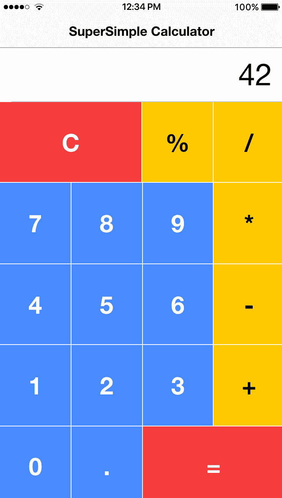T2】](https://res.cloudinary.com/practicaldev/image/fetch/s--CmEEfc_2--/c_limit%2Cf_auto%2Cfl_progressive%2Cq_auto%2Cw_880/https://i.imgur.com/Av1obHq.png)

我相信更多倾向于设计的读者会想出比这更巧妙的设计，我鼓励你和我们分享你的图片/scss 的变化。

现在我们来看一下发生变化的部分，这样你就可以按照你的例子自己去看了。

至于变化，这里是`src/pages/calculator/calculator.html`文件的最终内容:

```
<ion-header>
    <ion-navbar>
        <ion-title>
            SuperSimple Calculator
        </ion-title>
    </ion-navbar>
</ion-header>

<ion-content>
    <div class="container">
        <form class="myInputRow">
            <ion-item>
                <ion-input type="text" placeholder="0" name="display" [(ngModel)]="result"></ion-input>
            </ion-item>
        </form>

        <div class="row">
            <button class="col2" ion-button color="danger" (click)="btnClicked('C')"> C </button>
            <button class="col" ion-button color="energized" (click)="btnClicked('%')"> % </button>
            <button class="col" ion-button color="energized" (click)="btnClicked('/')"> / </button>
        </div>

        <div class="row">
            <button class="col" ion-button (click)="btnClicked('7')"> 7 </button>
            <button class="col" ion-button (click)="btnClicked('8')"> 8 </button>
            <button class="col" ion-button (click)="btnClicked('9')"> 9 </button>
            <button class="col" ion-button color="energized" (click)="btnClicked('*')"> * </button>
        </div>

        <div class="row">
            <button class="col" ion-button (click)="btnClicked('4')"> 4 </button>
            <button class="col" ion-button (click)="btnClicked('5')"> 5 </button>
            <button class="col" ion-button (click)="btnClicked('6')"> 6 </button>
            <button class="col" ion-button color="energized" (click)="btnClicked('-')"> - </button>
        </div>

        <div class="row">
            <button class="col" ion-button (click)="btnClicked('1')"> 1 </button>
            <button class="col" ion-button (click)="btnClicked('2')"> 2 </button>
            <button class="col" ion-button (click)="btnClicked('3')"> 3 </button>
            <button class="col" ion-button color="energized" (click)="btnClicked('+')"> + </button>
        </div>

        <div class="row">
            <button class="col" ion-button (click)="btnClicked('0')"> 0 </button>
            <button class="col" ion-button (click)="btnClicked('.')"> . </button>
            <button class="col2" ion-button color="danger" (click)="btnClicked('=')"> = </button>
        </div>
    </div>
</ion-content> 
```

以下是我所做的更改的明细:

*   将标题从`ion-title`标签上的`Calculator`改为`SuperSimple Calculator`
*   移除了所有的`id`属性
*   移除了`form`元素中的`ion-label`
*   向`form`元素添加了`myInputRow`类
*   向`div`元素添加了`row`类
*   给`button`元素添加了`col`类，除了`+`和`=`按钮，我已经给它们添加了`col2`类
*   用`container`类将所有内容包装在一个 div 中

在`scss/ionic.app.scss`文件中，我添加了这些新类的定义:

```
page-calculator {
    .container {
        display: flex;
        flex-direction: column;
        height: 100%;

        .row {
            flex: 2;
            flex-direction: row;
            padding: 0px !important;
            margin: 0px !important;

            .col {
                flex: 1;
                padding: 0px !important;
                margin: 0px !important;
            }

            .col2 {
                flex: 2;
                padding: 0px !important;
                margin: 0px !important;
            }
        }

        .myInputRow {
            flex: 1 !important;

            input {
                font-size: 40px;
                text-align: right;
            }
        }

        button {
            height: auto !important;
            border-radius: 0px !important;
            font-size: 32px;
            font-weight: bold;
            border-left: 1px solid #fff;
            border-bottom: 1px solid #fff;
        }
    }
} 
```

Flexbox 在这里被用作水平填充整个内容的布局的基础。你可以从[这个 Ionic 的具体教程](http://www.joshmorony.com/how-to-create-complex-layouts-in-ionic/)中了解更多，或者你可以从[这个教程](https://css-tricks.com/snippets/css/a-guide-to-flexbox/)中了解更多关于 Flexbox 的一般情况。

这样，我们现在就有了一个填充所有可用内容的界面。

## 如何在 Ionic framework 3 中自动创建图标和闪屏图像

图标是应用程序的重要组成部分，因为它代表了应用程序的品牌，有助于快速识别应用程序在手机上的位置。如果你熟悉创建应用程序，那么你会记得为 iOS 和 Android 平台创建大量不同大小的图像是一个乏味的过程。

同样，每次应用程序启动时出现的所谓闪屏也是如此。虽然闪屏不是强制性的，但它确实给人一种完整而专业的应用程序的感觉，这也是一个人在应用程序中想要表达的。

Ionic 在这方面帮助很大，它提供了一个 Ionic CLI 命令来自动生成所有需要的图标和闪屏尺寸。此外，Ionic 创建了 [Photoshop 闪屏模板](http://code.ionicframework.com/resources/splash.psd)，你可以免费下载，并将其用作创建图标的指南。然而，如果你使用`ionic start`命令创建你的项目，就像我们所做的，那么你已经在`resources`文件夹中有了`icon.png`和`splash.png`文件，你可以编辑它们。

因为当你创造一个品牌产品时，定制图标是绝对必要的。然而，在这种情况下，我将向您展示如何使用一个免费服务来搜索一个免费图标，然后您将在您的应用程序中使用它(即使您的应用程序是一个商业应用程序)。

我倾向于大量使用 [IconFinder](https://www.iconfinder.com?ref=Hitman666) ，这里是你必须使用的设置，以过滤出免费的(价格)计算器图像，可以在商业应用程序中使用，甚至不需要链接回来(许可证类型)。

当然，你也可以选择购买一个图像，如果你碰巧找到一个你喜欢的。您还可以按格式、大小和背景进行搜索。过滤器应该是这样的(使用这个[准备好的链接自动设置它们](https://www.iconfinder.com/search/?q=calculator&license=2&minimum=512&maximum=512&price=free&ref=Hitman666)):

[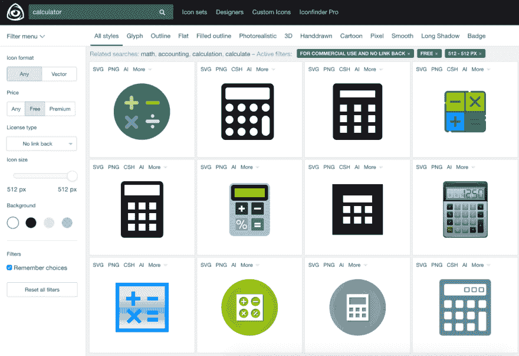T2】](https://res.cloudinary.com/practicaldev/image/fetch/s--WJNB8hO6--/c_limit%2Cf_auto%2Cfl_progressive%2Cq_auto%2Cw_880/https://i.imgur.com/IIi4opI.png)

我要用第一排的最后一个。只需点击它，您应该会看到如下所示的下载页面:

[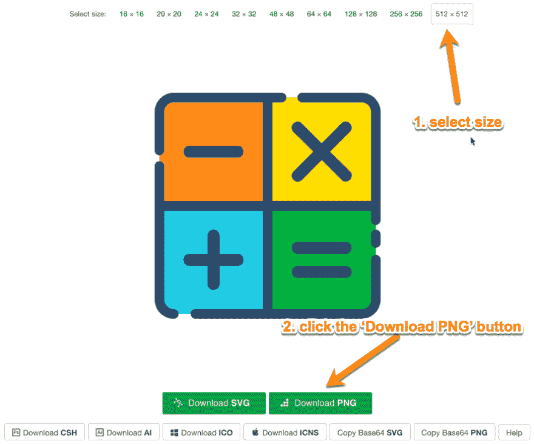T2】](https://res.cloudinary.com/practicaldev/image/fetch/s--mK4jIU97--/c_limit%2Cf_auto%2Cfl_progressive%2Cq_auto%2Cw_880/https://i.imgur.com/BtvGIBC.png)

要下载它，只需点击绿色的“下载 PNG”按钮。

现在，在`resources`文件夹中找到并使用您选择的图像编辑器打开`icon.png`文件。在这个例子中，我将使用 [Gimp](https://www.gimp.org/) ，因为它是免费的跨平台图像编辑器，可用于所有主要的操作系统(Linux、OS X、Windows)。您应该会看到类似这样的内容:

[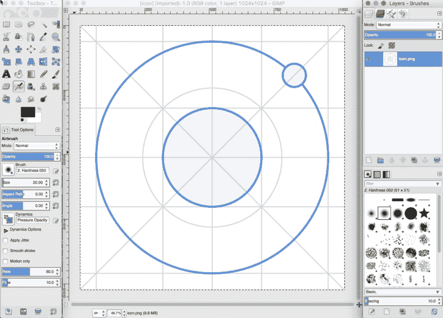T2】](https://res.cloudinary.com/practicaldev/image/fetch/s--Wg41z0wv--/c_limit%2Cf_auto%2Cfl_progressive%2Cq_auto%2Cw_880/https://i.imgur.com/lLbXt9G.png)

现在你需要做几个步骤:

*   选择整个区域(`Ctrl + a`或`Command + a`)并按下键盘上的`DEL`按钮。这会给你留下一张空白的画布。
*   在这块白色画布上拖动计算器图标，您应该会看到类似这样的内容: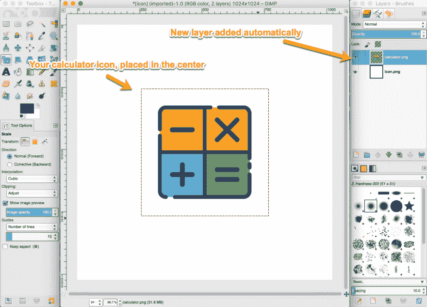
*   单击缩放工具
*   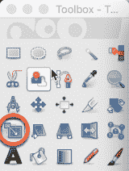
*   然后点击计算器图像。您应该会看到这个弹出窗口:
*   
*   将弹出菜单中的宽度和高度值更改为`1024px`，并点击`Scale`按钮。
*   单击对齐工具，然后单击计算器图像，然后单击下图中带圆圈的两个按钮。这将水平和垂直对齐计算器图像
*   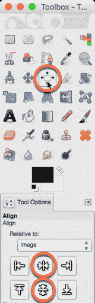

现在转到`File->Overwrite icon.png`保存文件:

[T2】](https://res.cloudinary.com/practicaldev/image/fetch/s--wKxfdpKW--/c_limit%2Cf_auto%2Cfl_progressive%2Cq_auto%2Cw_880/https://i.imgur.com/4C8mzLi.png)

重复该过程以创建闪屏图像，并将其命名为`splash.png`(将其改写为)。我想到的图像是这样的:

[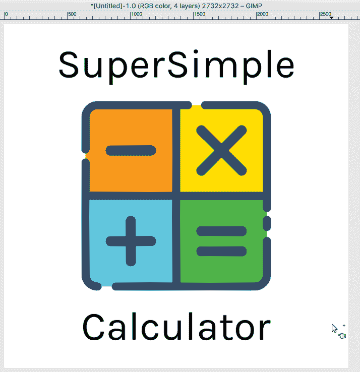T2】](https://res.cloudinary.com/practicaldev/image/fetch/s--GBg3-7lS--/c_limit%2Cf_auto%2Cfl_progressive%2Cq_auto%2Cw_880/https://i.imgur.com/a10DZi5.png)

现在，您已经准备好了**icon.png**和**splash.png**图像，使用您的终端/命令提示符导航到应用程序的根文件夹并运行以下命令:

`ionic cordova resources`

您应该得到以下输出:

```
✔ Collecting resource configuration and source images - done!
✔ Filtering out image resources that do not need regeneration - done!
✔ Uploading source images to prepare for transformations - done!
✔ Generating platform resources: 48 / 48 complete - done!
✔ Modifying config.xml to add new image resources - done! 
```

相反，如果此时出现如下错误:

`[ERROR] No platforms have been added. Please run: ionic cordova platform add`

这意味着你还没有添加任何 Ionic 应该构建的平台。由于我们要为苹果商店和安卓游戏商店构建应用，我们将使用以下两个命令:

```
ionic cordova platform add android
ionic cordova platform add ios 
```

您应该会看到类似如下的输出:

```
ionic cordova platform add ios
> cordova platform add ios --save
✔ Running command - done!
Using cordova-fetch for cordova-ios@~4.4.0
Adding ios project...
Creating Cordova project for the iOS platform:
    Path: platforms/ios
    Package: io.ionic.starter
    Name: MyApp
iOS project created with cordova-ios@4.4.0
Discovered plugin "cordova-plugin-console" in config.xml. Adding it to the project
Installing "cordova-plugin-console" for ios
Adding cordova-plugin-console to package.json
Saved plugin info for "cordova-plugin-console" to config.xml
Discovered plugin "cordova-plugin-device" in config.xml. Adding it to the project
Installing "cordova-plugin-device" for ios
Adding cordova-plugin-device to package.json
Saved plugin info for "cordova-plugin-device" to config.xml
Discovered plugin "cordova-plugin-splashscreen" in config.xml. Adding it to the project
Installing "cordova-plugin-splashscreen" for ios
Adding cordova-plugin-splashscreen to package.json
Saved plugin info for "cordova-plugin-splashscreen" to config.xml
Discovered plugin "cordova-plugin-statusbar" in config.xml. Adding it to the project
Installing "cordova-plugin-statusbar" for ios
Adding cordova-plugin-statusbar to package.json
Saved plugin info for "cordova-plugin-statusbar" to config.xml
Discovered plugin "cordova-plugin-whitelist" in config.xml. Adding it to the project
Installing "cordova-plugin-whitelist" for ios
Adding cordova-plugin-whitelist to package.json
Saved plugin info for "cordova-plugin-whitelist" to config.xml
Discovered plugin "ionic-plugin-keyboard" in config.xml. Adding it to the project
Installing "ionic-plugin-keyboard" for ios
Adding ionic-plugin-keyboard to package.json
Saved plugin info for "ionic-plugin-keyboard" to config.xml
--save flag or autosave detected
Saving ios@~4.4.0 into config.xml file ...
✔ Copying default image resources into ./resources/ios - done!

> cordova platform add android --save
✔ Running command - done!
Using cordova-fetch for cordova-android@~6.2.2
Adding android project...
Creating Cordova project for the Android platform:
    Path: platforms/android
    Package: io.ionic.starter
    Name: MyApp
    Activity: MainActivity
    Android target: android-25
Subproject Path: CordovaLib
Android project created with cordova-android@6.2.3
Installing "cordova-plugin-console" for android
Installing "cordova-plugin-device" for android
Installing "cordova-plugin-splashscreen" for android
Installing "cordova-plugin-statusbar" for android
Installing "cordova-plugin-whitelist" for android

               This plugin is only applicable for versions of cordova-android greater than 4.0\. If you have a previous platform version, you do *not* need this plugin since the whitelist will be built in.

Installing "ionic-plugin-keyboard" for android
--save flag or autosave detected
Saving android@~6.2.3 into config.xml file ...
✔ Copying default image resources into ./resources/android - done! 
```

在此之后，`ionic cordova resources`命令应该工作。

从输出中，您可以看到创建了 48 个图像，希望现在您意识到这样节省了多少时间。所有关于图标和闪屏的配置都是由 Ionic 生成的，并放在 **config.xml** 文件中。

值得注意的是，当使用浏览器测试或 Ionic View 测试时，您既不会看到图标，也不会看到闪屏(在下面的[如何使用 Ionic.io 云服务与其他用户共享我们的应用程序而不通过 app store](#) 部分中有更详细的讨论)。相反，只有当您将它们部署到实际的物理设备或仿真器时，您才会看到它们(我们将在下面的[如何在实际的物理设备和仿真器上测试我们的应用](#)小节中介绍)。

> ⚠️:如果你在 Windows 机器上开发，你可以添加一个 iOS 平台，然后`ionic cordova resources`命令会为它生成图标和闪屏。然而，记住**你不能在你的 Windows 机器**上为 iOS 构建项目。相反，你需要一台 Mac 电脑来完成这项工作。我们将在下面的[如何在真实的物理设备和仿真器](#)上测试我们的应用中更详细地介绍构建应用。

## 如何实现 Google AdMob 广告

如今，你可以通过多种方式用你的应用赚钱，以下是其中几种:

*   **付费应用** -直接在 App/Play 商店为你的应用设定价格，用户在下载你的应用前需要付费
*   免费增值(free mium)-免费提供应用程序，但对应用内购买收费，如添加一些额外的功能(想想游戏应用中更多的黄金或更快的生产)
*   **基于广告的** -在你的应用程序中显示广告。可能提供应用内购买来移除广告

在这里，我们将讨论基于广告的货币化选项，我将向您展示如何将 Google AdMob 广告添加到我们的计算器应用程序中。在 Ionic 项目中实现 Google AdMob 广告有两个部分，我将它们分为 **AdMob 设置**和 **Ionic 设置**。

### AdMob 设置

让我们从 AdMob 设置开始:

1.  在[https://www.google.com/admob/](https://www.google.com/admob/)登录/注册 AdMob
2.  点击**应用**，然后点击**添加应用**按钮:

[T2】](https://res.cloudinary.com/practicaldev/image/fetch/s--4uQLd7C_--/c_limit%2Cf_auto%2Cfl_progressive%2Cq_auto%2Cw_880/https://i.imgur.com/QVyB7xP.png)

1.  由于我们的应用程序尚未发布，我们将点击**否**按钮:

[T2】](https://res.cloudinary.com/practicaldev/image/fetch/s--akWhdcQ3--/c_limit%2Cf_auto%2Cfl_progressive%2Cq_auto%2Cw_880/https://i.imgur.com/0Gv0dMe.png)

1.  填写应用名称和平台，点击**添加**按钮:

[T2】](https://res.cloudinary.com/practicaldev/image/fetch/s---PQGjxBd--/c_limit%2Cf_auto%2Cfl_progressive%2Cq_auto%2Cw_880/https://i.imgur.com/6lvQBKD.png)

1.  将应用 ID 保存在某处，然后继续创建广告单元

[T2】](https://res.cloudinary.com/practicaldev/image/fetch/s--IU9EqxIV--/c_limit%2Cf_auto%2Cfl_progressive%2Cq_auto%2Cw_880/https://i.imgur.com/RtiQyeP.png)

1.  选择横幅广告格式:

[T2】](https://res.cloudinary.com/practicaldev/image/fetch/s--QLhU03_j--/c_limit%2Cf_auto%2Cfl_progressive%2Cq_auto%2Cw_880/https://i.imgur.com/zRG8SgJ.png)

1.  配置添加类型、大小、位置、样式、名称:

[T2】](https://res.cloudinary.com/practicaldev/image/fetch/s--26bnUXfB--/c_limit%2Cf_auto%2Cfl_progressive%2Cq_auto%2Cw_880/https://i.imgur.com/pQYT4uG.png)

1.  您可以阅读关于如何实现 GA 和 AdMob 的其他信息，但现在，我们只需单击“完成”:

[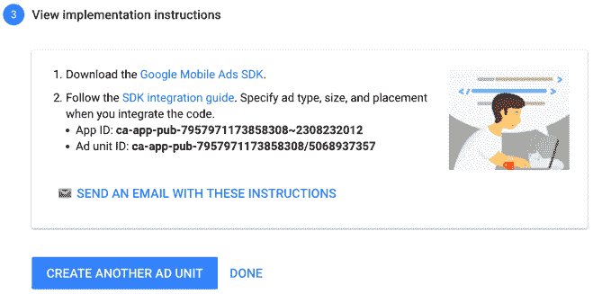T2】](https://res.cloudinary.com/practicaldev/image/fetch/s--UMQ5ihSS--/c_limit%2Cf_auto%2Cfl_progressive%2Cq_auto%2Cw_880/https://i.imgur.com/kbZY18b.png)

1.  您现在将看到以下类似的屏幕:

[T2】](https://res.cloudinary.com/practicaldev/image/fetch/s--SXtSO18I--/c_limit%2Cf_auto%2Cfl_progressive%2Cq_auto%2Cw_880/https://i.imgur.com/MujS4pC.png)

这里最需要注意的是这个**广告单元 ID** ，在我的测试用例中是**ca-app-pub-7957971173858308/5068937357**。记下这个字符串，因为它是这个设置中最重要的部分。*你可以点击“复制到剪贴板”按钮，将它作为评论粘贴到你的应用程序中。*

[T2】](https://res.cloudinary.com/practicaldev/image/fetch/s--5MJmjKz---/c_limit%2Cf_auto%2Cfl_progressive%2Cq_auto%2Cw_880/https://i.imgur.com/6f1MO7a.png)

1.  创建尽可能多的广告单元(针对每个平台[iOS、Android]和广告格式[横幅广告、插播广告等]。]).在我的例子中，我刚刚创建了额外的插播广告，并将在 iOS 和 Android 设备上使用它们进行演示。

[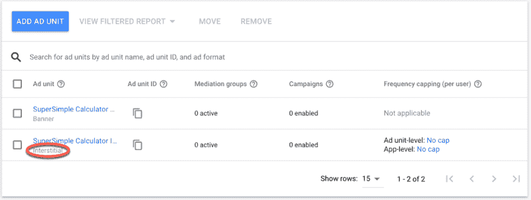T2】](https://res.cloudinary.com/practicaldev/image/fetch/s--8Q9V9tAM--/c_limit%2Cf_auto%2Cfl_progressive%2Cq_auto%2Cw_880/https://i.imgur.com/6qb2dum.png)

### 离子设置

熟悉 Ionic 1 的人都知道，多亏了名为 [ngCordova](http://ngcordova.com/) 的项目，你可以在 Ionic 项目中添加任何插件。对于爱奥尼亚 3，也有同样的东西叫做[爱奥尼亚原生](https://ionicframework.com/docs/native/)。

Ionic Native 是一个用于 Cordova/PhoneGap 插件的 TypeScript 包装器，它可以轻松地将您可能需要的任何本机功能添加到 Ionic 应用程序中。Ionic Native 将插件回调封装在一个 Promise 或 Observable 中，为所有插件提供一个公共接口，并确保 Native 事件触发 Angular 中的变化检测。

使用您的终端/命令提示符导航到应用程序的根目录，并执行以下命令来添加 [cordova-plugin-admobpro](https://ionicframework.com/docs/native/admob-pro/) 插件:

`ionic cordova plugin add cordova-plugin-admobpro`

运行该命令后，您应该会看到以下输出:

```
> cordova plugin add cordova-plugin-admobpro --save
✔ Running command - done!
Installing "cordova-plugin-admobpro" for android
Installing "cordova-plugin-extension" for android
Subproject Path: CordovaLib
Installing "cordova-plugin-admobpro" for ios
Plugin dependency "cordova-plugin-extension@1.5.1" already fetched, using that version.
Installing "cordova-plugin-extension" for ios
Adding cordova-plugin-admobpro to package.json
Saved plugin info for "cordova-plugin-admobpro" to config.xml 
```

此外，您还需要运行以下命令:

`npm install --save @ionic-native/admob-pro`

如果成功完成，只会向控制台输出类似于`added 1 package in 4.443s`的内容。

您还需要添加第二个命令，因为这将安装 TypeScript 所需的一些文件。

> ⚠️:此时，根据您拥有的 Ionic CLI 版本，您可能需要通过执行:`ionic cordova platform add ios`或`ionic cordova platform add android`来添加平台，这取决于您尝试构建的平台。如果命令`ionic cordova platform ls`显示你在当前项目中没有安装任何平台，你必须执行这个命令:
> 
> ```
> → ionic cordova platform ls
> ✔ cordova platform ls - done!
> Installed platforms:
> Available platforms: 
>  android ~6.2.2
>  blackberry10 ~3.8.0 (deprecated)
>  browser ~4.1.0
>  ios 4.4.0
>  osx ~4.0.1
>  webos ~3.7.0 
> ```
> 
> 如果运行`ionic cordova platform add ios`一切正常，您将看到如下输出:
> 
> ```
> Using cordova-fetch for cordova-ios@~4.4.0
> Adding ios project...
> Creating Cordova project for the iOS platform:
>     Path: platforms/ios
>     Package: io.ionic.starter
>     Name: MyApp
> iOS project created with cordova-ios@4.4.0
> Installing "cordova-plugin-admobpro" for ios
> Installing "cordova-plugin-extension" for ios
> Discovered plugin "cordova-plugin-console" in config.xml. Adding it to > the project
> Installing "cordova-plugin-console" for ios
> Adding cordova-plugin-console to package.json
> Saved plugin info for "cordova-plugin-console" to config.xml
> Discovered plugin "cordova-plugin-device" in config.xml. Adding it to > the project
> Installing "cordova-plugin-device" for ios
> Adding cordova-plugin-device to package.json
> Saved plugin info for "cordova-plugin-device" to config.xml
> Discovered plugin "cordova-plugin-splashscreen" in config.xml. Adding > it to the project
> Installing "cordova-plugin-splashscreen" for ios
> Adding cordova-plugin-splashscreen to package.json
> Saved plugin info for "cordova-plugin-splashscreen" to config.xml
> Discovered plugin "cordova-plugin-statusbar" in config.xml. Adding it > to the project
> Installing "cordova-plugin-statusbar" for ios
> Adding cordova-plugin-statusbar to package.json
> Saved plugin info for "cordova-plugin-statusbar" to config.xml
> Discovered plugin "cordova-plugin-whitelist" in config.xml. Adding it > to the project
> Installing "cordova-plugin-whitelist" for ios
> Adding cordova-plugin-whitelist to package.json
> Saved plugin info for "cordova-plugin-whitelist" to config.xml
> Discovered plugin "ionic-plugin-keyboard" in config.xml. Adding it to > the project
> Installing "ionic-plugin-keyboard" for ios
> Adding ionic-plugin-keyboard to package.json
> Saved plugin info for "ionic-plugin-keyboard" to config.xml
> --save flag or autosave detected
> Saving ios@~4.4.0 into config.xml file ...
> ✔ Copying default image resources into ./resources/ios - done! 
> ```

Btw，AdMob Pro 插件还有一个[免费版](https://ionicframework.com/docs/native/admob-free/)。但是，老实说，如果你真的开始用你的应用赚钱，这将是一个小开销。*此外，如果你在归还你赚钱的插件时遇到问题，那么我亲爱的学徒，你还有很多要学的...*🤔

现在，让我们将这个插件添加到我们应用程序的 NgModule 中。在`src/app/app.module.ts`文件中导入 AdmobPro:

`import { AdMobPro } from '@ionic-native/admob-pro';`

然后将其添加到 Providers 数组中。`src/app/app.module.ts`文件的全部内容现在应该是这样的:

```
import { NgModule, ErrorHandler } from '@angular/core';
import { BrowserModule } from '@angular/platform-browser';
import { IonicApp, IonicModule, IonicErrorHandler } from 'ionic-angular';
import { MyApp } from './app.component';
import { CalculatorPage } from '../pages/calculator/calculator';

import { StatusBar } from '@ionic-native/status-bar';
import { SplashScreen } from '@ionic-native/splash-screen';
import { AdMobPro } from '@ionic-native/admob-pro';

@NgModule({
    declarations: [
        MyApp,
        CalculatorPage
    ],
    imports: [
        BrowserModule,
        IonicModule.forRoot(MyApp)
    ],
    bootstrap: [IonicApp],
    entryComponents: [
        MyApp,
        CalculatorPage
    ],
    providers: [
        StatusBar,
        SplashScreen,
        AdMobPro,
        { provide: ErrorHandler, useClass: IonicErrorHandler }
    ]
})
export class AppModule { } 
```

现在，我将向您展示`src/pages/calculator/calculator.ts`文件的最终内容，并逐步解释什么被更改:

```
import { Component } from '@angular/core';
import { NavController } from 'ionic-angular';
import { AlertController } from 'ionic-angular';

import { AdMobPro } from '@ionic-native/admob-pro';
import { Platform } from 'ionic-angular';

@Component({
    selector: 'page-calculator',
    templateUrl: 'calculator.html'
})
export class CalculatorPage {
    constructor(public navCtrl: NavController, private alertCtrl: AlertController, private admob: AdMobPro, private platform: Platform) {
        this.platform.ready().then(() => {
            var admobid = {
                banner: 'ca-app-pub-7957971173858308/5068937357',
                interstitial: 'ca-app-pub-7957971173858308/5667703151'
            };

            this.admob.createBanner({
                adId: admobid.banner,
                isTesting: true,
                autoShow: true,
                position: this.admob.AD_POSITION.BOTTOM_CENTER
            })

            this.admob.prepareInterstitial({
                adId: admobid.interstitial,
                isTesting: true,
                autoShow: false
            })
        });
    }

    result = '';
    counter = 1;

    showInterstitialAd() {
        if (AdMobPro) {
            this.admob.showInterstitial();
        }
    }

    btnClicked(btn) {
        if (btn == 'C') {
            this.result = '';
        }
        else if (btn == '=') {
            if (this.result == '') {
                return;
            }

            try {
                this.result = eval(this.result).toFixed(2);

                if (this.counter++ == 5) {
                    this.showInterstitialAd();
                    this.counter = 0;
                }
            } catch (error) {
                this.showAlert();
                this.result = '';
            }
        }
        else {
            this.result += btn;
        }
    }

    showAlert() {
        this.alertCtrl.create({
            title: 'Malformed input',
            subTitle: 'Ooops, please try again...',
            buttons: ['Dismiss']
        }).present();
    }
} 
```

首先，我们添加了导入:

```
import { AdMobPro } from '@ionic-native/admob-pro';
import { Platform } from 'ionic-angular'; 
```

然后，通过构造函数，我们引入了平台和 AdMobPro:

```
constructor(public navCtrl: NavController, private alertCtrl: AlertController, private admob: AdMobPro, private platform: Platform) { } 
```

然后我们把一切都包在承诺里。这是**代码中最重要的**部分！如果你不这样做，你的应用程序可能会启动，插件仍然没有正确设置，你看不到显示的广告。

但话说回来，有时你会，这是它会使调试成为一场噩梦。这是一个非常常见的问题，我甚至在 Ionic 1 上回答 [StackOverflow](https://stackoverflow.com/users/534755/nikola?tab=answers) 上的问题时都见过。因此，您可能希望保留一个👁️强调，你需要将任何插件调用封装在`platform.ready()`承诺中，这样你就可以确保在使用之前所有的插件都已加载。

promise 解析后执行的代码用`banner`和`interstitial`属性设置我们的`admobid`对象。然后我们在注入的`admob`对象上调用`createBanner`和`prepareInterstitial`函数。请注意，横幅设置为当应用程序加载时自动显示(`autoShow: true`)，而 interstitial 没有。另外，请注意，我们已经将横幅广告的位置设置在底部:

```
this.platform.ready().then(() => {
    var admobid = {
        banner: 'ca-app-pub-7957971173858308/5068937357',
        interstitial: 'ca-app-pub-7957971173858308/5667703151'
    };

    this.admob.createBanner({
        adId: admobid.banner,
        isTesting: true,
        autoShow: true,
        position: this.admob.AD_POSITION.BOTTOM_CENTER
    })

    this.admob.prepareInterstitial({
        adId: admobid.interstitial,
        isTesting: true,
        autoShow: false
    })
}); 
```

然后我们添加了`showshowInterstitialAdAd`函数，显示了插播广告:

```
showInterstitialAd() {
    if (AdMobPro) {
        this.admob.showInterstitial();
    }
} 
```

当然，此时，将`adId`变量更改为您在第一部分(步骤 9)中获得的`admob_key`。另外，当你发布你的应用时，不要忘记将`isTesting`变量改为`false`。*别担心，到了那一部分我会提醒你的。*

> 👋如果你在这方面遇到任何问题，只需在评论中输入，我会尽力帮助你。

你可能不得不为 Android 做的一件常见的事情是通过 Android SDK 管理器安装一些额外的东西。为此，打开 Android Studio 并选择`Configure->SDK Manager`:

[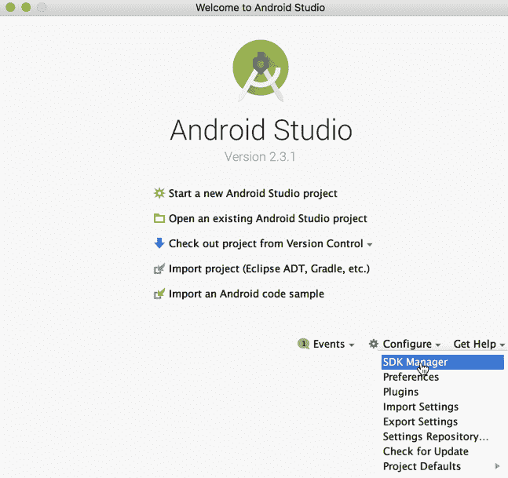T2】](https://res.cloudinary.com/practicaldev/image/fetch/s--BNn61UVi--/c_limit%2Cf_auto%2Cfl_progressive%2Cq_auto%2Cw_880/https://i.imgur.com/i4DL8zk.png)

确保你已经安装了下图中标有 **Installed** 的软件包(通常是**谷歌计费库**和**谷歌游戏服务**):

[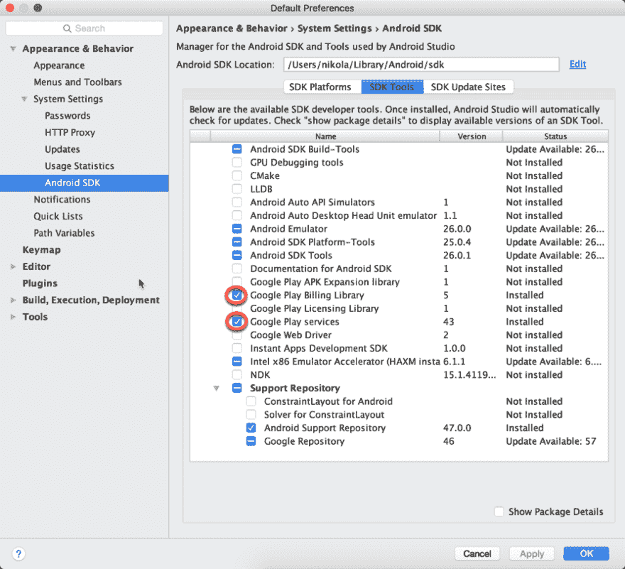T2】](https://res.cloudinary.com/practicaldev/image/fetch/s--f330uIDz--/c_limit%2Cf_auto%2Cfl_progressive%2Cq_auto%2Cw_880/https://i.imgur.com/dcM2rDs.png)

关于 Android SDK 管理器的更多信息，请看关于如何在真实的物理设备和模拟器上测试我们的应用程序的章节。

### 你应该展示什么样的广告？

这个插件的文档陈述了一个有趣的事实，强烈推荐使用间隙广告类型，因为它带来的利润是横幅广告的 10 倍以上。下面是来自官方文件的表格:

| 广告格式 | 旗帜 | 空隙的 |
| --- | --- | --- |
| 点击率 | < 1% | 3-15% |
| RPM (1k 印数) | 0.5$ - 4$ | 10-50$ |

> 横幅广告是通常放置在屏幕底部的小广告，而间隙广告是覆盖主机应用程序界面的全屏广告。因此，你可能宁愿选择这种广告，而不是横幅广告。

值得注意的是，这里可能没有关于何时显示插播广告的确切公式，但有一些最佳实践，这是谷歌对此的说法:

> 插播广告在有自然过渡点的应用中效果最好。一个应用程序中的一个任务的结束，比如分享一张图片或完成一个游戏关卡，就创造了这样一个点。因为用户希望在动作中有所停顿，所以很容易在不破坏用户体验的情况下呈现一个插播广告。请确保您考虑了在应用程序工作流程的哪些点上显示间隙，以及用户可能会如何回应。

你可以在这里了解更多。

无论如何，正如你在我上面的演示代码中看到的，我选择了一直在屏幕底部显示横幅广告，并且每当用户点击`=`按钮时，我都会显示插页广告。你可以在你的应用中随意调整，但是请记住上面提到的关于最佳实践的几点。

## 如何使用 Ionic.io 云服务与其他用户分享我们的应用，而无需通过 app store

能够立即获得关于您正在进行的工作的反馈，而不必在您的客户端设备上手动安装应用程序或等待 App Store/Play Store 的批准，这对于持续的反馈循环是不可或缺的，这在快速应用程序开发中至关重要。这是 Eric Ries 在他的书[精益创业](http://www.nikola-breznjak.com/blog/books/the-lean-startup-eric-ries/) 中强调的。

在 Ionic 中，这比您想象的要简单。你所要做的就是在 [https://apps.ionic.io](https://apps.ionic.io) 上创建账户，然后在你的终端/命令提示符下，在项目的根目录下输入以下命令:

`ionic upload`

这将提示您使用您在上一步中创建的用户名和密码组合登录。成功登录后，应用程序将被上传到 Ionic.io 云服务，您将能够通过名为 [Ionic View](http://view.ionic.io/) 的应用程序查看应用程序，您可以从 App Store/Play Store 免费下载到智能手机上。

上述命令的输出很短:

```
[INFO] Running app-scripts build: 

[09:55:39]  build dev started ... 
[09:55:39]  clean started ... 
[09:55:39]  clean finished in 2 ms 
[09:55:39]  copy started ... 
[09:55:39]  transpile started ... 
[09:55:42]  transpile finished in 2.30 s 
[09:55:42]  preprocess started ... 
[09:55:42]  deeplinks started ... 
[09:55:42]  deeplinks finished in 4 ms 
[09:55:42]  preprocess finished in 5 ms 
[09:55:42]  webpack started ... 
[09:55:42]  copy finished in 2.44 s 
[09:55:47]  webpack finished in 5.10 s 
[09:55:47]  sass started ... 
[09:55:48]  sass finished in 1.39 s 
[09:55:48]  postprocess started ... 
[09:55:48]  postprocess finished in 4 ms 
[09:55:48]  lint started ... 
[09:55:48]  build dev finished in 8.84 s 
> ionic cordova prepare
> cordova prepare
✔ Running command - done!

[09:55:50]  lint finished in 1.87 s 
✔ Requesting snapshot upload - done!
✔ Uploading snapshot - done!
[OK] Uploaded snapshot 19a5c87e-92aa-4757-b2c0-1c24e7ee9657! 
```

并且，如输出中所述，要与客户或朋友分享您的应用，无需首先通过 App Store/Play Store，转到 [https://apps.ionic.io](https://apps.ionic.io) 并在`Settings->Collaborators`部分添加测试人员的电子邮件:

[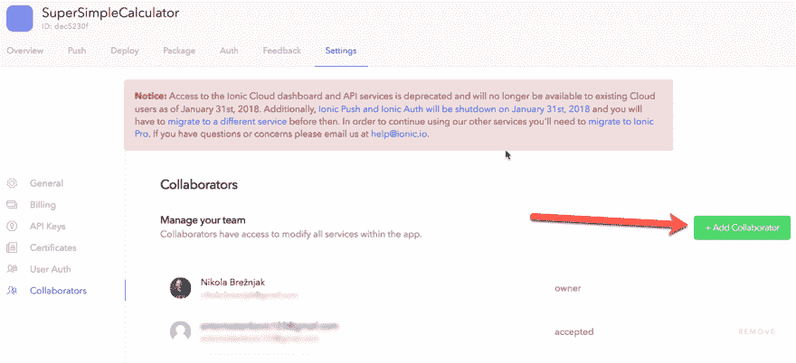T2】](https://res.cloudinary.com/practicaldev/image/fetch/s--pbsqtj-U--/c_limit%2Cf_auto%2Cfl_progressive%2Cq_auto%2Cw_880/https://i.imgur.com/zFEikV0.png)

用户将收到一封电子邮件，指导他完成设置:

[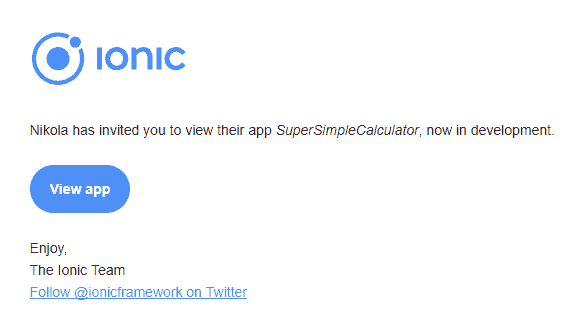T2】](https://res.cloudinary.com/practicaldev/image/fetch/s--7ngQX63f--/c_limit%2Cf_auto%2Cfl_progressive%2Cq_auto%2Cw_880/https://i.imgur.com/MhDL7Fn.png)

> 来自 Ionic 1 并且习惯了`ionic share EMAIL`命令的⚠️，如果你运行它，你会得到下面的错误信息:
> ionic share[some.email@mail.com](mailto:some.email@mail.com)
> 
> ```
> [ERROR] ionic share has been removed as of CLI 3.0.
> The functionality now exists in the Ionic Dashboard: https://apps.ionic.io 
> ```

如果您会得到这样的错误:

> [错误]您的项目文件(。/ionic.config.json)不包含“app_id”。运行离子连接。

然后执行命令`ionic link`并在终端中选择`Create new app`选项。这将把你带到网络界面，你必须输入你的应用程序的名称，然后点击`Create App`按钮:

[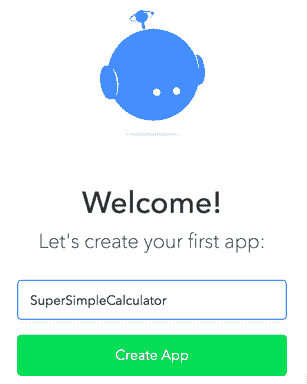T2】](https://res.cloudinary.com/practicaldev/image/fetch/s--7ZsbPlvG--/c_limit%2Cf_auto%2Cfl_progressive%2Cq_auto%2Cw_880/https://i.imgur.com/nbw0K3W.png)

创建应用程序后，您会看到如下内容:

[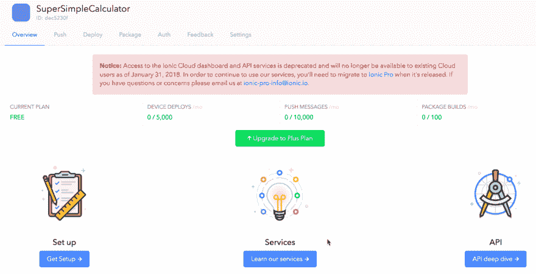T2】](https://res.cloudinary.com/practicaldev/image/fetch/s--WqaKhqrD--/c_limit%2Cf_auto%2Cfl_progressive%2Cq_auto%2Cw_880/https://i.imgur.com/yzndfCE.png)

现在回到你的终端，再次运行`ionic link`，选择你的应用程序的名字。您应该会看到类似这样的输出:

```
✔ Looking up your apps - done!
? Which app would you like to link SuperSimpleCalculator (dec5230f)
> ionic config set app_id dec5230f
[OK] app_id set to dec5230f in ./ionic.config.json!
[OK] Project linked with app dec5230f! 
```

现在您可以重新运行`ionic upload`命令，并得到一个输出，表明您的应用程序的快照已经上传。

一旦你的客户/测试人员/朋友收到成为合作者的电子邮件，他将被引导设置 Ionic View 并查看你的应用。

然而，你的客户/朋友还有一种方法可以试用这款应用。首先，告诉他们从 App Store/Play Store 下载`Ionic View`应用:

[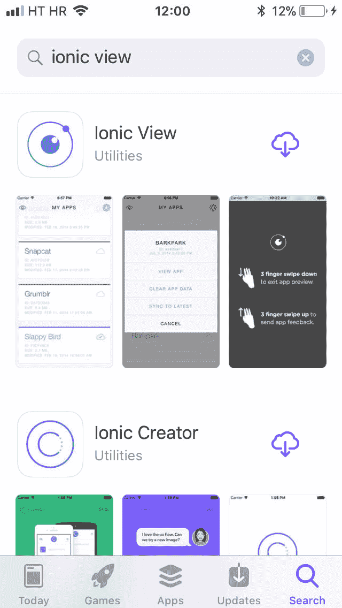T2】](https://res.cloudinary.com/practicaldev/image/fetch/s--t2NphRF1--/c_limit%2Cf_auto%2Cfl_progressive%2Cq_auto%2Cw_880/https://i.imgur.com/83VYnPu.jpg)

他们必须注册(这是免费的):

[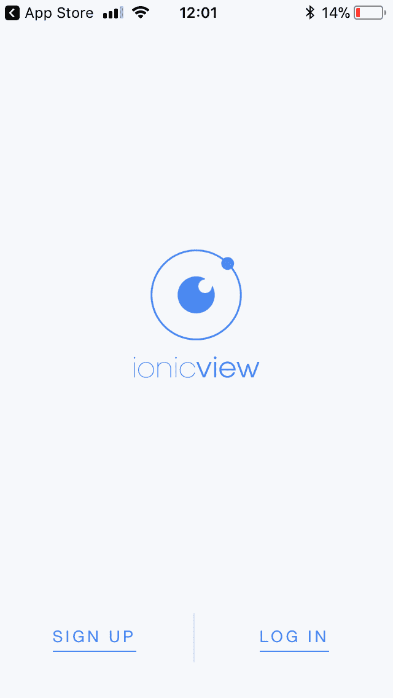T2】](https://res.cloudinary.com/practicaldev/image/fetch/s--JppUOVlw--/c_limit%2Cf_auto%2Cfl_progressive%2Cq_auto%2Cw_880/https://i.imgur.com/hquQZiP.png)

一旦登录，他们必须点击`PREVIEW A SHARED APP`按钮:

[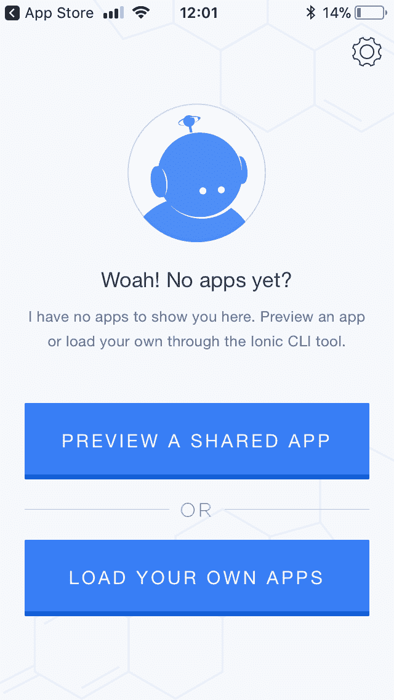T2】](https://res.cloudinary.com/practicaldev/image/fetch/s--yVOgt7j3--/c_limit%2Cf_auto%2Cfl_progressive%2Cq_auto%2Cw_880/https://i.imgur.com/mpwVTyb.png)

在这一点上，他们将不得不输入你的应用程序 Id，你必须发送给他们(松弛，电子邮件，信使，选择你的🍹).你可以在[离子仪表盘](https://apps.ionic.io/apps/)中找到你的 id。在我的例子中，id 是`dec523f`:

[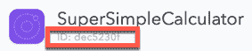T2】](https://res.cloudinary.com/practicaldev/image/fetch/s--jWzCPhnG--/c_limit%2Cf_auto%2Cfl_progressive%2Cq_auto%2Cw_880/https://i.imgur.com/aeTiNRk.png)

他们必须在表格中输入这个 id，然后点击`LOAD APP`按钮:

[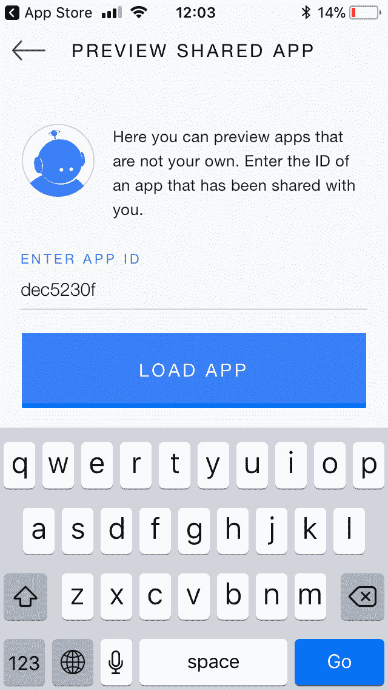T2】](https://res.cloudinary.com/practicaldev/image/fetch/s--ObSQIy80--/c_limit%2Cf_auto%2Cfl_progressive%2Cq_auto%2Cw_880/https://i.imgur.com/xP3gdLs.png)

他们将看到以下屏幕，其中包含如何使用该应用程序的说明:

[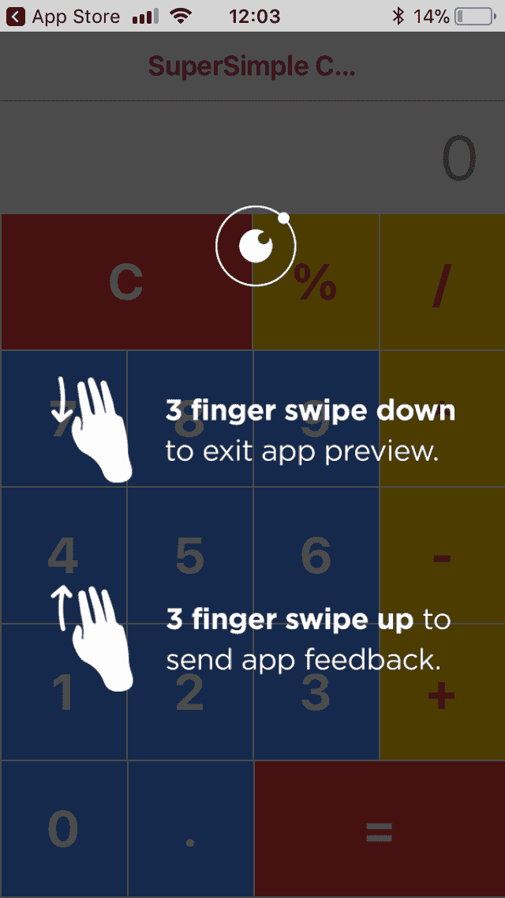T2】](https://res.cloudinary.com/practicaldev/image/fetch/s--rrFCR27C--/c_limit%2Cf_auto%2Cfl_progressive%2Cq_auto%2Cw_880/https://i.imgur.com/HF38QpU.png)

你会注意到我们在这个版本中看不到广告，因为 Ionic View 不支持 AdMob 插件:

[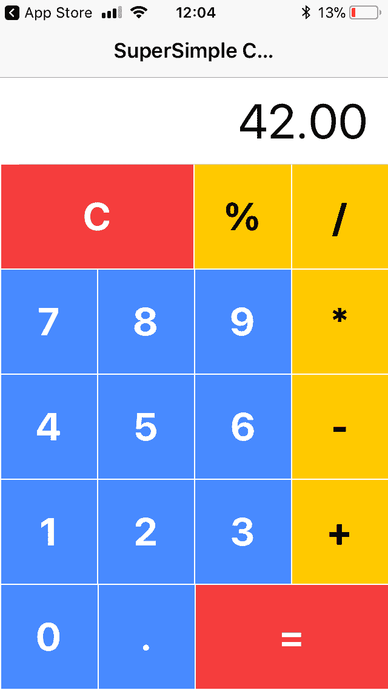T2】](https://res.cloudinary.com/practicaldev/image/fetch/s--7HClh3pc--/c_limit%2Cf_auto%2Cfl_progressive%2Cq_auto%2Cw_880/https://i.imgur.com/SsrW20K.png)

足以说；你亲爱的读者也可以通过你自己的 Ionic View 应用程序来尝试一下。

## 如何在真实的物理设备和仿真器上测试我们的应用程序

如果您在浏览器中运行应用程序(添加了 AdMob ),您将在浏览器的控制台输出中看到几条通知，说明 AdMob 未定义:

[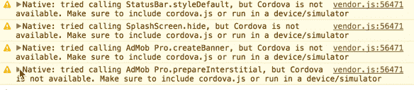T2】](https://res.cloudinary.com/practicaldev/image/fetch/s--5rZ4cp8W--/c_limit%2Cf_auto%2Cfl_progressive%2Cq_auto%2Cw_880/https://i.imgur.com/kQCK5sj.png)

此外，如果你在 Ionic View 中查看应用程序，你会注意到没有广告会出现。这是因为 **Cordova 插件不能在浏览器中工作，也不能在 Ionic 视图**中工作。相反，它们必须在真实设备或模拟器上进行测试(在 iOS 术语中使用了`simulator`这个词)。仅供参考，有一些[插件](http://docs.ionic.io/tools/view/#supported-plugins)可以在 Ionic 视图中工作。

在这一节中，我们将展示如何安装所需的先决条件，以及如何在模拟器/仿真器中和在 iOS 和 Android 的实际物理设备上运行我们的应用程序。

### iOS 设置

开发原生 iOS 应用的主要工具是 [Xcode](https://developer.apple.com/xcode/) 。Xcode 值得称赞地免费下载，它附带了许多模拟器，您可以在其中看到您的应用程序在真实设备上的样子。

然而，如果你想在 App Store 上构建和部署 iOS 应用程序，你需要一台 Mac 电脑，因为 Xcode 只能在他们的操作系统上运行。是的，**即使你用的是 Ionic，你也需要用 Xcode** 来构建 iOS 的应用。

有一些方法可以解决这个问题，比如使用所谓的 [Hackintosh](http://www.hackintosh.com/) 电脑，但老实说，从我的经验来看，这不值得。

如果你真的反苹果🤔，那么您会很高兴知道有一些服务允许您[在云中](http://www.macincloud.com/)租用一台苹果电脑，正好满足您构建应用程序的需要。此外，爱奥尼亚还提供所谓的服务，允许您为任何支持的平台构建移动应用，即使您没有苹果电脑。我们这里不涉及这个，但是您可以看看[官方包价服务](https://docs.ionic.io/services/package/)文件。

> 为了在 App Store 中发布一个应用程序(或者在你自己的 iOS 设备上测试,**,你需要购买*苹果开发者计划*的许可证，每年**花费 99 美元**。你需要在 http://developer.apple.com 注册，但是现在不要担心这个；我们将在下一个教程中介绍所有步骤，我将指导您完成为苹果应用商店和谷歌 Play 商店部署应用程序的过程。**

#### 安装需要的工具

正如我们之前提到的，你需要安装 Xcode，你可以通过在 Mac 上打开 App Store 应用程序并搜索 Xcode 来完成。你可以像安装其他应用程序一样，点击下载按钮，然后按照下一步下一种安装方式进行安装。

[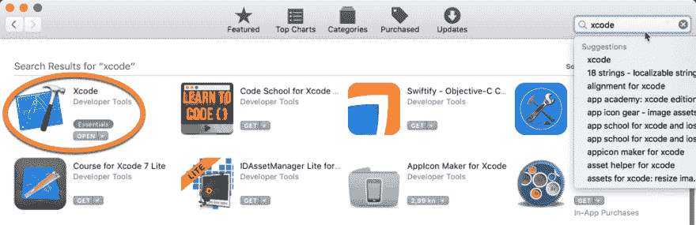T2】](https://res.cloudinary.com/practicaldev/image/fetch/s--huJpjJQh--/c_limit%2Cf_auto%2Cfl_progressive%2Cq_auto%2Cw_880/https://i.imgur.com/pERZ1hO.png)

安装完成后，打开 Xcode，导航到`Xcode -> Preferences -> Downloads`标签。在这里你可以下载最新版本的模拟器。就我而言，在撰写本文时，最新版本是 iOS 11.0 模拟器，正如你在下图中看到的:

[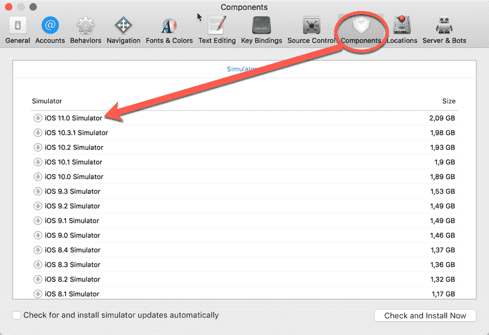T2】](https://res.cloudinary.com/practicaldev/image/fetch/s--vVE4Zig6--/c_limit%2Cf_auto%2Cfl_progressive%2Cq_auto%2Cw_880/https://i.imgur.com/Vocnyw1.png)

此外，我们需要安装带有 npm 的 ios-sim 软件包:

`npm install -g ios-sim`

#### 在模拟器中运行我们的应用程序

现在，要在模拟器中测试我们的应用程序，我们只需执行以下命令:

`ionic cordova emulate ios`

在一堆含糊不清的信息之后，你应该会看到一个 Xcode 模拟器打开，显示你的令人敬畏的应用程序，以及闪屏和广告:

[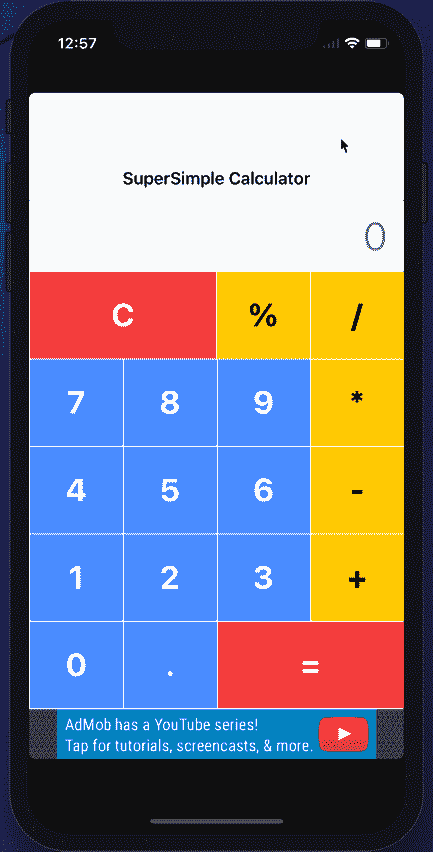T2】](https://res.cloudinary.com/practicaldev/image/fetch/s--al1xkzgG--/c_limit%2Cf_auto%2Cfl_progressive%2Cq_auto%2Cw_880/https://i.imgur.com/oGtFIad.png)

> ⚠️:如果你遇到这样的错误:
> 
> ```
> ** BUILD SUCCEEDED **
> Error: Cannot read property 'replace' of undefined
> [ERROR] An error occurred while running cordova emulate ios (exit code 1). 
> ```
> 
> 然后执行以下命令(如果在 Windows 上，不要使用 sudo):
> 
> ```
> cd platforms/ios/cordova/node_modules/ && sudo npm install ios-sim@latest 
> ```
> 
> 在这之后，重复仿真命令，一切都会好的。
> 
> *当然是在项目的根目录下运行`ionic cordova emulate ios`命令，而不是在`/platforms/ios/cordova/node_modules`文件夹下！*

如果你通过做五次计算来测试应用程序，那么在你第五次按下等号按钮`=`后，插页广告就会出现，如下图所示:

[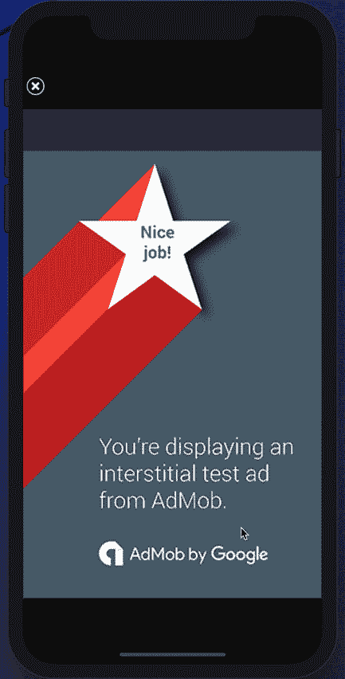T2】](https://res.cloudinary.com/practicaldev/image/fetch/s--04K70tv4--/c_limit%2Cf_auto%2Cfl_progressive%2Cq_auto%2Cw_880/https://i.imgur.com/MVeUMpw.png)

如果你退出模拟器回到主屏幕(按“Command (⌘) + Shift + H”)，你会看到应用程序的图标:

[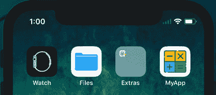T2】](https://res.cloudinary.com/practicaldev/image/fetch/s--bpiMO1Vf--/c_limit%2Cf_auto%2Cfl_progressive%2Cq_auto%2Cw_880/https://i.imgur.com/ciMninE.png)

当你在浏览器中用`ionic lab`测试你的应用程序时，你就有了很棒的实时重载功能。如果您使用额外的`-l`标志运行模拟器，您也可以在模拟器中使用它。如果您还想看到`console.log`输出，就像您在浏览器中看到的那样，那么您必须添加`–c`标志:

 ``ionic cordova emulate ios -lc`` 

 ``> 因为我们需要有一个 Apple 开发者帐户来在我们的物理手机设备上运行应用程序，所以我们将在下一个教程中讨论这个问题，在下一个教程中，我们还将展示如何将应用程序部署到实际的应用程序商店。
> 
> ⚠️在我写这篇文章的时候，你可以在 iOS 11 模拟器的更新截图中看到，这款应用还没有准备好 iOS 11。然而，任何人将重新遵循本教程，并将拥有最新的`ionic`和`cordova` npm 包，将不会有这个问题，因为 Ionic 团队在 iPhone X 发布时及时修复了一切。更多信息请看[官方博文](https://blog.ionic.io/ios-11-checklist/)。如果你想更新你的 Ionic 1 应用程序，让它在 iPhone X 上看起来更好，看看[这个教程](http://www.nikola-breznjak.com/blog/javascript/ionic/make-ionic-1-app-look-good-iphone-x/)。

### 安卓设置

Android 开发没有关于操作系统的先决条件；您可以在 Mac、Linux 和 Windows 电脑上为 Android 开发。

Android 为开发者提供了一些工具，可以从他们的[网站](https://developer.android.com/index.html)上免费获得。

> 💰要在 Play Store 发布应用程序，你需要购买*开发者计划*许可，只需**25 美元的一次性费用**。你需要在 https://play.google.com/apps/publish/signup/的[报名，但是就像之前说的——不要担心；我们将在下一个教程中介绍所有的步骤。](https://play.google.com/apps/publish/signup/)

#### 安装需要的工具

从[https://developer.android.com/studio/index.html](https://developer.android.com/studio/index.html)下载 Android Studio

[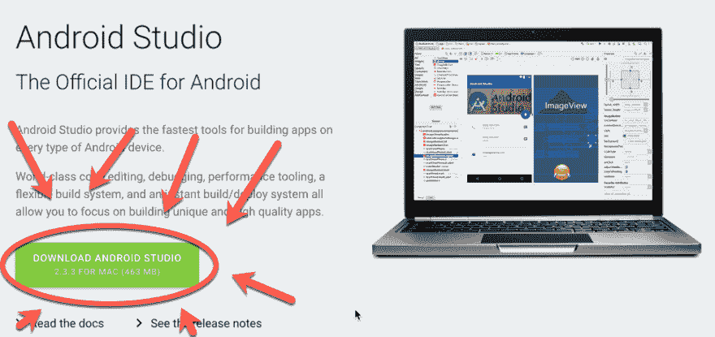T2】](https://res.cloudinary.com/practicaldev/image/fetch/s--GJ1CGFLL--/c_limit%2Cf_auto%2Cfl_progressive%2Cq_auto%2Cw_880/https://i.imgur.com/L8FiYYp.png)

安装是一个简单的 NextNext 类型的安装，但是如果你遇到困难，他们有很棒的官方文档。

接下来，你需要设置所谓的`PATH`变量来指向 Android SDK 工具。你可以打开 Android Studio 找到路径，选择`Configure->SDK Manager`选项，复制`Android SDK Location`:

[T2】](https://res.cloudinary.com/practicaldev/image/fetch/s--f330uIDz--/c_limit%2Cf_auto%2Cfl_progressive%2Cq_auto%2Cw_880/https://i.imgur.com/dcM2rDs.png)

在 Mac 上，可以这样设置`PATH`变量:

`export PATH=$PATH:/Users/nikola/Library/Android/sdk/tools/`。

你可能想把这一行放到你的`.bash_profile`(或者你可能有的任何相关的比如`.zshrc`)文件中。关于如何设置`PATH`变量的更多细节，你可以看看[这篇教程](http://www.cyberciti.biz/faq/appleosx-bash-unix-change-set-path-environment-variable/)。

至于**窗口**，命令将是:

`set PATH=%PATH%;C:\Dev\android-sdk\tools`

> ⚠️ *老实说，你在尝试使用它的时候可能会遇到一些错误，我已经在 StackOverflow 上回答了不少问题。所以，如果你在这一点上遇到了困难，请在评论中给我留言，我会尽力帮助你的。*

一旦为您的操作系统正确设置了 PATH 变量，您可以通过打开终端/命令提示符并键入以下命令来检查它是否正确:

`android`

您应该会得到与下面类似的输出:

``
安卓`

 `* * *

不推荐使用“android”命令。
手动 SDK、AVD、项目管理，请使用 Android Studio。
对于命令行工具，使用 tools/bin/sdkmanager 和 tools/bin/avdmanager

* * *

无效或不支持的命令“”

支持的命令有:
安卓列表目标
安卓列表 avd
安卓列表设备
安卓创建 avd
安卓移动 avd
安卓删除 avd
安卓列表 sdk
安卓更新 sdk
`

 `> 您可能会收到一条消息，提示您没有安装 java 工具:
> 
> [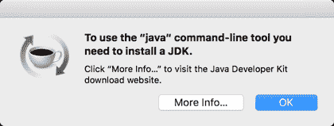T2】](https://res.cloudinary.com/practicaldev/image/fetch/s--sz4xww7m--/c_limit%2Cf_auto%2Cfl_progressive%2Cq_auto%2Cw_880/https://i.imgur.com/Xnr9ny5.png)
> 
> 在这种情况下，点击`More Info...`按钮，你将被引导到他们的网站，在那里你必须点击`DOWNLOAD`按钮(确保你点击了 JDK 的那个): [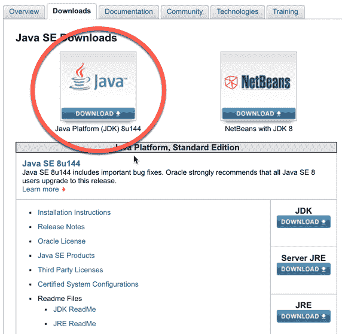](https://res.cloudinary.com/practicaldev/image/fetch/s--Hv9F5Np5--/c_limit%2Cf_auto%2Cfl_progressive%2Cq_auto%2Cw_880/https://i.imgur.com/MNc2bL1.png) ，然后在下一个屏幕上，点击`Accept License Agreement`并选择你的操作系统:
> [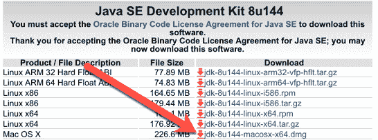](https://res.cloudinary.com/practicaldev/image/fetch/s--HO-OIx3O--/c_limit%2Cf_auto%2Cfl_progressive%2Cq_auto%2Cw_880/https://i.imgur.com/AdjqTws.png) 
> 。dmg 文件(在 Mac OS 上)并完成下一步下一种类型的安装。如果你用的是 Windows，为你的操作系统做适当的选择。

最后，您需要设置 SDK 包。对于在这一领域工作时间较长的人来说，您会记得您必须通过终端/命令提示符来做所有事情。具体来说，为此您必须输入:

`android sdk`

但是，使用 Android Studio 的新版本，正如您在之前的终端输出中看到的，您不必这样做。打开 SDK 管理器的方法是打开 Android Studio，然后点击`Configure->SDK Manager`:

[T2】](https://res.cloudinary.com/practicaldev/image/fetch/s--BNn61UVi--/c_limit%2Cf_auto%2Cfl_progressive%2Cq_auto%2Cw_880/https://i.imgur.com/i4DL8zk.png)

我建议您只下载最新的软件包，如下图所示。很可能你已经安装了除了谷歌游戏服务和 T2 谷歌游戏计费库之外的所有东西。

[T2】](https://res.cloudinary.com/practicaldev/image/fetch/s--ipXumc4p--/c_limit%2Cf_auto%2Cfl_progressive%2Cq_auto%2Cw_880/https://i.imgur.com/yUAQyTO.png)

确保你只下载你需要的平台。在下图中，只安装了 Android 7.1.1(牛轧糖)版本:

[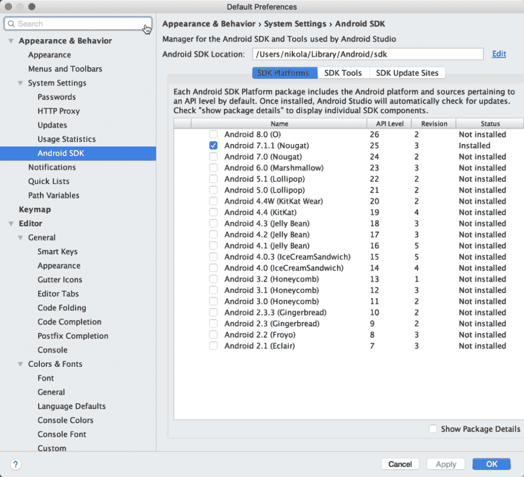T2】](https://res.cloudinary.com/practicaldev/image/fetch/s--GWB7dcRd--/c_limit%2Cf_auto%2Cfl_progressive%2Cq_auto%2Cw_880/https://i.imgur.com/3FypyHO.png)

现在运行`ionic cordova build android`，用 Android Studio 打开文件夹`platforms/android/`(点击`Open an existing Android Studio project`链接/按钮)，你应该会看到类似这样的内容:

[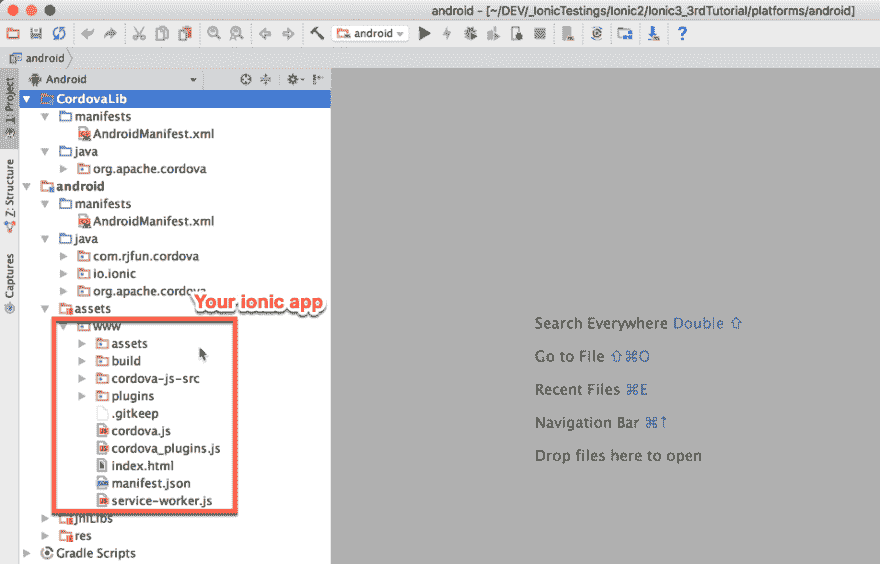T2】](https://res.cloudinary.com/practicaldev/image/fetch/s--SuMFqv62--/c_limit%2Cf_auto%2Cfl_progressive%2Cq_auto%2Cw_880/https://i.imgur.com/tOM1Xwu.png)

#### 创建新的仿真器

你需要一个模拟器来运行你的 Android 应用。要开始添加过程，请点击`Tools->Android->AVD Manager`:

[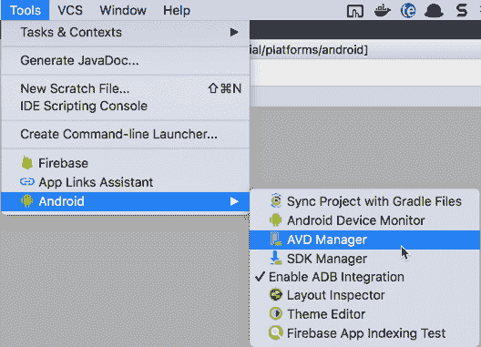T2】](https://res.cloudinary.com/practicaldev/image/fetch/s--HoqjopJt--/c_limit%2Cf_auto%2Cfl_progressive%2Cq_auto%2Cw_880/https://i.imgur.com/7EQq7zZ.png)

点击`Create Virtual Device`按钮:

[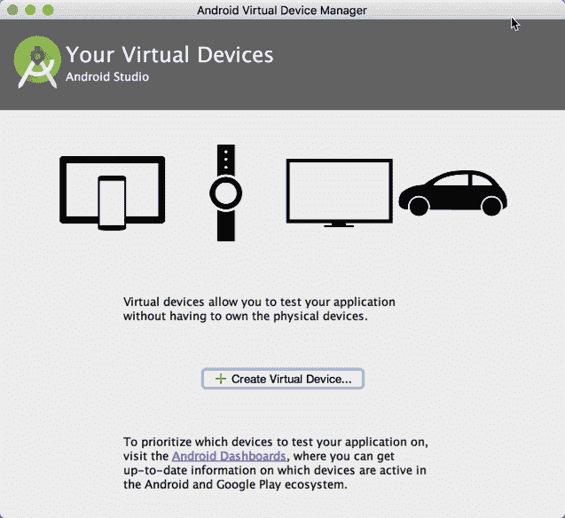T2】](https://res.cloudinary.com/practicaldev/image/fetch/s--7Ot9z-kE--/c_limit%2Cf_auto%2Cfl_progressive%2Cq_auto%2Cw_880/https://i.imgur.com/sDroCiB.png)

选择一个设备:

[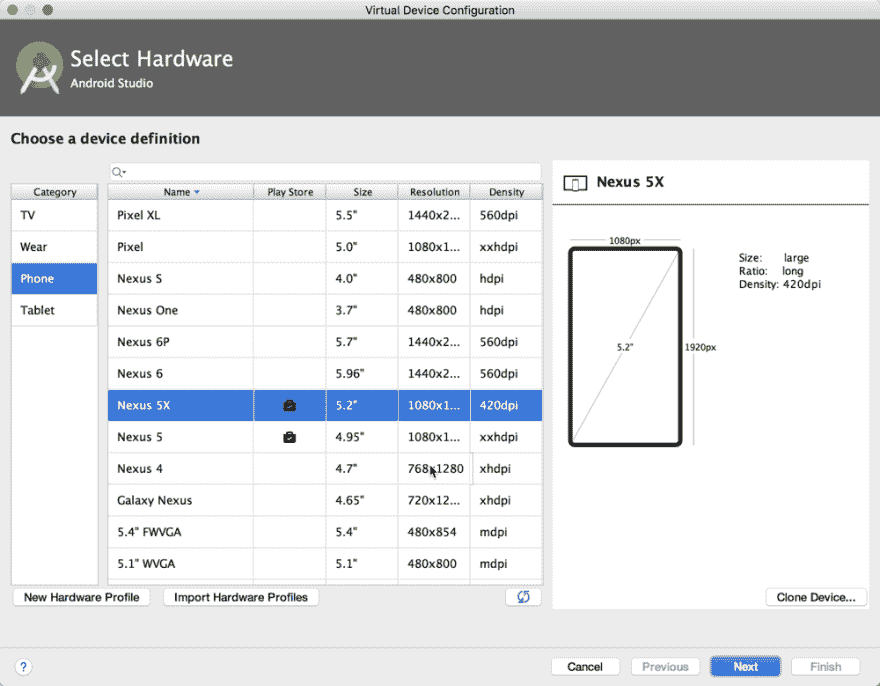T2】](https://res.cloudinary.com/practicaldev/image/fetch/s--x1qaGiuI--/c_limit%2Cf_auto%2Cfl_progressive%2Cq_auto%2Cw_880/https://i.imgur.com/Bi8q7hS.png)

选择系统图像并点击`Next`按钮。如果需要，首先点击`Download`链接。

[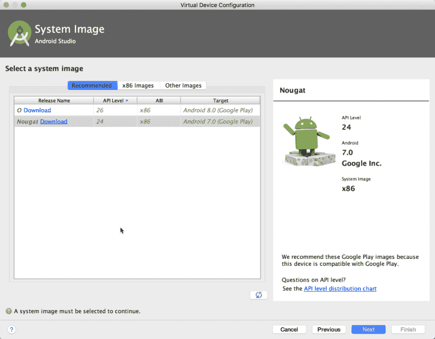T2】](https://res.cloudinary.com/practicaldev/image/fetch/s--ZfYGOCER--/c_limit%2Cf_auto%2Cfl_progressive%2Cq_auto%2Cw_880/https://i.imgur.com/UrQeVtn.png)

在最后一个屏幕上，只需点击`Finish`按钮，您应该会看到以下屏幕，其中显示了您的虚拟设备的摘要:

[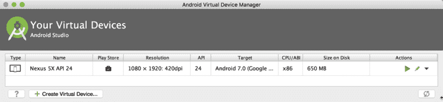T2】](https://res.cloudinary.com/practicaldev/image/fetch/s--Gqvgv285--/c_limit%2Cf_auto%2Cfl_progressive%2Cq_auto%2Cw_880/https://i.imgur.com/MnqN1fM.png)

#### 在新模拟器上运行应用程序

运行`ionic cordova emulate android`,你应该会看到一个 Android 模拟器启动并向你展示你的应用程序:

[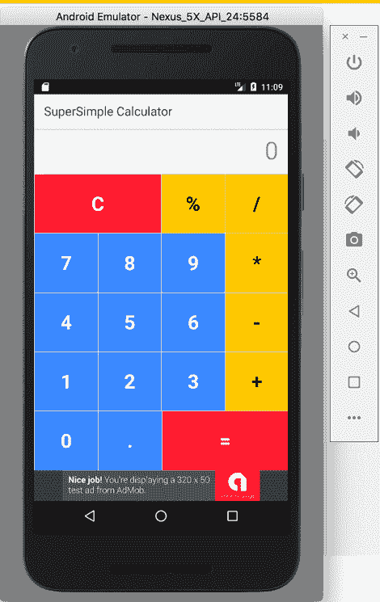T2】](https://res.cloudinary.com/practicaldev/image/fetch/s--AgJKqP6b--/c_limit%2Cf_auto%2Cfl_progressive%2Cq_auto%2Cw_880/https://i.imgur.com/xqDvwpV.png)

#### 在物理设备上运行应用程序

如果您想在自己的 Android 设备上运行该应用程序，那么首先必须运行以下命令来构建项目:

`ionic cordova build android`

输出的最后几行类似于:

``
构建成功`

 `总时间:1.557 秒
构建以下 apk:
/Users/Nikola/DEV/io inc3/io inc3 _ 3rd tutorial/platforms/Android/build/outputs/apk/Android-debug . apk
`

 `为了能够在您的 Android 设备上测试您的应用程序，您必须启用开发者设置，您可以通过几个步骤来完成:

*   打开设置视图并滚动至`About Phone`
*   在“关于手机”视图的底部找到一个`Build Number`，点击七次以启用开发者模式。
*   之后，您可以返回到`Settings`视图，您将看到一个名为`Developer Options`的新选项

现在您必须启用 USB 调试，您可以在接下来的几个步骤中完成:

*   在`Settings`视图中选择`Developer Options`项目
*   向下滚动，直到看到 USB 调试选项
*   打开它
*   现在，您的设备已经设置好进行调试，当它连接到您的计算机时，您就可以将应用程序部署到设备上了

现在连接您的设备，并在终端/命令提示符下执行以下命令:

`ionic cordova run android`

在应用程序列表中找到该应用程序并打开它。你应该看到底部的广告，在第五次计算后，你应该看到一个插页广告出现。

⚠️如果出于某种原因`ionic cordova run android`命令对你不起作用，你总是可以将生成的`.apk`文件手动复制到你连接的设备上(例如在`Downloads`文件夹中)。然后用你使用的文件管理应用程序打开手机上的`Downloads`文件夹，打开你粘贴的`.apk`文件。这样，系统会提示您在手机上安装该应用程序，然后您就可以在程序列表中找到它:

[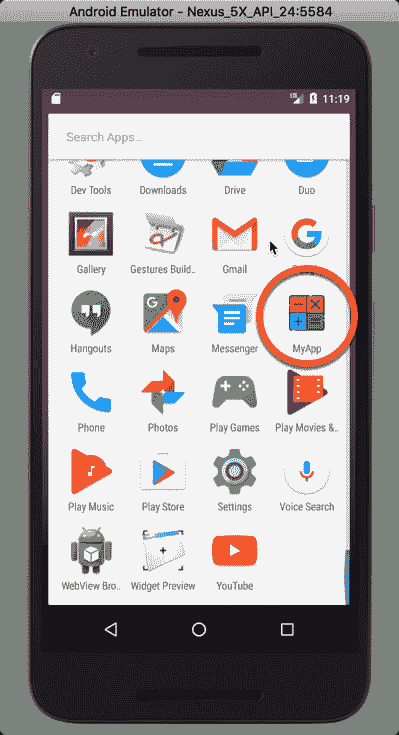T2】](https://res.cloudinary.com/practicaldev/image/fetch/s--ikrIJBai--/c_limit%2Cf_auto%2Cfl_progressive%2Cq_auto%2Cw_880/https://i.imgur.com/9Fkfc6n.png)

## 结论

在本教程中，你已经学到了不少东西。您了解了如何通过改进设计和用户体验来完善现有的计算器应用程序。接下来，您学习了如何自动创建图标和闪屏图像。那么，如何利用 Google AdMob 广告，用你的应用赚钱呢？此外，如何在不通过应用商店的情况下与其他用户分享你的应用。最后，您学习了如何在真实的物理设备和模拟器上测试您的应用程序。

在下一个教程中，我将向您展示如何为苹果的 App Store 和谷歌的 Play Store 准备应用程序，以及如何将应用程序发布到苹果的 App Store 和谷歌的 Play Store。

直到下一次，继续编码✌️