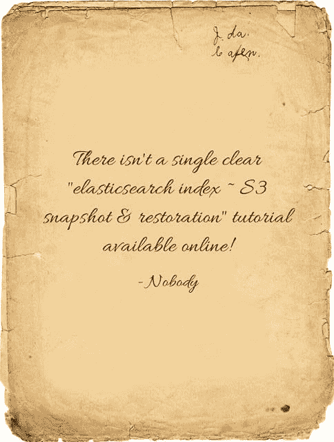
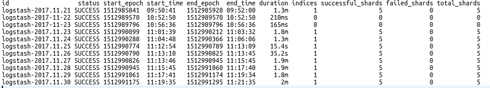

# ES 索引— S3 快照和恢复:

> 原文：<https://dev.to/sathyasarathi90/es-index-s3-snapshot-restoration-73p>

### ES 指数— S3 快照&复原:

[](https://res.cloudinary.com/practicaldev/image/fetch/s--f3LgfzRm--/c_limit%2Cf_auto%2Cfl_progressive%2Cq_auto%2Cw_880/https://cdn-images-1.medium.com/max/484/0%2AtB85jys_DWuTYI7o.jpg)

问题是...什么风把你吹来了？厌倦了所有关于如何备份和恢复特定索引的搜索？

不要害怕，你的搜寻到此结束。！

经过几十个小要点和手册页，这就是..我们已经为你做了所有的重活。

以下教程是在***elastic search v 5 . 4 . 0***上测试的

在我们继续之前，请记住:

**待办事项:**

确保 ***elasticsearch 版本的***

***集群的版本< =(小于或等于)恢复集群的版本。*T3】**

**不该做的:**

除非非常必要；

***【curl-XDELETE’[http://localhost:9200/nameoftindex](http://localhost:9200/nameOfTheIndex)***

***#删除特定指标***

尤其是当你喝醉的时候！：

***curl-XDELETE’[http://localhost:9200/_ all](http://localhost:9200/_all)***

***#删除所有索引***

(这是醉酒部分的切入点..！！)

[T2】](https://res.cloudinary.com/practicaldev/image/fetch/s--GEJcxrRo--/c_limit%2Cf_auto%2Cfl_progressive%2Cq_auto%2Cw_880/https://cdn-images-1.medium.com/max/500/0%2APaiwTUgOnjUipmrX.jpg)

### 第一步:安装 S3 插件支持

```
sudo bin/elasticsearch-plugin install repository-s3  
# (or) 
sudo /usr/share/elasticsearch/bin/elasticsearch-plugin install repository-s3 
```

这取决于你的 elasticsearch-plugin 可执行文件的安装位置。这使得 elasticsearch 实例能够与 AWS S3 存储桶进行通信。

### 第二步:输入快照注册设置

**方法**:放

**网址:**[http://localhost:9200/_ snapshot/logs _ backup？验证=假&漂亮](http://localhost:9200/_snapshot/logs_backup?verify=false&pretty)

**有效载荷:**

```
 {  “type”:  “s3”,  “settings”:  {  “bucket”:  “WWWWWW”,  “region”:  “us-east-1”,  “access_key”:  “XXXXXX”,  “secret_key”:  “YYYYYY”  }  } 
```

**在网址:**

*   **logs_backup** :快照文件的名称

**在有效载荷 JSON:**

*   **桶**:“WWWWW”是你输入桶名的地方。
*   **access_key & secret_key** :值“XXXXXX”和“YYYYYY”是我们根据 *IAM* 策略键入存储桶的访问密钥和秘密密钥的地方。如果你需要任何帮助来找到它，这里有一个链接应该可以引导你通过([https://AWS . Amazon . com/blogs/security/where s-my-secret-access-key/](https://aws.amazon.com/blogs/security/wheres-my-secret-access-key/))。
*   **地区**:存储桶的地区(选择任意一个:【http://docs.aws.amazon.com/general/latest/gr/rande.html】T2)。

这将给出一个响应，如'**{ " acknowledge ":" true " }**'。

### 步骤 3:云同步—列出所有快照

**网址:**[http://localhost:9200/_ cat/snapshot s/logs _ backup？五](http://localhost:9200/_cat/snapshots/logs_backup?v)

网址中的**:**

*   **logs_backup** :快照文件名称同步所有快照列表的时间。如果我们所有的设置都已经同步好了；我们最终应该会得到一个索引列表，与下面显示的内容很接近:

[T2】](https://res.cloudinary.com/practicaldev/image/fetch/s--4CtFgRRg--/c_limit%2Cf_auto%2Cfl_progressive%2Cq_auto%2Cw_880/https://cdn-images-1.medium.com/max/811/0%2AF29ShkFj4tm_F5VC.png)

### 步骤 4:创建快照

**方法**:放

**网址:**[http://localhost:9200/_ snapshot/logs _ backup/type _ of _ the _ backup？wait_for_completion=true](http://localhost:9200/_snapshot/logs_backup/type_of_the_backup?wait_for_completion=true)

**有效载荷:**

```
 {  “indices”:  “logstash-2017.11.21”,  “include_global_state”:  false,  “compress”:  true,  “encrypt”:  true  } 
```

网址中的**:**

*   **logs_backup** :快照文件的名称

*   **备份类型**:可以是任意字符串

**在有效载荷 JSON** 中:

*   **索引**:对应要备份到 S3 桶的索引。在单个恢复点下备份多个索引的情况下，索引可以以数组的形式输入。
*   **include_global_state** :设置为‘false’只是为了确保有跨版本的兼容性。 ***警告如果设置为'真'，索引只能恢复到 ES 的源版本。***
*   **compress** :对备份到 S3 的索引元文件进行压缩。
*   **加密**:以防索引需要额外加密。

这将给出一个响应，如'**{ " acknowledge ":" true " }[T1 ' '**

### 第五步:恢复快照:

**方法**:放

**网址:**[http://localhost:9200/_ snapshot/name _ of _ the _ backup/index _ to _ be _ restored/_ restore](http://localhost:9200/_snapshot/name_of_the_backup/index_to_be_restored/_restore)

**有效载荷:**

```
 {  “ignore_unavailable”:  true,  “include_global_state”:  false  } 
```

在 URL:

**logs_backup** :快照文件的名称

**index_to_be_restored** :步骤 3 中列出的 id 的任意索引

在有效负载 JSON 中:

*   **ignore_unavailable** :设置为 true 是安全的，这样可以避免不必要的检查。
*   **include_global_state** :设置为‘false’只是为了确保有跨版本的兼容性。**警告** **如果设置为‘真’，索引只能恢复到源版本的 ES。**

这将给出一个响应，如'**{ " acknowledge ":" true " }[T1 ' '**

瞧啊。修复工作已经完成。

不要忘记通过安全删除来回收与索引对应的空间—重用、减少和回收:)

愉快的争吵！！！

*原载于 2017 年 12 月 15 日*[*https://www . data wrangler . in*](https://www.datawrangler.in/2017/12/es-index-s3-snapshot-restoration.html)*。*

* * *