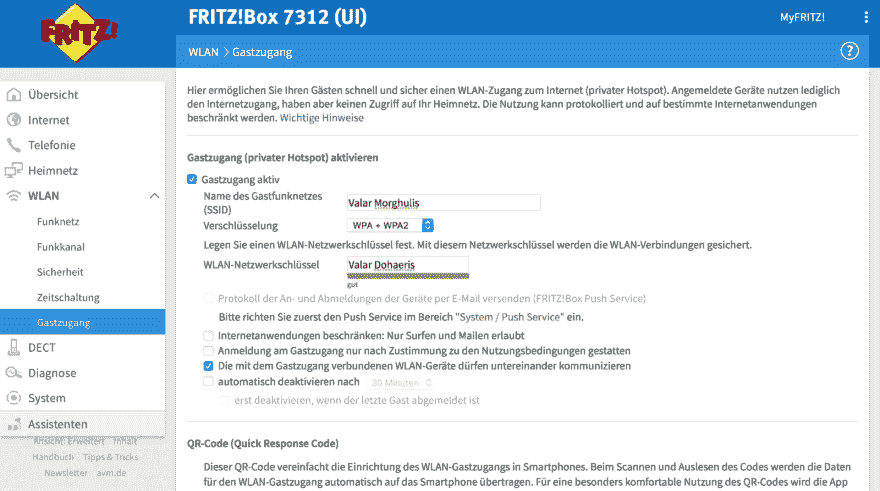
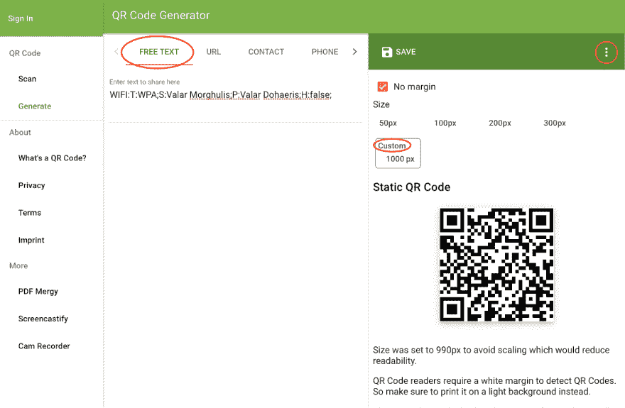
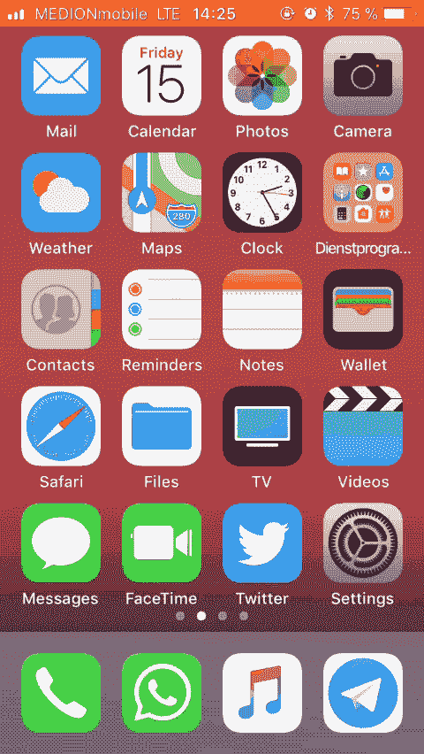

# 做一个好主人，分享你的 WiFi

> 原文：<https://dev.to/across_the_grid/be-a-good-host-and-share-your-wifi-3mn>

我和我的朋友们总是喜欢看 YT 视频，当我们出去玩的时候，但是当你找不到你想要显示的特殊视频时，这种乐趣就结束了，因为你的数据量已经达到了极限或者你的服务很差😩那么，为什么不和你的朋友分享你的 WiFi 呢？当你问他们密码时，他们会表现得很奇怪。你经常得到这样的回答:“对不起，我记不起来了！路由器下面有贴纸！”然后你试图在你朋友公寓里最够不着的地方找到黑匣子，周围有数百万条电缆，有时还有堆积如山的灰尘。当你最终找到它的时候——耶！👏—有一个巨大的数字(20 个字符😱)你总是打错字的地方！🆘
我知道我在这里有点夸张，但为了避免这种情况，这里有一个简单的方法，使用二维码与您的朋友分享您的 WiFi。

### 1。设置访客 WiFi📱🤝🗼(强烈推荐)

你不必设置一个特殊的访客 WiFi 来共享你的密码，但我强烈建议你这样做，以保护你自己的家庭设备免受意外访问。你的朋友可能不会这样，但如果你想与你的顾客分享你的 WiFi，因为你经营一家餐馆，这是值得的。
如果你和我一样有 FritzBox，打开浏览器，进入 [http://fritz.box](http://fritz.box) 。如果您看不到任何东西，请尝试使用 [http://192.168.178.1](http://192.168.178.1) (您路由器的 IP 地址可能与上面的不同，因此请查看您制造商的手册或直接询问谷歌)。
登录后，进入无线>访客访问并打开。选择 WPA/WPA2 作为加密策略，并给你的 WiFi 一个名称(SSID)和密码。就是这样！

[T2】](https://res.cloudinary.com/practicaldev/image/fetch/s--nR9AzpbT--/c_limit%2Cf_auto%2Cfl_progressive%2Cq_auto%2Cw_880/https://cdn-images-1.medium.com/max/1600/1%2AmVD2S6M-4JWFk9xxfNXVMg.png)

您还可以限制连接的客户端访问互联网和邮件，并在 30 分钟、1 小时或 1 天后关闭所有连接，这样可以防止人们持续使用您的 WiFi 网络。此设置更适合客户，因此也可以在使用 WiFi 之前显示使用条款，并限制设备之间的通信以提高安全性。

### 2。生成二维码🖨

这是最重要的一步！现在是 2017 年，尽管二维码已经存在了一段时间，但今年苹果终于在相机应用程序中集成了二维码阅读器，这使得它可以在没有任何其他应用程序的情况下立即访问。我非常确定这一方便的功能将在明年出现在 Android 上，但二维码扫描在当今的每个平台上都可以工作——只需从应用商店安装一个应用程序(向下滚动到第 3 部分以查看它的运行情况)。
现在，去一个免费的在线生成器，例如:[https://www.the-qrcode-generator.com](https://www.the-qrcode-generator.com)并使用以下文本:

```
WIFI:T:WPA;S:Valar Morghulis;P:Valar Dohaeris;H:false; 
```

Enter fullscreen mode Exit fullscreen mode

`T` =认证类型，可以是`WPA`、`WEP`或`nopass`(必填)
`S` =您的 SSID(必填)
`P` =您的密码(必填，但如果认证类型是`nopass` )
`H` = `false`(如果您的 SSID 是隐藏的，则可选和`true`)

[T2】](https://res.cloudinary.com/practicaldev/image/fetch/s--_rk8sAlC--/c_limit%2Cf_auto%2Cfl_progressive%2Cq_auto%2Cw_880/https://cdn-images-1.medium.com/max/1600/1%2ASwuLNSZkg03_pNAN4a20jw.png)

保存为`.png`或`.svg`文件并打印出来！为了获得更好的打印效果，我设置了一个自定义尺寸 1000px x 1000px(你可以在右上角的选项部分找到这个)。创建一个新的 Word/Pages 文档并插入您的 QR 码。我还添加了纯文本版本的 SSID 和密码，以防人们的设备没有二维码扫描功能，如笔记本电脑。我在亚马逊(【http://goo.gl/X4j8gq】)上买了一个很好看的画框(15cm x 15cm)放几只虫子，这样朋友一进我家就能很容易认出来。让我们看看它的实际效果吧！🎬

### 3。登录🖼📸 📶

在 iOS11 就这么简单:打开相机 app，扫描二维码，搞定！(以下 GIF 文件可能需要一段时间加载)

[T2】](https://res.cloudinary.com/practicaldev/image/fetch/s--4NwQlww3--/c_limit%2Cf_auto%2Cfl_progressive%2Cq_66%2Cw_880/https://cdn-images-1.medium.com/max/1600/1%2AMtsTjNGIk_gPULiC0apqRg.gif)

在安卓系统中，这也很容易，但是(目前)你需要一个应用程序来实现。谷歌 Play 商店有成吨的免费二维码阅读器，只要下载一个(例如:[二维码阅读器](https://play.google.com/store/apps/details?id=me.scan.android.client))扫描二维码，搞定！

* * *

#### 更新 2018–01–06

我的一个朋友在新年前夕发现，他的手机(摩托罗拉- Moto G4 Plus 和 Android 7)能够通过预装的[摩托罗拉相机应用](https://play.google.com/store/apps/details?id=com.motorola.camera)读取二维码。由于这个应用程序是由摩托罗拉而不是谷歌开发的，所以二维码阅读也有可能在你的手机上与一个独立的应用程序一起工作。请在评论中告诉我，如果你发现你的手机在相机应用程序中有自己的支持，那么我会将它添加到这个列表中:

| 支持 | 制造商 | 设备 |
| --- | --- | --- |
| **是** | 摩托罗拉 | G4 Plus 摩托车 |
| 不 | 三星电子 | 银河 S3 迷你 |

* * *

#### 更新 2017–12–16

在 Twitter 上,“One Two”已经指出，iOS11 有另一种方法可以非常容易地与朋友共享您的 WiFi 密码，所以我也想在这里提一下。我还没有意识到这一点，下面是它的工作方式:

[https://www.youtube.com/embed/6C3mBPDrHcY](https://www.youtube.com/embed/6C3mBPDrHcY)

要快速总结视频，你进入*设置* > *WiFi* ，点击你想连接的网络。将您的 iPhone 和您朋友的 iPhone 放在一起，并在要求您共享密码时进行确认。之后会无线秘密传输，用起来非常简单！

然而，与二维码相比，我看到了一些缺点:
一件事是，你的朋友不知道你愿意分享你的 WiFi -所以他们中的一些人可能会太害羞而不敢要求-他们还必须知道你的 SSID，这给我带来了第二个缺点，你将参与到这个过程中。我的想法是，当我的朋友们一进入我的家，他们就能认出这个小框架并自己连接，而我可以在厨房里给他们拿瓶啤酒🙃我看到的第三个缺点是，你正在共享手机的默认 WiFi，所以你不会使用访客 WiFi。这可能不是很重要，因为你是在和朋友分享，但是应该考虑。
最后，Android 怎么样？😢
另一方面，如果你所有的朋友都有 iPhones，iOS11 WiFi 共享真的很有用，请查看上面的视频。

* * *

我希望这个指南对你有用，我主要是为我的朋友和家人写的，他们对技术不太熟悉，但是如果你已经知道了，我希望它能激励你建立它😉玩得开心！✌️

* * *

*   你可以在这里找到更多关于二维码的信息:[http://www.qrcode.com/en/](http://www.qrcode.com/en/)
*   二维码还可以用于共享网址、联系方式、电话号码、电子邮件地址、坐标、事件等。这里有一些例子:[http://qrcode.meetheed.com/qrcode_examples.php?s=s](http://qrcode.meetheed.com/qrcode_examples.php?s=s)
*   大多数在线生成器都是免费的，你可以根据自己的要求设计二维码，例如:[https://www.qrcode-monkey.com](https://www.qrcode-monkey.com)
*   注意潜在的二维码风险:[http://resources . infosecinstitute . com/security-attacks-via-malicious-QR-codes/](http://resources.infosecinstitute.com/security-attacks-via-malicious-qr-codes/)