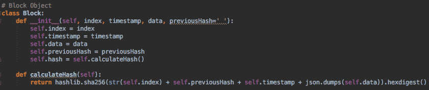
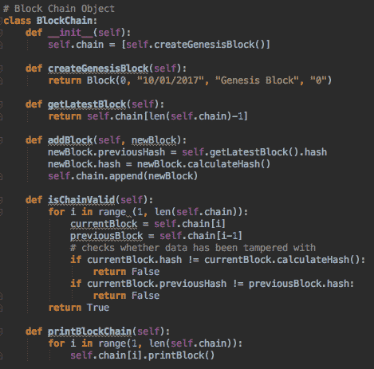
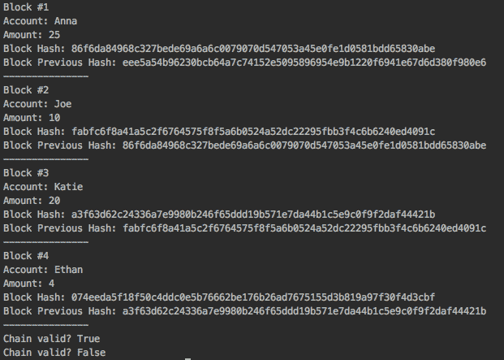

# 使用 Python 了解区块链

> 原文:[https://dev . to/huntress 413/learning-about-block-chain-with-python-4bh](https://dev.to/huntress413/learning-about-block-chain-with-python-4bh)

*注:这篇文章最初发表在 medium 上。你可以在这里找到这个[。](https://medium.com/@annamcabee/learning-about-block-chain-with-python-8b2178cf1fca)*

大约两周前，我意识到自己为何对比特币如此反感:我没有比特币，也不理解它。我决定通过研究比特币背后的技术，也就是区块链，开始了解比特币。我通过创建一个构建区块链的 python 脚本进行了学习，所以我想与其他想了解更多区块链信息的人分享一下。澄清一下，虽然我受到了比特币的启发，但这篇文章的重点是区块链。

## 一块的内容

通常，一个块包含事务数据、时间戳和到前一个块的链接。在我的块实现中，我创建了一个具有以下属性的块类:

索引:跟踪块在链中的位置

时间戳:创建块的日期/时间

数据:存储在块中的实际数据(比如谁买了多少)

前一个哈希:链中前一个块的哈希

哈希:块的哈希；如果您不熟悉散列，它本质上是将任意长度的数据映射到固定大小的数据；哈希本质上是一个表示块的字符串

我用 SHA-256 算法计算块的散列，这是一种加密散列算法。我将表示数据块的属性输入到哈希算法中，包括索引、时间戳、数据和以前的哈希。然后,“calculateHash”函数根据该输入返回一个 256 位的字符串。
[T3】](https://res.cloudinary.com/practicaldev/image/fetch/s--G69fM25a--/c_limit%2Cf_auto%2Cfl_progressive%2Cq_auto%2Cw_880/https://thepracticaldev.s3.amazonaws.com/i/vqnpv5ol2ycl5jcvxf1z.png)

## 区块链

### 初始化一条链

首先，区块链中的第一块被称为创世块。这个块只是链开始的原始块。在我的实现中，当一个区块链被创建时，genesis 块被自动创建。

### 添加一个块

为了向链中添加新的块，您需要获得前一个块的散列，然后计算新块的散列。因为前一个块的散列是散列函数的输入，所以必须在检索到前一个散列之后计算新块的散列。“getLatestBlock”方法只是用来获取链上的最后一个块，所以当你添加一个新块时，那是前一个块。

### 固定链条

区块链抵制设计上的修改。区块链的部分安全性是确保块之间的链接没有被篡改，因此块#3 中的先前散列实际上等同于块#2 中的散列。这是我在“isChainValid”方法中检查的内容。保护区块链的另一部分是确保块中的数据自创建以来没有被更改过。例如，如果有人试图改变在一个块中谁完成了一个事务，这必须被阻止以确保安全。如果块中的数据已经被篡改，那么块的散列也将改变，因为数据是散列函数的输入。“isChainValid”方法也考虑到了哈希值的变化，以便检查自块创建以来数据是否发生了变化。
[T3】](https://res.cloudinary.com/practicaldev/image/fetch/s--VXUK2I2G--/c_limit%2Cf_auto%2Cfl_progressive%2Cq_auto%2Cw_880/https://thepracticaldev.s3.amazonaws.com/i/cizhqepz2ej0jaoeyjic.png)

## 用安娜币测试区块链

下面是创建一个名为 annaCoin 的区块链对象并向其添加块的代码。我通过在任何篡改之前以及在我试图篡改一个块之后检查区块链的有效性来证明 annaCoin 的安全性。

 
这个函数的输出是这样的:

注意:我确实在我的区块链和 Block 类中做了一些打印函数，以使区块链在测试时可读性更好。为了简化，我没有在前面的代码片段中包含打印函数。

*完整剧本可以在这里找到:[https://github.com/annamcabee/Block-Chain](https://github.com/annamcabee/Block-Chain)T3】*