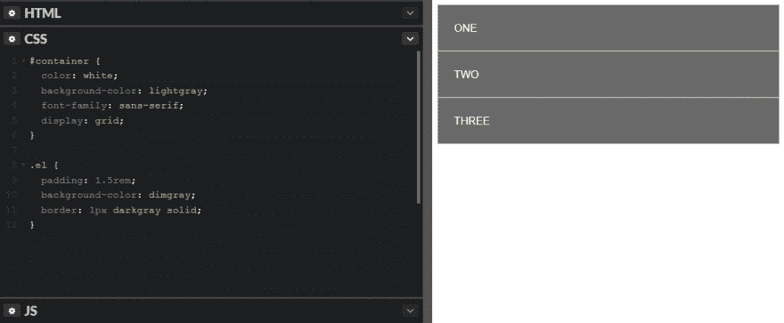
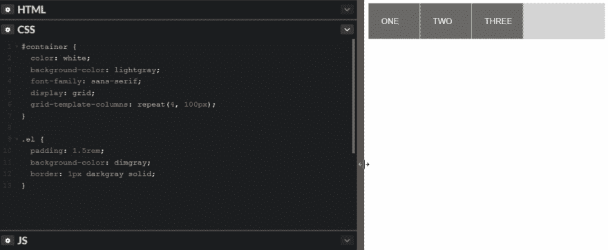
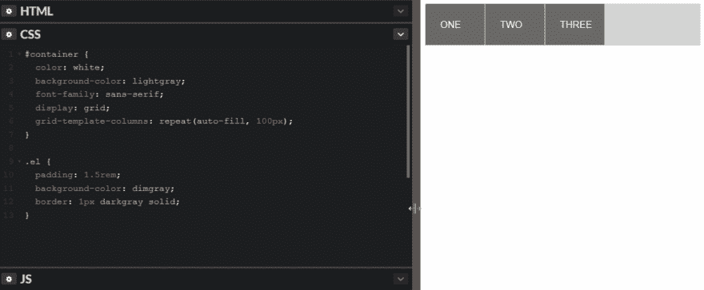
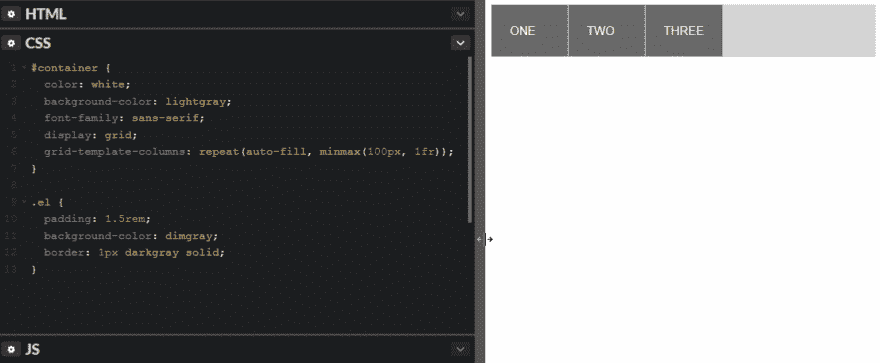
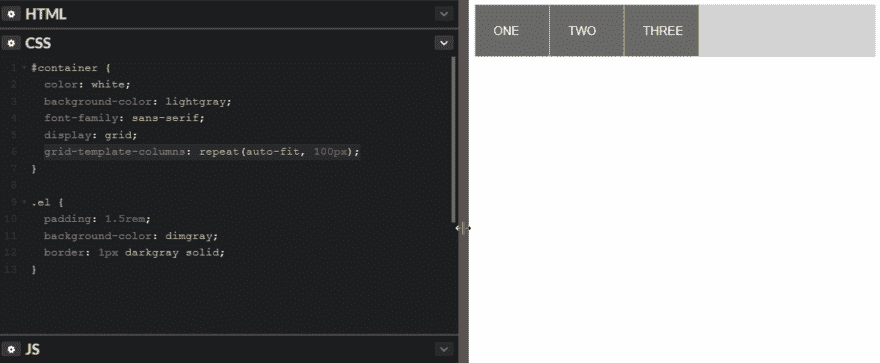
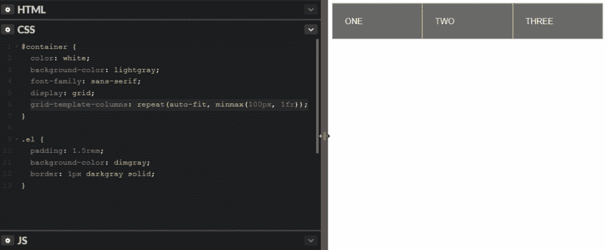

# 带有 CSS 网格的响应式布局，第 2 部分:自动填充和自动调整

> 原文：<https://dev.to/jonstodle/responsive-layout-with-css-grid-part-2-auto-fill--auto-fit-dij>

在[前一部分](https://blog.jonstodle.com/intro-to-css-grid-part-1-grid-areas)中，我们使用*网格区域*制作了一个响应式布局。使用网格区域，可以在网格中排列部分布局，并且通过媒体查询可以非常容易地重新排列。

在这一部分，我们将看看 CSS grid 的另一个特性，它可以帮助你建立一个响应性的布局:*自动填充*和*自动适应*。这些关键字值可以在 CSS 网格中定义列宽时用作值。

他们有非常相似的名字，行为也非常相似，他们做的事情略有不同。我在这里试着给你解释一下。

我们从一些简单的 HTML 和 CSS 开始:

```
<div id="container">
  <div class="el">ONE</div>
  <div class="el">TWO</div>
  <div class="el">THREE</div>
</div>

#container {
  color: white;
  background-color: lightgray;
  font-family: sans-serif;
  display: grid;
}

.el {
  padding: 1.5rem;
  background-color: dimgray;
  border: 1px darkgray solid;
} 
```

Enter fullscreen mode Exit fullscreen mode

[T2】](https://res.cloudinary.com/practicaldev/image/fetch/s--dMJp7ZM0--/c_limit%2Cf_auto%2Cfl_progressive%2Cq_auto%2Cw_880/https://blog.jonstodle.com/conteimg/2017/11/Screenshot-171110-130145.png)

接下来我们将使用`repeat()` CSS 函数。`repeat()`让你用简洁的方式定义许多列或行(使用`grid-template-columns`和`grid-template-rows`)。第一个参数是重复的次数，第二个参数是重复什么:

```
grid-template-columns: repeat(4, 100px); // Repeat 100px four times 
```

Enter fullscreen mode Exit fullscreen mode

[T2】](https://res.cloudinary.com/practicaldev/image/fetch/s--vNt6p0ry--/c_limit%2Cf_auto%2Cfl_progressive%2Cq_66%2Cw_880/https://blog.jonstodle.com/conteimg/2017/11/css-grid-repeat-4-2.gif)

`auto-fill`和`auto-fit`可让您创建更多动态布局:

# 自动填充

我们可以告诉浏览器，在给定指定长度的情况下，尽可能多地容纳列，而不是重复宽度倍数来创建固定数量的列。

`auto-fill`表示“在给定宽度的情况下，用尽可能多的列自动填充行”。`auto-fill`和`repeat()`连用如下:

```
grid-template-columns: repeat(auto-fill, 100px); 
```

Enter fullscreen mode Exit fullscreen mode

[T2】](https://res.cloudinary.com/practicaldev/image/fetch/s--KOmsH7Jl--/c_limit%2Cf_auto%2Cfl_progressive%2Cq_66%2Cw_880/https://blog.jonstodle.com/conteimg/2017/11/css-grid-repeat-auto-fill-2.gif)

如您所见，给定指定的宽度(100 像素)，每行都填充了尽可能多的列。当这一行没有剩余空间时，它将开始把元素放到下一行。

## minmax

`minmax()`是一个 CSS 函数，配合`auto-fill`使用非常得心应手。它允许您同时指定最小值和最大值。如果我们指定想要最小的`100px`和最大的`1fr`(剩余的可用空间)，列将自动调整大小以填充行:

```
grid-template-columns: repeat(auto-fill, minmax(100px, 1fr)); 
```

Enter fullscreen mode Exit fullscreen mode

[T2】](https://res.cloudinary.com/practicaldev/image/fetch/s--ZWi-wvX3--/c_limit%2Cf_auto%2Cfl_progressive%2Cq_66%2Cw_880/https://blog.jonstodle.com/conteimg/2017/11/css-grid-repeat-auto-fill-minmax-1.gif)

浏览器现在可以容纳尽可能多的最小宽度为 100 像素的列。如果该行有剩余空间，该空间将在所有列中平均分配。

# 自动适应

让我们把第一个`auto-fill`例子中的`auto-fill`换成`auto-fit`:

```
grid-template-columns: repeat(auto-fit, 100px); 
```

Enter fullscreen mode Exit fullscreen mode

[T2】](https://res.cloudinary.com/practicaldev/image/fetch/s--P1_VYayN--/c_limit%2Cf_auto%2Cfl_progressive%2Cq_66%2Cw_880/https://blog.jonstodle.com/conteimg/2017/11/css-grid-repeat-auto-fit-1.gif)

这里和`auto-fill`相比没有太大区别。当您指示浏览器如何处理行中剩余的空间时，这种差异就变得很明显了。

## minmax

我们再加一个`minmax()`:

```
grid-template-columns: repeat(auto-fit, minmax(100px, 1fr)); 
```

Enter fullscreen mode Exit fullscreen mode

[T2】](https://res.cloudinary.com/practicaldev/image/fetch/s--fHyW7d8V--/c_limit%2Cf_auto%2Cfl_progressive%2Cq_66%2Cw_880/https://blog.jonstodle.com/conteimg/2017/11/css-grid-repeat-auto-fit-minmax.gif)

`auto-fit`的行为与`auto-fill`非常相似，但是如果只有一行，可以容纳更多的列，但是没有元素可以放入这些列，那么空列的宽度就会变成`0`。使栏的最大宽度为 1fr，将使浏览器在它们之间平均分配剩余的空间。

* * *

您可以在这个代码栏中试验设置:

参见 [CodePen](https://codepen.io) 上 Jon stdle([@ jonstodle](https://codepen.io/jonstodle))的 Pen [响应式 CSS 网格 pt 2](https://codepen.io/jonstodle/pen/mqWevo/) 。

我希望我已经帮助你更好地理解了`auto-fill`和`auto-fit`。

编码快乐！