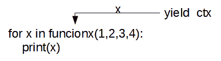
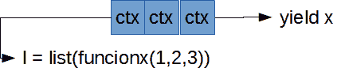

# 生成器和参考

> [https://dev . to/yorodm/发电机-y 参考资料-14p3](https://dev.to/yorodm/generadores-y-referencias-14p3)

# 发电机及参考

**Python** 中的引用是一个经常被忽视的话题，即使是那些我们不再是[那么年轻](https://stackoverflow.com/questions/47552529/obscure-iterator-behavior-in-python)的话题。让我们做一个实验，拿 10 个你认识的开发者来问他们这个功能有什么不好。

```
def funcionx(*args):
    ctx = dict()
    for x in args:
        ctx['run'] = x
        yield ctx 
```

Enter fullscreen mode Exit fullscreen mode

好吧，这是个诡计多端的问题，答案是全部或**无**视你如何使用生成函数而定。如果你不知道它是一个生成函数，因为你没有到达书中的那一章，或者你没有读过《T4》【pep 255】也没关系。这里有版本**TL；**博士

> 产生函数是使用**产量**代替**返回**返回数值的函数。

调用生成函数时，会得到一个生成函数，您可以用它来继续获取函数的值，方法是调用在找到 **yield** 时会返回新值(如上所述**TL；DR** 或更好的**TL；dw〔T7〕。发电机是可循环的，所以通常用于循环 **for-什么在〔T9〕中。**** 

```
>>> funcionx(1,2,3,4)
<generator object funcionx at 0x00000000061D98B8>
>>> for x in funcionx(1,2,3,4):
.... print(x)
{'run': 1}
{'run': 2}
{'run': 3}
{'run': 4} 
```

Enter fullscreen mode Exit fullscreen mode

到目前为止看起来一切都很好，**泛函〖t1〗返回了发生器类型的物体，我们可以迭代一下结果。但是由于某种原因，这个简单的单元测试没有通过。** 

```
class TestFuncionx(unittest.TestCase):

    def test_returns_generator(self):
        self.assertTrue(isinstance(funcionx(1,2,3,4),collections.Iterable))

    def test_yields_context(self):
        l = list(funcionx(1,2))
        self.assertEqual(len(l),2)
        # ¡¡Fatal!!
        self.assertEqual(l,[{'run': 1}, {'run': 2}]) 
```

Enter fullscreen mode Exit fullscreen mode

有可能吗？。很明显单元测试中有什么东西出故障了，让我们手动检查一下。

```
>>> len(list(funcionx(1,2,))) == 2
True
>>> list(funcionx(1,2,))
[{'run': 2}, {'run': 2}] 
```

Enter fullscreen mode Exit fullscreen mode

□什么？…嗯。冷静，让我们仔细看一下功能，特别是它所做的部分:

```
yield ctx 
```

Enter fullscreen mode Exit fullscreen mode

**ctx** 是字典吗？ **Python** 中的词典是参考文献吗？

每次发电机运行时，我们都以修改后的值返回**本身**参考。当在循环**for…**中使用函数时，我们使用 **ctx** 的值，马上丢弃，因为我们没有保存结果，所以没有注意到我们得到的下一个值是相同的修改参考。

[T2】](https://res.cloudinary.com/practicaldev/image/fetch/s--2TqmUXJS--/c_limit%2Cf_auto%2Cfl_progressive%2Cq_auto%2Cw_880/https://yorodm.github.img/generadores-referencias-python/yield-con-ciclo-for.png)

单元测试失败，因为每次调用生成器都会修改我们保存的引用。

[T2】](https://res.cloudinary.com/practicaldev/image/fetch/s--aunHn-UE--/c_limit%2Cf_auto%2Cfl_progressive%2Cq_auto%2Cw_880/https://yorodm.github.img/generadores-referencias-python/yield-con-list.png)

在这种情况下，我们会得到一份清单，列出具有最新值的 **ctx** 。

幸运的是，该问题有简单的解决方案，我们可以每次调用时返回一个新实例，也可以只创建一个副本:

```
def funcionx(*args):
    ctx = dict()
    for x in args:
        ctx['run'] = x
        yield dict(ctx) 
```

Enter fullscreen mode Exit fullscreen mode

并且准备好了，不再有奇怪的价值观，也不再有失败的证据。