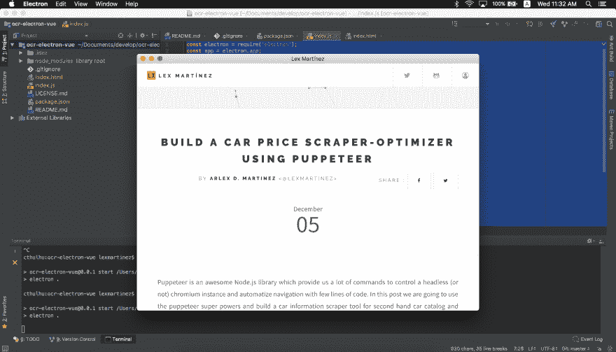
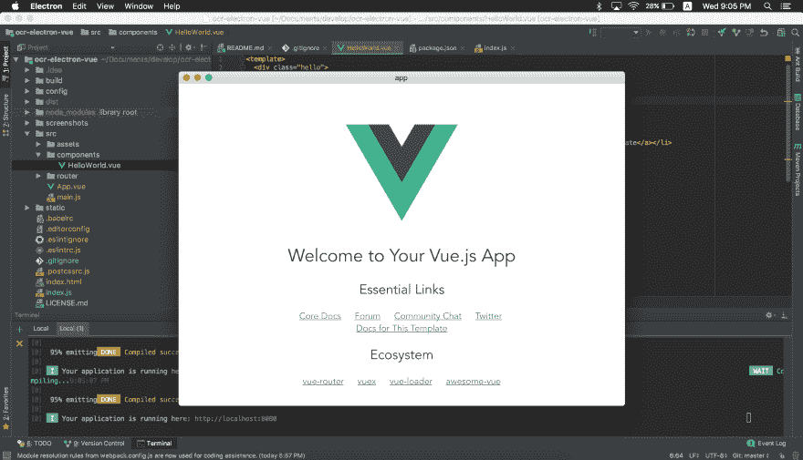
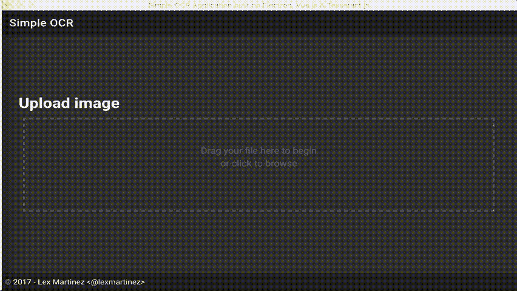

# 使用 Electron，Vue.js & Tesseract.js 创建简单的 OCR 应用程序

> 原文:[https://dev . to/lex Martinez/creating-a-simple-ocr-application-with-electronic-vue js-tessera ctjs-bnk](https://dev.to/lexmartinez/creating-a-simple-ocr-application-with-electron-vuejs--tesseractjs-bnk)

*原发表于我的[博客](https://redknot.io/articles/create-ocr-app-electron-vue)*

JavasScript 是当今最流行的编程语言之一，通过 Web 应用于许多领域和平台。在本教程中，我们将学习如何使用电子和 Tesseract.js 用 javascript 构建一个 OCR 桌面应用程序...你猜怎么着...我们的 FE 将通过 Vue.js 实现

一年多前，我遇见 **electron.js** ，从一开始对我来说，就是一个令人敬畏的图书馆...毕竟，用 JavaScript 创建一个桌面应用程序是一种很棒的能力...不是吗？所以我从一个简单的项目开始学习，我称之为 *triton-forms* ，基本上是一个用 AngularJS 构建的动态表单引擎，你可以在这里[看到它](https://github.com/lexmartinez/triton-forms)。本周，我决定回到我的**电子**冒险，创建另一个应用程序，这次是用`Vue.js`。

## OCR 项目

你可以想象，当我开始写这篇文章时(现在也是),主要目标是用**electronic**做一些很酷的东西，并在路上学习，但是我们要做的“什么”,在那一刻还不清楚。所以我花了几天时间阅读和思考一个简单但很酷的练习。

昨天，就像天堂的信号，我发现我的弟弟在他的笔记本电脑上从一份打印文件中为他的作业打东西，所以我告诉他...*“老兄你在干什么？你可以用 OCR"* 非常简单快速地做到这一点。最后一个词像回声一样留在我的脑海里，然后我就知道了...*“我必须创建一个 OCR 应用程序”*。

这个想法很简单，基本上，我们将有一个应用程序与一个拖放区，在该地区，我们将放下图像文件进行处理，然后提取文本并显示给用户。听起来不错...对吗？所以让我们开始吧！

## 电子-入门

**Electron** 结合了 **Node.js** 和一个专用 Chromium Web 浏览器实例的能力，以便运行像桌面应用程序这样的 Web/JavaScript 应用程序，这就是为什么我们要使用它作为 Vue.js Web 应用程序的容器，所以让我们开始配置我们的 **electron** 项目吧！

我们的项目本质上是一个基于 **Node.js** 的应用程序，因此，首先，我们将在一个新目录中创建一个新的`npm`项目。使用`-y`参数，package.json 将用默认值创建:

```
$ npm init -y 
```

<svg width="20px" height="20px" viewBox="0 0 24 24" class="highlight-action crayons-icon highlight-action--fullscreen-on"><title>Enter fullscreen mode</title></svg> <svg width="20px" height="20px" viewBox="0 0 24 24" class="highlight-action crayons-icon highlight-action--fullscreen-off"><title>Exit fullscreen mode</title></svg>

并将**电子**开发依赖项添加到项目

```
$ npm install --save-dev electron 
```

<svg width="20px" height="20px" viewBox="0 0 24 24" class="highlight-action crayons-icon highlight-action--fullscreen-on"><title>Enter fullscreen mode</title></svg> <svg width="20px" height="20px" viewBox="0 0 24 24" class="highlight-action crayons-icon highlight-action--fullscreen-off"><title>Exit fullscreen mode</title></svg>

然后在我们的 package.json 文件中，添加下面几行:

```
 "main":"index.js",  "scripts":  {  "start":  "electron ."  }, 
```

<svg width="20px" height="20px" viewBox="0 0 24 24" class="highlight-action crayons-icon highlight-action--fullscreen-on"><title>Enter fullscreen mode</title></svg> <svg width="20px" height="20px" viewBox="0 0 24 24" class="highlight-action crayons-icon highlight-action--fullscreen-off"><title>Exit fullscreen mode</title></svg>

这允许我们只使用`npm start`命令运行我们的**电子**应用程序

最后，为了完成我们的**电子**设置，让我们创建`index.js`文件，在那里我们将创建显示`https://lexmartinez.com/`网站内容的基本脚本。所以，在我们的`index.js`中，我们应该有以下几行:

```
const electron = require('electron');
const app = electron.app;
const BrowserWindow = electron.BrowserWindow;

let screen;

const renderApp = () => {
 // create the browser window
 screen = new BrowserWindow()
 // render the required website/entrypoint
 screen.loadURL('https://lexmartinez.com/')

 // dereference the screen object when the window is closed
 screen.on('closed', () => {
  screen = null;
 });
}

// call the renderApp() method when Electron has finished initializing
app.on('ready', renderApp);

// when all windows are closed, quit the application on Windows/Linux
app.on('window-all-closed', () => {
 // only quit the application on OS X if the user hits cmd + q
 if (process.platform !== 'darwin') {
  app.quit();
 }
});

app.on('activate', () => {
 // re-create the screen if the dock icon is clicked in OS X and no other
 // windows were open
 if (screen === null) {
  renderApp();
 }
}); 
```

<svg width="20px" height="20px" viewBox="0 0 24 24" class="highlight-action crayons-icon highlight-action--fullscreen-on"><title>Enter fullscreen mode</title></svg> <svg width="20px" height="20px" viewBox="0 0 24 24" class="highlight-action crayons-icon highlight-action--fullscreen-off"><title>Exit fullscreen mode</title></svg>

我们会得到这个结果...

[T2】](https://res.cloudinary.com/practicaldev/image/fetch/s--iDMZW9jO--/c_limit%2Cf_auto%2Cfl_progressive%2Cq_auto%2Cw_880/https://github.com/lexmartinez/ocr-electron-vue/raw/master/screenshots/screenshot-1.png)

## vista-Liza it！！

正如我在上面宣布的，我们将把`Vue.js`用于所有前端的东西，所以第一步，将设置`webpack`,以便捆绑我们的`Vue.js` Web 应用程序，并将其显示到我们的**电子**容器中。

要做到这一点并配置我们的`Vue.js`，我们将使用`vue-cli`脚手架:

```
# In case that you dont have the vue-cli installed yet
$ npm install -g vue-cli

$ vue init webpack app

# Use this answers for the wizard
? Project name app
? Project description xxxxxxxxxx
? Author xxxxxx <xxxxxx@domain.com>
? Vue build standalone
? Install vue-router? Yes
? Use ESLint to lint your code? Yes
? Pick an ESLint preset Standard
? Set up unit tests No
? Setup e2e tests with Nightwatch? No 
```

<svg width="20px" height="20px" viewBox="0 0 24 24" class="highlight-action crayons-icon highlight-action--fullscreen-on"><title>Enter fullscreen mode</title></svg> <svg width="20px" height="20px" viewBox="0 0 24 24" class="highlight-action crayons-icon highlight-action--fullscreen-off"><title>Exit fullscreen mode</title></svg>

这将在`app`文件夹中创建一个新的`Vue.js`项目，下一步是合并我们的`Vue.js`和`electron`项目，我们需要做以下四个步骤:

*   我们必须合并我们的`package.json`文件，将`Vue.js`依赖项和引擎设置复制到`electron`项目。
*   从 app 文件夹中删除`README.md`、`.gitignore`和`package.json`文件
*   将剩余的`app`文件夹内容移动到`electron`项目根目录(包括`.babelrc`等`.xxx`文件)
*   最后，像这样更新`package.json`脚本部分:

```
"scripts":  {  "start":  "electron .",  "dev":  "webpack-dev-server --inline --progress --config build/webpack.dev.conf.js",  "lint":  "eslint --ext .js,.vue src",  "build":  "node build/build.js"  } 
```

<svg width="20px" height="20px" viewBox="0 0 24 24" class="highlight-action crayons-icon highlight-action--fullscreen-on"><title>Enter fullscreen mode</title></svg> <svg width="20px" height="20px" viewBox="0 0 24 24" class="highlight-action crayons-icon highlight-action--fullscreen-off"><title>Exit fullscreen mode</title></svg>

现在您可以删除`app`文件夹，用`npm run dev`命令测试新的设置，并导航到 [http://localhost:8080](http://localhost:8080)

在这一点上，我们得到了分别工作的`electron`和`Vue.js`设置，让我们把它们放在一起，想法是用我们的`Vue.js`应用程序运行`webpack-dev-server`，它包含在`electron`上，只需要一个命令，我们将使用`concurrently`包:

```
$ npm install concurrently --save-dev 
```

<svg width="20px" height="20px" viewBox="0 0 24 24" class="highlight-action crayons-icon highlight-action--fullscreen-on"><title>Enter fullscreen mode</title></svg> <svg width="20px" height="20px" viewBox="0 0 24 24" class="highlight-action crayons-icon highlight-action--fullscreen-off"><title>Exit fullscreen mode</title></svg>

然后用下面的代码更新`npm start`命令:

```
 "start":  "concurrently --kill-others \"npm run dev\"  \"electron .\"", 
```

<svg width="20px" height="20px" viewBox="0 0 24 24" class="highlight-action crayons-icon highlight-action--fullscreen-on"><title>Enter fullscreen mode</title></svg> <svg width="20px" height="20px" viewBox="0 0 24 24" class="highlight-action crayons-icon highlight-action--fullscreen-off"><title>Exit fullscreen mode</title></svg>

最后更新`index.js`文件为了等一会儿到`webpack-dev-server`，让我们重写`on ready`处理程序:

```
// The loaded URL must be changed too
 screen.loadURL('http://localhost:8080/')

app.on('ready', ()=>{
 setTimeout(renderApp, 3000);
}); 
```

<svg width="20px" height="20px" viewBox="0 0 24 24" class="highlight-action crayons-icon highlight-action--fullscreen-on"><title>Enter fullscreen mode</title></svg> <svg width="20px" height="20px" viewBox="0 0 24 24" class="highlight-action crayons-icon highlight-action--fullscreen-off"><title>Exit fullscreen mode</title></svg>

> 这只是出于开发目的，当我们要打包`electron`应用程序时，应该删除这个`setTimeout`

这就是结果...

[T2】](https://res.cloudinary.com/practicaldev/image/fetch/s--ld58DsS0--/c_limit%2Cf_auto%2Cfl_progressive%2Cq_auto%2Cw_880/https://github.com/lexmartinez/ocr-electron-vue/raw/master/screenshots/screenshot-2.png)

现在，我们的工作空间将是`src`目录，我们要做的第一件事是重构默认的`HelloWorld`组件，姑且称之为`OCR.vue`，然后我们必须修复我们的路由文件上的导入，并从`assets`目录和`App.vue`文件中移除未使用的资产(Vue.js 徽标)。

#### 组件模板

我们的`OCR`组件模板将被分成三个面板:带有拖放区的图像文件输入面板，用于选择目标文件；带有进程状态更新的进度面板；以及带有提取文本的结果面板。此外，我们将使用`Vuetify`作为我们应用程序的外观和感觉:

```
$ npm install vuetify --save 
```

<svg width="20px" height="20px" viewBox="0 0 24 24" class="highlight-action crayons-icon highlight-action--fullscreen-on"><title>Enter fullscreen mode</title></svg> <svg width="20px" height="20px" viewBox="0 0 24 24" class="highlight-action crayons-icon highlight-action--fullscreen-off"><title>Exit fullscreen mode</title></svg>

然后在我们的`main.js`文件中:

```
import Vue from 'vue'
import Vuetify from 'vuetify'
import('vuetify/dist/vuetify.min.css')

Vue.use(Vuetify) 
```

<svg width="20px" height="20px" viewBox="0 0 24 24" class="highlight-action crayons-icon highlight-action--fullscreen-on"><title>Enter fullscreen mode</title></svg> <svg width="20px" height="20px" viewBox="0 0 24 24" class="highlight-action crayons-icon highlight-action--fullscreen-off"><title>Exit fullscreen mode</title></svg>

最后使用`Vuetify`组件，这将是我们的`OCR.vue`组件布局:

```
<template>
  <v-app id="inspire" dark>
    <v-toolbar app fixed clipped-left>
      <v-toolbar-title>Simple OCR</v-toolbar-title>
      <v-spacer></v-spacer>
      <span v-if="isSuccess || isFailed">
      <v-btn icon @click="reset">
        <v-icon>refresh</v-icon>
      </v-btn>
      <v-btn icon @click="save">
        <v-icon>save</v-icon>
      </v-btn>
      <v-btn icon @click="drive">
        <v-icon>file_upload</v-icon>
      </v-btn></span>
    </v-toolbar>
    <v-content>
      <v-container fluid fill-height>
        <v-layout justify-center align-center>
          <div class="container" v-if="isInitial">
            <form enctype="multipart/form-data" novalidate>
              <h1>Upload image</h1>
              <div class="dropbox">
                <input type="file" :name="'document'" :disabled="isSaving" @change="filesChange($event.target.files);" accept="image/*" class="input-file">
                <p v-if="isInitial">
                  Drag your file here to begin<br> or click to browse
                </p>
              </div>
            </form>
          </div>
          <div class="container text-xs-center" v-if="isSaving">
            <v-progress-circular v-bind:size="200" v-bind:width="15" v-bind:rotate="-90"
              v-bind:value="(status.progress * 100)" color="primary">
                  {{progress}}
            </v-progress-circular>
            <h2>{{status.status}}</h2>
          </div>
            <v-layout row wrap v-if="isSuccess || isFailed">
            <v-flex xs12>
              <v-divider></v-divider>
              <v-text-field label="Result" v-model="status.text" counter full-width multi-line single-line :auto-grow="true"></v-text-field>
            </v-flex>
            </v-layout>
        </v-layout>
      </v-container>
    </v-content>
    <v-footer app fixed>
      <span>&copy; 2017 - Lex Martinez &lt;@lexmartinez&gt;</span>
    </v-footer>
  </v-app>
</template>

<style>
  .dropbox {
    outline: 2px dashed grey; /* the dash box */
    outline-offset: -10px;
    background: transparent;
    color: dimgray;
    padding: 10px 10px;
    min-height: 200px; /* minimum height */
    position: relative;
    cursor: pointer;
  }

  .input-file {
    opacity: 0; /* invisible but it's there! */
    width: 100%;
    height: 200px;
    position: absolute;
    cursor: pointer;
  }

  .dropbox:hover {
    background: rgba(255,255,255,0.1); /* when mouse over to the drop zone, change color */
  }

  .dropbox p {
    font-size: 1.2em;
    text-align: center;
    padding: 50px 0;
  }
</style> 
```

<svg width="20px" height="20px" viewBox="0 0 24 24" class="highlight-action crayons-icon highlight-action--fullscreen-on"><title>Enter fullscreen mode</title></svg> <svg width="20px" height="20px" viewBox="0 0 24 24" class="highlight-action crayons-icon highlight-action--fullscreen-off"><title>Exit fullscreen mode</title></svg>

在该片段中，我们包含了上述三个带有一些标志的面板，以便在 OCR 进程状态改变时切换它们，[在这里](https://vuetifyjs.com/components)您可以找到关于`Vuetify`组件的更多信息。

#### OCR 引擎

另一个很棒的 **Node.js** 库是 **[Tesseract.js](http://tesseract.projectnaptha.com/)** ，它提供了一个完整但简单的文本检测框架，只需要几行代码我们就可以创建我们的 OCR 特性:

```
const Tesseract = require('tesseract.js');

Tesseract.recognize('/Users/john-doe/Desktop/text.jpg')
 .progress(function(packet){
     console.info(packet)
    })
 .then(function(result){
  console.log(result.text)
 }) 
```

<svg width="20px" height="20px" viewBox="0 0 24 24" class="highlight-action crayons-icon highlight-action--fullscreen-on"><title>Enter fullscreen mode</title></svg> <svg width="20px" height="20px" viewBox="0 0 24 24" class="highlight-action crayons-icon highlight-action--fullscreen-off"><title>Exit fullscreen mode</title></svg>

> 可以用这个命令`npm install tesseract.js --save`安装`Tesseract.js`依赖项，还需要语言`traineddata`文件，可以在的[处找到](https://github.com/tesseract-ocr/tessdata)

让我们把它包含在我们的`Vue.js`组件脚本中:在方法部分，我们将创建一个`ocr`函数:

```
methods: {
    ocr: function (event) {
      Tesseract.workerOptions.workerPath = 'http://localhost:8080/static/worker.js'
      Tesseract.workerOptions.langPath = 'http://localhost:8080/static/'
      Tesseract.recognize(event)
        .progress((status) => {
          this.status = status
        })
        .then((result) => {
          this.currentStatus = STATUS_SUCCESS
          this.status = result
        }).catch((error) => {
          this.currentStatus = STATUS_FAILED
          this.status = error
        })
    }, 
```

<svg width="20px" height="20px" viewBox="0 0 24 24" class="highlight-action crayons-icon highlight-action--fullscreen-on"><title>Enter fullscreen mode</title></svg> <svg width="20px" height="20px" viewBox="0 0 24 24" class="highlight-action crayons-icon highlight-action--fullscreen-off"><title>Exit fullscreen mode</title></svg>

正如我们看到的，最终的`ocr`函数与我们最初的代码片段没有太大的不同，我们只是添加了几行来设置语言路径和工人路径。

> 你可以在你的`node_modules/tesseractjs`文件夹中找到`worker.js`文件，我们把它和`traineddata`放在`static`文件夹中以便于操作和配置

#### 上传行为

如果你仔细看上面的模板，我们使用了一些标志来切换组件面板，以及其他更多的函数来处理用户事件。这里的主要行为是上传任务，又名`filesChange`函数，让我们看看它的简单实现:

```
 filesChange (fileList) {
     if (!fileList.length) return
     this.currentStatus = STATUS_SAVING
     this.ocr(fileList[0])
   } 
```

<svg width="20px" height="20px" viewBox="0 0 24 24" class="highlight-action crayons-icon highlight-action--fullscreen-on"><title>Enter fullscreen mode</title></svg> <svg width="20px" height="20px" viewBox="0 0 24 24" class="highlight-action crayons-icon highlight-action--fullscreen-off"><title>Exit fullscreen mode</title></svg>

#### 地狱耶！！！我们简单的 OCR 应用程序正在工作 8-)

[T2】](https://res.cloudinary.com/practicaldev/image/fetch/s--oyjvZPdL--/c_limit%2Cf_auto%2Cfl_progressive%2Cq_66%2Cw_880/https://github.com/lexmartinez/ocr-electron-vue/raw/master/screenshots/demo.gif)

*   **Electron.js** 文档可以在[这里找到！](https://github.com/GoogleChrome/puppeteer/blob/master/docs/api.md)和**宇宙魔方**文档[在这里！](http://tesseract.projectnaptha.com/)
*   这个练习的完整源代码可以在这个 [**Github repo**](https://github.com/lexmartinez/ocr-electron-vue) 上找到
*   感谢阅读！欢迎评论、建议和 [DMs](https://twitter.com/lex0316) ！
*   最后，对我来说，这个应用程序似乎有潜力，因此，如果你想贡献和改进这个简单的应用程序，我可以做到这一点...