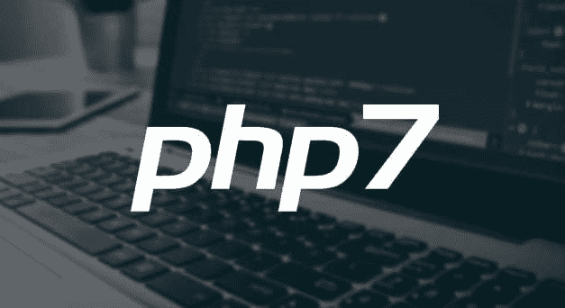

# 是时候用 PHP 7.2 练习更好的代码处理了

> 原文:[https://dev . to/nishthasinghuk/its-time-to-practice-better-code-handling-with-PHP-72-2 l5](https://dev.to/nishthasinghuk/its-time-to-practice-better-code-handling-with-php-72-2l5)

根据最新的报告，大约 89%的网站是基于 PHP 的，这使得 PHP 在全球范围内非常流行。更不用说它是免费的，不需要授权费，任何人(有一些编程知识)都可以使用。谈到它的特点和优点，我可以简单地继续下去。但这并不意味着它没有任何弱点。黑客和机器人会试图利用这些弱点来访问您的网站，因此首先了解这些弱点非常重要。

[T2】](https://res.cloudinary.com/practicaldev/image/fetch/s--aBFYCr5_--/c_limit%2Cf_auto%2Cfl_progressive%2Cq_auto%2Cw_880/https://thepracticaldev.s3.amazonaws.com/i/aoq3go326um17cq03hgj.jpg)

**一些常见的 PHP 漏洞包括**

**跨站点请求伪造(CSRF)** -当黑客设法创建一个链接，并让具有特权访问权限的人(如管理员)点击该链接时，就会发生这种情况。一个典型的 CSRF 攻击是当这个链接设法用一个已经存在的密码创建一个新的“admin”用户。

**SQL 注入(SQLi)** -一般来说，当黑客向您的数据库发送自己的指令并执行它们时，就会发生 SQL 注入。这通常归咎于 PHP 开发人员，他们在将访问者的输入传递给数据库之前没有检查恶意代码。

**认证绕过**——有时开发者会错误地验证访问者是否具有正确的访问级别。这通常发生在函数“is_admin()中。大多数开发人员认为用户是管理员，而事实上，他们只是在查看管理页面，并不是真正的管理员。这个错误的结果是，非管理员用户现在可以访问只有管理员才能看到的功能。

**远程和本地文件包含(RFI 和 LFI)**——远程文件包含(RFI)和本地文件包含(LFI)是两种比较常见的 PHP 漏洞。RFI 是指 PHP 应用程序接收输入(如 URL)并将其传递给一个用于加载文件的函数。而本地文件包含(LFI)是指攻击者可以访问 wp-config.php 文件。

嗯，作为 PHP web 开发人员，你会发现许多防御安全漏洞的方法，例如:开发代码后立即测试代码，与你的代码和方法保持一致，前端测试，单元测试，净化处理程序，数据库处理程序类，框架使用，当然还有升级到 PHP 7.2.0。

## PHP 7 . 2 . 0 简介

作为 PHP 7 系列的第二个特性更新，PHP 开发团队发布了 7.2.0。正如所料，您将会看到大量的改进和特性。其中一些包括在对象/数组转换中转换数字键的能力、对象类型提示、不可计数对象的计数以及 HasContext as Object。然而，这还不是全部！最新版本甚至将 TLS 常数提高到相同的值。Mycrypt 扩展已被移除，并添加了新的钠扩展。

该版本于 11 月 30 日发布，提供了多种安全功能，例如:

```
• The Argon2 algorithm for securely hashing passwords addresses downsides of current algorithms in that it was designed for the highest memory filling rate.
• The available Libsodium cryptography library, for authenticated encryption, is now a core extension. The library also offers high-speed elliptic cryptography. 
• SSL/TLS (Secure Sockets Layer/Transport Layer Security) constants have been improved.
• The Mcrypt cryptography library extension has been removed. PHP’s developers have said Mcrypt has inhibited the growth of the PHP language and serves as “abandonware.” 
```

*其他改进的编程特性包括:*

对象/数组转换中的数字键的转换解决了 PHP 7 的 Zend 引擎的一个问题。引擎曾经遇到过数组哈希表可以包含数字字符串，而对象哈希表可以包含整数键的情况。在这种情况下，PHP 代码找不到键。通过 [PHP 7.2](http://php.net/releases/7_2_0.php) 中的修复，数组或对象哈希表的键被适当地转换，因此对象中的数字字符串属性名变成了整数数组键，反之亦然，解决了属性不可访问的问题。

在对象类型提示的帮助下，可以很容易地解决这样一种情况，即开发人员不能声明需要将对象作为参数传递的函数，也不能声明函数应该返回对象。修复使用一个对象作为参数类型和返回类型。

HashContext as Object 迁移哈希扩展以使用哈希上下文的对象扩展，而不是使用资源。

当使用标量参数、null 参数或未实现 Countable 接口的对象调用 count()函数时，添加了新的警告。

所以暂时就这样吧！继续看空间了解更多！