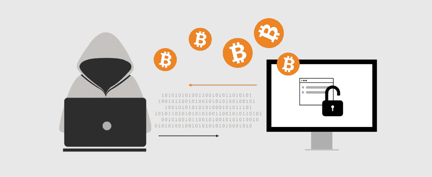

# 区块链的隐私和安全

> 原文：<https://dev.to/galyna_chekan/privacy-and-security-on-blockchains-what-protection-measures-the-networks-are-adopting-to-secure-their-users-11b>

一切去中心化，这个伟大的新想法，网络无法停止喋喋不休，如果你仔细观察，可能仍然有点乌托邦。

是的，区块链很可能重塑我们的经济，或者说是很大一部分，并让那些目前没有银行账户的人受益匪浅。

它们还可能有助于建立不受任何单一实体控制的评级/声誉系统，从而允许人们(比如说愿意为 Lyft 工作的优步司机)更换雇主，而不必重新建立他们的信誉。

他们可能让用户完全控制他们的资产；在一定程度上保护他们免遭抢劫，并提供工具来维护隐私，即使国家层面的行为者——银行或政府——正在追踪他们的身份。

但在这些事情开始发生之前，隐私和安全问题必须得到解决，这些问题目前正压在区块链头上。

在本文中，我们将讨论一些主要网络如何试图解决安全问题，并向那些使用分散式分类账的人提供建议，以确保他们的资产始终受到保护。

*我们开始吧！*

在讨论安全性之前，我们应该首先介绍的概念是**数字钱包。**

通俗地说，钱包就是一个软件程序，里面存放着公钥和私钥。在访问它之后，人们可以管理它所包含的加密资产，并无缝地执行各种交易。

目前，区块链生态系统中有四种类型的数字钱包——桌面、网络、移动和硬件钱包。为了保护它们，用户用又长又复杂的密码给钱包加密。

## 那么，可能会出什么问题呢？

[T2】](https://res.cloudinary.com/practicaldev/image/fetch/s--O1D3XYUM--/c_limit%2Cf_auto%2Cfl_progressive%2Cq_auto%2Cw_880/https://perfectial.com/wp-content/uploads/2017/12/img2-1.jpg)

2011 年，bitcointalk 论坛的一名成员(某人“allin vain”)[在发现自己被黑客抢走了 25000 BTC(现在，在 2017 年 10 月，价值约为 1.5 亿美元)后，写了一篇恐慌的帖子](https://bitcointalk.org/index.php?topic=16457.0)——一声求救。

很明显，攻击者设法进入了 allinvein 的电脑，并以某种方式清空了他的电子钱包。他(她)要么直接从受害者的机器上发送交易，要么复制 wallet.dat 文件并从他(她)自己的机器上运行。

另一个值得注意的盗窃事件是比特币子网站报道的[。用户 asoltys 对他的](https://www.reddit.com/r/Bitcoin/comments/1czrua/just_lost_160_btc_from_address_managed_with/) [blockchain.info 钱包](https://blockchain.info/)相当小心，所以当他发现有一天钱包里的 160 个比特币被盗时，他感到非常震惊。

使盗窃成为可能的漏洞在于 blockchain.info 移动应用程序；这与用户支持他的 Android 手机有关。

通常，当一个人试图进入他们的 blockchain.info 钱包(从台式电脑)时，他们会被要求输入两个密码——一个长密码(16-20 位)以访问整个钱包，一个短密码(通常为 8 位)以获得私钥。

然而，由于在智能手机上输入冗长的密码令人厌倦，钱包应用程序通常会记住密码，只要求你输入第二个密码。

因此，如果有人黑进你的手机，一个已经根，他们可能会找到主密码存储在哪里，并解密它。之后，他们可以破解第二个 PIN 码(黑客通常使用 GPU 或基于云计算的集群来快速破解 8 位密码)，并完全控制你的钱包。

世界第二大区块链以太坊上的一些智能合约也遭到了攻击.. _

以太坊不仅仅是一种加密货币。它也是一个可以构建分散应用的平台。

因此，托管在网络上的软件必须设计得无可挑剔:它的代码必须没有漏洞。否则，它肯定会成为聪明攻击者的猎物。

帖子[区块链的隐私和安全:网络采取什么保护措施来保护他们的用户](https://perfectial.com/blog/privacy-security-blockchains/)最先出现在[软件开发公司 perfecial](https://perfectial.com)上。